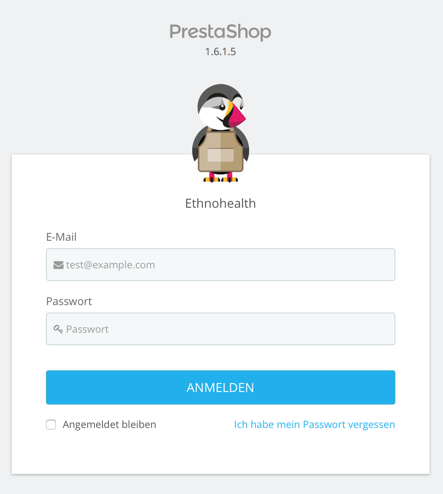
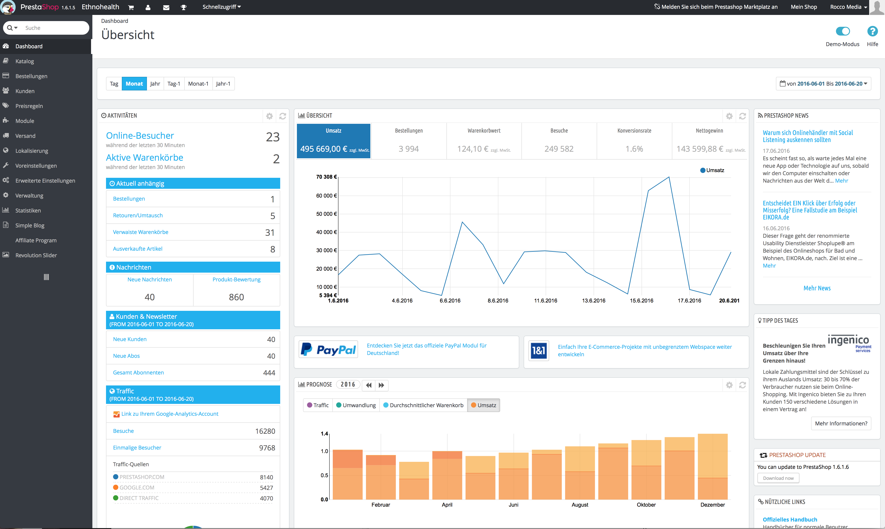

# Der PrestaShop Adminbereich

Der PrestaShop Adminbereich ist für alle Administrativen Aufgaben des PrestaShops zuständig. Sie werden die meiste Zeit hier verbringen. Alle Aufgaben werden hier erledigt, wie z.B. das Anlegen, Bearbeiten oder Löschen von Artikeln, Kategorien, Kunden usw.&#x20;

Während der Installation wird der /admin Ordner in einen einzigartigen Namen (z.B. /admin4312) umbenannt. Dies ist aus Sicherheitsgründen so. Zum erreichen des Backends muss dieser Ordner aufgerufen werden. Als Beispiel: http://IhrPrestashop.de/admin4312

Die Namenänderung erfolgt automatisch von PrestaShop. Seien Sie vorsichtig mit der Weitergabe, der Ordner ist der Zugang zu Ihrem Adminbereich

Sie sehen nun den Login Bereich

Geben Sie Ihre Zugangsdaten ein und klicken Sie auf "Anmelden". Sie werden nun in das Backend weitergeleitet. Sie sehen nun den Willkommensbildschirm.&#x20;

Hier können Sie nun langsam damit beginnen, den Shop nach Ihren Wünschen und Anforderungen einzurichten.&#x20;

Lesen Sie das nächste Kapitel "Erste Schritte mit PrestaShop 1.6" um zu sehen wie Sie Ihren Shop einrichten können.&#x20;
