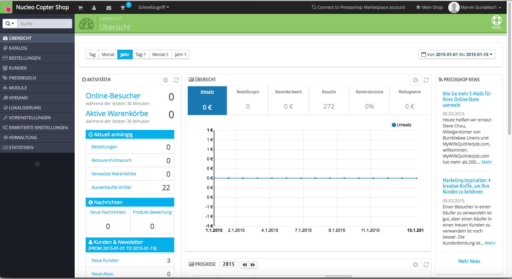
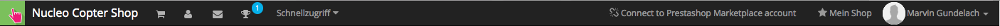
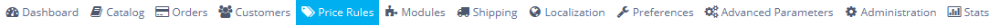
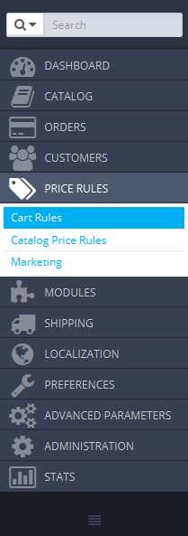
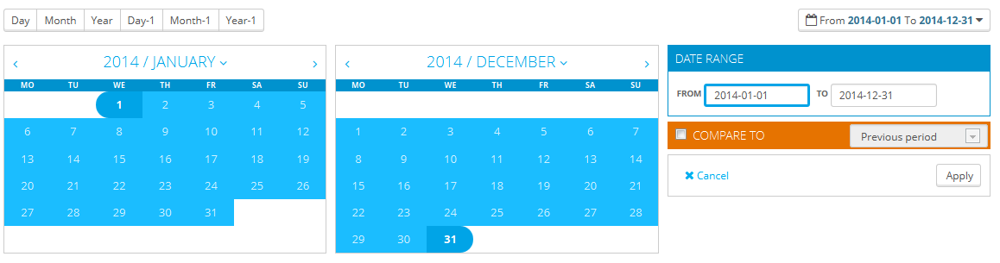
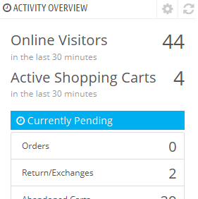
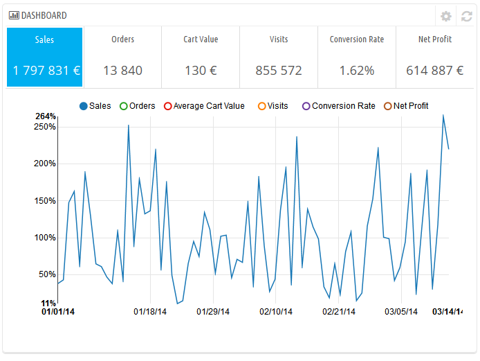
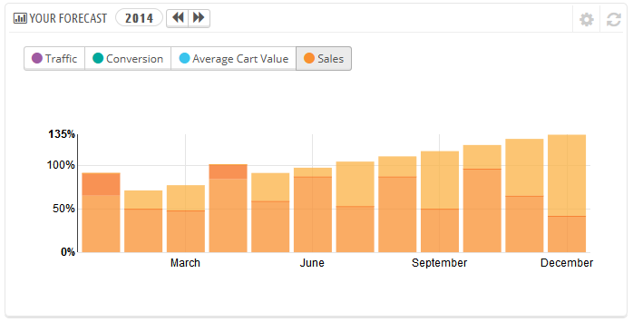
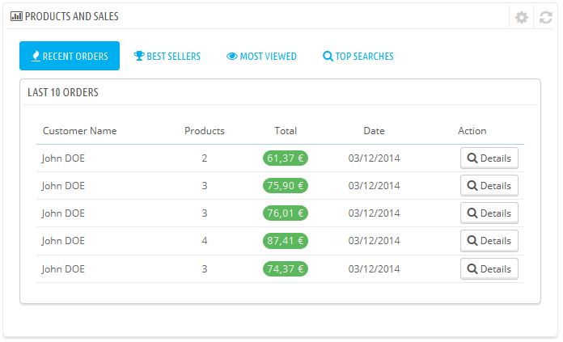

# Entdecken der Administrationsoberfläche

**Inhaltsverzeichnis**

/\*\<!\[CDATA\[\*/\
div.rbtoc1597071523177 {padding: 0px;}\
div.rbtoc1597071523177 ul {list-style: disc;margin-left: 0px;}\
div.rbtoc1597071523177 li {margin-left: 0px;padding-left: 0px;}\
\
/\*]]>\*/

* [Entdecken der Administrationsoberfläche](entdecken-der-administrationsoberflaeche.md#EntdeckenderAdministrationsoberfläche-EntdeckenderAdministrationsoberfläche)
  * [Überblick über den Hauptbereich](entdecken-der-administrationsoberflaeche.md#EntdeckenderAdministrationsoberfläche-ÜberblicküberdenHauptbereich)
    * [Die Top Bar](entdecken-der-administrationsoberflaeche.md#EntdeckenderAdministrationsoberfläche-DieTopBar)
    * [Die Menüs](entdecken-der-administrationsoberflaeche.md#EntdeckenderAdministrationsoberfläche-DieMenüs)
  * [Die Buttons](entdecken-der-administrationsoberflaeche.md#EntdeckenderAdministrationsoberfläche-DieButtons)
  * [Kontexthilfe](entdecken-der-administrationsoberflaeche.md#EntdeckenderAdministrationsoberfläche-Kontexthilfe)
  * [Das Dashboard](entdecken-der-administrationsoberflaeche.md#EntdeckenderAdministrationsoberfläche-DasDashboard)
    * [Der horizontale Balken](entdecken-der-administrationsoberflaeche.md#EntdeckenderAdministrationsoberfläche-DerhorizontaleBalken)
    * [Die linke Spalte](entdecken-der-administrationsoberflaeche.md#EntdeckenderAdministrationsoberfläche-DielinkeSpalte)
    * [Die mittlere Spalte](entdecken-der-administrationsoberflaeche.md#EntdeckenderAdministrationsoberfläche-DiemittlereSpalte)
    * [Die rechte Spalte](entdecken-der-administrationsoberflaeche.md#EntdeckenderAdministrationsoberfläche-DierechteSpalte)

## Entdecken der Administrationsoberfläche 

Nun haben Sie PrestaShop 1.6 erfolgreich installiert und Sie sind im Backend eingeloggt. Nun sorgen wir dafür, dass Sie sich schnell und sicher zurecht finden.&#x20;

Das Design des Backend wurde mit PrestaShop 1.6 komplett überarbeitet um noch bessere, intuitive Bedienung zu schaffen und um besser mit Mobilen Endgeräten zu arbeiten.

Die meisten 1.5 Funktionen sind noch dort wo sie waren. Aber evtl. benötigen Sie etwas Zeit um sich in der neuen Umgebung zurecht zu finden.

Wir haben dieses Kapitel erstellt um Ihnen dabei zu helfen, das PrestaShop Backend bestens kennen zu lernen. Es ist so entworfen das es einfach und ergonomisch zu nutzen ist, aber wir raten Ihnen das komplette Benutzerhandbuch zu lesen damit Sie wirklich perfekt mit Ihrem neuen Online Business Tool umgehen können.

### Überblick über den Hauptbereich 

Nehmen wir uns die Zeit und schauen uns die Übersicht etwas genauer an - Dis ist die erste Seite die Sie sehen wenn Sie sich in das Backend einloggen. Es zeigt Ihnen eine Zusammenfassung aller wichtigen und relevanten Daten über Ihren Shop. Außerdem gibt es Ihnen Tips was Sie als nächstes zu tun haben.&#x20;

#### Die Top Bar 

Am oberen Rand des Backends ist immer eine schwarze Leiste die Ihnen eine Hand voll nützliche Funktionen bietet:

* **(Name Ihres Shops)**. Wenn Sie hier drauf klicken kommen Sie immer zur Übersicht Ihres Backends.
* **Warenkorb Icon**. Eine Anzeige aller noch nicht bearbeiteten Bestellungen. Klicken Sie darauf um eine Liste der Bestellungen zu erhalten.
* **Personen Icon**. Eine Anzeige neuer Kunden. Klicken Sie darauf um eine Liste der Kunden zu erhalten.&#x20;
* **Nachricht Icon**. Eine Anzeige neuer Nachrichten. Klicken Sie darauf um eine Liste der Nachrichten zu erhalten.
* **Orden Icon.** Sie erhalten Abzeichen bei PrestaShop. Sie sehen was für Ziele Sie erreichen müssen für ein neues Abzeichen. Lassen Sie sich Ihr Handelsabzeichen anzeigen.&#x20;
* **Schnellzugriff**. Dies ist das Schnellzugriff Menü. Klicken Sie darauf und fügen Sie weitere, für Sie nützliche Seiten/Funktionen hinzu.
* **"Not connected to PrestaShop Addons" Link**. Über diesen Link können Sie sie Sich direkt mit dem Addon Store verbinden.&#x20;
* **"Mein Shop" Link**. Öffnet Ihren Shop (Frontend) in einem neuen Tab.
* **(Ihr Name) Link**. Ein Dropdown-Menü mit allen wichtigen Funktionen für Ihren Account.&#x20;
  * **"Mein Profil" Link**. Hier können Sie Ihr Profil bearbeiten. Z.B. Ihren Namen oder Ihr Passwort ändern.
  * **"Ausloggen" Link**. Damit loggen Sie sich aus dem Backend aus.

#### Die Menüs 

Während der täglichen Administrations-Tätigkeiten Ihres Shops, werden Sie die vielen Seiten und Optionen des Back-Office besuchen müssen.Icon

Standardmäßig wird das Menüsystem in PrestaShop 1.6 auf der linken Seite angezeigt. Sie können das Menü an den Anfang der Seite mit Hilfe  der Option "Ausrichtung" auf Ihrer Mitarbeiterseite (auf die Sie über den Link mit Ihrem Namen in der oberen Leiste zugreifen können) umschalten.

In beiden Ausrichtungen, Hoch- oder Querformat, wird der Inhalt der einzelnen Menüs angezeigt, wenn die Maus darüber fährt, wodurch die Notwendigkeit, neue Bildschirme zu laden, nur um Menüoptionen anzuzeigen, reduziert wird.&#x20;

Darüber hinaus kann das vertikale Format durch Klicken auf das Icon am Ende des Menüs, mit  parallelen Linien gekennzeichnet,  auf Symbole minimiert werden.

Jedes Menü steht für einen bestimmten Satz von Aufgaben und Optionen:

* **Suchfeld mit Dropdown-Liste**. Ermöglicht Ihnen, die Inhalte Ihres Shops zu durchsuchen.
* **Katalog**. Dies ist das Herz Ihres Shops, wo Sie Produkte hinzufügen, Kategorien erstellen, Lieferanten und Spediteure hinzufügen können.
* **Bestellungen**. Wenn Kunden Produkte in ihren Einkaufswagen legen, können Sie die Bestellungen in diesem Menü sehen, mit den daraus resultierenden Rechnungen. Hier können Sie auch, unter Anderem, Rücksendungen, Rückgabescheine und Kundenservice zu bestimmten Bestellungen anbieten.
* **Kunden**. Hier können Sie auf alle Kundeninformationen und deren Adressen zugreifen, Gruppen von Kunden erstellen, für die spezielle Rabatte gelten, Kundendienst anbieten und selbst Anreden einrichten, wenn nötig.
* **Preisregeln**. Ein spezielles Menü, in dem Sie einfach Gutscheine und Preissenkungen durch eine Reihe von Regeln festlegen können.
* **Module**. Erweitern Sie die Leistung und den Nutzen Ihres Shops durch Hinzufügen und Aktivieren von Modulen: mehr als einhundert sind standardmäßig zur Verfügung, viele weitere können auf dem Markt gekauft werden ([http://addons.prestashop.com/](http://addons.prestashop.com/)). Hier finden Sie auch Templates, wo Sie Inhaltsblöcke von Ihrem Modul positionieren können (einschließlich der Live-Funktion Edit). Auf der letzten Menüseite können Sie globale Einstellungen für Zahlungsmodule festlegen.
* **Versand**. Alles in Bezug auf Spediteure und Versandkosten, sowie Marketing.
* **Lokalisierung**. Hilft Ihnen, Ihren Shop mit lokalen Werten wie Sprache und Übersetzung, Währungen, Einheiten, Steuern und Steuervorschriften an bestimmte Länder und Regionen anzupassen.
* **Voreinstellungen**. PrestaShop ist eine stark konfigurierbare E-Commerce-Lösung und Sie können fast jede seiner Verhaltensweisen mit diesen Einstellungen bearbeiten.
* **Erweiterte Einstellungen**. Dieses Menü enthält Links zu Tools und Informationsseiten, die zu spezifisch sind, um in andere Menüs integriert zu werden, wie die Web-Service-Einstellungen, das Datenbank-Backup-Tool oder die Leistungs-Seite.
* **Verwaltung.** Hier sind die Einstellungen in Bezug auf das Back-Office selbst; zum Beispiel, unter Anderem, der Inhalt des Schnellzugriff-Menüs, die Mitarbeiterliste und deren Berechtigungen oder die Menüpunkte.
* **Statistiken**. Das Menü gibt Ihnen Zugriff auf die zahlreichen Statistiken und Grafiken, die gesammelt und durch PrestaShop erzeugt werden.

Dies sind die Standardmenüs. Beachten Sie, dass Module neue Menüpunkte zu bestehenden Seiten, neue Seiten zu den vorhandenen Menüs und sogar neue Menüs hinzuzufügen können.

Außerdem ist ein Menü nur verfügbar, wenn die richtige Option eingestellt ist:

* **Stock**. This menu gives you access to stock management feature, where you can handle warehouses, stock movement and supply orders.\
  It can be made available through the "Products" preference page: simply activate the "Enable advanced stock management" option (in the "Products stock" section) and save your change to see the menu appear.

Alle Standard-Menüs, darunter auch das "Lager"-Menü, werden ausführlich in diesem Handbuch erläutert.

### Die Buttons 

Viele von den Back-End-Seiten benutzen selbe Buttons, entweder am oberen oder am unteren Rand des Bildschirms. Beispielsweise kann die Produktänderungs-Seite bis zu 8 Tasten auf einmal haben.

Sie sind mehr als einfache Verknüpfungen, sie öffnen tatsächlich Funktionen, die Sie häufig verwenden.

Die verfügbaren Tasten sind, je nach Kontext, sehr unterschiedlich, also werden zwei verschiedene Seiten nicht den gleichen Satz von Buttons zu Verfügung stellen. Dennoch gibt es ein paar, die oft benutzt werden:

* **Neu Hinzufügen**. Öffnet die Seite zum Erstellen, bezogen auf den aktuellen Kontext.
* **Empfohlene Module**. Öffnet ein Popup-Fenster mit den verfügbaren, im aktuellen Kontext verfügbaren, Modulen.
* **Hilfe**. Öffnet die Online-Dokumentation für die aktuelle Seite.

Durch "Empfohlene Module" Knopf werden die Module, die für den aktuellen Kontext gelten, angezeigt. Zum Beispiel werden auf der Seite "Versand>Lieferanten" die Module aus der Kategorie "Transport und Logistik" angezeigt. Dies ist sehr hilfreich, wenn sie schnell finden wollen, welches Modul installiert und konfiguriert werden sollte, um ein bestimmtes Ergebnis zu erhalten.

Viele der Backoffice-Formulare haben folgende Buttons am unteren Rand:

* **Speichern**. Speichert den Inhalt der aktuellen Seite und kehrt zu der Liste der vorhandenen Produkte zurück.
* **Speichern und auf der Seite bleiben**. Speichert den Inhalt der aktuellen Seite und bleibt auch auf dieser.
* **Abbrechen**. Kehrt zur Produktliste zurück.

### Kontexthilfe 

Seit Version 1.6.0.7 von PrestaShop ist die  Dokumentation der Software direkt in die Administrationsoberfläche eingebettet: Ein Klick auf die Schaltfläche "Hilfe" von einer beliebigen Back-Office-Seite reduziert die Breite des Hauptfensters, und zeigt eine neue Spalte auf der rechten Seite an, die die Dokumentation zum jeweiligen Abschnitt des Back-Office anzeigt.

Ein weiterer Klick auf die Schaltfläche "Hilfe" schließt die kontextbezogene Hilfe. Wenn Sie nicht die Hilfe Säule zu schließen, versteht PrestaShop, dass Sie die Hilfe auf jedes Seite der Back-Office angezeigt haben wollen, deswegen wird die Spalte aufrecht erhalten, bis Sie geklickt haben, um es zu schließen.\

Wenn das Anzeigefeld des Browsers weniger als 1220 Pixel breit ist, öffnet PrestaShop die Dokumentation in einem neuen Browserfenster, statt Platz für das Hauptfenster zu verringern.

Am unteren Rand der Hilfespalte finden Sie einen Abschnitt, in dem sie dem PrestaShop-Team mitteilen können, ob der Hilfe-Bereich für Sie hilfreich war, oder nicht. Bewerten Sie die Hilfe-Seite, indem Sie auf die Zufriedenheitsskala klicken. Wenn Sie auf eine der beiden untersten Ebenen klicken, wird ein kurzes Formular geöffnet, das PrestaShop ermöglicht, sich Details Ihrer Kritik zu stellen. Sie können es entweder ausfüllen und auf die Schaltfläche "Absenden" klicken, oder schließen Sie das Formular, indem Sie auf das Kreuz klicken, in diesem Fall wird nur eine Bewertung an unseren Server gesendet.

### Das Dashboard 

Lassen Sie uns nun den Inhalt des Dashboards betrachten. Es kann auf den ersten Blick unübersichtlich wirken, aber Sie werden feststellen, dass es einen hervorragenden Überblick über die täglichen Aktivitäten Ihres Shops auf einen Blick gibt.

Das Dashboard ist durch einen horizontalen Balken in drei Spalten und 4 Bereiche geteilt.

Standardmäßig verwendet das Dashboard gefälschte Daten, so dass Sie besser sehen können, wofür die verschiedenen Statistiken stehen.

Bei der Verwendung von PrestaShop für einen echten Online-Shop, müssen Sie diese gefälschten Daten deaktivieren, so dass Ihre echten Daten angezeigt werden können: Klicken Sie auf "Nein" im "Demo-Modus" Block am unteren rechten Bildschirmrand.

#### Der horizontale Balken 

Am Kopf des Dashboards ist eine einzige Zeile, in der Sie die Zeitdauer für die aktuell angezeigte Dashboard Statistik wählen können. Drei Sätze von Optionen stehen zur Verfügung:

* Aktueller Tag, Monat oder Jahr.
* Vorheriger Tag, Monat oder Jahr.
* Genaue Auswahl (die Schaltfläche auf der rechten Seite, eine Datumsauswahl wird geöffnet).

Die Wahl einer Option aktualisiert alle Bausteine von Inhalten, die auf dem Dashboard angezeigt werden, so dass nur Daten für den gewählten Zeitraum angezeigt werden. Blöcke, die keine Statistiken enthalten, ändern sich nicht.

Um einen Zeitraum zu wählen, können Sie entweder auf den ersten und letzten Tag der Frist im Kalender (die Klick-Reihenfolge spielt keine Rolle) klicken, oder die Daten im YYYY-MM-DD-Format in die Textfelder eingeben. Klicken Sie auf "Übernehmen", um die Dashboard-Änderung gemäß Ihren Einstellungen zu sehen.

Sie können auch zwei Zeiträume miteinander vergleichen, indem Sie die "vergleiche mit"-Option auswählen. Wählen Sie die zweite Zeitperiode aus (die beiden können sogar überlappen), dann klicken Sie auf die Schaltfläche "Übernehmen".\
Beim Vergleich der beiden Zeiträume, werden einige der Inhaltsblöcke aktualisiert, um die Entwicklung der Daten anzugeben (siehe zum Beispiel das Haupt "Armaturenbrett", das Daten aus dem Prognose-Modul stellt).

#### Die linke Spalte 

Standardmäßig stellt diese Spalte, mit den Daten des Dashboard-Activity-Modul, die Hauptpunkte aus Ihrer Datenbank auf einen Blick dar:

* Online-Besucher in den letzten 30 Minuten.
* Aktive Warenkörbe in den letzten 30 Minuten.
* Derzeit noch nicht erledigte Aufträge, Umtausch / Rückgabe-Anfragen, verwaiste Warenkörbe und nicht vorrätige Produkte.
* Benachrichtigungen über neue Nachrichten, Anfragen und Produktbewertungen.
* Neue Kunden und neue Newsletter-Abonnements.
* Traffic-Statistik: Besuche, einmalige Besucher, Traffic-Quellen und direkte Links.

#### Die mittlere Spalte 

Die Mittelsäule ist, woher der Begriff "Dashboard" seine Bedeutung nimmt: Dieser Bereich des Dashboards präsentiert dem Benutzer (Ihnen) die wichtigsten Zahlen in Bezug auf die täglichen Aktivitäten des Shops, in Form eines Diagramms des Umsatzes und einer Liste der neuesten Bestellungen. Jedes Mal, wenn Sie sich im Administrationsbereich Ihres Shops anmelden, werden Sie zuerst einen Blick auf die Entwicklung dieser Daten werfen. Hier können Sie sehen, wie ihr Shop wächst und gedeiht.

Standardmäßig gibt es drei Blöcke von Inhalten in dieser Spalte, die Module beinhalten:

* **Dashboard** (Dashboard-Prognosen -Modul). Dies ist der Hauptinformationsblock auf dem Armaturenbrett. Mit seinen verschiedenen Grafiken sehen sie sofort, ob Ihr Geschäft die richtige Richtung einschlägt, oder nicht. Klicken Sie auf eine Grafik, um sie anzuzeigen. Zusätzlich wird beim Vergleich von zwei Zeitperioden die Entwicklung von jeder Zeitperiode in Prozentsätzen angezeigt. Fahren Sie mit der Maus über die Grafik, um die Details zu sehen.\
  \
  Durch Klicken auf das Konfigurationssymbol (oben rechts) öffnen Sie eine neue Seite, wo Sie verschiedene Ausgaben, die Ihr Geschäft hat (Zahlungsverkehrsnetzgebühr, durchschnittliche Versandkosten, Hosting-Kosten, etc.), um eine Prognose zu sehen.
* **Ihre Prognose**. Dieser Block zeigt Ihnen die Ziele, die Sie für die kommenden Monate haben, und wie sich Ihr Shop verglichen zu dieser Prognose macht. Fahren Sie mit der Maus über die Grafik, um die Details zu sehen.\
  \
  Abhängig von Ihren monatlichen Ergebnissen sollten Sie Ihre bevorstehenden Ziele aktualisieren. Sie können Ihre Ziele im Konfigurationsformular des Blocks (oben rechts im Block) setzen, geben Ihre Erwartungen pro Monat, in Bezug auf Verkehr, Konversionsrate und durchschnittlichen Warenkorbwert an. Die Spalte "Umsatz" wird nach den Einträgen in den anderen Spalten gesetzt (zum Beispiel für 1000 Besucher mit einer Konversionsrate von 2% und 10 $ Durchschnitts Warenkorb, würden Sie 1000 \* (2/100) \* 10 = $ 200 erhalten). Sie können die Währung auf der "Währungen"-Seite unter dem Menü "Lokalisierung" ändern.
* **Artikel und Verkäufe** (Dashboard-Produkte-Modul). Dieser Block präsentiert Ihnen eine Tabelle Ihrer aktuellen Bestellungen und ein Ranking Ihrer Produkte: Bestseller, die am meisten angesehen und am meisten gesucht (im Shop gesucht, nicht durch Suchmaschinen).\
  \
  Sie können die Anzahl der angezeigten Elemente im Konfigurationsformular des Blocks festlegen.

#### Die rechte Spalte 

Diese letzte Spalte zeigt Informationen: die neuesten Nachrichten von [PrestaShop.com](http://prestashop.com), Benachrichtigungen über neue Versionen von PrestaShop und nützliche Links.

Sie zeigt auch den "Demo-Modus" Block, von dem aus Sie die „gefälschten Daten“, die standardmäßig auf dem Dashboard verwendet werden, deaktivieren können und so Ihre eigenen Daten angezeigt werden (wie von dem PrestaShop-Statistiken-System gesammelt).
