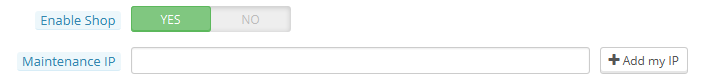
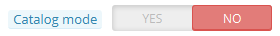
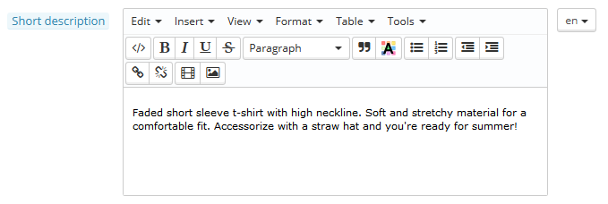
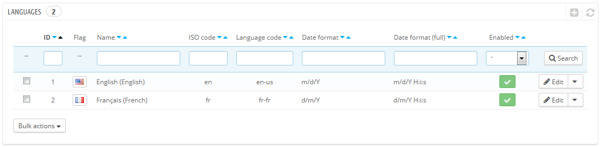
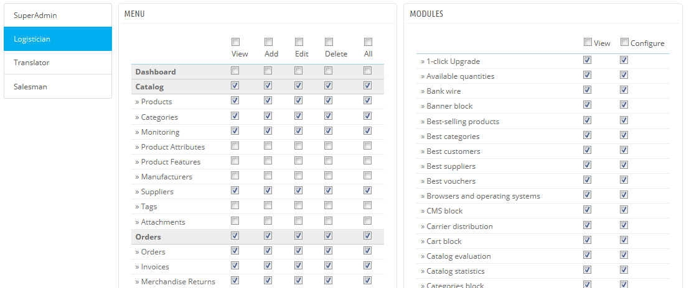

# Erste Schritte in PrestaShop 1.6

**Table of contents**

/\*\<!\[CDATA\[\*/\
div.rbtoc1597071524114 {padding: 0px;}\
div.rbtoc1597071524114 ul {list-style: disc;margin-left: 0px;}\
div.rbtoc1597071524114 li {margin-left: 0px;padding-left: 0px;}\
\
/\*]]>\*/

* [Erste Schritte in PrestaShop 1.6](erste-schritte-in-prestashop-1.6.md#ErsteSchritteinPrestaShop1.6-ErsteSchritteinPrestaShop1.6)
  * [Deaktivieren Ihres Shops](erste-schritte-in-prestashop-1.6.md#ErsteSchritteinPrestaShop1.6-DeaktivierenIhresShops)
  * [Den Inhalt des Standard-Shops löschen](erste-schritte-in-prestashop-1.6.md#ErsteSchritteinPrestaShop1.6-DenInhaltdesStandard-Shopslöschen)
  * [Konfigurieren der Shop-Informationen](erste-schritte-in-prestashop-1.6.md#ErsteSchritteinPrestaShop1.6-KonfigurierenderShop-Informationen)
    * [Die grundlegenden Shop-Einstellungen](erste-schritte-in-prestashop-1.6.md#ErsteSchritteinPrestaShop1.6-DiegrundlegendenShop-Einstellungen)
    * [Shop-Sprachen](erste-schritte-in-prestashop-1.6.md#ErsteSchritteinPrestaShop1.6-Shop-Sprachen)
    * [Mitarbeiter-Informationen](erste-schritte-in-prestashop-1.6.md#ErsteSchritteinPrestaShop1.6-Mitarbeiter-Informationen)
  * [Konfigurieren der Zahlungsmethoden](erste-schritte-in-prestashop-1.6.md#ErsteSchritteinPrestaShop1.6-KonfigurierenderZahlungsmethoden)
  * [Versanddienste und Versand](erste-schritte-in-prestashop-1.6.md#ErsteSchritteinPrestaShop1.6-VersanddiensteundVersand)
  * [Ein Template wählen](erste-schritte-in-prestashop-1.6.md#ErsteSchritteinPrestaShop1.6-EinTemplatewählen)
  * [Module auswählen](erste-schritte-in-prestashop-1.6.md#ErsteSchritteinPrestaShop1.6-Moduleauswählen)
  * [Artikel und Artikelkategorien erstellen](erste-schritte-in-prestashop-1.6.md#ErsteSchritteinPrestaShop1.6-ArtikelundArtikelkategorienerstellen)
  * [Statische Inhalte erstellen](erste-schritte-in-prestashop-1.6.md#ErsteSchritteinPrestaShop1.6-StatischeInhalteerstellen)
  * [Das Top-Menü zusammenstellen](erste-schritte-in-prestashop-1.6.md#ErsteSchritteinPrestaShop1.6-DasTop-Menüzusammenstellen)
  * [Aktivieren Ihres Shops](erste-schritte-in-prestashop-1.6.md#ErsteSchritteinPrestaShop1.6-AktivierenIhresShops)

## Erste Schritte in PrestaShop 1.6 

Sie sollten viel Zeit zur Shop-Konfiguration aufwenden, um sicherzustellen, dass jeder Teil Ihres zukünftigen Online-Shops richtig eingestellt, gesichert und bereit für Ihr Geschäft ist.

Zwar macht PrestaShop Ihnen die Installation und den Aufbau des Shops sehr leicht, dies kann aber keine Arbeit von 5 Sekunden sein: Sie haben es mit Artikeln, Kunden, Versanddiensten und am allerwichtigsten, mit echtem Geld, das vom Kunden auf Ihr Bankkonto fließt, zu tun. Wir wagen es zu sagen, wenn Sie sicherstellen, dass bei den Eingaben nichts schief geht, wird bei dem Bestellprozess, dem Finden der Artikel im Lager, dem Verpacken und dem Versand keine Glitches entstehen oder etwas Unerwartetes passiert.

PrestaShop ist eine Komplettlösung und die Anzahl der Optionen kann anfangs überfordernd sein. Dieses Kapitel führt Sie deshalb durch ein paar grundlegende Funktionen, die Sie sich angesehen haben sollten, bevor Sie Ihren Shop online stellen. Vieles kann und muss getan werden, bevor man einen Shop startet, die folgenden Schritte sind jedoch für jeden Shop wichtig.

### Deaktivieren Ihres Shops 

Wir setzen voraus, dass Sie immer noch in den ersten Stunden Ihrer PrestaShop-Installation sind, also einer Single-Shop-Instanz.

Deaktivieren Ihres Shops bedeutet, dass niemand darauf zugreifen kann, während Sie gerade Änderungen durchführen, Artikel erstellen, Preise und Steuern festlegen, Zahlungsmodule und neue Templates installieren, Versanddienste eintragen... Dies wird "den Shop in den Wartungsmodus versetzen" genannt.

Navigieren Sie zur Seite Voreinstellungen>Wartung in Ihrem Back-Office. Diese Seite hat zwei einfache Einstellungen:

* **Shop aktivieren**. setzen Sie dies einfach auf "Nein" und im Front-End wird Ihren Besuchern die Wartungsseite angezeigt, auf der steht, dass der Shop bald wieder online sein wird.
* **Wartungs-IP**. Hier müssen Sie Ihre eigene IP-Adresse eintragen, damit Sie immer noch Zugriff auf das Frontend haben und in Ihrem Shop navigieren können, als wäre er für jeden verfügbar. Dies ist ein Muss jedes Mal, wenn Sie den Shop in den Wartungsmodus versetzen, da Sie nach Änderungen immer das Frontend betrachten sollten, um sicherzustellen, dass alles an seinem Platz ist, wie beabsichtigt.\
  Klicken Sie einfach auf "Meine IP-Adresse hinzufügen“. Man kann, durch Kommas getrennt, mehrere IP-Adressen hinzufügen.

Wenn Sie bereits entschieden haben, welches Template Sie wählen und welche Artikel Sie verkaufen, können Sie den Shop einfach in den Katalog-Modus versetzen. Dies bedeutet, dass die Kunden durch den Shop navigieren können, bekommen aber keinen Preis angezeigt und sie werden nicht in der Lage sein, etwas in ihren Warenkorb zu legen, bis der Katalog-Modus wieder deaktiviert wird.

Sie können den Katalogmodus aktivieren, wenn Sie zur Seite „Voreinstellungen>Artikel“ navigieren, dort ist es die erste Funktion.

### Den Inhalt des Standard-Shops löschen 

Die Standard-Installation verfügt über ein paar Artikel- vor allem Damenkleidung. Deren einziger Zweck liegt darin, Ihnen zu zeigen, wie ein echter Shop funktioniert und aufgebaut ist. Nachdem Sie die Feinheiten der Verknüpfungen zwischen Artikeln, Kategorien, Bestellungen und Kunden gelernt haben, sollten Sie alle diese Elemente löschen, um in einem blanken Shop zu starten.

Sie müssen also alle Standarddaten löschen, was bedeutet:

* Artikel und deren ...\

  * Kategorien
  * Varianten
  * Eigenschaften
  * Hersteller
  * Lieferanten
  * Bildserien
  * Tags
* Bestellungen\

  * Nachrichten
* Kunden\

  * Kunden-Einkaufswagen
* Versanddienste\

  * Preisklassen
  * Gewichtsbereiche
* Kontakt & Geschäfte (löschen oder Ihrem Shop „anpassen“)
* CMS-Seiten (löschen oder Ihrem Shop „anpassen“)

Dies würde bedeuten, dass Sie durch viele Seiten im Back-Office navigieren müssten und jeden Eintrag einzeln löschen, aber es gibt einen viel einfacheren Weg:

1. Gehen Sie auf die Seite Module> Module.
2. Suchen Sie das Modul "PrestaShop Cleaner" und klicken Sie auf die Schaltfläche "Installieren".
3. Sie werden direkt auf die Konfigurationsseite weitergeleitet (falls nicht, klicken Sie auf die Schaltfläche "Einstellungen").
4. Lesen und akzeptieren Sie die Warnung und klicken Sie dann auf "delete catalog": Dies löscht alle Artikel, deren Varianten, Hersteller, usw.
5. Lesen und akzeptieren Sie die Warnung, klicken Sie dann auf "Delete orders & customers":hier werden alle Kunden, Bestellungen und Einkaufswagen gelöscht.
6. Klicken Sie auf "Check & fix", um die Integrität der Datenbank zu verbessern.
7. Klicken Sie auf "Clean & Optimize", um die physische Anordnung von Tabellendaten und den dazugehörigen Indexdaten neu zu organisieren, um Speicherplatz zu sparen und die I / O-Effizienz beim Tabellenzugriff zu verbssern.

ES GIBT keinen Weg zurück. Achten Sie darauf, diese Optionen nur anzuklicken, wenn Sie beabsichtigen, die Standard-Einträge von der Datenbank zu löschen.

### Konfigurieren der Shop-Informationen 

Jetzt, da Sie einen leeren Shop haben, können Sie ihn personalisieren, und das bedeutet, alles Einstellung nach Ihrem Geschmack und Ihren Daten einzustellen, beginnend mit persönlichen Informationen und Einstellungen.

#### Die grundlegenden Shop-Einstellungen 

Sie sollten die folgenden Einstellungen genau betrachten, die meisten sind wichtig, weil Sie im Frontend angezeigt werden, also Ihren Kunden.

Einige dieser Einstellungen setzen voraus, dass Sie Moduleinstellungen ändern und keine von PrestaShop selbst.

ein Modul einstellen ist einfach:

1. Navigieren Sie zur "Module"-Seite im "Module"-Menü.
2. Geben Sie den Namen des Moduls (oder einen Teil davon) im Modulsuchfeld ein. Es sollten während der Eingabe Ergebnisse gezeigt werden.
3. Wenn das Modul gefunden wird, klicken Sie auf die Schaltfläche "Einstellungen" und folgen Sie den Anweisungen.

Für jedes hier gezeigte Modul sollten Sie dessen Dokumentation lesen, um weitere Informationen zu erhalten.

| Einstellung                                 | Beschreibung                                                                                                                                                                                                                                                                                                                                                                                                                          | Wo finde ich es                                                                                                                                                                                                                                                                                                                                                                                                                                                                                                                                                   |
| ------------------------------------------- | ------------------------------------------------------------------------------------------------------------------------------------------------------------------------------------------------------------------------------------------------------------------------------------------------------------------------------------------------------------------------------------------------------------------------------------- | ----------------------------------------------------------------------------------------------------------------------------------------------------------------------------------------------------------------------------------------------------------------------------------------------------------------------------------------------------------------------------------------------------------------------------------------------------------------------------------------------------------------------------------------------------------------- |
| Shop-Name                                   | Definiert Ihren Markennamen, vor allem in den Suchmaschinen (Google, Yahoo !, Bing ...).                                                                                                                                                                                                                                                                                                                                              | Menü "Voreinstellungen", Seite "Shopadressen“, bearbeiten Sie das Feld „Name des Shops“ unter Kontaktangaben.                                                                                                                                                                                                                                                                                                                                                                                                                                                     |
| Shop-Logo                                   | 
Definiert die Marke visuell. Das Standard-Logo zeigt "yourlogo“, um deutlich zu machen, dass Sie Ihr Logo verwenden sollen.

Wird oben links auf jeder Seite Ihres Shops angezeigt, sowie auf Ihren Rechnungen und anderen automatischen E-Mails. 
                                                                                                                                                                        | Menü "Voreinstellungen", Seite "Templates", hier können Sie unter dem Punkt „Logo“ Ihre Bilder einsetzen.                                                                                                                                                                                                                                                                                                                                                                                                                                                         |
| Standard-Währung des Shops                  |  Die Währung, in der Sie den Standardpreis für die Artikel festlegen möchten.                                                                                                                                                                                                                                                                                                                                                         | 
Seite "Lokalisierung" im Menü "Lokalisierung". Wenn die Währung nicht zur Verfügung steht, muss ein Lokalisierungspaket für deren Land importiert werden: Verwenden Sie die Option "Import des Lokalisierungspakets" auf der genannten Seite.
                                                                                                                                                                                                                                                                                                           |
| Kundendienst Info-Block                     | 
Ein Block, der die Telefonnummer Ihres Kundenservice und einen Button zum Versenden von Mails enthält.

Wird in der rechten Spalte des Front-Office angezeigt. 
                                                                                                                                                                                                                                                           | "Block Kontakt"-Modul.                                                                                                                                                                                                                                                                                                                                                                                                                                                                                                                                            |
| Firmeninformationen / Kontaktinformationen  | 
Ein Block, der Ihre Adresse anzeigt, sowie die Telefonnummer für den Kundendienst und einen Link zu senden einer E-Mail.

Wird in der Fußzeile des Front-Office angezeigt. 
                                                                                                                                                                                                                                               | "Block Kontaktinformationen"-Modul.                                                                                                                                                                                                                                                                                                                                                                                                                                                                                                                               |
| Banner                                      | 
Ein Block, der ein Bild mit einem Link zu einer anderen Seite zeigt.

Wird in der linken Spalte im Front-Office angezeigt. 
                                                                                                                                                                                                                                                                                               | "Block Banner" Modul.                                                                                                                                                                                                                                                                                                                                                                                                                                                                                                                                             |
| Image slider                                | 
Der Slider zeigt mehrere Bilder, die nacheinander gescrollt werden. Dies ist eine starke Option, um Ihren Shop und Artikel zu präsentieren.

Gewöhnlich in der Mitte der Homepage platziert 
                                                                                                                                                                                                                              | Modul "Image Slider für Ihre Website".                                                                                                                                                                                                                                                                                                                                                                                                                                                                                                                            |
| CMS-Seiten                                  | 
Der Inhalt von statischen Seiten wie "Über uns", "Versand", "Impressum", "Allgemeine Geschäftsbedingungen" und "Sicheres Bezahlen". Einige von ihnen haben Standard-Inhalte, die Sie einfach nur Ihrem Shop entsprechend anpassen sollten; einige andere sind leer, in diesen müssen Sie eigenen Text schreiben.

Wird im "Informationen"-Block in der linken Spalte und bei den "Information" in der Fußzeile angezeigt.
 | Menü "Voreinstellungen", Seite "CMS-Seiten", hier könne Sie CMS-Seiten nach Belieben bearbeiten und erstellen.                                                                                                                                                                                                                                                                                                                                                                                                                                                    |
| Soziale Netzwerke                           | 
Ein Block mit drei Links: Facebook-Seite, Twitter-Account Ihres Unternehmens, und RSS-Feeds für den Unternehmens-Blog (oder die "News"-Seite).

Standardmäßig führen alle diese Links zu den eigenen von PrestaShop. Es ist wichtig, diese zu ändern.

Dies wird in der Zeile „Folgen Sie uns“ in der Fußzeile angezeigt. 
                                                                                           | Modul "Block Soziale Netzwerke".                                                                                                                                                                                                                                                                                                                                                                                                                                                                                                                                  |
| Horizontale Navigationsleiste               | Das Standard-Template verwendet eine horizontale Navigationsleiste im oberen Bereich, um Kategorien anzuzeigen, zu denen der Besucher navigieren kann, sowie Links zu weiteren Seiten - zum Beispiel hat die Standard-Installation einen "Blog"-Link, der zum offiziellen PrestaShop-Blog weiterleitet.                                                                                                                               | Modul "Horizontale Navigationsleiste".                                                                                                                                                                                                                                                                                                                                                                                                                                                                                                                            |
| Inhalt der Startseite                       | Das Standard-Template enthält eine Menge von Demo-Inhalten: Texte, Bilder, Links, etc. Wenn Sie dieses Template für Ihren eigenen Shop verwenden möchten, anstatt ein neues zu kaufen, sollten Sie sicherstellen, zuerst alles an Standard-Content zu entfernen.                                                                                                                                                                      | Modul "Template-Konfigurator": Dieses Modul kümmert sich um viele Dinge in Ihrem Template. Es ermöglicht vor allem das Aktivieren und Deaktivieren von bestimmten Funktionen (social-network-Buttons, Werbung, Zahlungslogos, etc.) und vielleicht noch wichtiger: Sie können damit einfach Bilder auf Ihrer Startseite hinzufügen/bearbeiten.Modul "CMS Block": Dieses Modul hilft Ihnen, die letzten beiden Blöcke am unteren Rand der Startseite, direkt vor der Fußzeile, zu konfigurieren: die Einträge für "versandkostenfrei“ usw. und ein "Custom Block". |

Dies sind die sichtbarsten Standardeinstellungen im Front-End - zumindest mit dem Standard-Template.\
Die Spalte "Wo finde ich es" ermöglicht ihnen, zu sehen, wo Sie die entsprechenden Einstellungen zur Anpassung des Shops finden können. Dieses Benutzerhandbuch enthält noch viel mehr Details für jede Seite.

#### Shop-Sprachen 

PrestaShop ist in der Lage, mit vielen Sprachen zu arbeiten, sowohl im Front-Office, als auch im Back-Office. Sobald mehr als eine Sprache in Back-Office-aktiviert ist, enthält jedes Text-Feld im Back-Office einen Sprachcode-Selektor, der die aktuelle Sprache angibt, diesen können Sie anklicken, um eine andere Sprache auszuwählen, in der Sie den Inhalt bearbeiten möchten.

In der Standardeinstellung ist PrestaShop mit zwei Sprachen installiert: die, die Sie ausgewählt haben und Französisch. Um die derzeit installierten Sprachen verwalten, Navigieren Sie zur Seite "Lokalisierung>Sprachen". Hier sehen Sie eine Tabelle der verfügbaren Sprachen.

Die aktuell aktivierte Sprache (n) haben einen grünen Haken, während die anderen ein rotes Kreuz haben. Klicken Sie auf die Haken, um die gewählten Sprache zu deaktivieren; Klicken Sie auf das Kreuz, um den Schritt rückgängig zu machen.

Sie können viele Sprachen installieren und aktivieren, müssen jedoch bedenken, dass die Inhalte für jede der akivierten Sprachen übersetzt werden müssen: Artikelnammen, Beschreibungen, Tags, Kategorienamen und Beschreibungen, statische Inhalte (CMS-Seiten), Moduleinstellungen usw.

Sie können leicht viele weitere Sprachen durch die Seite "Lokalisierung>Lokalisierung" importieren, aktiviert werden müssen sie dann auf der Seite "Lokalisierung>Sprachen".

#### Mitarbeiter-Informationen 

Wenn Ihnen Menschen in Ihrem Shop helfen (ob Familie, Freunde oder bezahlte Mitarbeiter), sollten Sie sicherstellen, ein Mitarbeiterkonto für jeden von ihnen zu erstellen- wenn Sie es auch nur benutzen, um zu wissen, wer die letzte Aktion durchgeführt hat. Der andere Vorteil ist, dass sie spezifische Profile und spezifische Zugriffsrechte für Verwaltungsseiten geben können: zum Beispiel könnte nicht jeder Zugriff auf Statistiken, Rechnungen oder Zahlungseinstellungen haben.\
Sie können beliebig viele Profile nach Bedarf erstellen.

Um ein neues Mitarbeiter-Konto zu erstellen, navigieren Sie zur Seite Verwaltung>Mitarbeiter und klicken Sie auf die Schaltfläche "Neuen Mitarbeiter erfassen". Geben Sie ihm einen Namen, wie "Martin Doe" oder "Logistiker" und speichern Sie ihn.\
Ein Konto kann für so viele Menschen wie nötig verwendet werden - aber wir raten, eines für jede helfende Person zu erstellen.

Jetzt, da Sie ein richtiges Konto für diesen Mitarbeiter haben, sollten Sie ihm Berechtigungen geben, die auf die Aufgaben des Mitarbeiters zugeschnitten sind. Standardmäßig kann ein neues Profil nicht viel tun. Es liegt an ihnen, genau die Berechtigungen zu setzen, auf die das Profil Zugriff haben soll. Dies kann eine mühsame Aufgabe sein, es ist aber auch eine sehr wichtige.\
Um einem Mitarbeiterkonto Berechtigungen zuzuweisen, müssen Sie die "Berechtigungen"-Option bei der Kontoerstellung/-bearbeitung nutzen: Dieses Menü ermöglicht die Profilauswahl für das Konto(Superadmin, Übersetzer, etc.).

Auf diese Weise können Sie die Berechtigungen bearbeiten: Navigieren Sie zur Seite „Berechtigungen“ im Menü „Verwaltung“ und klicken Sie das entsprechende Profil an. Eine lange Liste der Berechtigungen erscheint, die sie nach Belieben bearbeiten können. Die Änderungen werden automatisch gespeichert.

### Konfigurieren der Zahlungsmethoden 

Ihr Shop ist da, um für Sie Geld zu verdienen und dies kann funktionieren, wenn Sie mindestens ein Zahlungsmodul verwenden. Mehrere Module sind in der Standard-Installation bereits installiert, die Sie(von der "Module"-Seite im Menü "Module" in der Kategorie "Zahlungsarten & Schnittstellen") installieren und konfigurieren können, sowie Einschränkungen für sie festlegen können(auf der Seite „Zahlungsart“ im Menü „Module“). Viele Zahlungsmodule benötigen zuerst ein Konto des Service, für den sie geschrieben wurden.

Siehe "Zahlungsmodule" im Kapitel "Funktionen der Standardmodule" dieses Handbuchs, um mehr darüber zu erfahren.

Sie können auch andere Zahlungsmodule installieren, die vom Addons-Marketplace heruntergeladen  wurden: [http://addons.prestashop.com/en/4-payments-gateways-prestashop-modules](http://addons.prestashop.com/en/4-payments-gateways-prestashop-modules)

Scheckzahlung und Banküberweisung sind die einzigen zwei Zahlungsmethoden an, die standardmäßig aktiviert sind. Wenn Sie sich entscheiden, sie zu behalten, müssen Sie diese mit Informationen konfigurieren: Zahlungsempfänger und Adresse, Kontoinhaber, Bankverbindung (IBAN, BIC, etc.).

Diese Zahlungsmethoden sind durch die Module "Banküberweisung" und "Scheckzahlungen" konfiguriert, die man in der Kategorie " Zahlungsarten & Schnittstellen " nicht finden kann.

### Versanddienste und Versand 

Artikel, die im Shop verkauft werden, müssen an die Kunden ausgeliefert werden - es sei denn, Sie verkaufen nur digitale Artikel, in diesem Fall wird das "Versand"-Menü von wenig Nutzen sein.

Egal, ob Sie die Artikel selbst durch regelmäßige Postsendungen schicken, oder Sie einen Vertrag mit einem Versanddienst haben, Sie sollten diese Informationen in PrestaShop eintragen.

Siehe das Kapitel "Versand" dieses Handbuchs, um mehr den Versand und Versanddienste zu lernen.

**Warenrücksendungen sind standardmäßig nicht aktiviert**. Wenn Sie Ihren Kunden ermöglichen wollen, Artikel zurückgeben und dafür eine Rückerstattung oder einen Gutschein zu erhalten, kann die Option unter "Warenrücksendungs-Optionen (RMA)" unter Bestellungen>Warenrücksendungen aktiviert werden.\
Warenrücksendung ist im Kapitel "Bestellungen verwalten" dieses Handbuchs erläutert.

### Ein Template wählen 

Ihr Shop sollte sein eigenes Template haben, um einen unverwechselbaren Stil zu besitzen und daher besser erkennbar zu sein, und damit unter den anderen Online-Shops hervorzustechen.

Es gibt eine große Auswahl an Templates auf dem PrestaShop Addons-Marketplace: [http://addons.prestashop.com/en/3-templates-prestashop](http://addons.prestashop.com/en/3-templates-prestashop).

Sie können auch ein eigenes Thema erstellen oder von einem Entwickler eines erstellen lassen. Hier sollten Sie den PrestaShop Designer Guide zu Rate ziehen(noch keine deutsche Übersetzung verfügbar).

Sobald Ihr Template installiert ist, sollten Sie es vollständig betrachten, um Kunden auswendig bei einer Situation zu helfen. Lesen Sie seine Dokumentation sorgfältig.

Sie können und sollten einige Eigenschaften Ihres Templates ändern/betrachten, vor allem das Logo in verschiedenen Punkten (header, mail, Rechnung, etc.). Dies tun sie über die Seite Voreinstellungen>Templates.

### Module auswählen 

PrestaShop enthält mehr als hundert Module bei der Installation. Diese sind sehr vielfältig: Analytik, Front-Office-Funktionen, Bezahlung, Versand ... Sie sollten die verfügbaren Module vollständig durchsuchen, um zu erfahren, welche Sie vielleicht aktivieren möchten und welche Sie lieber deaktiviert halten.

Siehe die Kapitel "Module und Templates verwalten" und "Funktionen der Standardmodule" für mehr Informationen.

Sie können auch viele weitere Module auf dem Addons-Marketplace finden: [http://addons.prestashop.com/en/2-modules-prestashop](http://addons.prestashop.com/en/2-modules-prestashop)

Stellen Sie Jedes Mal, wenn Sie ein Modul aktivieren einstellen sicher, dass es in Zusammenarbeit mit dem Template gut funktioniert, wenn sich das Modul auf das Front-End auswirkt.

### Artikel und Artikelkategorien erstellen 

Dies wird im Detail im Kapitel "Verwaltung des Katalogs" beschrieben.

### Statische Inhalte erstellen 

Wenn Sie es nicht bereits getan haben, sollten Sie sich die Zeit nehmen, den Inhalt für die verschiedenen statischen Seiten zu schreiben, die in der PrestaShop-Installation entweder bereits verfügbar sind, oder diejenigen erstellen, die Sie benötigen.

Einige Seiten sind bereits vorhanden, ihr Inhalt sollte jedoch mehrmals geprüft werden, da sie eine große Auswirkung auf die rechtlichen Aspekte Ihres Shops haben können.

Die Standard-Seiten sind "delivery", "legal notice", "terms and conditions of use", "about us" und "secure payment". Einige von ihnen haben Standard-Content, den Sie aktualisieren sollten; einige andere sind leer, in diese sollten Sie eigenen Text einfügen.\
Gehen Sie zum Menü "Voreinstellungen" und klicken Sie auf den Button "CMS-Seiten", wählen Sie dann die zu bearbeitende Seite oder erstellen Sie eine neue.

Sie können beliebig viele Seiten erstellen, so viele, wie Sie als nötig erachten.

### Das Top-Menü zusammenstellen 

Jetzt, da Sie Produktkategorien und CMS-Seiten haben, sollten Sie diese auf eine logische und platzsparende Weise im Top-Menü anordnen.

Dies geschieht mit dem Modul "Horizontale Navigationsleiste": Gehen Sie zur Seite "Module" und geben Sie "Navigation" im Modulsuchformular ein, so sollten Sie das Modul finden. Aktivieren Sie es, wenn es deaktiviert ist, und konfigurieren Sie es: Nehmen Sie die Seiten oder Kategorien heraus, die Sie für unnötig erachten, fügen Sie andere Seiten ein, und bewegen Sie die Inhalte, bis Sie mit der Menühierarchie zufrieden sind.

### Aktivieren Ihres Shops 

Nun, da alles eingestellt und getan ist, können Sie Ihren Shop schließlich für die Öffentlichkeit öffnen.

Gehen Sie zur Seite "Voreinstellungen>Wartung“ und ändern Sie die zwei Optionen:

* **Shop aktivieren**: setzen Sie diese Option wieder auf "Ja".
* **Wartungs-IP**: Entfernen Sie die IP-Adresse aus der Liste. Dies ist optional: der Shop wird immer noch funktionieren, wenn das Feld so gelassen wird, wie es ist.

Ihr Shop sollte jetzt vollständig bereit sein, die ersten Besucher zu empfangen ... und Sie, um die ersten Bestellungen zu bearbeiten!
