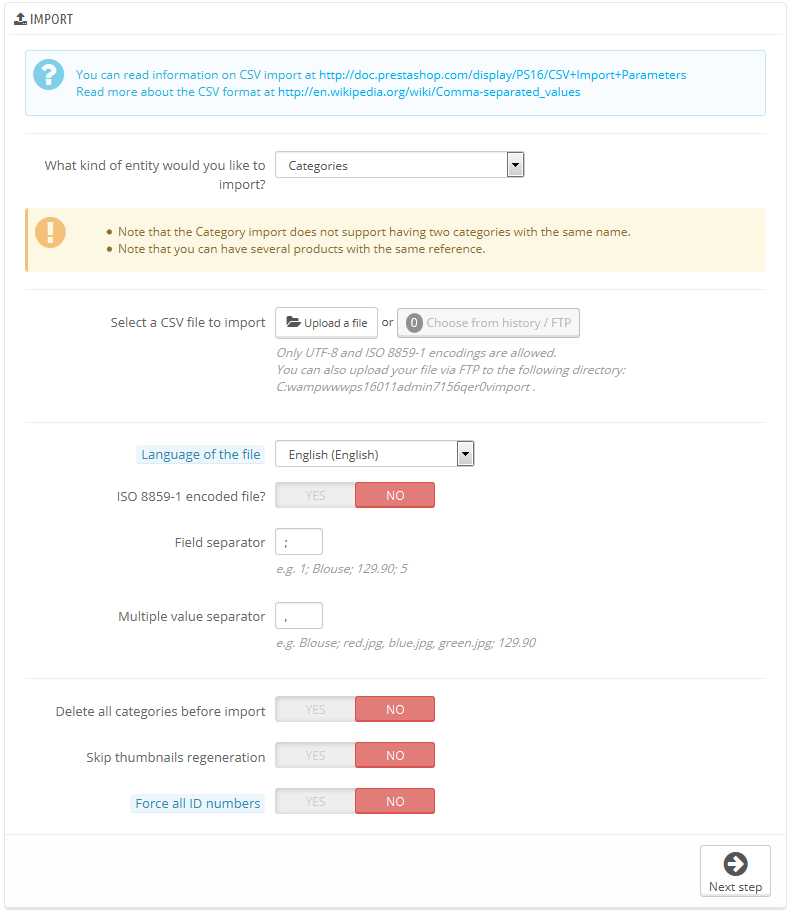
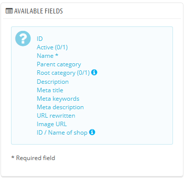
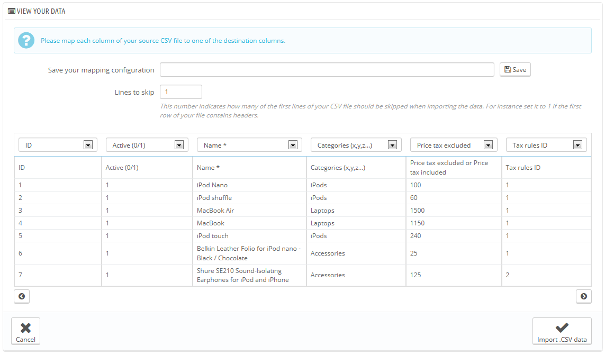

# CSV-Import

The CSV import page enables you to easily fill your product catalog when you have a very large amount of products, or to import data that you exported and converted from another e-commerce tool.

CSV is an acronym of "Comma-separated values". It is a popular plain-text format when there is a need to import, export or simply store data in a non-proprietary format. Almost all data handling tool support CSV format, in various incarnations. You can read more about the CSV format on Wikipedia: [http://en.wikipedia.org/wiki/Comma-separated\_values](http://en.wikipedia.org/wiki/Comma-separated\_values).



The import process requires preparation, and starts with a form made of primary settings:

* **What kind of entity would you like to import?**. Entities are the types of data that you can import. The "Available fields" on the right updates when you choose an entity, so that you know the kind of data that your CSV file should contain.\
  PrestaShop enables you to import the following types of data:
  * Categories,
  * Products,
  * Combinations,
  * Customers,
  * Addresses,
  * Manufacturers,
  * Suppliers,
  * Aliases,
  * Supply orders (if Advanced Stock Management is enabled),
  * Supply order details (if Advanced Stock Management is enabled).
*   **Select a CSV file to import**. You can import more than one file at a time, but make sure that they all contain the same type of data.

    You can download sample files for each type of data from the "Download sample CSV files" section on the right. This helps you compare these sample files with your own files, so that you can make sure that the files you are about to import are indeed ready to be imported to PrestaShop. These files are actually stored in the `/docs/csv_import` folder of your installation of PrestaShop.
* **Language of the file**. Data can only be imported for a single language at a time. If your data exists in more than one language, you should split it into as many files.
* **ISO-8859-1 encoded file?**. By default, the import files should use UTF-8 encoding. But if your files use ISO-8859-1 and you would rather not convert them, you can check this box.
* **Field separator**. Not all CSV file use commas to separate their values: some use tabulations, others semicolons, etc. You can indicate what your files use in this field.
* **Multiple value separator**. When an attribute can support more than one value, these values need to be separated with a specific separator. After reviewing your files, indicate your separator here.
* **Delete all \_\_\_ before import**. This option will erase all previously existing entries of the type of data you are importing. Thus you will start with a clean slate.
* **Use product reference as key**. Product import only. You can choose to have the product key be determined by PrestaShop, or instead use the product's reference as the ID. In this case, make sure the file does contain references for all your importer products.
* **Skip thumbnails regeneration**. Category and product import only. You can choose to have PrestaShop regenerate the thumbnails that are linked from your CSV file (in the "Image URL" or "Image URLs" fields).
* **Force all ID numbers**. You can either keep the imported IDs, or let the importer auto-increment them.

When changing the Entity setting, the section on the right, titled "Available fields", changes to present the expected data fields. Although the importing tool helps you by taking care of matching your file's fields with PrestaShop's, you should strive to make your data more import-friendly by following the naming scheme and order of the presented fields. If not, the import will be more tedious, but not impossible.\
Some fields have a little information popup available (represented by a "i" logo), which you can display by hovering the mouse cursor over it. They mostly pertain to PrestaShop's multistore or advanced stock management features. Make sure to read them all in order to better build/edit your data files.



## Data format <a href="#csv-import-dataformat" id="csv-import-dataformat"></a>

Imported data file must be in text-file, using a CSV-based format and the accompanying `.csv` file extension. We recommend using a semicolon ";" as a field separator. If you textual data (product description and such) contains semicolons, you should either remove them, or choose another separator in the "Field separator" option.

You can create a CSV file using any text editor (we recommend Notepad++: [http://notepad-plus-plus.org/](http://notepad-plus-plus.org/)), but we do advise you to use a spreadsheet program, then save your work in the CSV format. Using a spreadsheet program enables you to have an easier and more visual grasp of your data, in comparison to the plain text file. You can use the commercial Microsoft Excel ([http://office.microsoft.com/en-us/excel/](http://office.microsoft.com/en-us/excel/) or the free [OpenOffice.org](http://openoffice.org) [http://www.openoffice.org/](http://www.openoffice.org/) Calc.

Here is a sample import file, with a list of products:

```
"Enabled";"Name";"Categories";"Price";"Tax rule ID";"Buying price";"On sale";"Reference";"Weight";"Quantity";"Short desc.";"Long desc";"Images URL"
1;"Test";"1,2,3";130;1;75;0;"PROD-TEST";"0.500";10;"'Tis a short desc.";"This is a long description.";"http://www.myprestashop/images/product1.gif"
0;"Test 02";"1,5";110;1;65;0;"PROD-TEST2";"0.500";10;"'Tis also a short desc.";"This is a long description too.";"http://www.myprestashop/images/product2.gif"
1;"Test 03";"4,5";150;1;85;0;"PROD-TEST3";"0.500";10;"'Tis a short desc. again";"This is also a long description.";"http://www.myprestashop/images/product3.gif"
```

Note that this is only a regular sample files built for this demonstration; it is purposefully not optimized for PrestaShop importation. If you need a sample file you can learn from, use the ones you can download from the "Upload" button's form.

The first row should be a descriptive name for the data column (you will be able to skip it during the import process). There must be the same number of columns on each row.

You should remember that:

* The price column will use your store's default currency.
* Categories are to be specified using their existing IDs (so you should have imported them first), and separated with a comma (by default).
* The URL of the image must be an absolute link. In other words, it should be the link that may be used in a web browser in order to display the image. For instance: [http://www.myprestashop/images/productXXX.gif](http://www.myprestashop/images/productXXX.gif).
* The file's character encoding should be UTF-8. If not, use ISO-8859-1 and check the "ISO-8859-1 encoded file?" option.
* Dates use the ISO 8601 format, without a time zone designator (the time zone is the one for your store): `2013-06-21 15:07:27`.

## Uploading the file <a href="#csv-import-uploadingthefile" id="csv-import-uploadingthefile"></a>

Once you have all your data in CSV format, you can upload them to your store's database using the form in this page.

You have two ways to register files to import:

* Using your browser: click the "Add file" button, find your file then validate. Do this as many times as necessary to list all your import files.
* Using your FTP client: upload the files in the `/admin-dev/import` folder of your PrestaShop installation. Reload the import page: the "Choose from history/FTP" button should now indicate a number. Click the button to display the list of available files (including the ones you previously uploaded using the browser), then click the "Use" button for the file you wish to import.

Once your files are all listed in the "Select your CSV file" section, you can proceed with the rest of the form:

1. **Select the type of data contained in your file**, using the drop-down list named "What kind of Entity would you like to import?". Once you have selected the type of data, the list of the available fields appears on the right, which helps you refine your CSV file – at least for the order of the columns, which will soon prove handy.
2. **Select the language of the imported content**. If the target language is not available, you must install it first, in the "Languages" page under the "Localization" menu.
3. **Select the file encoding**. Simply indicate if the file uses ISO-8859-1 or not. If not, then it is assumed the files use UTF-8.
4. **Select the field separators**. We suggest that you leave the default values ("field separator" with a semicolon "`;`", "multiple value separators" with a comma "`,`"). But obviously, if your CSV file is built differently, you should change these values accordingly.
5. If you want to remove all the products in your catalog before importing, select the appropriate option.
6. Once all your choices have been made, click "Next step".

All import files are uploaded directly in the admin folder's `/import` sub-folder. If the CSV File drop-down menu gets too crowded, you can delete old imports directly using your FTP client.

When clicking the "Next step" button, the page reloads with the data mapping tool. This interface helps you map you file's data columns with the ones required by PrestaShop.



Presented in this table are the rows from your CSV file, placed under arbitrary columns matched to PrestaShop's database needs. It is up to you to make sure that all the columns from your CSV file are matched with the correct column header, using each header's drop-down selector, so as to import your content correctly.

For instance, with our sample file:

* **First column**. We marked it as "Enabled", PrestaShop presents "ID" as a header. Click on the header's drop-down menu, and select "Active (0/1)".
* **Second column**. Marked "Name", header indicates "Active (0/1)". Let's change the header for "Name \*".
* **Third column**. You get the idea...

The screen cannot contain more than 6 columns, so click the ">" and "<" buttons to see the other columns, and make sure to match them all correctly.

In our example, we used the first row as for column names. Since we do not want these imported, enter "1" in the "Lines to skip" text-field.

Once you are done matching your columns, click the "Import .CSV data" button (bottom right-hand corner of the screen), and PrestaShop will start the importing process. When the process is done, you are sent to the main screen, which should either confirm that everything has indeed been imported, or give you a notice of all the encountered problems. In this second case, you should review your CVS file and make sure to correct everything.

### Mapping configurations <a href="#csv-import-mappingconfigurations" id="csv-import-mappingconfigurations"></a>

The mapping process can be a tedious task if you cannot customize your CSV files columns order according to that used by the PrestaShop importer, and even more so if you have to do that repeatedly or frequently. That is why PrestaShop includes a small tool to save the current mapping order that you have set up using all the headers drop-down selectors.


The tool is a simple field at the top of the matching tool. You can do the three basic actions (only one if there is no mapping configuration saved yet):

* **Saving**. Enter a descriptive name in the field, and click "Save". The interface updates to feature the saved configuration in its drop-down list.
* **Loading**. Select a mapping configuration in the drop-down list, and click "Load".
* **Deleting**. Select a mapping configuration in the drop-down list, and click "Delete".
