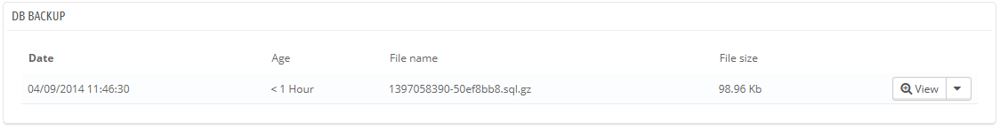
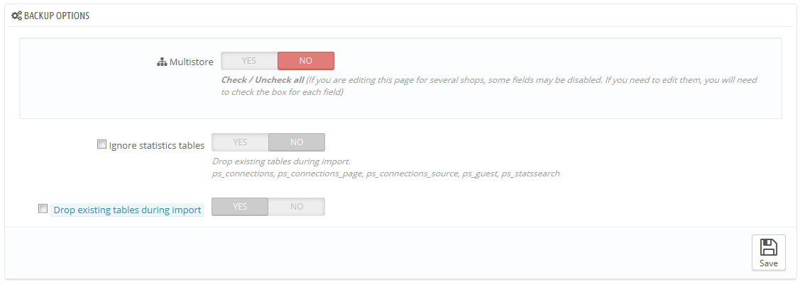

# Datenbank-Backup

Ein Backup ist der Inhalt Ihrer Datenbank, gespeichert in Dateien, die Sie an einem sicheren Ort aufbewahren. Darauf kann man zurückgreifen, wenn Ihre Datenbank inkonsistent wird, korrupt, oder abstürzt.

Sie müssen regelmäßig Sicherungskopien Ihrer Shops durchzuführen, so dass Sie Ihren Shop im Falle eines Crashs schnell und unter guten Bedingungen neustarten können. Die Datenbank enthält alle Informationen Ihres Shops, von denen viele unverzichtbar für korrekte Funktion von PrestaShop sorgen - und damit sind nicht nur Ihre Artikel und Kategorien gemeint.

Je öfter Sie Sicherungen durchführen, desto sicherer sind Sie. Einmal in der Woche sollte eine neue gemacht werden, mindestens.

Um Datenbanksicherungen von Ihrem Shop zu erstellen haben Sie mehrere Möglichkeiten. Sie können Tools wie phpMyAdmin (für fortgeschrittene Anwender) oder das in PrestaShop integrierte Tool verwenden: die "Datenbank-Backup" -Seite.

Die Seite beginnt mit zwei großen Hinweisen. Sie sollten beide vollständig lesen, um eine bessere Vorstellung davon zu bekommen, was die Seite kann:

* Der Abschnitt "Haftungsausschluss" listet eine Reihe von Erinnerungen über Backups auf, die Sie jedes Mal berücksichtigen sollten, wenn Sie ein Backup erstellen. Der Abschnitt endet mit "Ich habe den Haftungsausschluss zur Kenntnis genommen. Hier klicken und Backup erstellen.", das Sie anklicken müssen, um eine Sicherungskopie zu erstellen. In einem neuen "Download-Bereich", am Kopf der Seite, können Sie die Backup-Datei herunterladen.
* Der Abschnitt "Backup-Wiederherstellung leicht gemacht – in 10 Schritten" gibt Ihnen Tipps, wie Sie Ihre Daten im Falle eines Fehlers wiederherstellen können. Sie sollten diese Tipps im Gedächtnis behalten oder zumindest speichern, denn ein Absturz hat zur Folge, dass Sie nicht auf die PrestaShop-Verwaltung zugreifen können - und damit auch nicht auf die Datenbank-Backup-Seite.

Die Tabelle zeigt alle Backups, die bereits gemacht wurden, unter Angabe des Erstellungsdatums, des Alters, Dateiname und Größe.\
Auf der rechten Seite jeder Zeile sind die verfügbaren Aktionen:

* **Anzeigen**. Hier können Sie dieses Backup herunterladen.
* **Löschen**. Ermöglicht es Ihnen, diese Sicherung zu löschen. Seien Sie vorsichtig, dieser Vorgang ist endgültig.

Nach jedem Backup-Prozess sollten Sie die erzeugte Backup-Datei herunterladen, indem Sie auf das Symbol "Anzeigen" klicken, oder einfach über den Link im Benachrichtigungsfeld am oberen Rand. Legen Sie Ihre Sicherungsdatei an einem sicheren Ort ab, Sie könnten sie im Ernstfall gut gebrauchen. Darüber hinaus können Sie diese Sicherungen direkt auf dem Server im Ordner / backup speichern, unter Ihrem spezifischen Namen im / admin-Ordner.

Ihre Datenbank wird unter Verwendung des Standard-SQL-Formats und seiner SQL-Datei-Erweiterung gespeichert und komprimiert (mit dem bzip2-Algorithmus und seiner .bz2 Dateierweiterung (eine Variante des beliebten Zip-Formats. Lesen Sie hier mehr: [Http://en.wikipedia.org/wiki/Bzip2](http://en.wikipedia.org/wiki/Bzip2) )). Das ergibt ein Datei-Archiv mit der Dateiendung .sql.bz2.

## Backup-Optionen 

Am unteren Rand des Bildschirms sind zwei Optionen verfügbar:

* **Statistiktabellen ignorieren**. PrestaShop speichert Statistiken Ihrer Website in Datenbanktabellen, die ziemlich schnell sehr groß werden können. Zwar kann es sinnvoll sein, Ihre Statistiken an einem sicheren Ort zu halten, dies macht Ihre Backups meistens aber unnötig größer, während Sie mehr daran interessiert sind, ein Backup Ihrer Artikel, Kategorien, Kunden, Bestellungen, etc. zu erstellen.Standardmäßig sichert PrestaShop alle Tabellen, wenn Sie aber wenig Speicherplatz auf Ihrem Web-Server haben sollten, ändern Sie diese Option auf "Ja".
* **Vorhandene Tabellen während des Imports löschen**. Beim Importieren einer Backup-Datei kann das System entweder die vorhandenen Livetabellen mit dem Inhalt des Backups überschreiben oder alle vorhandenen löschen, um sie mit dem Inhalt des Backups ersetzen. Der erste Fall kann zu Redundanz führen, weshalb diese Option standardmäßig aktiviert ist.

