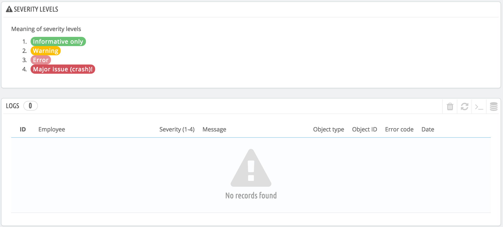
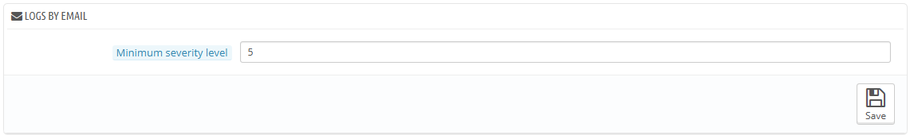

# Log-Dateien

Fehler passieren. Die meisten sind Ihnen überhaupt nicht bewusst, weil PrestaShop sie still korrigiert. Vielleicht möchten Sie aber mehr über sie erfahren, um in der Lage zu sein, die häufigsten Fehler zu vermeiden und so Ihren Shop stabiler zu machen.

Auf der „Log-Dateien“- können Sie einen Blick auf die PHP-Fehlermeldungen Ihres Shops werfen. Sie werden in der zentralen Tabelle aufgeführt und in 4 Stufen dargestellt:

* 1: Rein informativ. Laufzeit Benachrichtigungen. Zeigt, dass das Skript auf etwas gestoßen ist, das ein Fehler sein könnte, aber auch im Rahmen der normalen Ausführung eines Skripts liegen kann.
* 2: Vorsicht. Laufzeit-Warnungen (nicht-fatale Fehler). Die Ausführung des Skripts wird nicht angehalten.
* 3: Fehler.
* 4: Schwerwiegendes Problem(Absturz) !. Fataler Laufzeitfehler. Dies zeigt Fehler, die nicht korrigiert werden können, wie eine fehlerhafte Speicherzuweisung. Die Ausführung des Skripts wird abgebrochen.

Diese Erklärungen sind die Offiziellen des PHP-Handbuchs. Lesen Sie hier mehr: [http://www.php.net/manual/en/errorfunc.constants.php](http://www.php.net/manual/en/errorfunc.constants.php).

## Protokolle per E-Mail 

Die Fehlerstufen dienen auch als Werte für die "Protokolle per E-Mail" -Funktion.\
PrestaShop fügt einen letzten Wert ein, 5, was anzeigt, dass der Administrator keine Benachrichtigung möchte, sei es für kleinere oder größere Fehler.

Durch das Fehlerprotokollierungs-Tool können Sie eine E-Mail-Benachrichtigung erhalten, wenn ein Fehler auftritt. Benachrichtigungen werden an die E-Mail-Adresse des Shop-Besitzers gesendet und Sie können die Bedeutung, ab welcher sie E-Mails erhalten sollen, konfigurieren:

* &#x20;"1", wenn Sie über alles, auch die kleinsten Informationen in Kenntnis gesetzt werden möchten.
* "3", wenn Sie nur über Probleme (Fehler und Schwerwiegende Probleme) informiert werden möchten.
* "4", wenn Sie nur von schwerwiegenden Problemen wissen möchten.
* "5" ist die Standardeinstellung, was bedeutet, dass keine Benachrichtigung gesendet wird.
