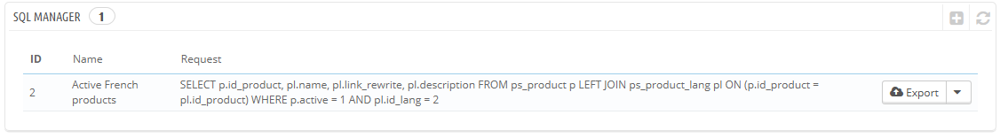
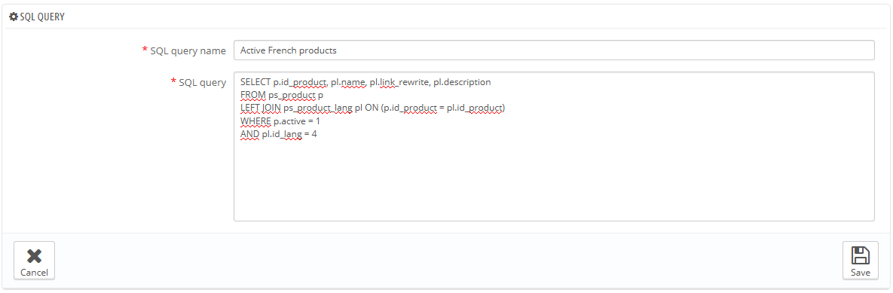
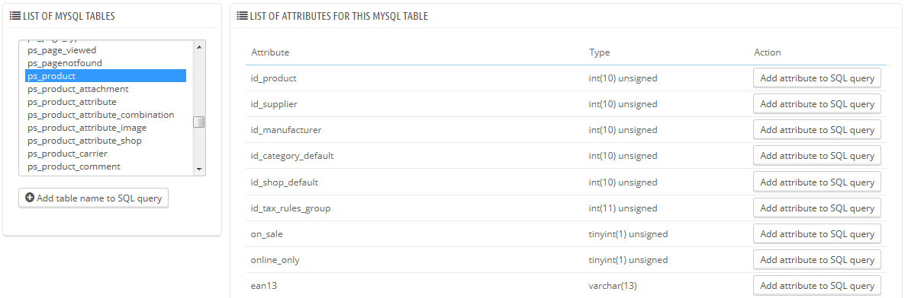
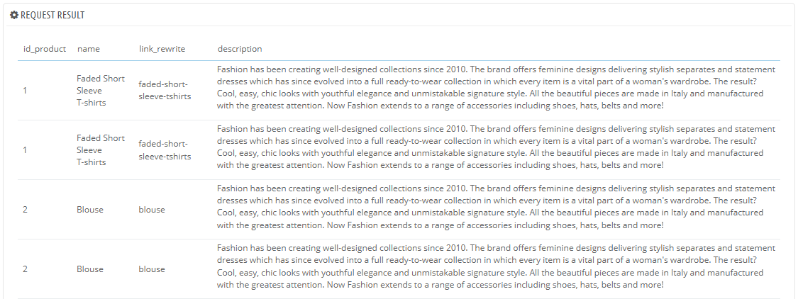
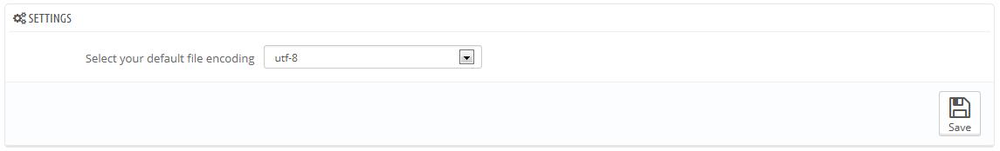

# SQL-Abfragen

SQL-Abfragen sind eine komplexe Funktion, die nur von technisch versierten Mitarbeitern genutzt werden sollte, die wissen, wie man mit einer Datenbank mit Hilfe der Sprache SQL umgeht. Im Gegenzug zu dieser Komplexität kann diese Funktion sehr leistungsfähig sein und sich als immens nützlich für diejenigen herausstellen, die sich damit beschäftigen.



Dieses Tool ermöglicht es Ihnen, SQL-Abfragen direkt an der PrestaShop-Datenbank durchzuführen, und sie für die Verwendung zu einem späteren Zeitpunkt zu speichern. PrestaShop stellt die Daten seiner Datenbank Daten in vielen Ansichten dar, aber Sie brauchen vielleicht etwas mehr, oder einfacher, etwas Roheres als die Schnittstelle von PrestaShop. Mit dem SQL Manager können Sie komplexe Abfragen ausführen, die auf Datentabellen bauen, die SIE benötigen.\
Zum Beispiel können Sie mit diesem Tool und Ihren Kenntnissen in SQL eine wiederverwendbare Abfrage erstellen, die Ihnen eine aktualisierte Liste der Kunden liefert, die den Newsletter abonniert haben, oder einfach eine Liste von Artikeln, im HTML- oder CSV-Format.

Aus Sicherheitsgründen sind einige Arten von Abfragen nicht zulässig: UPDATE, DELETE, CREATE TABLE, DROP, etc. Kurz gesagt, können Sie nur Daten lesen (SELECT-Abfrage).

Außerdem werden Sicherheitsschlüssel oder Kennwörter versteckt (\*\*\*\*\*\*\*\*\*\*\*).

## Erstellen einer neuen Abfrage <a href="#sql-abfragen-erstelleneinerneuenabfrage" id="sql-abfragen-erstelleneinerneuenabfrage"></a>

Wie üblich, führt die Schaltfläche "Neue SQL-Abfrage" zu einem Erstellungsformular. Es hat zwei Punkte:

* **Name**. Machen Sie den Namen so lange und ausführlich wie nötig.
* **Abfrage**. Die SQL-Abfrage selbst. Es steht Ihnen frei, Joins oder andere komplizierte Abfragen zu erstellen.



Zusätzlich hilft Ihnen der Abschnitt "Liste der MySQL-Tabellen", die Datenbank zu erkunden, und macht es einfacher für Sie, Ihre Abfragen zu erstellen. Es gibt Ihnen eine praktische und anklickbare Auswahl aller derzeit verfügbaren Datenbanktabellen. Wählen Sie eine Tabelle und PrestaShop zeigt all ihre Attribute und Typen an, klicken Sie dann auf "Eigenschaft zur SQL-Abfrage hinzufügen", um dessen Namen in das Feld "Abfrage" zu senden.



Speichern des Formulars sendet Sie zurück zur Hauptseite mit der Liste der Abfragen.

## Starten einer Abfrage <a href="#sql-abfragen-starteneinerabfrage" id="sql-abfragen-starteneinerabfrage"></a>

Jede gespeicherte Abfrage in der Tabelle hat vier Symbole rechts:

* **Exportieren**. Führt die Abfrage aus und das Ergebnis wird im CSV-Format heruntergeladen.
* **Anzeigen**. Führt die Abfrage aus und gibt das Ergebnis direkt in einer HTML-Tabelle innerhalb der PrestaShop-Schnittstelle aus.
* **Bearbeiten**. Sie können eine Abfrage so oft Sie möchten bearbeiten, um sie zu verfeinern und bessere Ergebnisse zu erhalten.
* **Löschen**. Wenn eine Abfrage nicht mehr verwendet wird(oder einfach weil sie nicht funktioniert), gelöscht werden soll, können Sie sie durch Klicken dieses Buttons und Bestätigung Ihrer Auswahl löschen.



## Einstellungen <a href="#sql-abfragen-einstellungen" id="sql-abfragen-einstellungen"></a>

Es gibt nur eine Einstellung:

* **Standard-Dateikodierung auswählen**. Sie können die Zeichenkodierung der heruntergeladenen CSV-Datei konfigurieren. Das standardmäßige UTF-8 wird empfohlen, aber Sie können auch ISO-8859-1, wenn es sein muss.



## Einige Beispielabfragen <a href="#sql-abfragen-einigebeispielabfragen" id="sql-abfragen-einigebeispielabfragen"></a>

Die Möglichkeiten sind endlos, aber hier sind ein paar Beispielabfragen, damit Sie Ihre eigenen bauen können.

### alle E-Mail-Adressen aller Kunden <a href="#sql-abfragen-allee-mail-adressenallerkunden" id="sql-abfragen-allee-mail-adressenallerkunden"></a>

```
SELECT email FROM ps_customer
```

### alle E-Mails-Adressen aller Kunden, die den Newsletter abonniert haben <a href="#sql-abfragen-allee-mails-adressenallerkunden-diedennewsletterabonnierthaben" id="sql-abfragen-allee-mails-adressenallerkunden-diedennewsletterabonnierthaben"></a>

```
SELECT email
FROM ps_customer
WHERE newsletter = 1
```

### Auflistung aller Produkte, die aktiv sind und eine Beschreibung in Französisch (id\_lang = 4) haben <a href="#sql-abfragen-auflistungallerprodukte-dieaktivsindundeinebeschreibunginfranzoesisch-id_lang-4-haben" id="sql-abfragen-auflistungallerprodukte-dieaktivsindundeinebeschreibunginfranzoesisch-id_lang-4-haben"></a>

```
SELECT p.id_product, pl.name, pl.link_rewrite, pl.description
FROM ps_product p
LEFT JOIN ps_product_lang pl ON (p.id_product = pl.id_product)
WHERE p.active = 1
AND pl.id_lang = 4
```

### Auflistung aller Bestellungen, mit Details über Versanddienst, Währung, Zahlung, Gesamtpreis und Datum <a href="#sql-abfragen-auflistungallerbestellungen-mitdetailsueberversanddienst-waehrung-zahlung-gesamtpreisun" id="sql-abfragen-auflistungallerbestellungen-mitdetailsueberversanddienst-waehrung-zahlung-gesamtpreisun"></a>

```
SELECT o.`id_order` AS `id`,
	CONCAT(LEFT(c.`firstname`, 1), '. ', c.`lastname`) AS `Customer`,
	ca.`name` AS `Carrier`,
	cu.`name` AS `Currency`,
	o.`payment`, CONCAT(o.`total_paid_real`, ' ', cu.`sign`) AS `Total`,
	o.`date_add` AS `Date`
FROM `ps_orders` o
LEFT JOIN `ps_customer` c ON (o.`id_customer` = c.`id_customer`)
LEFT JOIN `ps_carrier` ca ON (o.id_carrier = ca.id_carrier)
LEFT JOIN `ps_currency` cu ON (o.`id_currency` = cu.`id_currency`)
```
