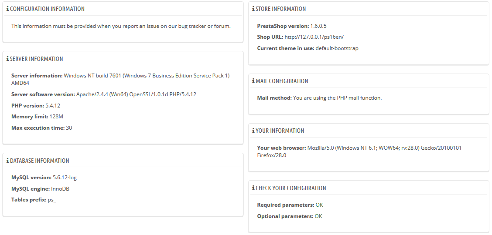

# Systemeinstellungen

Diese Seite dient als Übersicht über Ihre PrestaShop Konfiguration: Version, Server-Info, PHP-Version, MySQL-Version. Alle diese beweisen sich als wirklich nützlich, wenn Sie den PrestaShop-Entwicklern ein Problem melden müssen, bzw. Ihrem Webmaster oder Web-Host.

Es gibt noch einen letzten Abschnitt mit dem Titel "Liste der geänderten Dateien". Direkt nach der ersten Installation steht dort nur "keine Änderung Ihrer Dateien festgestellt".\
Aber nachdem Sie einige Module und ein paar Themen installiert haben, erweiterte Änderungen an einigen Override-Klassen durchgeführt oder Dateien gelöscht haben, zeigt diese Liste die Differenz zwischen der aktuellen Installation von PrestaShop, verglichen mit seinem ursprünglichen Zustand. Dies hilft Ihnen zu sehen, welche Änderungen an der Installation gemacht worden ... und damit, was zu berücksichtigen ist, wenn Sie Ihren Shop manuell aktualisieren möchten, oder wenn Sie die Dateien auf einen neuen Server verschieben möchten.

Selbst bei einer Neuinstallation könnte dieser Abschnitt angeben, dass `".gitattributes"`, `".gitignore"`, `"CONTRIBUTING.md"`, `"CONTRIBUTORS.md"` oder `"README.md"` fehlen. Dies sind Git-spezifische Dateien und PrestaShop verwendet sie nicht, Sie sollten sich also nicht darum kümmern.
