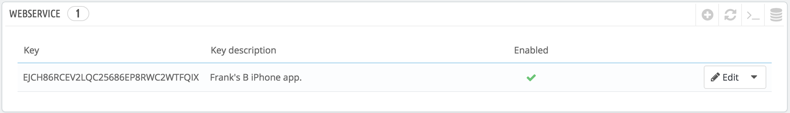
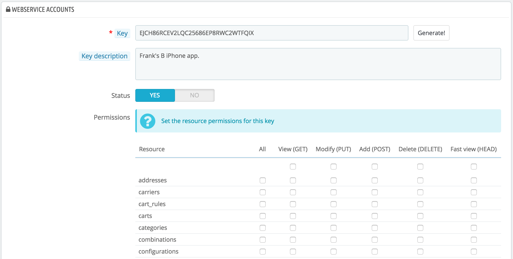
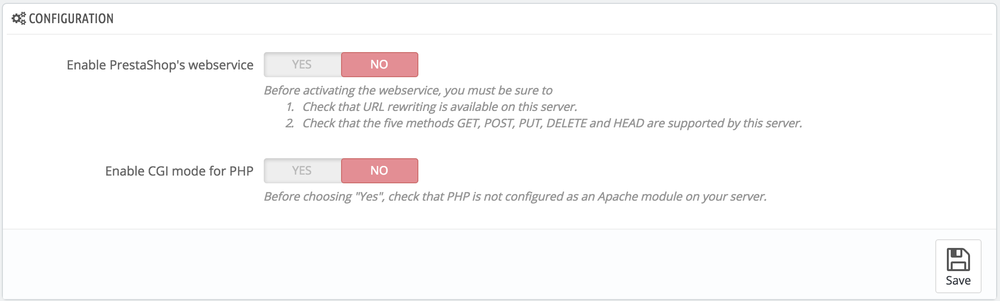

# Webservice

Auf dieser Seite können Sie den Webservice Ihres Shops aktivieren, so dass Drittanbieter-Tools auf Ihre Daten zugreifen können. Dies macht es Tools möglich, Ihnen oder Ihren Kunden eine bessere Nutzung Ihres Shops(z.B. mobile Apps) zu ermöglichen.

Ein Web-Service ist ein Verfahren zur Kommunikation zwischen zwei elektronischen Geräten über ein Netzwerk. Es beruht auf einer bekannten Reihe von Methoden, Formaten und Zugriffsrechten, um so in der Lage zu sein, den Inhalt des Webservice in einem anderen autorisierten Tool zu verwenden, und auf dem ursprünglichen Inhalt aufzubauen. Lesen Sie mehr darüber auf Wikipedia: [http://en.wikipedia.org/wiki/Web\_service](http://en.wikipedia.org/wiki/Web\_service).

Die Seite beginnt mit der Auflistung der gegenwärtig existierenden Webservice Keys in einer Tabelle, falls schon vorhanden. Ein Webservice Keys ist ein eindeutiger Zugang, den Sie an einen Entwickler weitergeben können, der ihn dann verwendet, um ein Tool eindeutig mit Ihrem Shop verbinden zu können. Geben Sie Keys mit Bedacht heraus, Sie wollen vielleicht nicht immer, dass jeder Zugriff auf Ihre Daten hat.

Nicht jede App kann auf Ihren Shop durch PrestaShop Webservice zugreifen: Sie entscheiden, welche es können und was sie tun dürfen. Jede App verfügt über einen einzigartigen Key, mit spezifischen Zugriffsrechten.

## Hinzufügen eines neuen Schlüssels 

Durch den "NEU" –Button gelangen Sie zum Erstellungsformular für Webservice-Schlüssel:

* **Schlüssel**. Ein eindeutiger Schlüssel. Sie können entweder Ihren eigenen eintragen, oder einen generieren lassen, indem Sie auf die Schaltfläche "Generieren!" klicken, oder indem Sie einen Online-Key-Generator verwenden. Generierte Schlüssel sind meistens sicherer, weil sie schwieriger zu erraten sind.
* **Schlüsselbeschreibung**. Eine Erinnerung für Sie, um zu sehen, für wen der Schlüssel ist und welche Zugriffsrechte er gewährt zum Beispiel.
* **Status**. Sie können einen Schlüssel jederzeit deaktivieren. Dies ermöglicht Ihnen, den Zugriff auf Ihre Daten von einem bestimmten Schlüssel nur temporär zu gewähren.
* **Berechtigungen**. Sie müssen nicht alle Ihre Daten mit jedem Schlüssel teilen. Sie können aus einer breiten Palette von Berechtigungen wählen, entweder durch den Abschnitt oder durch Art des Zugriffs. Vielleicht möchten Sie, dass einige Anwendungen nur in der Lage sind, einen Teil Ihrer Artikel zu betrachten, während einige andere (zum Beispiel diejenigen, die Sie verwenden, um den Shop aus der Ferne zu verwalten) in der Lage sein sollten, alles tun zu können. Wählen Sie mit Bedacht.

## Konfiguration 

Aus Gründen der Sicherheit sollten Sie sicherstellen, dass der Server Ihres Shops sichere SSL-Verbindung unterstützt!

Die Konfiguration ist recht einfach:

* **Webservice aktivieren**. Wenn Sie nicht möchten, dass auf Ihren Shop durch Drittanbieter-Tools und Anwendungen zugegriffen werden kann, halten Sie die Option einfach deaktiviert.
* **PHP CGI mode aktivieren**. Der CGI mode ist eine spezielle Einstellung für den Apache-Server, in dem Sie festlegen, dass er PHP als CGI-Skript handhaben soll, anstatt als Apache-Modul. Während der CGI-Modus den Ruf als sicherere Variante hat, ist erst im Mai 2012 eine Sicherheitslücke gefunden worden. Bei Fragen sollten Sie Ihren Web-Host für Ratschläge konsultieren.

[Http://doc.prestashop.com/display/PS16/Using+the+PrestaShop+Web+Service](http://doc.prestashop.com/display/PS16/Using+the+PrestaShop+Web+Service): Entwickler können hier die Dokumentation finden, um zu lernen wie man ein Tool zur Nutzung vom PrestaShop Webservice erstellt.
