# Die Oberfläche der Lagerverwaltung

/\*\<!\[CDATA\[\*/\
div.rbtoc1597071549867 {padding: 0px;}\
div.rbtoc1597071549867 ul {list-style: disc;margin-left: 0px;}\
div.rbtoc1597071549867 li {margin-left: 0px;padding-left: 0px;}\
\
/\*]]>\*/

* [Durch die erweiterte Lagerverwaltung navigieren](die-oberflaeche-der-lagerverwaltung.md#DieOberflächederLagerverwaltung-DurchdieerweiterteLagerverwaltungnavigieren)
  * [Lagerverwaltung aus der Artikelverwaltung](die-oberflaeche-der-lagerverwaltung.md#DieOberflächederLagerverwaltung-LagerverwaltungausderArtikelverwaltung)
  * [Verwaltung der Lager](die-oberflaeche-der-lagerverwaltung.md#DieOberflächederLagerverwaltung-VerwaltungderLager.1)
  * [Lagerverwaltung](die-oberflaeche-der-lagerverwaltung.md#DieOberflächederLagerverwaltung-Lagerverwaltung)
  * [Lagerbewegung](die-oberflaeche-der-lagerverwaltung.md#DieOberflächederLagerverwaltung-Lagerbewegung)
  * [Aktueller Lagerbestand](die-oberflaeche-der-lagerverwaltung.md#DieOberflächederLagerverwaltung-AktuellerLagerbestand)
  * [Lagerbestand](die-oberflaeche-der-lagerverwaltung.md#DieOberflächederLagerverwaltung-Lagerbestand)
  * [Bestellaufträge](die-oberflaeche-der-lagerverwaltung.md#DieOberflächederLagerverwaltung-Bestellaufträge)
  * [Configuration](die-oberflaeche-der-lagerverwaltung.md#DieOberflächederLagerverwaltung-Configuration)

Lagerverwaltung ist ab dem Moment von großer Bedeutung, an dem Sie Artikel verkaufen, deren Menge sich bei jedem Verkauf vermindert(keine digitalen Artikel oder Dienstleistungen).

Um festzustellen, ob Sie die erweiterte Lagerverwaltung von PrestaShop benötigen, lesen Sie zunächst das Kapitel "Allgemeines Konzepte": [Allgemeines Konzept](allgemeines-konzept.md)

Wenn Sie die erweiterte Lagerverwaltung nutzen möchten, müssen Sie:

* Artikel in Lagern verwalten.
* Artikel in den Lagern Lieferanten zuordnen.
* Artikel in den Lagern entsprechenden Shops zuordnen.

Lagerverwaltung lässt sich über 3 Stufen realisieren.

Diese Stufen sind:

* Keine Lagerverwaltung: Es gibt keine Artikelmenge, PrestaShop geht davon aus, dass der Vorrat unendlich ist. Verwenden Sie diese Option, wenn Sie nur virtuelle Produkte verkaufen (Dateien, Dienstleistungen, etc.).
* Einfache Lagerverwaltung: für jeden Artikel, den Sie verkaufen, können Sie die aktuell verfügbare Menge angeben (einschließlich Artikelvarianten). Verwenden Sie diese Option, wenn Sie nur wenige Artikel haben, oder ein simples Lager haben.
* Erweiterte Lagerverwaltung: für jeden Artikel(und seine Varianten), den Sie verkaufen  können Sie angeben, in welchem, von einer unbegrenzten Anzahl an Lagern, sich die verfügbare Menge befindet (mit unterschiedlichen Lieferanten und Bewertungsmethoden). Sie können auch Ihre Lagerbewegungen, den aktuellen Lagerstand, sowie den Lagerbestand einsehen und Bestellaufträge für Lieferanten erstellen.

Die dazugehörigen Einstellungen sind:

* Voreinstellungen> Artikel> Artikel Lager: Hier können Sie folgende Funktionen aktivieren:\

  * **Bestandsverwaltung aktivieren.** Sie können die aktuelle Artikelmenge einstellen, PrestaShop senkt die Menge bei einem Kauf und erhöht sie wieder bei einer Stornierung. Standardmäßig sollten Sie diese Funktion aktiviert lassen, da das Deaktivieren die gesamte Lagerverwaltung Ihres Shops beeinflusst. Nur wenn Sie sollten dies nur deaktivieren, wenn Sie keine Bestände haben - zum Beispiel, wenn Sie nur virtuelle Artikel vertreiben.
  * **Erweiterte Lagerverwaltung aktivieren**. Eine weitere kleine Option, die große Auswirkungen hat: es wird ein neues Menü namens "Lager" hinzugefügt, das es ermöglicht, Ihre Lager auf einer Pro-Lager-Basis zu betreuen, falls erforderlich. Sie können hier alle Details zu Ihren Lagern sehen: Lagerbewegung, aktueller Lagerstand, Lagerbestand, Bestellaufträge, etc. Sie erfahren mehr über die Erweiterte Lagerverwaltung im Abschnitt "Das Lager verwalten" dieses Kapitels.
  * **Erweiterte Lagerverwaltung für neue Artikel automatisch aktivieren**. Wenn aktiviert, werden neue Artikel automatisch von der erweiterten Lagerverwaltung behandelt. Das Standard-Warenlager für diese Artikel wird in der nächsten Option festgelegt.
  * **Standard-Warenlager für neue Artikel**. Wenn neue Artikel die erweiterte Lagerverwaltung nutzen, legen Sie hier das Standard-Lager dafür fest.
* Home> Artikel> Artikelseite: 1-2 Registerkarten wurden hinzugefügt.\

  * &#x20;Mengen:\

    * Im einfachen Modus: Sie können manuell die Menge der einzelnen Artikel ändern.
    * Im erweiterten Modus: die Mengen werden von PrestaShop nun im Menü „Lager“ verwaltet.
  * Lager: Im erweiterten Modus können Sie das Lager für jeden Artikel bzw. jede Artikelvariante festlegen.
* Menü Lager: im erweiterten Modus können Sie auf alle Seiten der Lagerverwaltung(Lagererstellung, Lagerbewegung, Lagerbestand, aktueller Bestand, Bestellaufträge) zugreifen.

Im folgenden Abschnitt sind diese Seiten nacheinander beschrieben.

## Lagerverwaltung aus der Artikelverwaltung 

### Mengen 

In PrestaShop 1.4 konnten Sie die Artikelmenge nur manuell festlegen.

In PrestaShop 1.5 und 1.6 können Sie denselben Vorgang auf die gewohnte Weise durchführen. Aber sobald die erweiterte Lagerverwaltung aktiviert wurde, können Sie auch automatisch die Menge festlegen, in Abhängigkeit von der aktuellen Menge des Artikels auf Lager. Beachten Sie, dass es möglich ist, die erweiterte Lagerverwaltung global zu aktivieren, oder nur für bestimmte Artikel.

Wenn die Option "Bestandsverwaltung  aktivieren" (Voreinstellungen> Artikel) gewählt wurde, bekommen alle Artikel auf deren Verwaltungsseite einen neuen Tab, genannt „Mengen“. Diese einfache Benutzeroberfläche ermöglicht es Ihnen, die verfügbaren Mengen für den Verkauf in Ihrem Shop(Ihren Shops) für einen bestimmten Artikel und jede potenzielle Variante einzeln festzulegen.

Wenn Sie nur diese Option aktiviert haben, können Sie die Mengen für einzelne Artikel verwalten, einen nach dem anderen.

Wenn Sie es vorziehen, alle Mengen Ihrer Artikel durch die erweiterte Lagerverwaltung festzulegen, anstatt auf Artikelbasis, müssen Sie noch eine andere Option auswählen: Voreinstellungen>Artikel>"erweiterte Lagerverwaltung aktivieren".

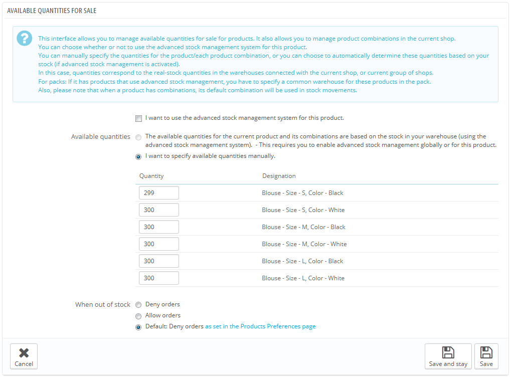

Der "Menge"-Tab enthält nun einen kleinen Paragraphen, den Sie vollständig lesen sollten. Diesem Abschnitt folgt die Schnittstelle zur  erweiterten Lagerverwaltung, für die 3 Optionen gewählt werden können:

* **Die verfügbaren Mengen für den aktuellen Artikel und seine Varianten sind abhängig vom Lagerbestand (bei aktivierter erweiterter Lagerverwaltung).**
* **Die verfügbaren Mengen für den aktuellen Artikel und seine Varianten werden lagerbasiert verwaltet.**
* **Die verfügbaren Mengen werden manuell erfasst.**

Standardmäßig ist die dritte Option ("Die verfügbaren Mengen werden manuell erfasst.") aktiviert. Solange Sie nicht die erste Checkbox( "Für diesen Artikel die erweiterte Lagerverwaltung verwenden. ") aktiviert haben, werden Mengen auf die gleiche Art und Weise wie bei Version 1.4 PrestaShop verwaltet, was bedeutet, dass Sie die Mengenangaben manuell eingetragen haben und PrestaShop die verkaufen Mengen abgezogen hat.

Wenn Sie lieber die verfügbaren Mengen mit Ihren Lagerbestand synchronisieren würden (oder dem mehrerer Lagerhäuser), müssen Sie die Verwaltungsmethode ändern:

1. Aktivieren Sie die Option " Für diesen Artikel die erweiterte Lagerverwaltung verwenden.", um die Methode zu ändern.
2. Dies macht die zweite Option, " Die verfügbaren Mengen für den aktuellen Artikel und seine Varianten sind abhängig vom Lagerbestand (bei aktivierter erweiterter Lagerverwaltung)", endlich verfügbar. Wählen Sie diese aus, um die zur Verfügung stehende Menge für diesen Artikel mit Ihrem Lagerbestand zu synchronisieren.

Sobald Sie die zweite Option gewählt haben, kann die Menge im „Mengen“-Tab nicht mehr manuell bearbeitet werden: Die Mengen werden nun direkt von der erweiterten Lagerverwaltung behandelt und nicht von jedem "Mengen"-Tab jedes Artikels.

Artikelbündel sind ein Sonderfall. Da es noch nicht möglich ist, Artikelvarianten zu einem Bündel zusammenzufassen, haben die PrestaShop Entwickler entschieden, wenn ein solcher Fall eintritt, verringert PrestaShop die Menge der Standard-Variante, wenn eine besondere Variante eines Artikels gebündelt wird.

Außerdem zeigt eine Meldung die empfohlene maximale Anzahl von Bündeln.

Der Rest des Tabs wird im Kapitel "Verwaltung des Katalogs“ dieses Handbuchs erläutert.

### Lieferanten verwalten 

Sie können nun mehr als einen Lieferanten für einen bestimmten Artikel festlegen. Für jeden Lieferanten, der mit einem Artikel verbunden ist, können Sie die Lieferanten-Nummer und einen Standard-Kaufpreis für den Artikel sowie dessen Variante festlegen. Diese Information wird verwendet, wenn Sie eine Lieferantenbestellung durchführen..

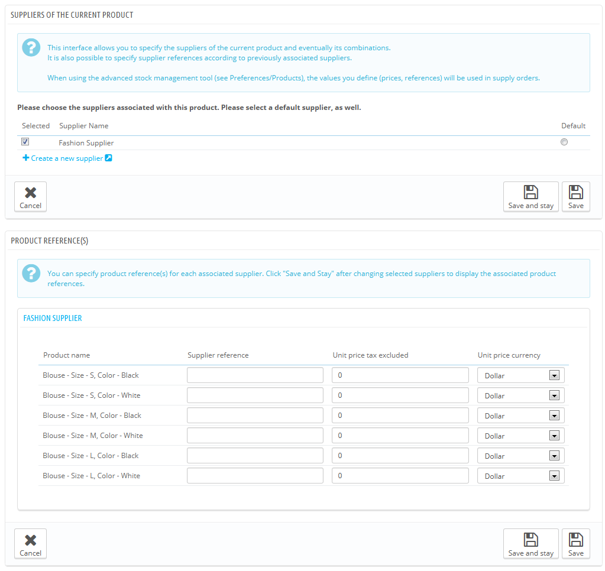

### Verwaltung der Lager 

Wenn die erweiterte Lagerverwaltung aktiviert ist, erscheint der Tab "Lager" auf jeder Artikelseite, in dem Sie das/die Lager für Ihren Artikel und jede seiner Varianten einsehen können, in dem der Artikel gelagert werden kann. Sie können sogar den Standort für den Artikel angeben, sowie seine Varianten.

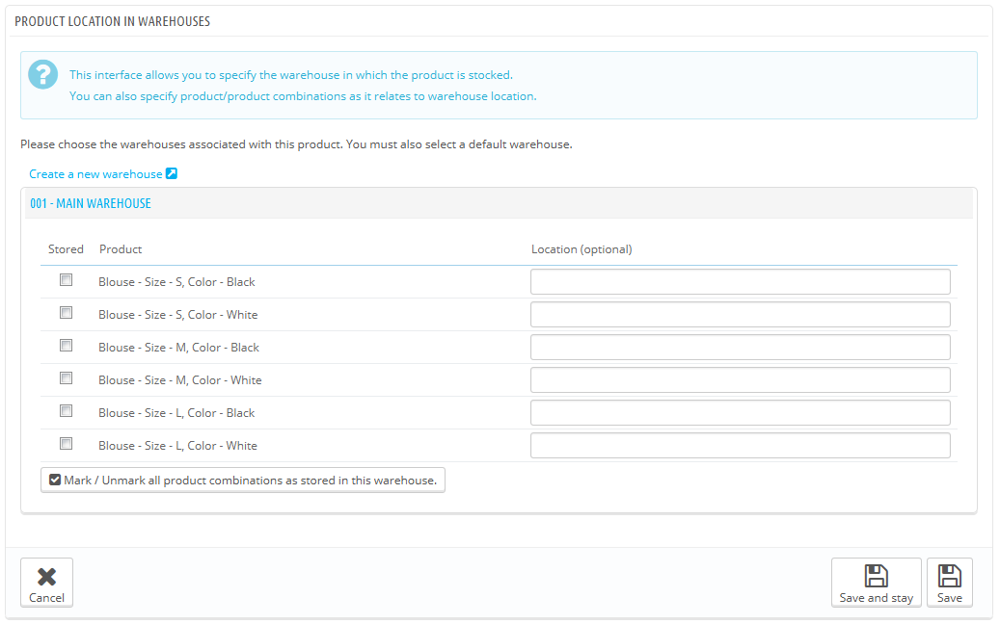

Sie müssen zunächst mindestens ein Lager (siehe unten) erstellen, bevor Sie einen Artikel damit verbinden und den Standort dessen festlegen können. Dieser Schritt ist sehr wichtig: es ist von großer Bedeutung, mindestens ein Lager zu erstellen, in dem ein Artikel aufbewahrt werden kann. Dies hat erhebliche Auswirkungen auf die Bestellungsvorbereitung, bezogen auf Multi-Versand.

## Verwaltung der Lager 

Die erweiterte Lagerverwaltung macht es möglich, ein oder mehrere Lager zu erstellen. Um eines zu erstellen, navigieren Sie zur "Lager"-Seite im Menü „Lager“.

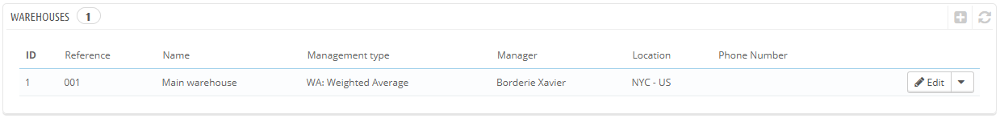

Sobald Sie ein neues Lager erstellen wollen, müssen Sie die folgenden Felder ausfüllen:

* **Artikel-Nr.** und **Name**. Eine eindeutige Referenz-ID und der Name Lagers. Stellen Sie sicher, dass Sie etwas eintragen, mit dem Sie das spezifische Lager schnell erkennen: Sie sollten in der Lage sein, Lager leicht in einer Drop-Down-Liste zu unterscheiden.
* **Adresse**, **Postleitzahl / PLZ,** **Stadt** und **Land**. Die reale Adresse des Lagers. Diese Informationen werden auf Bestellungen an Lieferanten abgedruckt.
* **Leitung**. Eine Person, die für das Lager zuständig ist, ausgewählt aus Ihren Mitarbeitern. Wenn das Konto des Mitarbeiters noch nicht erstellt wurde, müssen Sie es zunächst erstellen.
* **Versanddienste**. Die Paketdienste o.ä., die von diesem Lager aus Bestellungen versenden dürfen. Halten Sie die "Shift" -Taste gedrückt während Sie klicken, um mehr als einen Versanddienst zu wählen.
* **Lagerführungssystem**. Ein Verfahren zur buchhalterischen Bewertung, basierend auf den Gesetzen Ihres Landes. Siehe das Kapitel "Regeln zur Lagerverwaltung" für weitere Informationen.
* **Bestandsbewertung Währung**. Währung zur Bestandsbewertung(Auswahl nur aus hinzugefügten Währungen).

Es ist nicht möglich, ein Lagerführungssystem oder eine Bewertungsmethode zu ändern, sobald festgelegt. Wenn Sie diese Informationen ändern müssen, werden Sie das Lager neu zusammenstellen müssen, und das falsche löschen. Sie können ein Lager nur löschen, wenn es keinen Artikel mehr enthält.

Achten Sie auf die Versanddienste, die Sie zulassen, da einen großen Einfluss auf die Bestellungsvorbereitung im Multiversand-Szenario hat.

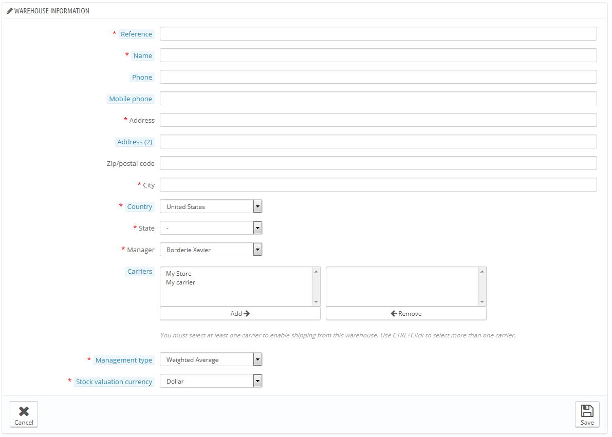

Wenn Sie mehr als einen Shop verwalten, werden Sie auch jeden Shop einem oder mehreren Lagern zuordnen müssen. Dies ermöglicht es Ihnen, Lager festzulegen, von dem Artikel für einen bestimmten Shop versendet werden können.

Sobald das Lager angelegt wurde, kann es auf der Liste der Lager eingesehen werden. Klicken Sie auf "Anzeigen" auf der rechten Seite der Zeile, um Informationen, einschließlich der Liste aller darin gespeicherten Artikel, die Summe aller verfügbaren Mengen, einer globaler Währungsbewertung, Details der gespeicherten Produkte, und die Historie der Lagerbewegungen für das Lager.

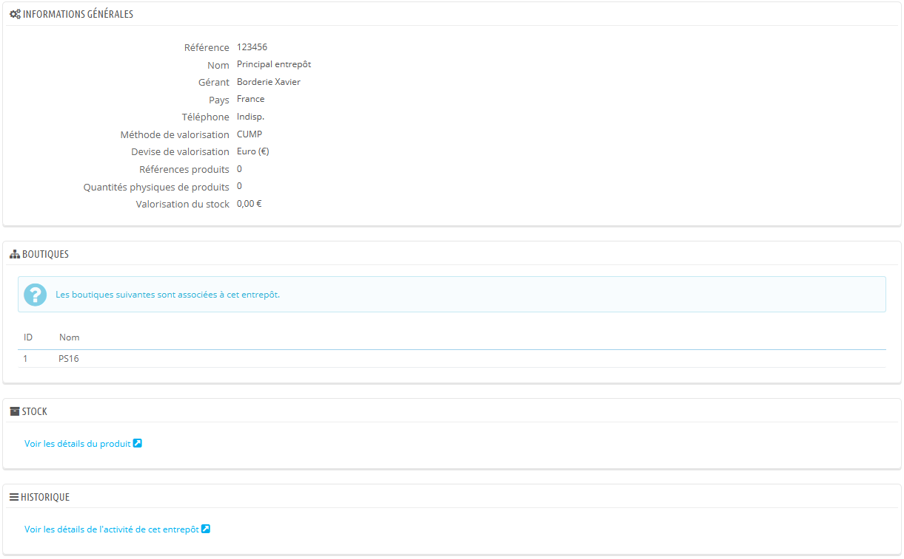

Jede Lager-Seite enthält auch zwei Links unten:

* **Artikeldetails anzeigen**. Führt Sie auf die Seite "Aktueller Lagerbestand".
* **Lagerbewegungen anzeigen**. Führt Sie auf die Seite "Lagerbewegung".

## Lagerverwaltung 

Nun, da Sie eines oder mehrere Lager erstellt haben, müssen Sie für jedes Bestände festlegen. Zu diesem Zweck finden Sie die Seite "Lagerverwaltung" im Menü "Lager".

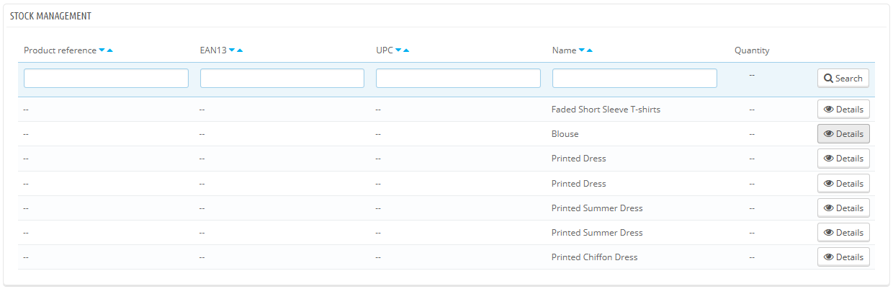

Alle Artikel aus dem Katalog sind in dieser Liste aufgeführt. Wenn Sie eine beliebige Variante eines Produkts haben möchten, können Sie das durch den Button "Details" verwalten.

In Ihren täglichen Verwaltungstätigkeiten können Sie diese Schnittstelle verwenden, um manuell folgende Aktionen durchzuführen:

* **Artikel hinzufügen**. Dieser Button fügt einem Lager einen bestimmten Artikel hinzu.
* **Artikel entfernen**. Dieser Button entfernt einen bestimmten Artikel von einem bestimmten Lager.
* **Artikel transferieren**. Diese Schaltfläche überträgt den Bestand von einem Lager zu einem anderen.

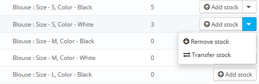

Die letzten beiden Aktionen werden nur angezeigt, wenn bereits Bestände des gewählten Produkts in einem Lager sind.\
"Artikel transferieren" erscheint nur, wenn Sie mindestens zwei Lager erstellt haben.

### Artikel einem Lager hinzufügen 

Um einem Artikel Bestände hinzuzufügen, klicken Sie auf „Artikel hinzufügen“. Eine neue Seite öffnet sich, ein Formular mit den wichtigsten Informationen wird angezeigt, um Ihnen zu helfen, einen Artikel mit Gewissheit zu identifizieren (Referenz, EAN13, UPC-Code und Name). Diese Informationen können nicht in diesem Formular geändert werden, daher sind sie ausgegraut.Um einem Artikel Bestände hinzuzufügen, klicken Sie auf „Artikel hinzufügen“. Eine neue Seite öffnet sich, ein Formular mit den wichtigsten Informationen wird angezeigt, um Ihnen zu helfen, einen Artikel mit Gewissheit zu identifizieren (Referenz, EAN13, UPC-Code und Name). Diese Informationen können nicht in diesem Formular geändert werden, daher sind sie ausgegraut.

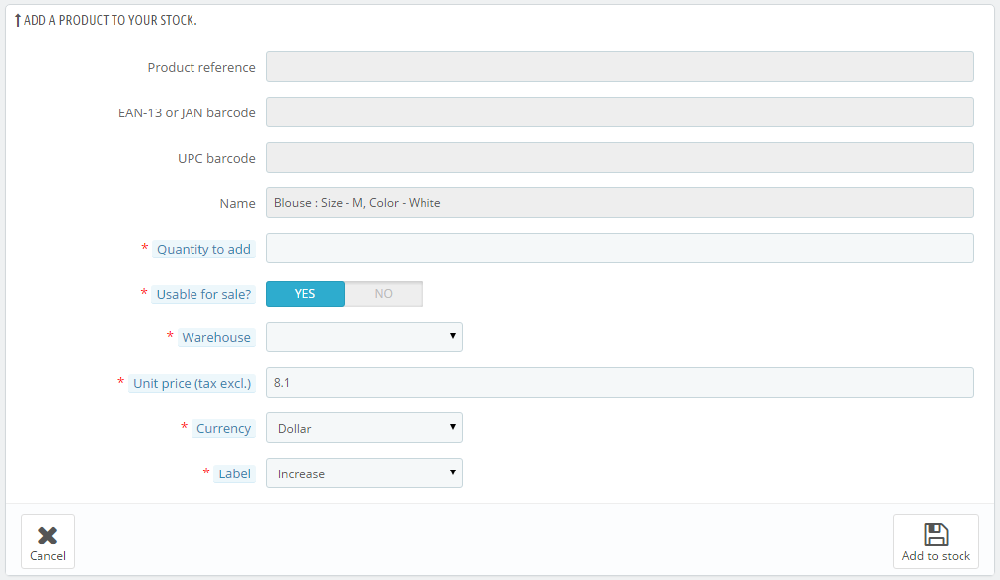

Sie müssen folgende Werte einstellen:

* **Menge**. Dies muss eine positive Zahl sein. Sie können nichts aus dem Lager entfernen, indem Sie eine negative Zahl eingeben.
* Für Verkauf verwendbar. Legt fest, ob die verfügbare Menge auch zum Verkauf verfügbar ist, oder ob Sie sich noch entscheiden müssen. Im zweiten Fall gilt die Menge als "reserviert".
* **Warenlager**. Das Lagerhaus, dem die Bestände hinzugefügt werden. Das Formular lässt Sie Bestände nur einem Lager gleichzeitig hinzufügen. Wenn Sie Bestände für diesen Artikel mehr als einem Lager hinzufügen müssen, müssen Sie den gesamten Prozess für jedes Lager unabhängig voneinander erneut durchführen.
* **Stückpreis (zzgl. MwSt.)**. Der Einheitspreis zum Zeitpunkt des Hinzufügens. Dies dient Bewertungszwecken.
* **Währung**. Die Währung des Einheitspreises. Wenn die Währung nicht verfügbar ist, können Sie sie aus einer Liste von erstellen, auf der Seite "Währungen" im Menü "Lokalisierung", oder Sie importieren sie auf der Seite "Lokalisierung" im Menü "Lokalisierung", indem Sie das Lokalisierungspaket des Landes installieren, dessen Währung sie verwenden möchten.
* **Name**. Die Bezeichnung der Lagerbewegung, die Sie durchführen. Dies ist nur zu Informationszwecken.

Wenn Sie mit dem Mauszeiger über "Menge" oder "Stückpreis (zzgl. MwSt.)" fahren, zeigt der erscheinende Tooltip die Werte, die Sie beim letzten Hinzufügen verwendet haben.

### Bestände von einem Lager entfernen 

Wenn Sie eine bestimmte Menge eines Artikels vom Lager entfernen möchten, müssen Sie die Aktion "Artikel entfernen" verwenden (Pfeil nach unten, steht nur zur Verfügung, wenn Artikel bereits vorrätig sind). Eine neue Seite öffnet sich, mit einem Formular, in dem Ihnen die wichtigsten Informationen angezeigt werden, um Ihnen zu helfen, einen Artikel mit Gewissheit zu identifizieren(Referenz, EAN13, UPC-Code und Name). Diese Informationen können nicht in diesem Formular geändert werden, daher sind sie ausgegraut.

Sie müssen folgende Werte einstellen:

* **Zu entnehmende Menge**. Dies muss eine positive Zahl sein. Sie können nichts dem Lager hinzufügen, indem Sie eine negative Zahl eingeben.
* **Für Verkauf verwendbar**. Ob diese Menge von der nutzbaren Menge oder aus dem gesamten Bestand(einschließlich der reservierten Bestände) entfernt werden soll.
* **Warenlager**. Das Lager, aus dem die Menge entfernt werden soll. Mit diesem Formular können Sie Bestände nur aus einem Lager gleichzeitig entfernen. Wenn Sie Bestände für einen Artikel in mehr als einem Lager entfernen müssen, müssen Sie den gesamten Entfernungsprozess für jedes Lager unabhängig durchführen.
* **Name**. Die Bezeichnung der Lagerbewegung, die Sie durchführen. Dies dient nur Informationszwecken.

### Artikel zwischen Lagern transferieren 

Durch das Transferieren können Sie Bestände von einem Lager zum anderen übertragen, oder von einem Zustand in einen anderen (Für Verkauf verwendbar/ reserviert). Klicken Sie auf den Button "Artikel transferieren" (seitliche Pfeile, steht nur zur Verfügung, wenn Artikel bereits auf Lager sind und mindestens zwei Lager existieren). Eine neue Seite öffnet sich, die ein Formular mit den wichtigsten Informationen angezeigt, um Ihnen zu helfen, einen Artikel mit Gewissheit zu identifizieren(Referenz, EAN13, UPC-Code und Name). Diese Informationen können nicht in diesem Formular geändert werden, daher sind sie ausgegraut.

Sie müssen folgende Werte einstellen:

* Transfermenge. Dies muss eine positive Zahl sein.
* Quell-Lager. Das Lager, von denen Sie einige Artikel verschieben wollen, oder wenn Sie den Status von einem Teilbestand ändern möchten.
* Im Quell-Lager für den Verkauf verwendbar?. Legt fest, ob die gewählte Menge von reserviertem Bestand oder zum Verkauf verfügbaren Bestand genommen werden soll.
* Ziellager. Das Lager, zu dem Sie Bestände übertragen. Wenn Sie einfach nur den Status von einigen Beständen des Quell-Lagers ändern möchten, stellen Sie sicher, das gleiche Lager in diesem Feld zu wählen.
* Im Ziellager für den Verkauf verwendbar?. Legt fest, ob der Status der zu verschiebenden Bestände geändert werden soll, auch wichtig für die Statusänderung von Beständen innerhalb eines Lagers:\

  * Wenn Sie nicht wollen, dass sich der Status während des Transfers nicht ändert, stellen Sie sicher, dass beide " für den Verkauf verwendbar?"-Optionen gleich eingestellt sind.
  * Wenn Sie Status ändern wollen, ob im gleichen Lager oder beim Transfer: Stellen Sie sicher, dass beide " für den Verkauf verwendbar?"-Optionen unterschiedlich gesetzt sind.

Hier werden alle Bewertungen und Währungsumrechnungen, abhängig von den Bewertungsmethoden, automatisch durchgeführt.

## Lagerbewegung 

Diese Seite ermöglicht es Ihnen, die Bestandsbewegungen einzusehen. Sie können alle Lagerbewegungen anzeigen lassen, oder nur die eines Lagers. Zur Einschränkung der Suche können Sie Filter verwenden.

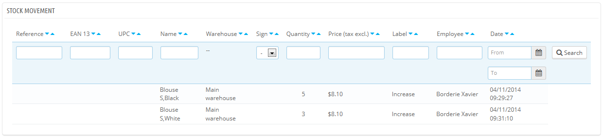

Wenn Sie die Bewegungen für ein Lager filtern, können Sie die Liste in eine CSV-Datei exportieren.

## Aktueller Lagerbestand 

Diese Seite ermöglicht Ihnen, einen schnellen Überblick über Ihre Lager zu bekommen, entweder global oder gefiltert. Die Zahlen sind aktuell.

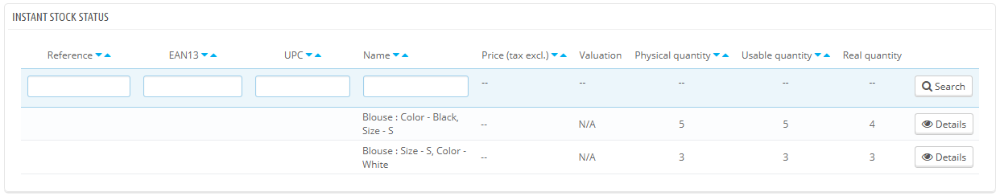

Für jeden Artikel oder jede Artikelvariante auf Lager stehen folgende Indikatoren zur Verfügung:

* Verkaufspreis netto.
* Wert. Die Summe (für alle Artikel) ist ohne Filter nicht verfügbar, filtern Sie vorher nach Lager.
* Physische Menge.
* Nutzbare Menge.
* Reale Menge(Physische Menge – Bestellungen + Bestellaufträge).

Je nach Bewertungsmethode kann die Aufteilung der Einzelpreise und der damit verbundenen Wertansätze durch Klicken auf den "Details" eingesehen werden.

Darüber hinaus haben Sie für ein bestimmtes Lager zwei Möglichkeiten, um die aktuelle Liste im CSV-Format zu exportieren:

* Mengen exportieren.
* Export der Preise.

## Lagerbestand 

Diese Seite ermöglicht es Ihnen, Ihren Lagerbestand einzusehen. Hier können Sie sehen, wie lange ein Lagerbestand voraussichtlich noch ausreichen wird. Diese Information ist sehr nützlich, da sie Ihnen hilft, Voraussagen über Bestellaufträge zu machen. Dies berechnet sich nach zuvor durchgeführten Lagerbewegungen.

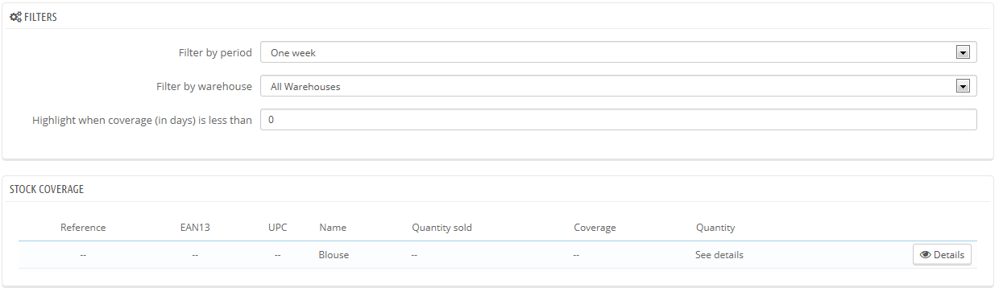

Sie können diese Information für alle Lager oder nur für ein einzelnes Lager anzeigen.\
Sie können auch die Zeitdauer (eine Woche, zwei Wochen, drei Wochen, ein Monat, ein halbes Jahr, ein Jahr) festlegen, abhängig davon, welche Lagerbewegungen berücksichtigt werden sollen, zu alte werden dann nicht mehr in die Berechnung aufgenommen.\
Schließlich können Sie die Bestandsdeckung hervorheben, die unterhalb einer bestimmten Anzahl von Tagen ist. Dadurch werden die entsprechenden Artikel markiert, so können Sie diese schneller identifizieren.

Um die Bestandsdeckung von Artikelvarianten zu sehen, müssen Sie "Details" anklicken.

Es ist möglich, auch Benachrichtigungen über die Bestandsdeckung zu erhalten. Das E-Mail-Benachrichtigungsmodul kann auch die Produktbestandsdeckung berücksichtigen. Es ist somit möglich, Tage für die Bestandsdeckung einzustellen, wenn für einen Artikel die Tage der Bestandsdeckung geringer sind, als festgelegt, erhalten Sie eine Mail. Sehen Sie sich für mehr Informationen die Konfiguration für das eMail-Modul an.

## Bestellaufträge 

Eines der wichtigsten Merkmale der erweiterten Lagerverwaltung ist die Möglichkeit, Bestellaufträge an Lieferanten zu setzen, um die Lagerbestände verwalten zu können.

Die dazugehörige Seite ermöglicht es Ihnen, alle Ihre Bestellaufträge zu verwalten, sowie wiederverwendbare Bestellvorlagen.

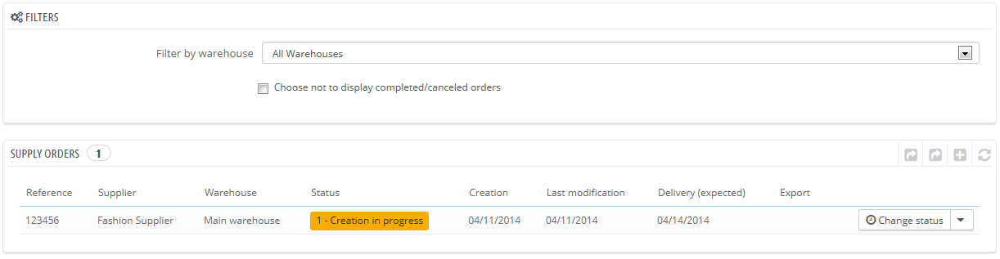

Die Formulare zur Erstellung einer Vorlage für einen Bestellauftrag und für die Erstellung eines Bestellauftrags sind nahezu identisch(mit Ausnahme des Feldes "voraussichtliches Lieferdatum"). Deshalb wird hier nur erklärt, wie man einen Einkaufsauftrag hinzufügt.

### Einen neuen Bestellauftrag erstellen 

Das Erstellen eines Auftrags für einen Lieferanten kann in zwei Schritte unterteilt werden: den Auftrag erstellen, dann dem Auftrag Artikel hinzufügen.

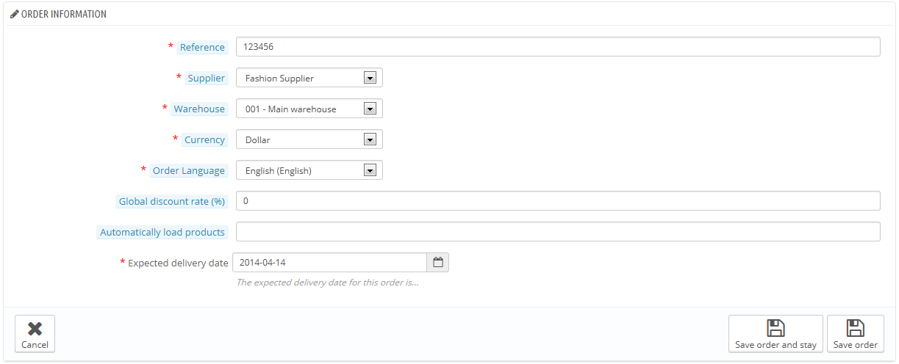

Mit dem ersten Schritt wird deshalb der Kopf der Bestellung ausgefüllt:

* Artikel-Nr. Dies ist eine Verwaltungsnummer; tragen Sie hier keine scheinbar eindeutige Nummer ein.
* Lieferant. Wenn der Lieferant, den Sie auswählen möchten, nicht in der Dropdown-Liste ist, müssen Sie ihn auf der "Lieferanten"-Seite im Menü „Katalog“ erstellen.
* Warenlager. Sie müssen mindestens ein Lager erstellt haben.
* Währung. Wenn die gewünschte Währung nicht gelistet ist, können Sie sie im Menü „Lokalisierung“ importieren bzw. erstellen.
* Sprache der Bestellung. Wenn die gewünschte Sprache nicht gelistet ist, können Sie sie im Menü „Lokalisierung“ importieren bzw. erstellen.
* Gesamtrabatt(%). Sie können dieses Feld bei "0", wenn Sie keinen Rabatt auf diese Bestellung erhalten(Absprache mit dem Lieferant).
* Artikel automatisch laden. Wenn Sie hier einen Wert setzen, wird PrestaShop alle Artikel in diesem Auftrag, deren Anzahl auf Lager diesen Wert unterschreitet, automatisch dem Auftrag hinzufügen.
* Voraussichtliches Lieferdatum.

Der zweite Schritt besteht aus dem Hinzufügen von Artikeln zu der Bestellung. Um diesen zweiten Schritt durchzuführen, können Sie:

* Auf den Button "Speichern und bleiben" klicken.
* Auf „Bestellung speichern“ klicken. So kommen Sie zurück zur Liste der Bestellaufträge: Klicken Sie auf "Bearbeiten" neben dem Auftrag, den Sie gerade erstellt haben.

Das Formular der Auftragserstellung Form wurde um ein zweites Formular, unter den bereits ausgefüllten Feldern, ergänzt. Sie müssen dieses zweite Formular verwenden, um Artikel Ihrer Bestellung hinzuzufügen, indem Sie die integrierte Suchmaschine benutzen. Die Artikel, die Sie hinzufügen, erscheinen nun in einer neuen Liste.

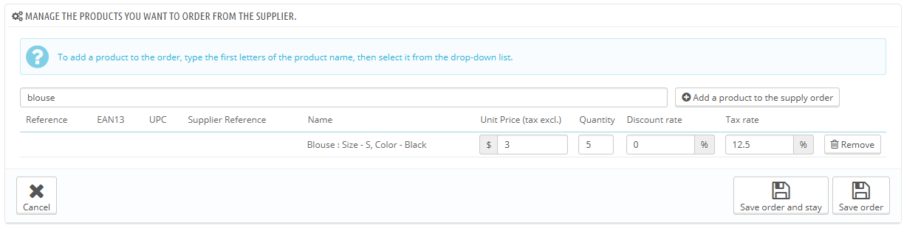

Für jeden Artikel müssen Sie den Stückpreis(o. MwSt.), die Menge, den Steuersatz und den produktspezifischen Rabatt eintragen oder aktualisieren.

Sobald der Auftrag erstellt wurde, erscheint er in der Liste mit dem Status "1 – Creation in progress". Dieser Status ermöglicht es Ihnen, die zuvor eingetragenen Informationen anzuzeigen und zu bearbeiten, sowie noch Artikel hinzuzufügen. Diese Dinge lassen sich im Status „2 – Order validated“ nicht mehr ändern.

Sie können einen Bestellauftrag nicht löschen, nur abbrechen.

You need to follow through for the whole order process, always indicating its status change in PrestaShop's interface. This is what the first action button of the list ("Change state") is for: click on it to reach the status changing form. See the "Changing the status of a supplier order" section below for more information on the available statuses, and see the "Registering the reception of products" to understand how to follow through on a supply order.

The "+" icon in the supply order list displays the order's history, which enables you to see who did what and when.

### Order template creation 

The whole point of creating a template is to serve as a basis for new orders.

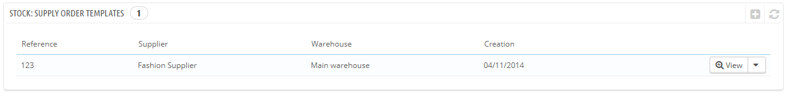

The supply order template creation process is the same as the one for a real order, except that:

* You do not have to set a planned delivery date.
* The "Automatically load products" value will be the quantity to order for the loaded products, not the stock/typed value difference.

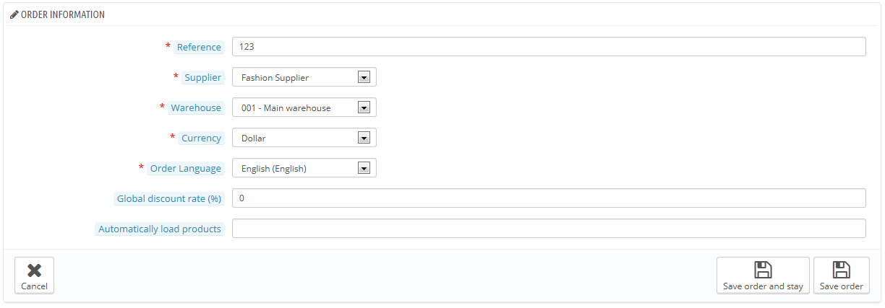

Moreover, contrary to an ordinary supply order:

* A template does not have a status.
* A template can be deleted.
* A template has no edit history.

Once you have created your template, you only need to use the "Use this template to create a supply order" action from the template list (the "two windows" icon) to start creating an order.

### Changing the status of a supply order 

Each order has many available actions (in the "Actions" column of the order list). One of them enables you to edit the status: the "Change state" one. There are six possible default statuses, but you can add your own (see the "Configuration" section of this chapter).

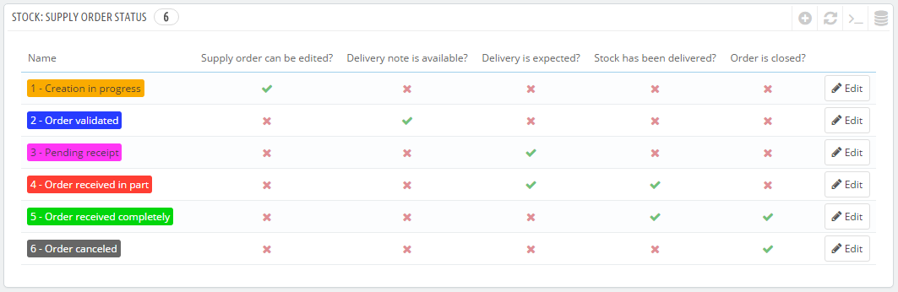

An order's status helps you understand your stock movements at a glance thanks to their color code. Here is the significance of the six default statuses:

1. **Creation in progress**. This is when you are in the first step of the creation step, where you can edit everything.
2. **Order validated**. This status validates the order and freezes the information it contains (purchase prices, quantities, etc.). At this step, a new action appears in the "Actions" column, which enables you to edit the invoice that is sent to the supplier in PDF format.
3. **Pending receipt**. As soon as the supplier has received and validated your invoice, you have to change the supply order's status to "Pending receipt".
4. **Order received in part**. As soon as a delivery is made, you must switch the order to this status. There can be multiple deliveries, and a delivery history is logged for each product. The restocking is made with each delivery.
5. **Order received completely**. Once an order is completely delivered, or partially because of a partial cancellation, it should be switched to this status. Stocks are unaffected in this case, and it is possible to perform actions on the order.
6. **Order canceled**. This status is to be given to canceled orders, whatever the reason. Stocks are unaffected in this case, and it is not possible to perform actions on the order.

With each status change, the status drop-down selector evolves in order to present only the possible status changes, in regard to the current status. The unavailable statuses are grayed out.

### Details of a supplier order 

Clicking the "View" icon from the list of supply orders enables you to get a synthetic view of your order. \
You can also download the invoice generated as a PDF file (provided the order is validated by you) from the list of orders or from the status change page.

The "Details" action enables you to display the status change history for the current order.

### Registering the reception of products 

You must change the status of your supply order within PrestaShop as soon as actions are taken in the real world. This is done using the "Change state" action in the "Actions" column from the list of orders. The form in this page always preselects the next logical status, but you are free to choose any of the other statuses available.

While you are preparing the supply order, keep its status to "Creation in progress". Once you are done preparing the order, switch it to "Order validated", then print the invoice PDF and send it to your supplier. As soon as your supplier confirms the reception of the invoice, change the status to "Pending receipt".

During the "Pending receipt" and "Order received in part" statuses, a new action is available in the "Actions" column. Using the "truck" icon, the "Update ongoing receipt of products" action enables you to register the reception of products for a given order during the current day.\
The form that opens after clicking that "truck" action enables you to see how many items were expected, and to indicate the quantity of product delivered for each product that day. Click the "Update selected" button to mark the selected products as received with the number of items you indicated in the "Quantity received today?" field. The checkbox on the left of each row must be checked for PrestaShop to take that line into account.

This step can be done as many times as necessary, and it is possible to receive and incorporate more stock than planned.

If you receive less stock than expected, PrestaShop automatically changes the order's status to "Order received in part".

For each product, a reception history is available ("+" action), as well as an indication of the received quantity, the expected quantity, and the remaining quantity. If the "received quantity" is equal to the "expected quantity", the corresponding row is highlighted in green. If you received more than expected, it is in red.

When all the products from the order have been received, you must manually change the supply order's status to "Order received completely". This ends the supply order process, and a new "Export" action appears, which you can use to download a CSV file of all the information pertaining to that order.

### CSV export 

Using the supply orders interface, you can filter the list of orders or the details of these orders so that you may export it, according to the current filters (reference, supplier, etc.).\
Moreover, you can choose not to display the orders that are completed or canceled, using the appropriate checkbox.

## Configuration 

The configuration page enables you to customize the way certain parts of the advanced stock manager work:

* The available statuses for a supply order.
* The labels for the stock movements.
* The default statuses for some stock movements which are used throughout the solution.

### Adding a new default order status 

You can add custom statuses corresponding to your business line. You cannot delete a default status.

The list on the main page enables you to get a better perspective of the available statuses, and how they can impact an order.

Click the "Add new" button to reach the creation form.

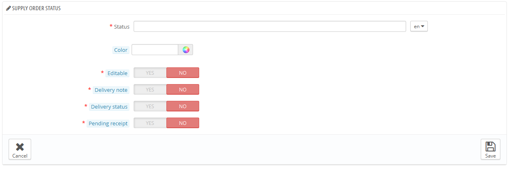

A status has a label, a color, and enables you to define whether:

* The order can be edited. As long as the order is editable, it cannot be sent to the supplier.
* The order delivery note can be generated.
* Product reception is ongoing, meaning that you have not yet received all the ordered products.
* Product delivery is still pending, meaning that you are still waiting for any product to arrive.

### Adding a stock movement label 

It is possible to add more labels to stock movements. Click the "Add new" button from the "Stock movement labels" section to access the creation form.

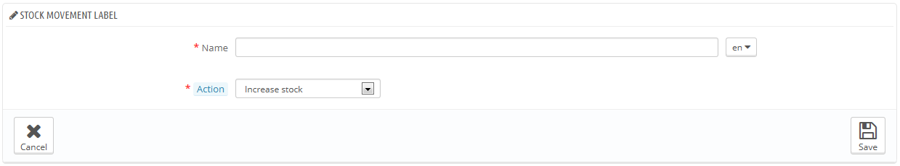

You simply have to set a name for the label, and indicate whether it pertains to stock increase or decrease. Those labels can be used when adding/removing/transferring stock manually (as explained earlier).

### Changing default supply order labels 

It is possible to choose the default stock movement labels in the following standard cases:

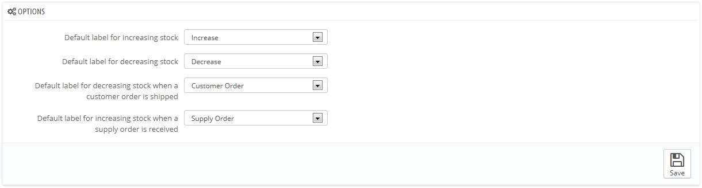

* Increasing stock (manually).
* Decreasing stock (manually).
* Decreasing stock following the shipment of a client order.
* Increasing stock following the delivery of products from a supplier's order.
