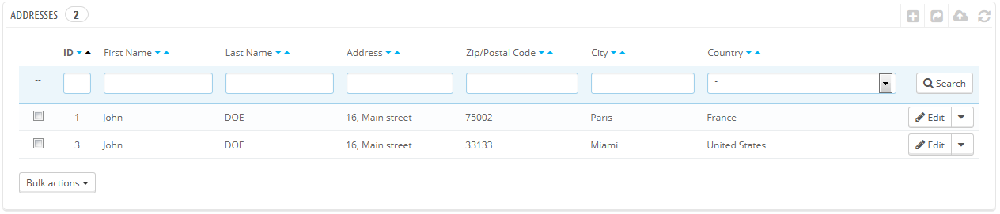
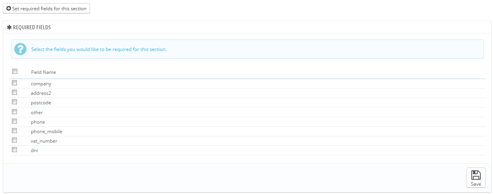
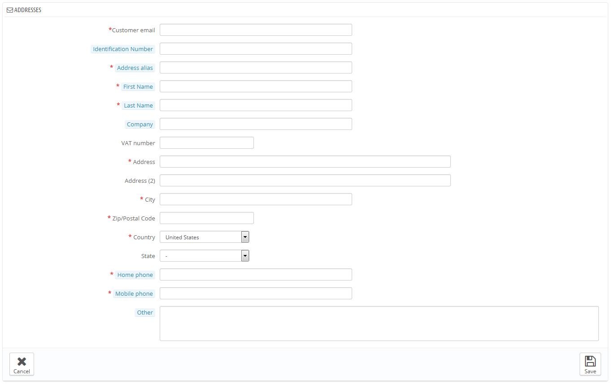

# Adressen

Auf der Seite "Adressen" haben Sie Zugriff auf die Liste der Adressen Ihrer Kunden (zu Hause, Arbeit, etc.). Sie können sie mit Hilfe der Schaltfläche "Bearbeiten" bearbeiten oder ganz löschen.

Unterhalb der Adressen-Tabelle ist der Button "Legen Sie zusätzliche Pflichtfelder für diesen Bereich fest". Es öffnet sich ein Formular, in dem Sie angeben können, ob ein Datenbankfeld notwendig ist oder nicht, indem Sie die entsprechenden Kästchen markieren: Auf diese Weise können Sie z.B. Felder wie "Unternehmen" oder "Telefonnummer" als Pflichtfelder deklarieren, wenn ein Kunde eine neue Adresse in Ihrem Shop erstellt.

## Hinzufügen einer neuen Adresse 

Sie haben die Möglichkeit, neue Adressen für einen Kunden zu erstellen, indem Sie auf den Button „NEU“ klicken. Ein neues Formular öffnet sich.

Einige Felder erfordern besondere Sorgfalt:

* **Kunden-E-Mail**. Dieses Feld ist wichtig: wenn Sie eine Adresse für einen bestehenden Kunden hinzufügen, müssen Sie diesen Kunden mit seiner E-Mail-Adresse zu identifizieren. Andernfalls wird PrestaShop nicht in der Lage sein, diese Adresse zuzuweisen.
* **Steuernummer**. Dieses Feld ist natürlich optional.\
  Hinweis: Das Feld Titel gibt einen Hinweis: "DNI / NIF / NIE". Das sind spanische Akronyme: DNI steht für "Documento Nacional de Identidad" steht NIF für "Número de Identificación Fiscal" und NIE steht für "Número de Identidad / Identificación de Extranjero".
* **Adress-Kürzel**. Eine kurze Beschreibung, um dem Kunden zu helfen, die richtige Adresse zu wählen: "zu Hause", "Büro", "Tante Beth" usw.
* **Firma**. Der Name der Firma des Kunden, falls erforderlich.
* **USt-Identifikationsnummer**. Die Umsatzsteuer-Identifikationsnummer für den Kunden (oder Firma des Kunden).
* **Andere**. Einige zusätzliche Informationen, die nützlich für den Versand sein könnten.
