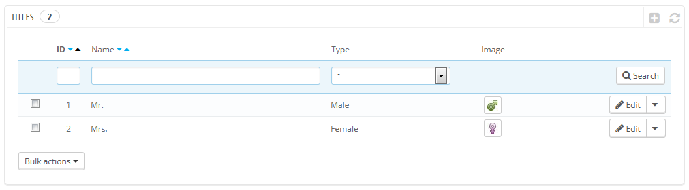
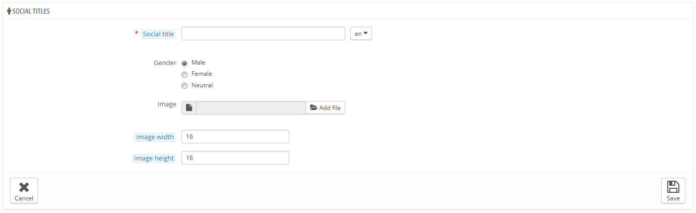

# Anreden

Das Anreden-Tool hilft Ihnen, Ihre Kunden zu personalisieren: in der Kundenliste können Sie zum Beispiel danach filtern. Bestimmte Module greifen auch für bestimmte Funktionen auf Anreden zu.

Mit einem Klick auf den "NEU" –Button gelangen Sie zum Erstellungsformular:

* **Anrede**. Sie können alles wählen, angefangen bei gewöhnlichen Titeln("Sir", "Lady", "Gentleman", etc.) bis zu den exotischsten("Jedi", "Magnificent One", "Money carrier" ...).
* **Geschlecht**. Einige Anreden können sich nur auf ein Geschlecht beziehen, oder auf keines. In diesem letzten Fall sollten Sie darauf achten die Option auf "Neutral" zu setzen.
* **Bild**. Ein 16x16 Bild, das den Titel repräsentiert. Klassische Geschlechtssymbole sind Mars und Venus (♂ und ♀), es gibt aber viele andere Möglichkeiten. Mit PrestaShop können Sie ein einzigartiges Bild einsetzen.
* **Bildbreite** und **Bildhöhe**. PrestaShop funktioniert am besten mit 16 \* 16 Bildern und wird Ihr Bild daran anpassen, wenn Sie eine andere Größe verwenden. Wenn Sie trotzdem größere Bilder verwenden möchten, können Sie die genaue Größe Ihres Bildes hier eintragen. Wenn Sie "0" eingeben, wird PrestaShop einfach die Originalgröße verwenden.
