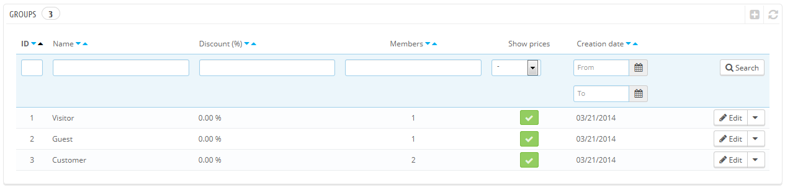

# Gruppen

PrestaShop ermöglicht es Ihnen, Kunden bestimmte Vorteile zu geben, indem Sie ihnen Gruppen zuordnen. Sie können beliebig viele Kundengruppen erstellen und Kunden beliebig vielen Gruppen zuordnen.

Dies wird auf der Seite "Gruppen" unter dem Menüpunkt "Kunden" verwaltet.

Standardmäßig stehen drei Sondergruppen zur Verfügung:

* **Visitor**. Alle Personen, die Ihren Shop ohne Kundenkonto besuchen.
* **Guest**. Alle Personen, die eine Bestellung ohne Kundenkonto aufgegeben haben - diese Option muss aktiviert werden.
* **Customer**. Alle Personen, die ein Konto in Ihrem Shop erstellt und authentifiziert haben.

Diese drei Gruppen können nicht gelöscht werden.

Um mehr Gruppen zu erstellen, klicken Sie auf "NEU" und Sie gelangen zu einem neuen Formular.

* **Name**. Verwenden Sie einen kurzen und aussagekräftigen Namen.
* **Rabatt** (%). Der Rabatt, den Sie für die Mitglieder dieser Gruppe setzen, gilt für alle Produkte in Ihrem Shop.\
  &#x20;Sie können sich auch entscheiden, keinen Rabatt festzulegen und  Warenkorb Preisregeln erstellen. Im nächsten Kapitel dieses Handbuchs, "Erstellen von Preisregeln und Gutscheinen", erfahren Sie mehr über Preisregeln.
* **Preisanzeige**. PrestaShop wird häufig im Business to Business (B2B) Bereich eingesetzt. Sie können eine Gruppe von Kunden festlegen, die Artikel ohne Zahlung der Steuer kaufen kann. Die Dropdown-Liste gibt Ihnen die Wahl zwischen "zzgl. MwSt" und "inklusive MwSt ".
* **Preise anzeigen**. Standardmäßig können alle Benutzer Ihres Shops Preise sehen. Sie können es aber auch vorziehen, bestimmten Kunden keinen Zugriff auf Ihre Produktpreise zu geben. Zum Beispiel könnten Sie es vorziehen, dass Benutzer die Preise erst sehen können, wenn sie ein Konto haben: Navigieren Sie dazu zur Gruppe „Besucher“ und klicken Sie auf den grünen „JA“-Button, um „Preise anzeigen“ zu deaktivieren.

Sobald diese Einstellungen vorgenommen wurden, können Sie die Gruppe zu speichern, wie sie ist, oder Sie fügen noch Kategorie- und / oder Moduleinstellungen hinzu. Im zweiten Fall müssen Sie die Gruppe nach dem Speichern erneut öffnen: das Formular wird mit zwei weiteren Optionen geladen:

* **Kategorie-Rabatt**. Klicken Sie auf "Kategorie-Rabatt hinzufügen", um zu einer Liste, die alle Kategorien enthält, zu gelangen. Sie können eine auswählen und einen bestimmten Rabatt darauf anwenden, der nur für diese Kategorie und nur für Mitglieder dieser Gruppe gilt.\
  Beachten Sie:\

  * Nur Artikel, die diese Kategorie als Standardkategorie haben, werden von der Ermäßigung betroffen sein. Produkte, die diese Kategorie als sekundäre Kategorie haben, nicht.
  * Dieser Rabatt ersetzt andere Rabatte, die Mitglieder dieser Gruppe sonst in dieser Kategorie hätten.
  * Sie können so viele Kategorie-Rabatte hinzufügen, wie Sie möchten. So können Sie eine ganze Palette an Rabatten für Kundengruppen erstellen.
* **Autorisierte Module**. In diesem Abschnitt können Sie Mitgliedern dieser Gruppe den Zugriff auf und einige der Module Ihres Shops verwehren. Zum Beispiel könnten Sie einstellen, dass einige Kunden nicht in der Lage sind, Ihre Top-Seller oder Angebote zu sehen.

Sie können einem Kunden eine Gruppe zuweisen, indem Sie seine Details bearbeiten. Navigieren sie zur Kunden-Seite und klicken Sie auf den entsprechenden Eintrag. In der Tabelle „Gruppenzugang“ können Sie die Gruppen ankreuzen, denen der Kunde angehören soll. Wenn Sie Kunden mehr als einer Gruppe zuordnen, sollten Sie daran denken, ihre Hauptgruppe mit der Option "Standard-Kundengruppe" zu setzen.

