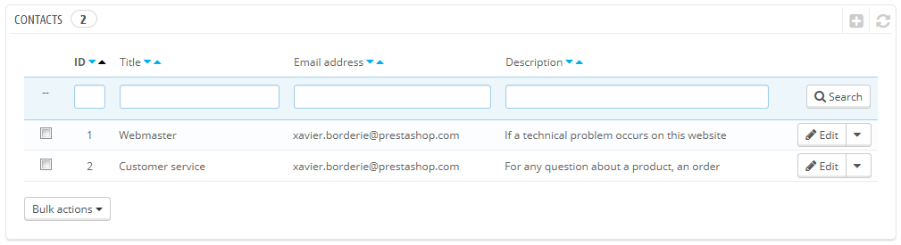
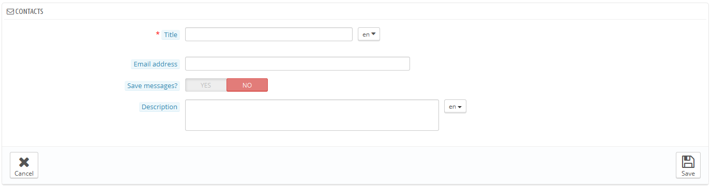
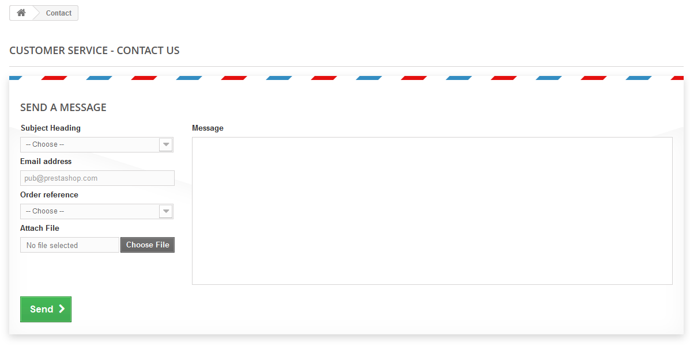

# Kontakte

Um die Kommunikation mit Ihren Kunden zu erleichtern, können Sie mehrere Kontaktkonten erstellen. Zum Beispiel: Kundendienst, technischer Support, Vertrieb, usw. Mit dieser Funktion können Sie Ihren Kunden direkt den richtigen Ansprechpartner vermitteln.

## Einen neuen Kontakt erstellen 

Damit die Nachricht an den vorgesehenen Empfänger umgeleitet wird, müssen Sie die Kontakte in Ihrem Shop konfigurieren.

Durch Klicken auf die Seite "Kontakte" im Menü "Kunden" können Sie auf die Kontaktliste zugreifen.

Klicken Sie auf "NEU", um das Formular zur Kontakterstellung zu öffnen:

* **Überschrift**. Der Name des Kontakts: entweder der Name einer Person oder der Name des Dienstes selbst. Sie können eine Phrase wie "Ich habe ein Problem mit meiner Bestellung", "Ich möchte ein Produkt zurückgeben" oder "Ich will Partner werden" einsetzen.
* **E-Mail**. Die gleiche Adresse kann für mehrere Kontakte genutzt werden. In der Tat können alle Kontakte die gleiche Adresse teilen, wenn Sie z.B. kein ganzes Team haben - Kunden werden diese Tatsache nie erfahren, aber viele Kontakte bauen Vertrauen auf, da Sie wie ein großes Unternehmen mit mehreren Mitarbeitern auftreten.
* **Mitteilungen speichern ?**. Geben Sie an, ob die E-Mail auf der "Kundenservice"-Seite gespeichert werden oder einfach an die E-Mail-Adresse geschickt soll. Wenn deaktiviert, wird PrestaShop keine Kundendienst-Services übernehmen. Dies kann zum Beispiel nützlich sein, wenn Sie möchten, dass Ihre Kunden-Service-Mitarbeiter keinen Zugriff auf bestimmte Mails haben.
* **Beschreibung**. Machen Sie eine kurze Beschreibung, am besten nicht mehr als eine einzige Zeile, diese wird dem Kunden im Kontakt-Formular angezeigt.

## Wie der Kunde Sie kontaktieren kann 

Um mit dem entsprechenden Mitarbeiterteam in Kontakt zu treten, klickt der Kunde entweder auf den Link "Kontakt" am oberen Rand der Seite oder auf den "Kontakt"-Link am unteren Rand der Seite. Daraufhin wird das Kontaktformular angezeigt.

Der Kunde wird dann gefragt, mit welchem Service er in Verbindung treten will und muss anschließend E-Mail-Adresse und die Nachricht eingeben. Ein Dropdown-Menü ermöglicht es sogar zu entscheiden, welche Bestellung betroffen ist, und selbst, welcher Artikel aus dieser Bestellung.
