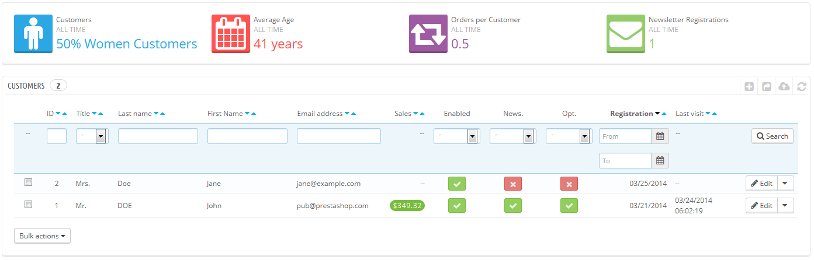
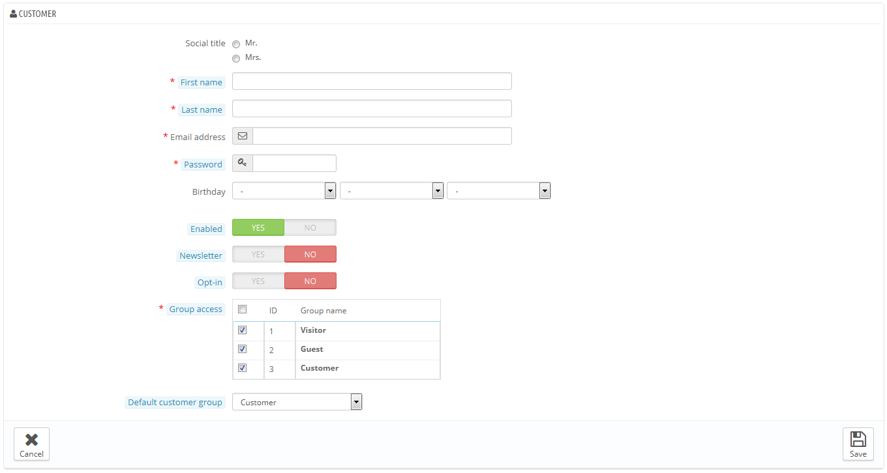
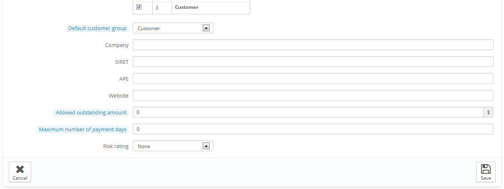
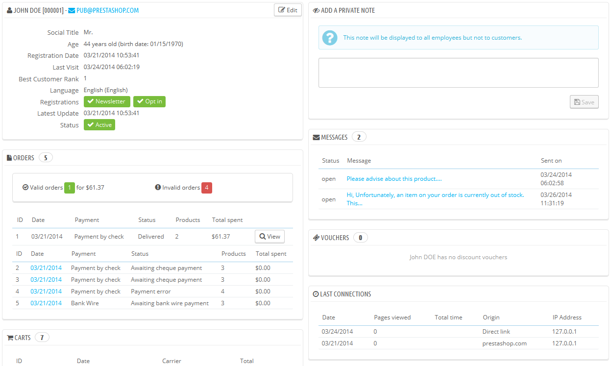
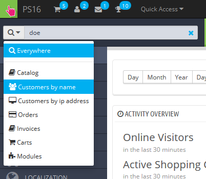
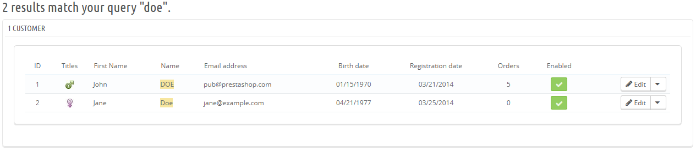
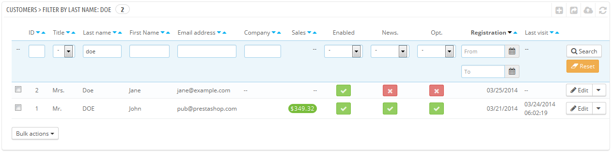

# Kunden

Auf der ersten Seite im Menü "Kunden" erhalten Sie eine Liste aller registrierten Benutzer Ihres Shops.



Dies gibt Ihnen eine grobe Übersicht Ihrer Kunden mit einigen Details, die Sie dazu verwenden können, Kunden zu sortieren und zu suchen:

* **Anrede**. Kunden können ihre sozialen Anreden eintragen, was helfen kann, das Kundenerlebnis zu verbessern. Es gibt zwei Standard-Anreden (Mr. Und Mrs.), Sie können aber jederzeit mehr auf der Seite „Anreden“ unter dem Menüpunkt "Kunden" hinzufügen.
* **Alter**. Mit dem Alter des Kunden können Sie Ihr Produktangebot besser abstimmen.
* **Aktiviert**. Gibt an, ob ein Kundenkonto aktiv ist oder nicht. Sie können ein Konto deaktivieren, indem Sie auf das grüne Häkchen klicken.
* **Newsletter**. Gibt an, ob der Kunde den Newsletter Ihres Shops abonniert hat. Sie können Ihn durch Klicken auf das grüne Kreuz deaktivieren.
* **Opt -in**. Gibt an, ob der Account akzeptiert hat, E-Mails von Ihren Partnern zu empfangen. Sie können die Funktion für den Kunden deaktivieren, indem Sie auf das grüne Häkchen klicken. **Abonnieren Sie Kunden nicht ohne deren Zustimmung, dies gilt als Spam.**
* Anmeldung und letzter Besuch sind immer nützlich, wenn Sie Benutzerkonten sortieren.
* **Aktionen**. Sie können das Konto eines Benutzers bearbeiten, lassen Sie sich einfach die Vollansicht(mit Nachrichten, Bestellungen, Adressen, Gutscheinen, etc.) anzeigen, oder löschen Sie es für immer.

Wenn PrestaShop zum ersten Mal mit Beispieldaten installiert wurde, gibt es einen Standardbenutzer mit dem Namen John Doe.

Sie können diesen Fake-Benutzer verwenden, um einige Funktionen Ihres Shops zu testen, und in der Regel sehen Sie dadurch Ihren Shop, wie es ein normaler Benutzer tun würde.

Um sich in Ihren Shop mit diesem öffentlichen Konto anzumelden, verwenden Sie diese Anmeldeinformationen:

* E-mail address: [pub@prestashop.com](mailto:pub@prestashop.com)
* Password: 123456789

**Bevor Sie Ihren Shop für die Öffentlichkeit öffnen, stellen Sie sicher, dass Sie diesen Standard-Benutzer zu löschen oder zumindest ihre Anmeldeinformationen ändern!** Wenn nicht, können böswillige Besucher das Konto, um gefälschte Einkäufe und vieles mehr zu machen.

Unterhalb der Kunden-Tabelle ist der Button"Legen Sie zusätzliche Pflichtfelder für diesen Bereich fest". Mit diesem öffnet sich ein Formular, in dem Sie angeben können, ob ein Datenbankfeld notwendig ist oder nicht, indem Sie die entsprechenden Kästchen markieren: Auf diese Weise können Sie Felder wie "Newsletter" oder "Opt-in" zu Pflichtfeldern bei der Accounterstellung machen.

Sie können eine Liste Ihrer Kunden exportieren, indem Sie auf den "EXPORTIEREN"-Button klicken.

Außerdem können Sie Kunden mit Hilfe der Schaltfläche "IMPORTIEREN" importieren. Ihre CSV-Datei muss folgendes Format haben:

```
ID;Title;Last name;First Name;Email address;Age;Enabled;News.;Opt.;Registration;Last visit;
2;1;Gorred;Francis;francis@example.com;-;1;0;0;2013-07-04 15:20:02;2013-07-04 15:18:50;
1;1;DOE;John;pub@prestashop.com;43;1;1;1;2013-07-02 17:36:07;2013-07-03 16:04:15;
```

Weitere Importmöglichkeiten gibt es auf der "CSV-Import"-Seite des Menüs "Erweiterte Einstellungen".

## Erstellen eines neuen Kundenkontos <a href="#kunden-erstelleneinesneuenkundenkontos" id="kunden-erstelleneinesneuenkundenkontos"></a>

Um ein Kundenkonto manuell zu erstellen, wählen Sie "Neu". Ein Formular wird angezeigt.



Füllen Sie die Kundeninformationen aus:

* **Anrede**. Wählen Sie zwischen den zur Verfügung stehenden aus, oder erstellen Sie eine andere auf der "Anrede"-Seite unter dem Menüpunkt "Kunden".
* **Vorname, Nachname, E-Mail-Adresse**. Diese sind wesentlich: die Namen werden in Bestätigungs-E-Mails, die von PrestaShop gesendet werden, verwendet, und die E-Mail-Adresse wird für die Anmeldung genutzt.\
  Passwort. Wählen Sie ein Passwort, mindestens 5 Zeichen lang.
* **Geburtstag**. Diese Information kann für Geburtstagsmails und für temporäre Rabatte genutzt werden.
* **Aktiviert**. Vielleicht möchten Sie ein Konto erstellen, es aber noch nicht als aktives Konto haben.
* **Newsletter**. Kann durch das "Newsletter"-Modul verwendet werden, für das Senden von regelmäßigen Informationen an die Kunden, die einen Newsletter wollen.
* **Opt-in**. Kann durch Module für das Senden von Sonderangeboten Ihrer Partner an Ihre Kunden eingerichtet werden, wenn Kunden dies wollen. Abonnieren Sie Kunden nicht ohne deren Zustimmung, dies gilt als Spam.
* **Gruppenzugang**. Mit Kundengruppen können Sie Gruppen-Rabatte erstellen. Viele andere PrestaShop-Funktionen können auch in Gruppen eingeschränkt werden. Sie werden in der Rubrik "Gruppen" in diesem Kapitel des PrestaShop-Handbuchs mehr über Gruppen erfahren.
* **Standard-Kundengruppe**. Egal, zu wie vielen Gruppen ein Kunde gehört, er sollte immer einer Hauptgruppe zugeordnet werden.

Wenn Ihre Kunden meist Unternehmen sind, sollten Sie den B2B-Modus aktivieren, um weitere Optionen zu erhalten: gehen Sie zur "Kunden"-Seite des Menüs "Voreinstellungen", und wählen Sie "Ja" für die "Aktiviere B2B-Modus" -Option.



Der B2B-Modus verfügt über ein paar unternehmensspezifische Felder:

* **Firma**. Der Name des Unternehmens.
* **SIRET**. SIRET-Nummer (nur Frankreich).
* **APE**. (Activité principale exercée – nur in Frankreich).
* **Website**. Die Firmenwebsite.
* **Offene Rechnung erlauben**. Die Menge des offenen Rechnungsbetrages, der dem Unternehmen erlaubt ist.
* **Spätestes Zahlungsziel**. Die Anzahl der Tage, die dem Unternehmen zum begleichen von Rechnungen erlaubt ist.
* **Ratenzahlung erlauben**. Ihre Risiko-Bewertung des Unternehmens: Niedrig, Mittel oder Hoch.

## Kundeninformationen einsehen <a href="#kunden-kundeninformationeneinsehen" id="kunden-kundeninformationeneinsehen"></a>

Wenn Sie weitere Informationen über einen bestimmten Kunden sehen möchten, können Sie auf die Schaltfläche "Anzeigen" am Ende der Zeile in der Kundenliste klicken. Eine neue Seite wird angezeigt.



Die verschiedenen Abschnitte vermitteln Ihnen einige wichtige Daten über den Benutzer:

* Kundeninformationen, Vor- und Nachname, E-Mail Adresse, ID, Anmeldedatum, Datum des letzten Besuchs, Rang.
* Informationen über das Abonnement von Newsletter und Opt-in.
* Eigene Notizen von Mitarbeitern ihres Shops(d.h. von Ihnen oder Ihrem Team).
* Nachrichten, die der Kunde gesendet hat(durch den Kundenservice).
* Die Gruppen, denen der Kunde angehört.
* Zusammenfassung der letzten Einkäufe des Kunden. Ausgegebener Betrag, Art der Zahlung, Bestellstatus. Für weitere Informationen über jeden Auftrag, klicken Sie auf die gewünschte Bestellung.
* Zusammenfassung der Produkte, die von dem Kunden bestellt wurden. Unter Anderem ermöglicht diese Funktion zu wissen, wann ein Kunde von einem Artikel sehr angetan ist und vielleicht richten Sie ihm einen Sonderrabatt für den 10. Kauf ein. Ein Klick auf einen Artikel leitet auf die Bestellung weiter, mit der dieser Artikel verbunden ist.
* Registrierte Adressen.
* Verfügbare Gutscheine / Preisregeln.
* Warenkörbe, welche der Kunde seit seiner Anmeldung erstellte (aber nicht notwendigerweise weiterbenutzte). Wenn Ihr Kunde zurzeit in Ihrem Shop ist, können Sie in Echtzeit sehen, was in seinen Warenkorb aufgenommen wird.
* Vorherige Verbindung zum Shop.

## Kunden suchen <a href="#kunden-kundensuchen" id="kunden-kundensuchen"></a>

Die Suche nach einem Kunden in Ihrem PrestaShop-Shop kann auf zwei verschiedene Arten durchgeführt werden.

**Die erste Methode** besteht darin, die Informationen, die Sie haben, in die PrestaShop Suchleiste, oben links im Back-Office, einzutragen. Durch Auswahl von "überall", "nach Name" oder "Kunden nach IP-Adresse" können Sie eine Suche durchführen, basierend auf:

* ID. Die Zahl, die dem Kunden in der Datenbank zugeordnet ist.
* Vor- oder Nachnamen. Beachten Sie, dass Sie beides suchen können: wählen Sie entweder "john" oder "Doe", Suchen wie "John Doe" werden nicht funktionieren.
* E-Mail-Addresse.
* IP Adresse. Sie können mit der IP der letzten Verbindung zu Ihrem Shop suchen.



Die Ergebnisse, wenn existent, werden dann aufgelistet: Die Liste zeigt Ihnen der Benutzer-ID, Anrede, E-Mail, Geburtstag, Anmeldedatum, Betrag der Aufträge und ob das Konto des Benutzers aktiv ist. Von dort aus können Sie die ganze Seite des Benutzers anzeigen lassen oder die Details zu bearbeiten.



**Die zweite Methode** besteht darin, zur "Kunden"-Seite zu gehen.



Auf dieser Seite können Sie die Felder an der Spitze der Liste ausfüllen, um sie nach folgenden Kriterien zu filtern: ID, Anrede, Vorname, Nachname, E-Mail Adresse, Alter, Kontostatus (aktiviert oder deaktiviert), Abonnement des Newsletters, Abonnement für das Opt-in, Datum der Erstellung, und Datum des letzten Besuchs. Geben Sie Ihre Kriterien ein und klicken Sie auf die Schaltfläche "Suche" am rechten Rand der Tabelle. Anschließend können Sie die Liste nach Spalten sortieren.

Klicken Sie auf die Schaltfläche "Reset", um wieder auf die vollständige Liste zu gelangen.
