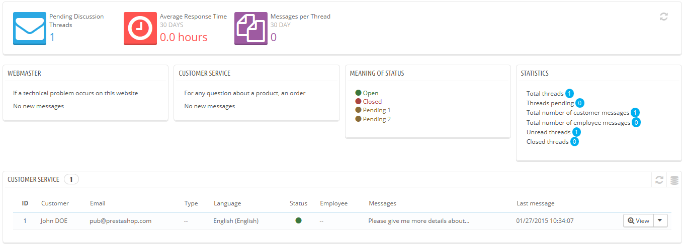
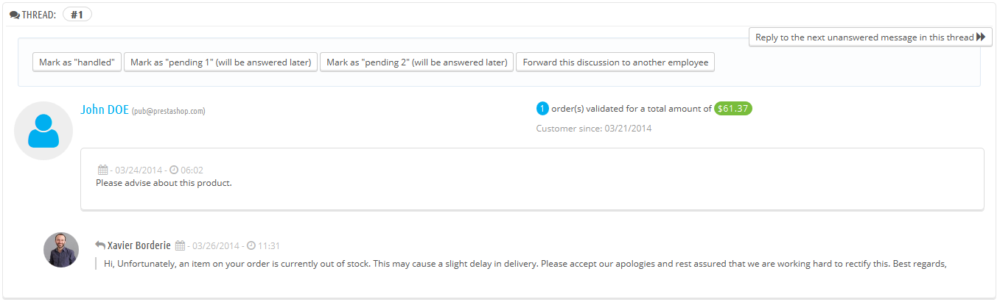
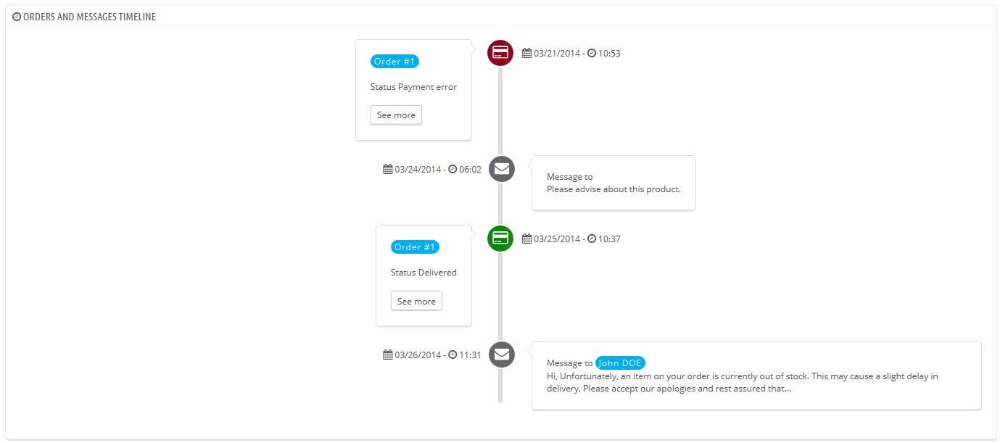
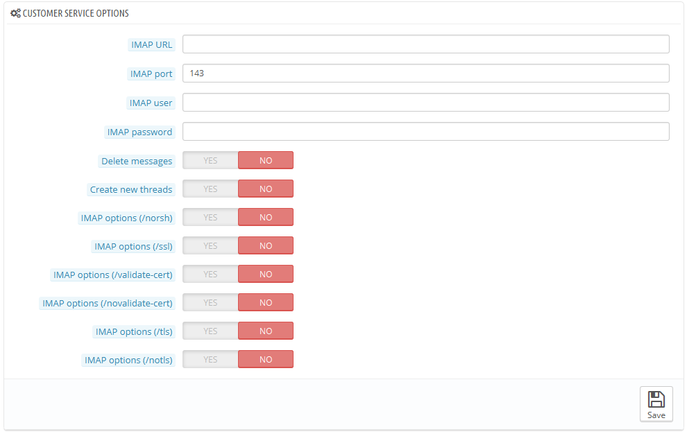

# Kundenservice

PrestaShop ermöglich es Ihnen, Kundenanfragen zentral an einem Ort zu bearbeiten. Dies hilft Ihnen dabei, nicht den Überblick über Diskussionen und Ähnliches zu verlieren, anstatt alle Email-Konversationen einzeln zu checken.

Das Kontaktformular Ihres Shops, zu finden unter dem "Kontakt"-Link am unteren Ende Ihres Front-Office, lässt den Kunden standardmäßig zwischen zwei Kontakten wählen: "Webmaster" und "Customer Service". Der Kunde muss nur wählen, wen er kontaktieren will und seine Nachricht schreiben. Die Nachricht wird dann im PrestaShop-Kundendienst-Tool erfasst.

Diskussions-Threads sind nur im Kunden-Service-Tool enthalten, wenn der Kontakt die Option "Mitteilungen speichern?" aktiviert hat. Sie können diese Einstellung ändern oder fügen mehrere Kontakte hinzufügen, indem Sie auf die Seite "Kontakte" unter dem Menüpunkt "Kunden" navigieren. Diese Seite ist im Detail im nächsten Abschnitt dieses Kapitels des PrestaShop Benutzerhandbuch erläutert.

Ist die Option für den Kontakt, den der Kunde wählt, deaktiviert, wird die Nachricht einfach an die E-Mail-Adresse des Kontakts gesendet und nicht in PrestaShop gespeichert.

Sie müssen Ihre IMAP-Einstellungen auch richtig konfigurieren, sodass PrestaShop den Kunden auch auf E-Mails antworten kann, sowie Mails abrufen kann, um im Tool angezeigt werden zu können. Dies wird in der Rubrik "Kundenservice-Optionen" durchgeführt, weiter unten in der Liste.

Auf dieser Seite hat jeder Kontakt eine eigene Box, woran Sie schnell erkennen können, ob neue Nachrichten vorhanden sind (diejenigen, die noch nicht gelesen wurden). Standardmäßig gibt es zwei Kontakte, das Hinzufügen von mehr Kontakten verschiebt die Boxen "Bedeutung des Status" und "Statistik" weiter nach links und nach unten.

Diese beiden letzten Boxen sind praktisch, wenn Sie neue Nachrichten täglich checken:

* **Bedeutung des Status**. Eine einfache Erinnerung an die Farbcodes, die Ihr auf Threads anwenden kann.
* **Statistiken**. Ein Überblick über die globalen Aktivitäten Ihres Kunden-Service seit Beginn.

Weiter unten ist die Liste der empfangenen Nachrichten, mit alten und neuen.

Sie können ein paar Optionen am unteren Rand der Seite die für alle Kontakte gelten, bearbeiten:

* **Datei-Upload erlauben**. Hängt davon ab, ob der Kunde Dateien an die Nachricht anhängen darf. Dies kann nützlich im Falle von visuellen Problemen sein, so könnte der Kunde Ihnen Screenshots senden.
* **Standard-Nachricht**. Die Standardvorlage für Antworten Ihrer Mitarbeiter. Passen Sie diese Nachricht einfach vielen Situationen an, um den Schreibaufwand zu verringern, auch wenn der Fall etwas länger zur Bearbeitung braucht.

Schließlich finden sich unten auf der Seite der Abschnitt "Kundenservice-Optionen", in dem Sie viele Optionen in Bezug auf Ihre E-Mail-Server finden.

## Umgang mit Kundenservice-Nachrichten 

Jedes Gespräch mit einem Kunden kann vollständig durch PrestaShop gehandhabt werden, ohne dass ein E-Mail-Client, wie Outlook oder Thunderbird verwendet werden muss.

Klicken Sie In der Nachrichtenliste auf eine Zeile, um Gesprächs-Details anzuzeigen:

* Sie können einige Optionen auf Diskussionen anwenden, um sie schneller sortieren zu können und somit schneller bearbeiten zu können. Es gibt 4 verfügbaren Aktionen:\

  * **„Als bearbeitet markieren" oder "Wiederaufnahme"**. Ändert den Status der Diskussion zu "Erledigt" oder "Offen".
  * **„Als „Warten auf 1“ Markieren(wird später beantwortet)“(bzw. „Warten auf 2“)**. Diese beiden Zustände sind intern: ihre Bedeutung nur für Ihr Team wichtig. Sie können sogar festlegen, dass sie diese nicht benutzen und sich nur auf "Erledigt" und "Offen" verlassen.
  * Nachricht weiterleiten. Von dem Moment an, an dem ein Mitarbeiter begonnen hat, auf eine Kundenanfrage zu antworten, wird er für die Anfrage des Kunden zugeteilt. Wenn sich während der Diskussion herausstellt, dass sie stattdessen ein anderer Mitarbeiter bearbeiten sollte, können Sie diesen Button verwenden, um durch eine Dropdown-Liste einen anderen Kontakt auszuwählen. Wenn die Person, der Sie dieses Gespräch weiterleiten wollen nicht in der Liste ist, wählen Sie "Jemand Anderes" aus und zwei Optionen werden angezeigt. Die E-Mail-Adresse des Empfängers und ein Kommentar über die bis jetzt laufende Diskussion.
* **Nächste unbeantwortete Nachrichten dieses Threads beantworten**.

Kundendetails:

* Kundenname und E-Mail, die Sie anklicken können, um auf die Kundeninformationen zuzugreifen
* Anzahl der Bestellungen, ausgegebener Gesamtbetrag und Datum der Registrierung.
* Uhrzeit und Datum der Nachricht.
* Schließlich die Nachricht selbst.

Um auf diesen Thread zu antworten, verwenden Sie einfach das Formular mit Ihrer Standardmeldung (wie im Abschnitt "Kontakt-Optionen" auf der "Kundenservice" Seite festgelegt), und klicken Sie auf "Senden".

Am unteren Ende der Seite, im Abschnitt „Bestellungen und Nachrichten chronologisch“, sehen Sie eine klare Zeitlinie der Ereignisse im Zusammenhang mit dieser Diskussion.

## Kundenservice-Optionen 

In diesem Abschnitt können Sie im Allgemeinen den Zugriff von PrestaShop auf Ihren E-Mail-Server genau konfigurieren (IMAP). Sie sollten sicherstellen, alle Felder auszufüllen, damit das Kunden-Service-Tool einwandfrei funktionieren kann. Die meisten dieser Informationen sollten von Ihrem Webhost zur Verfügung gestellt werden.

* **IMAP-URL, IMAP-Port, IMAP-Benutzer und IMAP-Passwort**. Wesentliche Informationen für das IMAP-Protokoll.
* **Nachrichten löschen**. Wenn aktiviert, werden Nachrichten auf dem Server, sobald PrestaShop sie abgerufen hat, gelöscht. Vorsicht: dies würde Ihre Nachrichten für andere Mail-Clients nicht zugänglich machen.
* **/ norsh**. Wenn aktiviert, wird die Verbindung zu Ihrem E-Mail-Server wird nicht im Voraus authentifiziert. Nicht empfehlenswert.\
  **/ ssl**. Wenn aktiviert, wird die Verbindung zu Ihrem E-Mail-Server nicht verschlüsselt. Nicht empfehlenswert.
* **/ validate-cert**. Wenn aktiviert, wird PrestaShop die Validierung von TLS / SSL-Zertifikaten des Servers erzwingen.
* **/ novalidate-cert**. Wenn aktiviert, wird PrestaShop nie versuchen, TLS / SSL-Zertifikate des Servers zu validieren. Wesentlich für Server mit selbst signierten Zertifikaten.
* **/ TLS**. Wenn aktiviert, wird PrestaShop die Verwendung von StartTLS erzwingen, um die Verbindung zu verschlüsseln. Server, die nicht StartTLS unterstützen, werden abgelehnt.
* &#x20;**/ notls**. Wenn aktiviert, wird PrestaShop StartTLS nicht verwenden, um die Sitzung zu verschlüsseln, auch bei Servern, die dies unterstützen.
