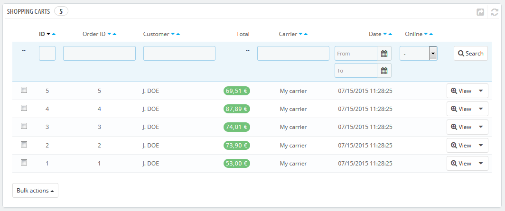
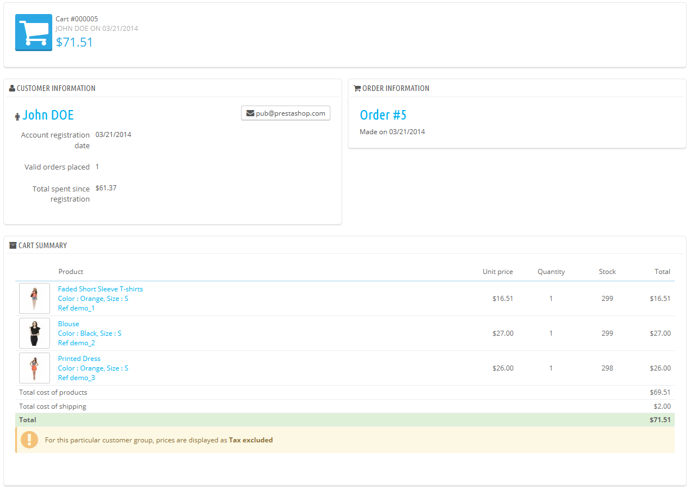

# Warenkörbe

PrestaShop besitzt einige sehr leistungsfähige Marketing-Funktionen, die Ihnen ermöglichen, die Artikel, die Kunden zurzeit im Warenkorb haben, in Echtzeit zu sehen. Es gibt zwei Wege, dies zu erreichen:

1. Gehen Sie auf die Seite "Kunden" im Menü "Kunden", suchen Sie den entsprechenden Kunden aus und sehen sich dessen Kundenprofil an. Blättern Sie im Profil nach unten zum Abschnitt "Warenkörbe", in diesem sind alle Warenkörbe des Kunden gelistet.
2. Gehen Sie auf die Seite "Warenkörbe" im Menü "Kunden". Die Warenkörbe werden hier nach ihrer ID sortiert.

In beiden Fällen können Sie den Button "Anzeigen" anklicken, um den Inhalt des Warenkorb Ihres Kunden zu sehen und diese Informationen zu nutzen, Ihren Umsatz zu verbessern.

Auf der Seite des entsprechenden Warenkorbs finden Sie die wichtigsten Informationen im Abschnitt "Inhalt des Warenkorbs", in dem Sie sehen, welche Artikel vom Kunden ausgewählt wurden, inklusive Preise, Mengen und dem Gesamtwert des Warenkorbs.

Verwaiste Warenkörbe

Verwaiste Warenkörbe heißen oft, dass Artikel im Warenkorb liegen, aber keine Zahlung durchgeführt wurde und der bestellvorgang nicht abgeschlossen wurde. Sie können Ihre Kunden aber daran erinnern, dass Sie noch Artikel im Warenkorb haben.

Verwaiste Warenkörbbe haben ihren eigenen "löschen"-Button, während Warenkörbe ohne diesen Button einen abgeschlossenen Einkauf darstellen, d.h. die Bestellung wurde abgewickelt und Sie müssen die Artikel senden.

Standardmäßig müssen Sie den Kunden wegen eines verwaisten Warenkorbs selbst kontaktieren. Sie können aber auch das "Customer Follow-up"-Modul aktivieren, welches in der Standardinstallation von PrestaShop enthalten ist, und Gutscheine an Kunden mit verwaisten Warenkörben senden lassen, Kunden für ihre Bestellungen danken oder den besten Kunden für ihr Vertrauen danken. Vorsicht, Kunden können absichtlich Warenkörbe verwaisen lassen, um Gutscheine zu bekommen.

Sie können auch PrestaShop's Abandoned Cart Reminder module als komplettes Tool kaufen: [http://addons.prestashop.com/en/checkout-modules/16535-abandoned-cart-pro.html](http://addons.prestashop.com/en/checkout-modules/16535-abandoned-cart-pro.html).
