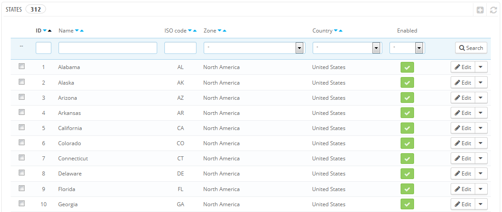
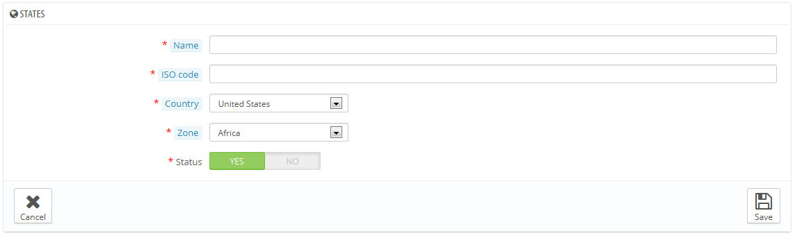

# Bundesländer

Durch "Bundesländer" legt PrestaShop die Unterteilung eines Landes auf erster Ebene fest. In den Vereinigten Staaten werden diese „states“ genannt; in Italien sind es regioni (Singular: Regione); in Frankreich sind es régions; im Vereinigten Königreich sind es regions.\
Standardmäßig bietet PrestaShop eine Menge von Bundesländern: 54 US-Bundesstaaten und Territorien, 31 Mexikanische estados, 13 kanadische Provinzen und Territorien, 34 indonesische Provinsi, 24 argentinische provincias, 47 japanische todōfuken und 110 italienischen Province (Singular: provincia).

Korrekt definierte Bundesländer helfen,  die Liefermöglichkeiten Ihrer Versanddienste besser zu zeigen. Diese Informationen können auch wichtig für die Berechnung der Steuersätze sein, abhängig vom Land. Es ist daher wichtig, alle administrativen Abteilungen des jeweiligen Landes anzugeben, wenn sie wichtig für Ihre Versanddienste sind. [Http://en.wikipedia.org/wiki/Table\_of\_administrative\_divisions\_by\_country](http://en.wikipedia.org/wiki/Table\_of\_administrative\_divisions\_by\_country): Sie können eine Liste der Gebiete auf dieser Wikipedia-Seite finden.

## Hinzufügen eines neuen Bundeslandes 

Klicken Sie auf die Schaltfläche "NEU", um zum Erstellformular zu kommen.

* **Name**. Der Name des Bundeslandes, wie auf Rechnungen und der Verpackung gedruckt. Er sollte daher in der Sprache des übergeordneten Staates sein.
* **ISO-Code**. Der ISO-3166-2-Code des Bundeslandes:\

  1. Gehen Sie zu dieser Wikipedia-Seite: [http://en.wikipedia.org/wiki/ISO\_3166-2](http://en.wikipedia.org/wiki/ISO\_3166-2),
  2. Klicken Sie auf „Current Codes“ in der Navigation,
  3. Auf dieser Seite finden Sie den Code (in einer Liste auf der Seite),
  4. Wenn es einen Code gibt, entfernen Sie das Präfix des Landes, um den Code unter 4 Zeichen zu halten. Zum Beispiel ist die vollständige ISO 3166-2 für Devon im Vereinigten Königreich "GB-DEV". Verwenden Sie einfach "DEV", und wählen das Land mit der "Land" Dropdown-Liste (siehe nächster Schritt) aus.
* **Land**. Geben Sie das Land mit Hilfe der Dropdown-Liste an.
* &#x20;**Zone**. Geben Sie die geografische Zone mit Hilfe der Dropdown-Liste an. Achten Sie darauf, nicht die falsche Zone auszuwählen, da PrestaShop die Land- und Zoneneinstellungen mischen könnte.
* **Status**. Ein deaktiviertes Bundesland wird nicht als Option angezeigt, wenn sich ein Besucher registrieren will und ein Kundenkonto eröffnet.
