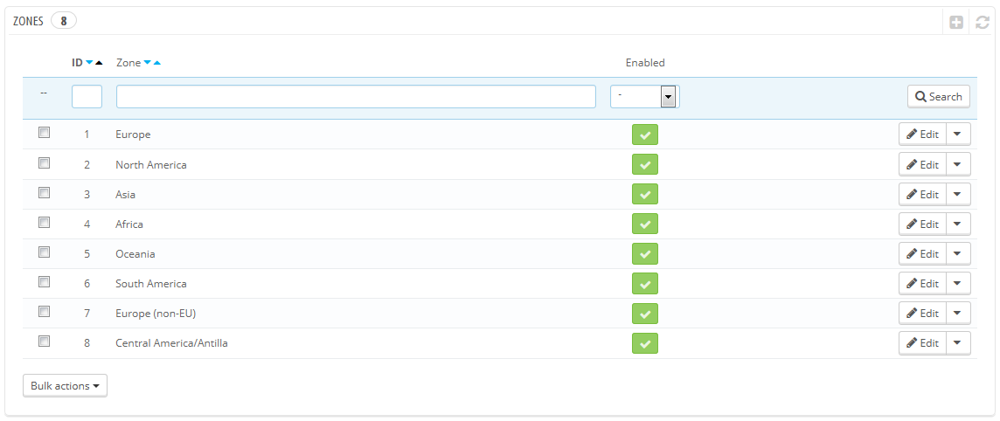
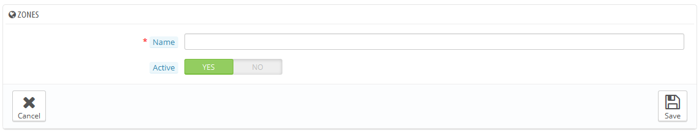

# Gebiete

PrestaShop Gebiete ist eine Liste der Teilgebiete der Welt ([http://en.wikipedia.org/wiki/Subregion](http://en.wikipedia.org/wiki/Subregion)). Sie hilft, Länder zu kategorisieren.

Bei Bedarf können Sie mehrere Zonen erstellen: Klicken Sie auf "NEU", um das Formular zur Erstellung anzuzeigen.

Alles was Sie brauchen ist ein Name und ein Status, zum Beispiel, dass Sie Bestellungen nach Ozeanien nicht zulassen.\
Wenn Sie im Multishop-Modus sind, können Sie auch eine Zone mit einer Auswahl an Shops verknüpfen.
