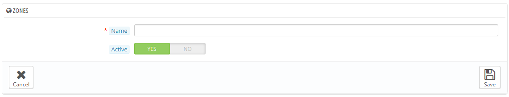

# Länder

Ihre PrestaShop Installation muss alle existierenden Länder kennen, um zu wissen, wo die Kunden auf der Erde leben.

Es gibt ungefähr 200 Länder in der Welt, PrestaShop hat 244. Das liegt daran, dass sich einige Länder noch Überseeregionen zugestehen.

\
Zum Beispiel haben, früher Französische Kolonien, als DOM (Guadeloupe, Martinique, Mayotte, Réunion und Französisch-Guayana) bekannt, heutzutage den Status der Französischen Metropolregion. Ebenso sind Alaska und Hawaii US-Staaten.\
Dennoch bedeutet das Senden eines Pakets nach Guadeloupe nicht, dass es nach Frankreich gesendet wird, die Versandkosten weichen ab. Daher ist die Liste der Länder in PrestaShop aufgrund dieser Differenzierungen länger.

Standardmäßig ist nur Ihr eigenes Land aktiviert. Sie sollten sie eines nach dem anderen aktivieren. Wenn Sie unsicher sind, welche Sie aktivieren sollten, überprüfen Sie Ihre Statistiken, um die Länder mit den meisten Besuchern zu sehen.

Am unteren Ende der Liste finden Sie die Option „Länderauswahl im Front Office auf die Länder beschränken, die durch aktivierte Versanddienste beliefert werden“, die im Front-Office die Länder deaktiviert, in welche nicht gesendet wird. Wir empfehlen, dass Sie diese Einstellung aktivieren, da es verhindert, dass Kunden zu lange durch alle Ländernamen zu scrollen, bis sie ihr eigenes finden.

## Hinzufügen eines neuen Lands 

Normalerweise hat PrestaShop alle gängigen Länder in der Datenbank. Im Fall, dass es ein neues gibt, müssten Sie ein neues erstellen.

* **Land**. Der offizielle Name des Landes, das  Sie hinzufügen möchten, in allen unterstützten Sprachen. Überprüfen Sie Wikipedia-Seite des Landes, wenn Sie den Namen nicht kennen.
* **ISO-Code**. ISO-3166-Code des Landes, die Sie auf der offiziellen ISO Seite finden: [http://www.iso.org/iso/country\_codes/iso\_3166\_code\_lists/country\_names\_and\_code\_elements.htm](http://www.iso.org/iso/country\_codes/iso\_3166\_code\_lists/country\_names\_and\_code\_elements.htm).
* **Telefonvorwahl**. Die internationale Ruf-Vorwahl, die Sie auf dieser Wikipedia-Seite finden: [http://en.wikipedia.org/wiki/List\_of\_country\_calling\_codes](http://en.wikipedia.org/wiki/List\_of\_country\_calling\_codes).
* **Standard-Währung**. Sie können Standard-Währung Ihres Shops ("Lokalisierung" unter dem Menüpunkt "Lokalisierung") verwenden, oder eine der anderen installierten Währungen. Denken Sie daran, dass, wenn nötig, können Sie eine neue Währung auf der Seite "Währungen" hinzufügen.
* **Gebiet**. Der weltweite Unterbereich, zu dem dieses Land gehört. Wenn nötig, können Sie neue Gebiete mit Hilfe der "Gebiete" Seite, unter dem Menüpunkt "Lokalisierung" hinzufügen.
* **PLZ erforderlich?**. Gibt an, ob ein Benutzer in diesem Land eine Postleitzahl haben muss, um richtig in Ihrem Shop bestellen zu können, oder nicht.
* **PLZ-Format**. Sie können auch weitere Einzelheiten über das Format der Postleitzahl (oder PLZ) angeben. Wenn Sie hier nichts eintragen, wird PrestaShop die Gültigkeit der Postleitzahl nicht überprüfen, wenn eine neue Adresse für dieses Land angelegt wird.\
  Verwenden Sie die folgenden Codes für das PLZ-Format: "L" für einen Buchstaben, "N" für eine Zahl und "C" für den Land-ISO-Code (derselbe, den Sie oben im ISO-Feld eingetragen haben).\
  Wenn Sie das Postleitzahl-Format des Landes nicht wissen, können Sie es auf dieser Wikipedia-Seite [http://en.wikipedia.org/wiki/List\_of\_postal\_codes](http://en.wikipedia.org/wiki/List\_of\_postal\_codes) nachlesen. Achten Sie darauf, nicht zu kopieren / einzufügen die Notation aus Wikipedia ist mit Prestashop nicht konform! Zum Beispiel steht bei Wikipedia "AAA 9999 \*" für Malta, so dass die Schreibweise für PrestaShop zu "LLL NNNN" wird.
* **Adressanzeige**. Geben Sie Details über das Adresslayout für die Kunden an. Sie können über die verschiedenen Einträge Links auf der Seite des Textfeld weitere Felder hinzuzufügen, indem Sie darauf klicken. In Live-Nutzung werden sie automatisch von PrestaShop durch die Daten aus dem Konto des Kunden ersetzt.\
  Ihre Änderungen werden nur gespeichert, wenn Sie die ganze Seite speichern. Wenn Sie einen Fehler gemacht haben, können Sie mit einer der vier Hilfsschaltflächen am unteren Rand Formulars den Fehler korrigieren, je nach Ihrer Situation.
* **Aktiv**. Ein deaktiviertes Land erscheint nicht als Option, wenn sich ein neuer Besucher registrieren und ein Kundenkonto eröffnen will.
* **Bundesländer**. Gibt an, ob das Land "Bundesländer" hat oder nicht. Dies fügt ein neues Feld in das PrestaShop Adressformular. Beachten Sie, dass "Bundesländer" Regionen, Provinzen, Bezirke usw. sein können, hauptsächlich etwas, das Sinn für die lokalen Lieferdienste des Landes macht.
* **UST-Identifikationsnummer erforderlich? und MwSt. anzeigen**. Eine Steueridentifikationsnummer ist eine Identifikationsnummer vom Finanzamt des Landes, die es in der Verwaltung der Steuergesetze verwendet. Nicht jedes Land verfügt über eine solche Nummer für die Wirtschaft. Erkundigen sie sich über die Bestimmungen des Landes.
* **Verknüpfter Shop**. Sie können das Land nur für eine Auswahl von Ihren Shops erstellen, zum Beispiel Shops, die auf ein bestimmtes Land abzielen.
