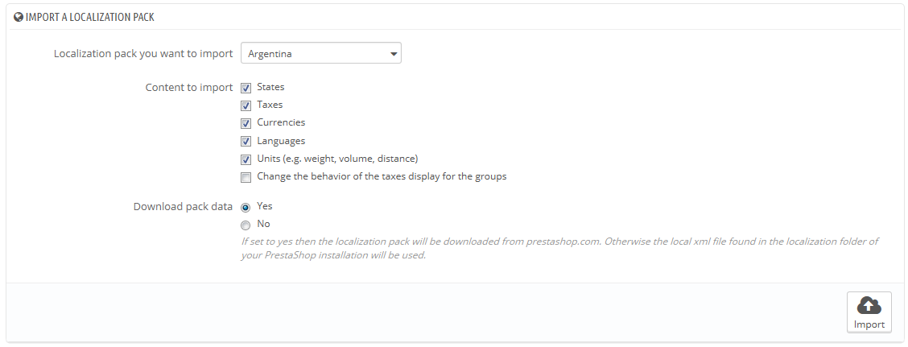
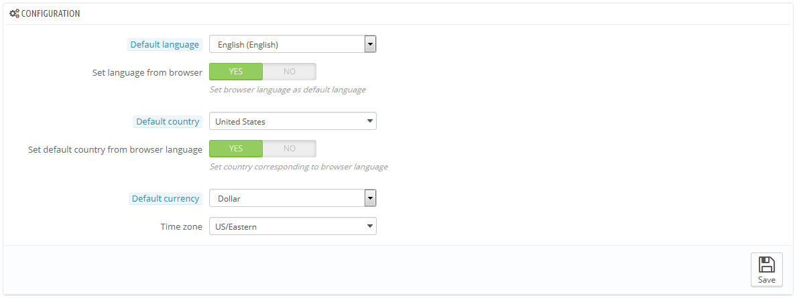
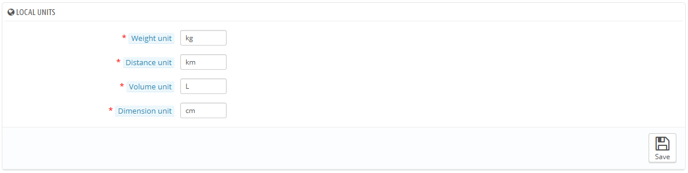
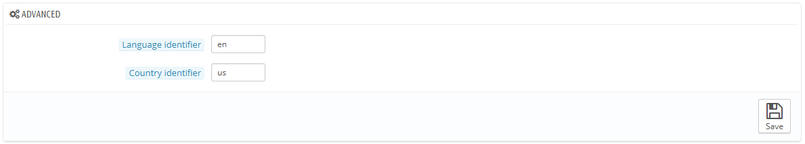

# Lokalisierung verwalten

Die Hauptseite des Menüs "Lokalisierung" ermöglicht Ihnen, die für Ihre Produkte verwendeten Einheiten zu konfigurieren.

## Import des Lokalisierungspakets 

Dieser Abschnitt bietet Ihnen eine umfangreiche Liste der vorhandenen Lokalisierungspakete, die Sie importieren können. Nicht nur, dass es PrestaShop mit den richtigen lokalen Einheiten installiert, es fügt auch viele andere Daten hinzu:

* **Bundesländer**. Beim Versand eines Produkt in ein Land zu wissen, in welches Bundesland, kann wichtig werden, da dies einen Einfluss auf die lokalen Steuern haben kann. Die hinzugefügten Bundesländer können unter dem Menüpunkt "Lokalisierung" angezeigt und bearbeitet werden, auf der Seite „Bundesländer“.
* **Steuern**. Die wirkliche Bedeutung der Lokalisierung sind lokale Steuern, diese können zahlreich sein und je nach Land oder Bundesland variieren. PrestaShop bietet Ihnen eine grundlegende Unterstützung für die wichtigsten Steuern und Steuervorschriften. Die Steuern und Steuervorschriften können angezeigt und auf den Seiten "Steuersätze" und "Steuerregeln" im Menü "Lokalisierung" bearbeitet werden.
* **Währungen**. Ausländische Kunden würden gern in der Lage sein, die Preise für Ihren Shop in die eigene Währung zu konvertieren. Sie sollten zumindest US-Dollar und Euro zur Verfügung stellen, neben Ihrer eigenen Währung(wenn es nicht eine von diesen ist). Einmal hinzugefügt, müssen Sie eine neue Währung auf der Seite "Währungen" unter dem Menüpunkt "Lokalisierung" aktivieren und sicherstellen, dass die Umwandlungsrate korrekt ist. Die hinzugefügten Währungen können auf dieser "Währungen" Seite angezeigt und bearbeitet werden.
* **Sprachen**. Alle öffentlichen Bereiche auf Ihrem Shop können in mehreren Sprachen erstellt werden, und es ist wichtig, dass Sie dies für Ihre Artikel-Namen und die Beschreibung, allermindestens. Beachten Sie, wenn eine Sprache importiert wird, wird auch das Datums-Format (d / e / Y, m / d / Y, dmY, etc.) neben anderem importiert. Die hinzugefügten Sprachen können unter dem Menüpunkt "Lokalisierung" angesehen und auf der Seite "Sprachen" bearbeitet werden.
* **Einheiten**. Gewicht, Größe, Volumen, Abstand: Diese Einheiten sind notwendig, um einen Artikel richtig zu beschreiben, für Ihre Kunden und für Ihre eigenen Verpackungsinformationen. Sie können auf dieser Seite angesehen und bearbeitet werden.
* **Steuer-Anzeige nach Gruppe ändern**. Dies sind keine zu importierenden Daten, sondern eine Einstellung, die Sie beim Import ändern können.

Wie Sie sehen können, sind diese zusätzlichen Daten optional: Sie können wählen, die Währung und Sprache für ein bestimmtes Land zu importieren, und nicht seine Steuern, zum Beispiel.

Während Sie nicht zu viele lokale Daten hinzufügen sollten, um den Verwaltungsaufwand klein zu halten, kann es nützlich sein, das Lokalisierungspaket für Ihre am häufigsten besuchten Ländern zu importieren (je nach Statistik).

Neben den Standardeinheiten, können Sie nicht automatisch alle Daten für ein bestimmtes Land entfernen; wenn Sie die Daten löschen möchten, müssen Sie dies manuell im Menü "Lokalisierung" tun, auf den jeweiligen Seiten.

## Einstellungen 

Dieser Abschnitt die lokalen Standardeinstellungen in vier Gruppen, die von zentraler Bedeutung sind:

* **Sprache**. Dies ist die Hauptsprache für Ihren Shop. Mit dieser Einstellung wird die Sprache aus Ihrem Back-Office (einschließlich der Hauptsprache für Ihre Produkte), sowie das Front-Office beeinflusst. Beachten Sie, dass sich die Sprache des Front-Office an die Einstellung der Browser der Kunden anpassen kann.
* **Land**. Der Standort Ihres Unternehmens. Wenn Sie Hauptsitze in vielen Ländern haben, nutzen Sie Ihren wichtigsten oder das Ursprungsland.
* **Standard-Währung**. Die Währung, in der Ihre Produktpreise eingestellt sind. Währungen werden durch Importieren und Aktivieren der Währung eines Landes hinzugefügt. Beachten Sie, wenn Sie die Währung ändern, nachdem bereits einige Produktpreise gesetzt wurden, müssen Sie alle vorhandenen Preise manuell aktualisieren. Achten Sie darauf, diesen Wert ein für alle Mal festzulegen.
* **Zeitzone**. Ihre Zeitzone. Dies ist nützlich für tägliche Rabatte: Sie wissen genau, wann er beginnt und endet.

Seit Version 1.6.0.10 haben  "Sprache" und " Land" jeweils eine zusätzliche Einstellung:

* Für " Sprache": PrestaShop stellt die Sprache des Shops abhängig von der Sprache des Gebietsschemacode des Browser des Besuchers ein(zum Beispiel: fr\_CA gibt Französisch)
* Für "Land": Land abhängig von Browser-Sprache. PrestaShop wird das Land abhängig vom Gebietsschemacode des Browser des Besuchers festlegen(zB fr\_CA gibt Kanada).

## Lokales Maß 

Die physikalischen Einheiten in diesem Abschnitt (Gewicht, Abstand, Volumen, Dimension) werden sowohl für Ihre Produktblätter und für Ihre eigene Verpackungsbedürfnisse verwendet – und ist letztlich für Ihren Versanddienst.

Diese Werte können eingestellt werden, wenn Sie das Lokalisierungspaket für ein Land importiert haben, aber die Werte anschließend manuell bearbeiten wollen. Zum Beispiel, wenn Sie lieber Zentiliter statt Litern als Volumeneinheit nehmen möchten, ändern Sie die Standardeinstellung "L" auf "CL".

Die Werte sollten Einheit Symbole aus dem Internationalen Einheitensystem ([http://en.wikipedia.org/wiki/International\_System\_of\_Units](http://en.wikipedia.org/wiki/International\_System\_of\_Units)) sein.

## Erweitert 

Dieser lässt Sie die lokale Sprache und das Land des Servers als ISO-Code einstellen:

* Für die Sprache: ISO 639-1 Code ([http://en.wikipedia.org/wiki/List\_of\_ISO\_639-1\_codes](http://en.wikipedia.org/wiki/List\_of\_ISO\_639-1\_codes)).
* Für das Land: ISO 3166-1 Alpha-2-Code ([http://en.wikipedia.org/wiki/ISO\_3166-1\_alpha-2](http://en.wikipedia.org/wiki/ISO\_3166-1\_alpha-2)).

Diese Werte können eingestellt werden, wenn Sie das Lokalisierungspaket für ein Land importiert haben, aber die Werte anschließend manuell bearbeiten wollen.
