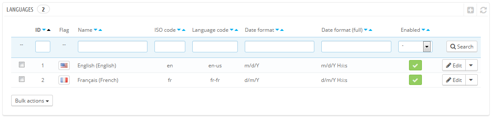
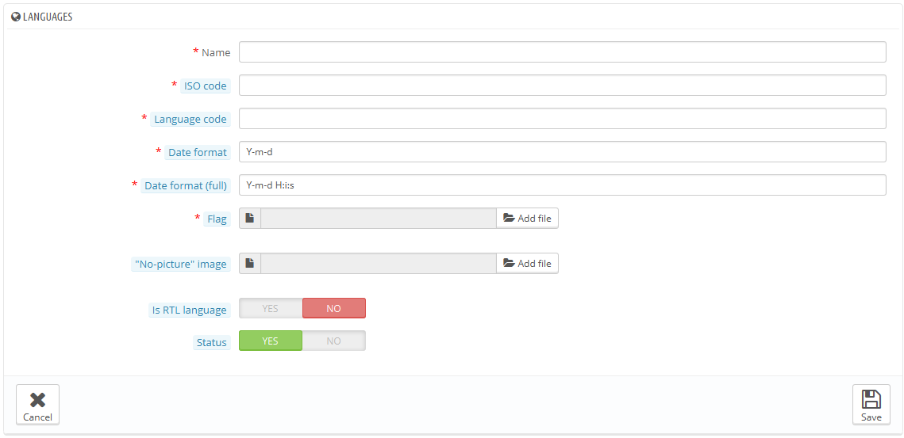

# Sprachen

PrestaShop wird mehrsprachig out-of-the-box geliefert: es gibt eine Standardsprache (die Sie zur Installation verwendet haben), viele weitere stehen zum Download bereit.

Die "Sprachen" Seite verwaltet die Sprachen, die Sie in Ihrem Back-Office und Shop sehen.

Die Seite zeigt die Sprachen, die bereits in Ihrem Shop installiert sind, zusammen mit einigen Informationen: ISO-Code, Sprachcode, Datums-Format (kurz und lang). Sie können Sprachen aktivieren oder deaktivieren, indem Sie auf das Symbol in der Spalte "Aktiviert" klicken.

Hinzufügen einer neuen Sprache wird einfach durch einen Import des entsprechenden Lokalisierungspakets von einem Land, das diese Sprache verwendet (auf der Seite "Lokalisierung"), realisiert. Stellt sich heraus, dass etwas nicht funktioniert, oder dass Sie etwas besonders anfertigen möchten, können Sie eine neue Sprache manuell hinzufügen, indem Sie den Button „Neue Sprache hinzufügen“ anklicken.

## Erstellen einer neuen Sprache 

Eine neue Sprache anlegen heißt, Sie müssen den gesamten Text für PrestaShop Front-End, Back-End, Module usw. übersetzen. Die Übersetzung wird auf der Seite "Übersetzungen" unter dem Menü "Lokalisierung" gemacht.

Sie können auch eine neue Sprache erstellen, um ein Sprachpaket zu erstellen, das Sie sonst von der PrestaShop Website heruntergeladen hätten.

Um eine neue Sprache zu erstellen, müssen Sie so viele Felder des Formulars wie möglich zu füllen:

* **Name**. Der Name ist öffentlich. Wenn Sie eine Sprache für regionale Zwecke erstellen, können Sie dies so im Namen kenntlich machen: "Französisch (Quebec)", zum Beispiel.
* **ISO-Code**. Geben Sie die angemessenen 2 Buchstaben des ISO 639-1 Code ein. Siehe [http://en.wikipedia.org/wiki/List\_of\_ISO\_639-1\_codes](http://en.wikipedia.org/wiki/List\_of\_ISO\_639-1\_codes) für weitere Informationen.Wenn Sie ein Sprachpaket importieren, sollte dieser Code genau mit dem des Pakets übereinstimmen.
* **Sprachcode**. Geben Sie die angemessene 4-Buchstaben-Sprachencode in der Form xx-yy an, wobei xx die Sprache ISO-Code (wie oben) ist und yy der Land ISO-Code, mit ISO 3166-1 alpha-2 (http: // en. [wikipedia.org/wiki/ISO\_3166-1\_alpha-2](http://wikipedia.org/wiki/ISO\_3166-1\_alpha-2)). Siehe [http://en.wikipedia.org/wiki/IETF\_language\_tag](http://en.wikipedia.org/wiki/IETF\_language\_tag) für weitere Informationen.
* **Datumsformat**. Die Länder haben nicht immer die gleiche Datumsdarstellung (siehe [http://en.wikipedia.org/wiki/Date\_format\_by\_country](http://en.wikipedia.org/wiki/Date\_format\_by\_country)). Z.B. wenn Sie in Ihrem Shop 02.08.12 anzeigen, wird ein Kunde aus Frankreich ", 2. August 2012" herauslesen, während man in den USA "8. Februar 2012" verstehen wird- japanische Kunden könnten sogar "12. August 2002 " lesen. Aus diesem Grund ist es wichtig, das Datumsformat und die daran gebundene Sprache anzuzeigen. Die verwendeten Buchstaben sollten der PHP date () Funktion entsprechen: [http://php.net/manual/en/function.date.php](http://php.net/manual/en/function.date.php).
* **Datumsformat (lang)**. Gleich wie das Datumsformat vorher, jedoch einschließlich des Stunden-Minuten-Formats.
* **Flagge**. Laden Sie ein Bild von der Flagge, am besten die mit der Sprache, die Sie hinzufügen möchten, übereinstimmt. Es sollte 16 \* 11 Pixel sein. Wir empfehlen, dass Sie den kostenlosen FamFamFam Flags Bildsatz verwenden: [http://www.famfamfam.com/lab/icons/flags/](http://www.famfamfam.com/lab/icons/flags/).
* **Bild** **"Kein-Bild "**. Laden Sie ein Bild hoch, das angezeigt wird, wenn für einen Artikel, noch kein Bild gezeigt werden kann. Das Bild ist einfach ein leeres Bild, mit" Kein Bild "oder" kein Bild vorhanden", geschrieben in dieser Sprache. Das Bild sollte 250 \* 250 Pixel sein. Sie können vorhandene "Kein-Bild" Bilder im / img / l Verzeichnis Ihrer PrestaShop Installation finden.
* **RTL-Sprache**. Einige Sprachen werden von rechts nach links geschrieben, vor allem solche, die arabische Schrift oder das hebräische Alphabet ([http://en.wikipedia.org/wiki/Right-to-left](http://en.wikipedia.org/wiki/Right-to-left)) beinhalten. Wenn ein PrestaShop Template gut codiert ist, ist es in der Lage, RTL Sprachen zu umgehen - sofern sie eindeutig als solche festgelegt sind.
* **Status**. Sie können eine neue Sprache deaktivieren, bis alles übersetzt wurde.
* **Verknüpfter Shop**. Sie können die Sprache nur auf eine Auswahl Ihrer Shops anwenden, zum Beispiel Shops, die auf ein bestimmtes Land bezogen sind.

Sobald Ihre Sprache gespeichert und aktiviert ist, können Sie sein Sprachpaket importieren. Dies wird auf der Seite "Übersetzungen" Seite im Menü "Lokalisierung" getan. Verwenden Sie "Manueller Import eines Sprachpakets".

Schließlich, stellen Sie sicher, dass alles funktioniert: Gehen Sie zum Front-Office Ihres Shops und klicken Sie auf die Fahnen am Kopf der Seite. In ähnlicher Weise können die Kunden nun eine andere Sprache auswählen, indem Sie diese Symbole ändern.
