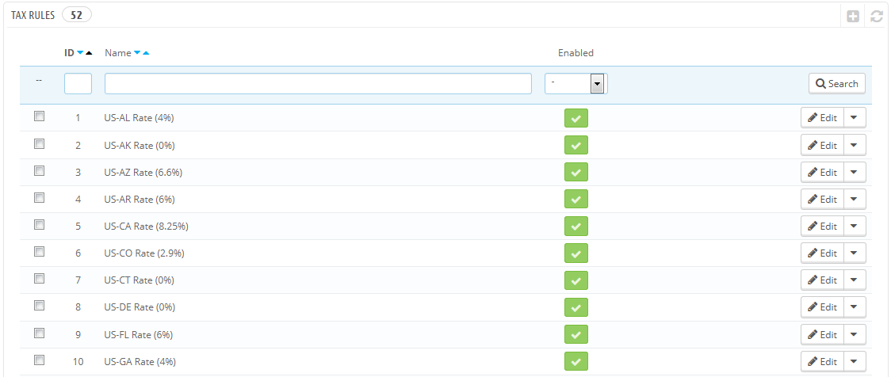
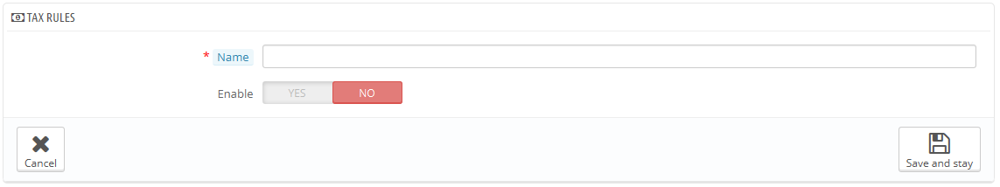
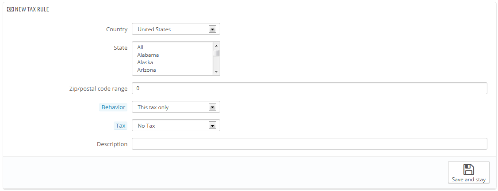

# Steuerregeln

Steuerregeln legen fest, dass Steuern nur bei bestimmten Ländern angewendet werden.

Standardmäßig gilt in PrestaShop eine Steuer auf alle Länder / Bundesländer/ Gebiete. Um einen bestimmten Steuersatz für ein einzelnes Land oder eine Gruppe von Ländern (und nicht alle) anzuwenden, müssen Sie eine Steuerregel erstellen. Die Steuerregel wird dann auf einer Pro-Produkt-Basis angewendet, während der Erstellung des Artikels("Preise" Tab).

Sie können nicht direkt eine Steuer auf einen Artikel anwenden, für ihn können nur Steuerregeln gelten. Daher müssen Sie alle relevanten Steuern eintragen, dann eine Steuerregel für die Steuern erstellen, die Länder für die Steuer angeben, und schließlich die Steuerregel auf das Produkt anwenden.

Einige Beispiel Steuerregeln sind bereits vorhanden, die dem Land, das Sie für Ihren Shop bei der Installation von PrestaShop ausgewählt haben, entsprechen. Die Steuerregeln werden für jede Steuer gesetzt: die Regeln dienen sozusagen als Filter für Länder, für die bestimmte Steuern gelten.

Sie sollten ein paar der vorhandenen Regeln bearbeiten, um ein besseres Verständnis dafür zu haben, wie Steuerregeln festgelegt werden.

## Hinzufügen einer neuen Steuerregel 

Sie können beliebig viele Steuerregeln hinzufügen. Nicht nur das, Sie sollten auch sicherstellen, dass alle benötigten Steuerregeln in Ihrem Shop vorhanden sind.

Erstellen einer neuen Steuerregel wird in zwei Schritten durchgeführt:

1. Erstellen der Steuerregel:\

   * Klicken Sie auf den Button "NEU".
   * Im Formular, das angezeigt wird, benennen Sie die Regel. Verwenden Sie einen bezeichnenden Namen: Verwenden Sie Ländercode der Steuerregel, ihren Namen, vielleicht sogar ihre Rate, so dass sie leicht wieder gefunden werden kann. Wenn PrestaShop bereits Steuerregeln für das gewünschte Land hat, verwenden Sie deren Namen als Inspiration, um eine gewisse Konsistenz zu halten.\
     
   * Wählen Sie, ob die Regel ab sofort gelten soll. Sie können sie auch erst später aktivieren, wenn nötig.
   * Klicken Sie auf die Schaltfläche "Speichern und auf der Seite bleiben". Die Seite wird neu geladen, mit einem Formular an der Unterseite.
2. Geben Sie das Land und Verhalten an:\

   * Klicken Sie auf "neue Steuerregel hinzufügen"
     * Ein neues Formular erscheint. Füllen Sie die Felder aus:\
       
     * **Land**. Das Zielland für die Regel, die Sie erstellen.\

       * **Bundesland**. Einige Länder haben Bundesländer (siehe die "Bundesländer" Seite, unter dem Menüpunkt "Lokalisierung"). In diesem Fall können Sie die Steuer noch spezifischer machen, oder wählen, dass sie auf das ganze Land angewendet werden soll. Sie können mehr als ein Bundesland wählen, indem Sie die Strg-Taste beim Klicken auf das Bundesland halten.
     * **Postleitzahl-Gruppe**. Abhängig davon, ob das Land Bundesländer hat oder nicht, können Sie weiter mit der Postleitzahl des Kunden spezifizieren. In diesem Feld können Sie Postleitzahlen, auf die die Steuer angewandt werden soll, definieren: Entweder geben Sie eine einzelne Postleitzahl an, oder Sie definieren einen Bereich mit dem Bindestrich. Beispielsweise "75.000-75.012", um eine Regel für alle Postleitzahlen zwischen diesen beiden zu erstellen.
     * **Verhalten**. Einige Kunden könnten eine Adresse haben, die mit mehr als einer Ihrer Steuerregeln übereinstimmt. In diesem Fall können Sie wählen, wie sich diese Steuerregel verhalten soll:\

       * Nur diese Steuer. Nur diese Steuer, keine der anderen passenden Steuern gelten lassen.
       * Kombinieren. Kombinieren der Steuern. Zum Beispiel: 100 € + (10% + 5% => 15%) => 115 €.
       * Nacheinander. Steuern gelten nacheinander. Zum Beispiel: 100 € + 10% => 110 € + 5% => 115,5 €.
     * **MwSt**. Die Steuer, die für diese Steuerregel verwendet werden soll. Diese Steuer muss bereits in PrestaShop erstellt worden sein. Wenn nicht: Wählen Sie "keine Steuer", um die Steuer Regel zu deaktivieren, speichern Sie, gehen Sie zu „Steuersätze“, um eine Steuer zu erstellen und kommen dann zurück, um die Steuerregel bearbeiten.
     * **Beschreibung**. Sie können einen kurzen Text als Erinnerung daran verfassen, warum für dieses Land diese Steuerregel gilt.
   * Klicken Sie auf "Speichern und auf der Seite bleiben". Das Land ist in der folgenden Tabelle hinzugefügt, und Sie können das Hinzufügen eines weiteren Landes mit den neuen leeren Feldern starten.

Beachten Sie, dass die Standardsteuer, die auf Ihre Produkte angewendet wird, auf dem Standard Land Ihres Shops basieren.
