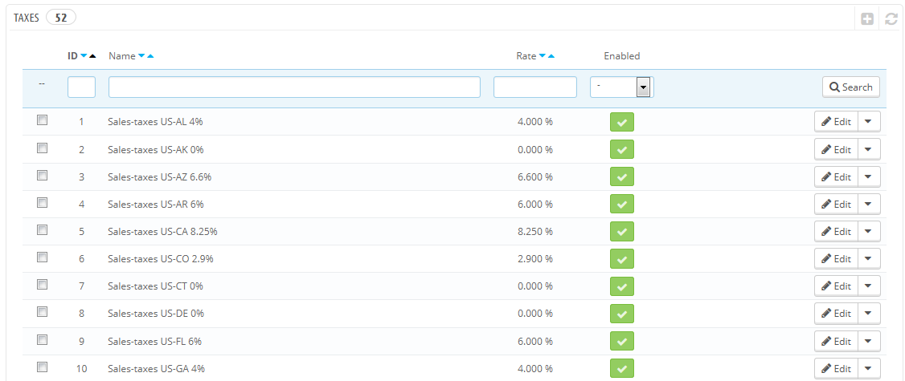
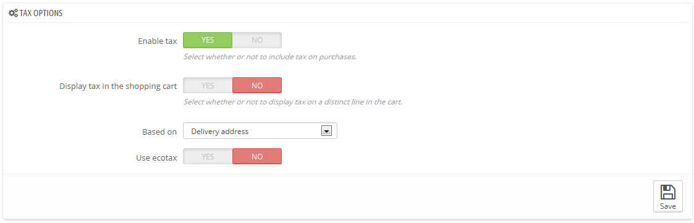
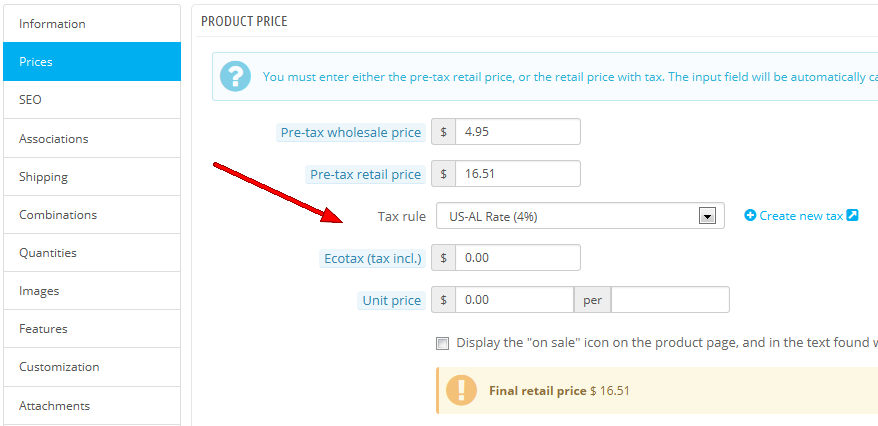
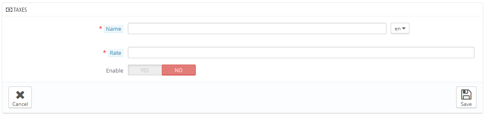

# Steuersätze

Steuersätze sind ein komplexes Thema, welches vollständig verstanden werden sollte, weil es einen erheblichen Einfluss auf die Produktpreise oder Ihre Versandkosten haben kann. Während dieses Handbuch nicht dazu gedacht ist, alle Aspekte von Steuern zu lehren, werden wir unser Bestes versuchen, Ihnen einen Einstieg zu geben.

Steuern sind "Pflichtbeiträge zu staatlichen Einnahmen, die von der Regierung auf Einkommen und Ertrag der Arbeitnehmer erhoben werden oder auf die Kosten für einige Waren, Dienstleistungen und Transaktionen aufgeschlagen werden". Kurz gesagt, alle Produkte, die Sie verkaufen unterliegen Umsatzsteuern, die von den Steuergesetzen Ihres Landes/Bundeslandes abhängen. Um dazu beizutragen, dass das System Ihres Landes funktioniert(Infrastruktur, Dienstleistungen, Soziales), werden Steuern erhoben.

Es gibt viele Steuersätze in der Welt, welche erheblich von Land zu Land variieren können und sogar innerhalb eines Landes, wenn man Bundesländer betrachtet (USA, Deutschland, Spanien, Russland ...). Daher sollten Sie sicherstellen, dass Sie sich strikt an Steuergesetze dieses Landes halten, und selbst an die des Bundeslandes oder der Stadt, wenn nötig. Erkundigen Sie sich bei Ihrem lokalen Steuerberater, um alle offiziellen Details zu erhalten.

Standardmäßig gilt eine Steuer auf alle Länder / Staaten / Zonen. Wenn ein bestimmter Steuersatz für ein einzelnes Land oder eine Gruppe von Ländern (und nicht alle) hinzugefügt werden muss, müssen Sie eine Steuerregel erstellen. Die Steuerregel wird dann auf einer Pro-Produkt-Basis angewendet, während der Erstellung des Produkts ("Preise" Tab).

Sie können nicht direkt eine Steuer auf ein Produkt anwenden; dies kann nur in einer Steuerregel gelten. Daher müssen Sie alle relevanten Steuern hinzufügen und dann eine Steuerregel für die Länder, in denen die Steuer gilt, angeben, und stellen Sie die Steuerregel auf das Produkt beziehen.

## Steueroptionen 

Am unteren Rand der Seite ist der Abschnitt "Steueroptionen". Diese Optionen gelten für den gesamten Shop und sämtliche Bestellungen.

* **MwSt. aktivieren**. Ob Steuern in jedem Kauf enthalten sind.
* **MwSt. im Warenkorb anzeigen**. Sie könnten es vorziehen, dass Kunden nicht sehen sollen, wie und in welcher Reihenfolge Steuern einbezogen werden. In diesem Fall deaktivieren Sie diese Option.
* **Basierend auf**. Der Kunde kann festlegen, dass das Produkt nicht an die gleiche Adresse wie die Rechnung gesendet werden soll. Dies kann einen großen Einfluss auf Steuern haben. Standardmäßig basiert PrestaShop ihre Steuersätze auf die Lieferadresse, aber Sie können wählen, sie auf Grundlage der Rechnungsadresse umzusetzen.
* **Ökosteuer anwenden**. Die Ökosteuer bezieht sich auf "Steuern zum Verbrauch von Energie". Erfahren Sie mehr über Ökosteuer auf dieser Wikipedia-Seite: [http://en.wikipedia.org/wiki/Ecotax](http://en.wikipedia.org/wiki/Ecotax).\
  Sobald Sie die Verwendung von Ökosteuer aktiviert haben, werden alle Ihre Artikel im Backoffice über ein "Ökosteuer (inklusive MwSt.)" Feld in ihrem Register "Preise" verfügen. Sie sollten dieses Feld mit dem exakten Wert der Steuer, der von den Steuergesetzen Ihres Landes abhängt, füllen.

Wenn Sie sich entscheiden, die Ökosteuer, nachdem sie hinzugefügt wurde, zu aktivieren, müssen Sie alle Artikel bearbeiten, um die Steuer korrekt für jedes Produkt eingetragen zu haben.

Beachten Sie, wenn Sie bereits eine Ökosteuer für Ihre Produkte festgelegt haben, und sich dazu entscheiden, Ökosteuer zu deaktivieren, werden alle Ihre Produkte ihre Ökosteuer-Einstellungen verlieren. Reaktivierung der Ökosteuer bedeutet, dass auf alle diese Artikel wieder Ökosteuern angewendet werden.\
Die Ökosteuer wird auch dem Kunden auf der Produktseite angezeigt.

## Hinzufügen eines neuen Steuersatzes 

Hinzufügen einer neuen Steuer ist sehr einfach:

* **Name**. Seien Sie sehr spezifisch, da dies Ihnen helfen wird, Steuerregeln schneller zu erstellen.\
  Es wird empfohlen, eine Erinnerung im Namen hinzuzufügen, wie Land / Gruppe / Zone auf das/die sich die Steuer bezieht, und seine Rate. So können Sie sich leichter daran erinnern, welche Steuern in einer Steuerregel verwendet werden sollen.
* **Steuersatz**. Der genaue Steuersatz, im XX.XX Format.
* **Aktivieren**. Sie können eine Steuer zu jeder Zeit deaktivieren und aktivieren.

