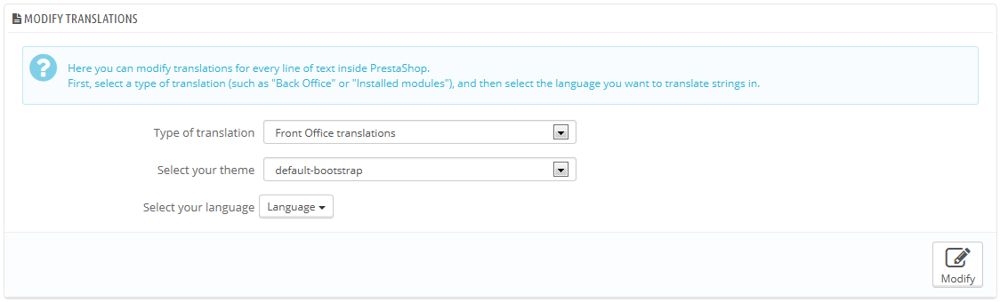
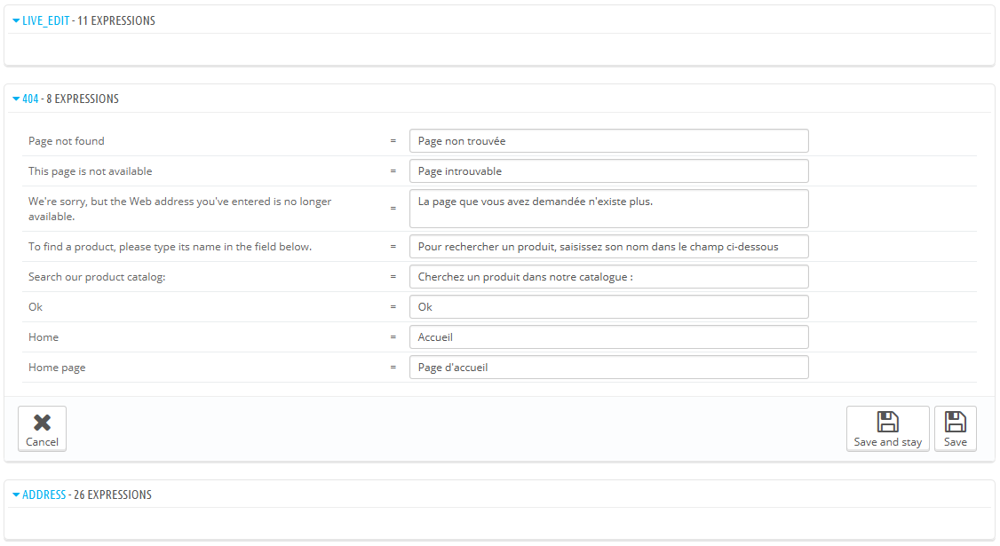
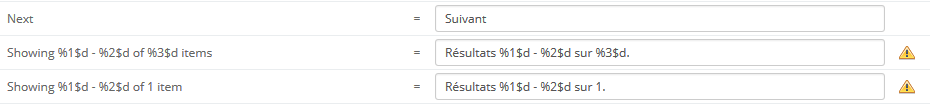
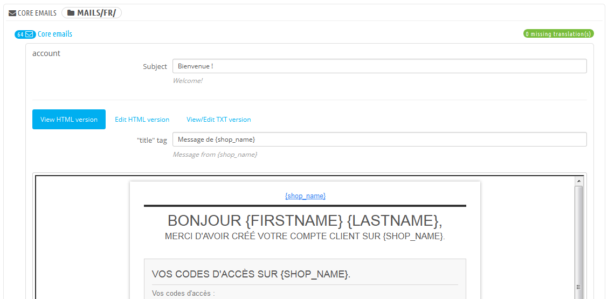
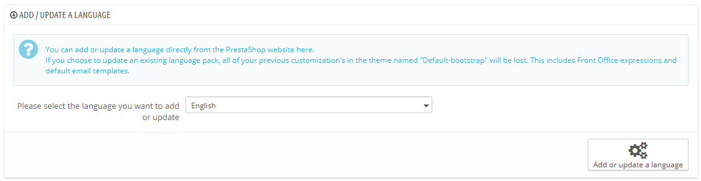
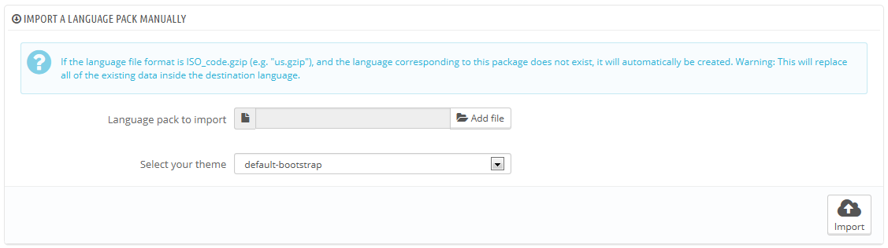
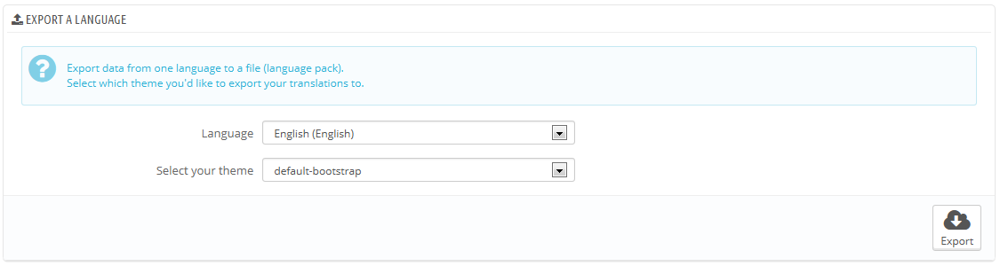
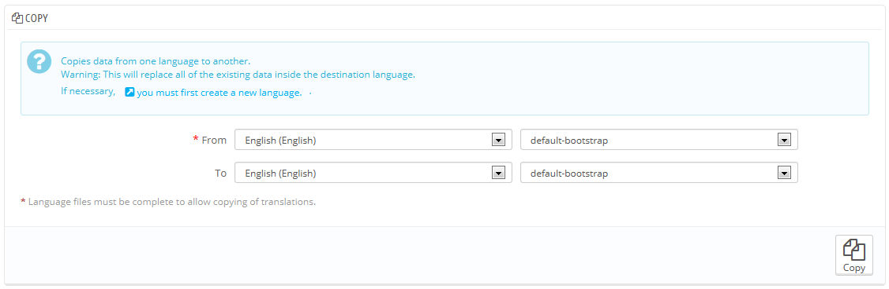

# Übersetzungen

PrestaShop bietet Ihnen vollständige Übersetzungswerkzeuge für Ihren Shop an. Dies hilft Ihnen, Ihrem Shop Übersetzungen hinzuzufügen. Auf diese können Sie Ihre Übersetzungen verwalten, ohne dass Sie auf offizielle Übersetzer warten müssen.

Auch wenn Sie die Übersetzerarbeiten nicht korrigieren wollen, möchten Sie vielleicht den Wortlaut der Übersetzung ändern(weniger formal, weniger wortreich, etc.) oder den zur Verfügung stehenden Text ändern und anpassen, damit Ihre Website genau auf Ihre Kunden zugeschnitten ist; zum Beispiel könnte ein Shop für Hip-Hop-Kleidung besser oder schlechter mit verschiedenen Ausdrucksformen eines Shops für Luxusartikel dargestellt werden.

Der Prozess der Anpassung eines Shops an Fremdsprachen heißt Internationalisierung und Lokalisierung, oder kurz I18N und L10N.\
Internationalisierung ist der erste Schritt, in dem Entwickler einen Mechanismus für die Übersetzung der Software wählen. Alles basiert dann auf diesem Mechanismus.\
Die Lokalisierung ist der zweite Schritt, in dem zwei- oder mehrsprachige Anwender der Software die Originalzeichenfolgen in ihre eigene Sprache übersetzen. Lokalisierung kann auch bedeuten, lokale Daten zur Verfügung zu stellen, um die Software für lokale Benutzer weiter zu verbessern.\
&#x20;Sie können mehr über I18N und L10N auf dieser Wikipedia-Seite erfahren: [http://en.wikipedia.org/wiki/Internationalization\_and\_localization](http://en.wikipedia.org/wiki/Internationalization\_and\_localization)

Das PrestaShop-Team hat sich entschieden, sein eigenes integriertes Übersetzungs-Tool zu verwenden, so dass jeder mit einer PrestaShop Installation seinen Shop auf seine Bedürfnisse anpassen kann.\
Die Community-Übersetzung wird mit einem Online-Tool, auf [https://crowdin.net/project/prestashop-official](https://crowdin.net/project/prestashop-official) durchgeführt.

[Http://www.prestashop.com/en/translations](http://www.prestashop.com/en/translations): Die offiziellen Übersetzungspacks können manuell von dieser Adresse heruntergeladen werden

## Eine Übersetzung bearbeiten 

Das wichtigste Werkzeug auf der Seite "Übersetzungen" ist der Abschnitt „Übersetzungen ändern“. Hier können Sie eine zu ändernde Übersetzung auswählen und jeden einzelnen Satz komplett neu gestalten, wenn Sie so möchten.

Wählen Sie den Teil der aktuellen Übersetzung, die Sie bearbeiten möchten:

* **Übersetzungen im Front Office**. Der Text, den Kunden beim Surfen durch Ihren Shop sehen.
* **Übersetzungen im Back Office**. Der Text, den Sie und Ihr Team im Administrations-Bereich Ihres Shops sehen.
* **Fehlermeldungen**. Die Fehlermeldungen, die auf der Front-Office-Seite angezeigt werden können.
* **Feldnamen**. Der Name der Felder sowohl im Front-Office und Back-Office.
* **Installierte Module**. Die Begriffe, die von den installierten Modulen verwendet. Beachten, dass die Module, die verfügbar sind, aber nicht installiert werden nicht im Tool gezeigt werden.
* **PDF-Dateien**. Die in den generierten PDF-Dateien verwendeten Begriffe: Rechnungen, Lieferscheine etc.
* **E-Mail-Vorlagen**. Die Begriffe, die in den Standard-E-Mail-Vorlagen verwendet werden.

Einige Kategorien haben eine zweite Dropdown-Liste, welche die verfügbaren Templates auflistet. PrestaShop Templates haben nicht nur ihre eigenen Zeichenfolgen, sondern auch ihre eigenen Module, PDF-Vorlagen und E-Mail-Vorlagen. Die Dropdown-Liste ermöglicht es daher, zu wählen, mit welchen Templates Sie arbeiten möchten.

Nachdem Ihre Auswahl abgeschlossen ist, klicken Sie auf den Sprachcode der Sprache, in der Sie die Übersetzung bearbeiten möchten.

Eine lange Seite erscheint, die Hunderte von verfügbaren Strings für diese Kategorie, manchmal weiter aufgeteilt, anzeigt.

Standardmäßig werden nur die Felder mit nicht übersetzten Strings offen angezeigt. Wenn Sie alle öffnen möchten, klicken Sie auf die Schaltfläche „Schließen Sie alle Blöcke“ zweimal: einmal, um alle von ihnen zu schließen, noch einmal, um sie alle zu erweitern. Sie können einzelne öffnen und schließen, indem Sie auf den Titel klicken.

Bearbeiten einer Übersetzung ist einfach:

* Öffnen Sie ein fieldset,
* bearbeiten Sie seinen Inhalt,
* Klicken Sie entweder auf "Speichern und auf der Seite bleiben", um währenddessen zu speichern oder auf die Schaltfläche "Speichern", um zu speichern und zur Hauptseite "Übersetzungen" zu gelangen.

PrestaShop 1.5 hat eine neue Syntax, wo Strings Platzhalter wie% s,% d,% 1 $ s% 2 $ d usw. haben können.

Wenn Sie eine Zeichenfolge mit einem solchen Platzhalter finden, bedeutet dies, dass PrestaShop ihn mit einem dynamischen Wert ersetzt, bevor die Zeichenkette angezeigt wird.\
Zum Beispiel wird in der Zeichenfolge "Ihre Bestellung auf% s ist abgeschlossen",% s durch den Namen des Shops ersetzt. Daher sollten Sie darauf in Ihrer endgültigen Übersetzung achten; beispielsweise in Französisch würde die Übersetzung "Votre commande sur% sa bien été enregistrée“ lauten.

Einige Strings können ein Warnsymbol rechts haben. Dies zeigt Strings mit Platzhaltern an. Sie können auf das Symbol klicken, um weitere Informationen zu erhalten.\
Im Falle eines Strings mit einem Platzhalter sollten Sie sicherstellen, dass der Inhalt dieser Platzhalter korrekten Satzfluss gesetzt ist und vermeiden Sie wörtliche Übersetzung.\
Nummerierte Platzhalter (% 1 $ s% 2 $ d, etc.) ermöglichen Übersetzern, die Reihenfolge der Platzhalter in der Zeichenkette neu anzuordnen, während die Daten jeweils ersetzt werden. Auf diese Weise könnte ein Französisch Übersetzer "aus% Order #% 1 $ d 2 $ s" in "Commande Nr% 1 $ s du% 2 $ s" oder "Le% 2 $ s, commande n °% 1 $ s " umwandeln.

### Besonderheiten 

Die meisten Übersetzungskategorien zeigen ihre Strings auf dieselbe Weise: Strings der Kategorie sind in Fieldsets aufgeteilt, die Sie schließen oder erweitern können, indem Sie auf ihren Titel klicken, zusammengefasst. Der Titel zeigt die Anzahl von Ausdrücken, die das Fieldset enthält, und, wenn nötig, die Anzahl der fehlenden Ausdrücke in Klammern in rot.

Dies gilt für die meisten Kategorien, mit Ausnahme von drei speziellen:

* **Fehlermeldungen**. Strings hier sind nicht in Fieldsets aufgeteilt, sie werden alle zusammen gezeigt.
* **PDF-Vorlagen**. Es gibt nur ein fieldset, "PDF".
* **E-Mail-Vorlagen**. Strings werden in Fieldsets aufgeteilt, aber sie sind nicht mehr einfache Textfelder. Jede E-Mail hat zwei Vorlagen: eine HTML, die formatiert werden kann, und einen Text, der schlicht und einfach ist. Während der Klartext direkt durch das Textfeld bearbeitet werden kann, kann man HTML nur bearbeiten, indem Sie auf "HTML-Version bearbeiten“ am unteren Rand der Vorschau klicken. Der Klick schaltet die Vorschau in ein WYSIWYG-Textfeld (What you See is What you get), mit einem kompletten Editor am Kopf(basierend auf TinyMCE: [http://www.tinymce.com/](http://www.tinymce.com/)). Zusätzlich zur Bearbeitung des Textes können Sie den Entwurf ändern, wie Sie wollen, zum Beispiel können Sie die Farben ändern, um den Entwurf Ihrem Shop anzupassen.\
  Beachten Sie, dass die Platzhalter in E-Mail-Vorlagen, wie {Nachname} oder {shop\_name}, von PrestaShop mit den tatsächlichen Werten beim Senden der E-Mail ersetzt werden. Stellen Sie sicher, sie Ihren Übersetzungen zu behalten.

## Sprache Hinzufügen / Aktualisieren 

PrestaShop Übersetzungen sind in Sprachpaketen erhältlich, die all die verschiedenen Kategorien der Übersetzung in einer ZIP-Datei kombinieren. Viele Sprachpakete sind frei verfügbar zum Herunterladen und Installieren direkt von den [PrestaShop.com](http://prestashop.com) Servern. PrestaShop kümmert sich selbst um das Herunterladen des Sprachpakets, Auspacken und die Erstellung der richtigen Unterordner in Ihrer Installation.

Sie können auch die derzeit installierten Sprachen aktualisieren, ebenfalls direkt durch die [PrestaShop.com](http://prestashop.com) Server, aber seien Sie daran erinnert, dass jede Änderung, die Sie zu Ihrer eigenen Übersetzung vorgenommen haben, verloren geht, sobald Sie sie aktualisieren.

## Manueller Import eines Sprachpakets 

Im Falle, dass Sie kein offizielles PrestaShop Übersetzungspaket verwenden möchten, sondern ein individuelles (entweder durch einen Bekannten, oder ein, von einem anderen PrestaShop exportiertes Sprachpaket), dann sollten Sie dieses Tool nutzen.

Wählen Sie die Zip-Datei, wählen Sie das Template, auf das das Paket angewendet werden soll, und klicken Sie dann auf die Schaltfläche "Importieren", um das Paket in den Ordner / Übersetzung zu installieren.

Falls bereits ein Ordner mit demselben ISO 639-1 Code existiert, wird er durch die Dateien aus dem Paket, das Sie importieren, ersetzt.

## Übersetzung exportieren 

Sie können mit diesem Tool Ihr eigenes Sprachpaket erstellen, um entweder eine Sicherungskopie Ihrer Anpassungen zu machen, oder um Ihre Übersetzungen mit anderen PrestaShops zu teilen.

Wählen Sie einfach die Sprache und das Template der Übersetzung, die Sie exportieren möchten, und klicken Sie auf die Schaltfläche "Exportieren".

Beachten Sie, dass das Paket das Template, das Ihre Übersetzung unterstützen soll, enthält.

## Kopieren 

Sie können den Inhalt von einer Sprache in eine andere zu kopieren. Dies ist besonders nützlich, wenn Sie die Sprache eines Templates mit der gleichen Sprache von einem anderen Template ersetzen wollen.

Wählen Sie die Quellsprache und Template, dann die Zielsprache und Template, und klicken Sie auf die Schaltfläche "Kopieren". In den meisten Fällen sollte die Sprache die gleiche in beiden Dropdown-Listen bleiben.

Wenn es bereits einen Sprachordner für diese Sprache im Ziel Template gibt, wird er von den Dateien von der Sprache und Templates, die Sie kopieren, ersetzt werden.

Sie sollten zuerst eine neue Sprache für das Ziel Template erstellen, bevor Sie von der Quellsprache kopieren.
