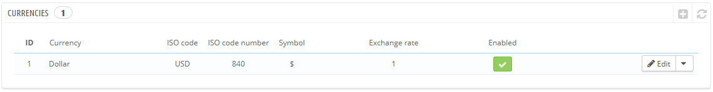

# Währungen

PrestaShop kann eine große Anzahl von Währungen akzeptieren. Standardmäßig gibt es nur eine Standardwährung: die eine für Ihr Land. Allerdings müssen Sie neue hinzufügen, und den Bedürfnissen Ihrer Kunden entsprechend konfigurieren. Kunden werden die die Möglichkeit, die Preise Ihres Shops in der Währung ihres Landes anzeigen zu lassen, zu schätzen wissen.

Die beiden Abschnitte an der Unterseite der "Währungen" Seite sind sehr einfach, aber wichtig, da, sie sich auf Wechselkurse (oder "Umrechnungskurse") beziehen. Um Wikipedia zu zitieren: "In der Finanzwelt ist ein Umrechnungskurs zwischen zwei Währungen die Rate, mit der eine Währung gegen eine andere ausgetauscht werden kann. Es wird auch als der Wert der Währung eines Landes in Bezug auf eine andere Währung betrachtet." Preise ändern sich täglich, manchmal drastisch, je nach aktueller Finanzlage und Ihr Shop sollte immer auf die neuesten Werte aktualisiert werden.

Um die Standardwährung zu ändern, müssen Sie auf die Seite "Lokalisierung" des Menüs gehen, und die Option "Standardwährung" konfigurieren.\
Wenn die Währung, die Sie verwenden möchten hier nicht verfügbar ist, müssen Sie die Währung von einem der Länder, die sie verwenden, importieren, mit dem Abschnitt "Import eines Lokalisierungspakets" auf der Seite "Lokalisierung".

## Aktualisierung der Währungskurse 

In PrestaShop, gibt es zwei Möglichkeiten, um Ihre Wechselkurse zu aktualisieren:

* **Manuell**. Klicken Sie im Abschnitt "Wechselkurse" auf die Schaltfläche "Wechselkurse aktualisieren". Dies wird die Update-Datei von den [PrestaShop.com](http://prestashop.com) Servern mit Hilfe des PrestaShop Web-Service herunterladen.
* **Automatisch**. Dies ist die empfohlene Methode. Anstatt einmal oder dreimal am Tag den Button "Wechselkurse aktualisieren " anzuklicken, können Sie einen Cron-Task erstellen, der die Datei so oft Sie wollen herunterlädt. Fügen Sie die angegebene URL in Ihre crontab-Datei ein, um die automatische Aktualisierung zu aktivieren. Wenn Sie nicht wissen, was ein Cron-Task oder eine crontab-Datei ist, kontaktieren Sie Ihren Hosting-Anbieter.

Beachten Sie, dass die Preise von PrestaShop gestellt werden: das PrestaShop-Team achtet auf korrekte Preise in dieser Datei, aber möglicherweise weichen diese geringfügig von den tatsächlichen ab, weil diese in kurzer Zeit stark schwanken können.

## Hinzufügen einer neuen Währung 

Der einfachste Weg, die Währung eines Landes hinzuzufügen ist es, sein Lokalisierungspaket zu importieren. Dies wird auf der Seite "Lokalisierung" unter dem Menü "Lokalisierung" durchgeführt. Sobald importiert, müssen Sie auf die Seite "Währungen", um sie zu aktivieren.

Möglicherweise müssen Sie eine Währung hinzufügen, die nicht in irgendwelchen der Lokalisierungspakete enthalten ist. In diesem Fall können Sie das Erstellungsformular verwenden.

* **Währung**. Der Name der Währung, vorzugsweise in Englisch, dass so viele Kunden wie möglich es lesen können.
* **ISO-Code**. Drei-Buchstaben-ISO 4217-Code der Währung. Sehen Sie auf diese Wikipedia-Seite: [http://en.wikipedia.org/wiki/ISO\_4217](http://en.wikipedia.org/wiki/ISO\_4217).
* **Numerischer ISO-Code**. Der dreistellige ISO 4217 Code. Gleiche Wikipedia-Seite, wie oben.
* **Symbol**. Symbol der Währung, wenn vorhanden. Sehen Sie auf diese Wikipedia-Seite: [http://en.wikipedia.org/wiki/Currency\_sign](http://en.wikipedia.org/wiki/Currency\_sign).
* **Wechselkurs**. Diese Rate ist nach der Standardwährung Ihres Shops definiert. Zum Beispiel, wenn die Standardwährung Euro ist und die neue Währung US-Dollar ist, geben Sie "1.31" ein, denn 1 € hat in der Regel einen Wert von $ 1,31 (zum Zeitpunkt des Schreibens dieses Artikels). Verwenden Sie den Konverter Für Hilfe hier: [http://www.xe.com/ucc/](http://www.xe.com/ucc/).
* **Währungsformat**. Richten Sie ein, wie Sie möchten, dass Ihr Preis angezeigt wird. Das X entspricht dem Symbol der Währung. Sie haben fünf Möglichkeiten.
* **Dezimale**. Sie können angeben, ob Ihr Shop Dezimalstellen anzeigen soll. Während Sie alle Ihre Preise in ganzen Zahlen ausdrücken können, können Rabatte und sonstige Preisschwankungen Dezimalstellen rechtfertigen. Sie können sie mit dieser Option verhindern.
* **Leerzeichen**. Sobald Sie ein Währungsformat ausgewählt haben, können Sie auswählen, ob Sie ein Leerzeichen zwischen dem Symbol und dem Preis selbst haben möchten. Einige Sprachen erfordern dies. Zum Beispiel würde es in Spanien "50 €" heißen, während Französische Leute "50 €" verwenden würden. Wählen Sie, was Ihrer Meinung nach am besten ist.
* **Aktivieren**. Jede Währung kann jederzeit sowohl von ihrer eigenen Konfigurationsseite deaktiviert werden, als auch von der Währungen-Tabelle auf der Seite "Währungen".
* **Verknüpfter Shop**. Sie können die Währung nur einer Auswahl von Ihren Shops zur Verfügung stellen, zum Beispiel Shops, die bestimmte Länder als Ziel haben.
