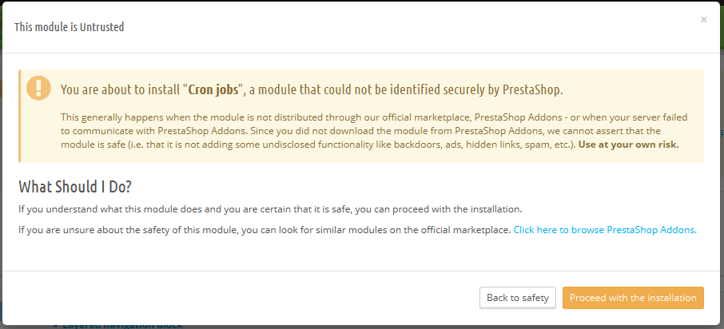

# Modul- und Template-Shop

**Table of contents**

/\*\<!\[CDATA\[\*/\
div.rbtoc1597071533958 {padding: 0px;}\
div.rbtoc1597071533958 ul {list-style: disc;margin-left: 0px;}\
div.rbtoc1597071533958 li {margin-left: 0px;padding-left: 0px;}\
\
/\*]]>\*/

* [Modul- und Template-Katalog](modul-und-template-shop.md#Modul-undTemplate-Shop-Modul-undTemplate-Katalog)
  * [Installation eines Moduls](modul-und-template-shop.md#Modul-undTemplate-Shop-InstallationeinesModuls)
    * [Installation mit Hilfe des Dialoges](modul-und-template-shop.md#Modul-undTemplate-Shop-InstallationmitHilfedesDialoges)
    * [Installation mit Hilfe eines FTP-Client](modul-und-template-shop.md#Modul-undTemplate-Shop-InstallationmitHilfeeinesFTP-Client)
  * [Aktualisieren eines Moduls](modul-und-template-shop.md#Modul-undTemplate-Shop-AktualisiereneinesModuls)
  * [Deinstallieren eines Moduls](modul-und-template-shop.md#Modul-undTemplate-Shop-DeinstalliereneinesModuls)
  * [Ein Template installieren](modul-und-template-shop.md#Modul-undTemplate-Shop-EinTemplateinstallieren)
    * [Installation mit dem PrestaShop Theme Installer](modul-und-template-shop.md#Modul-undTemplate-Shop-InstallationmitdemPrestaShopThemeInstaller)
    * [Installation mit Hilfe eines FTP-Client](modul-und-template-shop.md#Modul-undTemplate-Shop-InstallationmitHilfeeinesFTP-Client.1)
  * [Ein Template Exportieren](modul-und-template-shop.md#Modul-undTemplate-Shop-EinTemplateExportieren)
  * [Mobile Vorlagen](modul-und-template-shop.md#Modul-undTemplate-Shop-MobileVorlagen)
    * [Installieren der mobilen Vorlage für Ihren Shop](modul-und-template-shop.md#Modul-undTemplate-Shop-InstallierendermobilenVorlagefürIhrenShop)
    * [Anpassen der mobilen Vorlage](modul-und-template-shop.md#Modul-undTemplate-Shop-AnpassendermobilenVorlage)
    * [Verwendung der mobilen Vorlage mit einem anderen Template](modul-und-template-shop.md#Modul-undTemplate-Shop-VerwendungdermobilenVorlagemiteinemanderenTemplate)

## Modul- und Template-Katalog 

PrestaShop hat mehr als 100 Module, wenn selbst diese Zahl für Sie eine Einschränkung darstellt, oder Sie noch mehr erkunden möchten, gibt es eine große Anzahl von Community-Modulen.

.png>)

Es stehen viele weitere Module auf der PrestaShop Addons-Website ([http://addons.prestashop.com/](http://addons.prestashop.com/)) zur Verfügung. Einige sind kostenlos, andere kostenpflichtig, Sie finden sicher, etwas, das Ihren Bedürfnissen entspricht! Wenn Sie ein erfahrener Modul Entwickler / Template Designer sind, können Sie sogar Ihre eigenen Kreationen einsenden, und sie auf Addons verkaufen!

Auf der Seite "Modul- & Template-Shop" finden Sie einen schnellen und einfachen Zugriff auf die Online-Addon-Datenbank der Module und Templates. Die Oberfläche ist ziemlich einfach:

* ein Suchfeld, mit dem Sie den gesamten Inhalt der Addons Website durchsuchen können.
* Eine Liste von 8 Modulen, die Sie direkt kaufen können.
* Eine Liste von 12 Templates, die Sie direkt kaufen können.

Mit einer Suchanfrage gelangen Sie auf die Addons Website, wo mehr Optionen zur Verfügung stehen.

Durch Klicken auf ein Element wird seine Addons Seite in einem neuen Browser-Tab zu geöffnet.

Addons ist der offizielle Marktplatz für PrestaShop Module und Templates. Hier können sich Shopbesitzer alle notwendigen Elemente holen, um ihren Shop anzupassen und Autoren ihre Kreationen mit der Community teilen können.

Module und Templates können entweder kostenlos oder kostenpflichtig sein: Der Preis wird vom Autor festgelegt. Nehmen Sie sich Zeit, die verfügbaren Module und Templates durchzusehen, teuer bedeutet nicht immer besser.

Sie müssen angemeldet sein, bevor Sie downloaden und bewerten können. Die Erstellung eines Kontos ist kostenlos.

### Installation eines Moduls 

Sobald Sie ein Modul von der Addons-Seite auf Ihren Computer heruntergeladen haben, müssen Sie es in Ihrem Shop installieren

Es gibt zwei Möglichkeiten, ein Modul zu installieren: entweder mit dem speziellen Dialog oder mit Ihrem FTP-Client.

#### Installation mit Hilfe des Dialoges 

Um die automatische Installation eines neuen PrestaShop Moduls zu starten, klicken Sie auf den Button "neue Modul hinzufügen", links oben an der Liste der Module auf der Seite "Module". Ein neuer Abschnitt wird geöffnet.

.png>)

Im Dialog dieses Abschnitts können Sie die Archiv-Datei des Moduls hochladen, wie sie von Addons heruntergeladen wurde. Sie können entweder eine Zip-Datei oder eine tar.gz-Datei auswählen. Der Dialog ist einfach: einfach die Datei des Moduls, die Sie heruntergeladen haben, durchsuchen und auf "Modul hochladen" klicken. Wählen Sie keinen unkomprimierten Ordner des Moduls oder eine entpackte Datei: nur die Archivdatei!

Sobald Sie den Button geklickt haben, wird das Modul PrestaShop von Ihrem Computer auf den Server laden, entpacken, die Dateien an der richtigen Stelle ablegen und die Seite zu aktualisieren, das alles in ein paar Sekunden. PrestaShop zeigt dann an: "Modul erfolgreich hochgeladen".

Module sind nicht standardmäßig installiert: Sie müssen das Modul "Installieren" und dann möglicherweise seine Einstellungen konfigurieren.

Sobald die Konfiguration abgeschlossen ist, müssen Sie das Modul sofort testen, um zu bestätigen, dass es funktioniert wie geplant.

#### Installation mit Hilfe eines FTP-Client 

Um ein neues PrestaShop-Modul manuell zu installieren:

1. Entpacken (dekomprimieren) Sie die Archivdatei (.zip oder tar.gz). Dies sollte einen neuen Ordner zur Folge haben.
2. Verwenden Sie Ihren FTP-Client, um eine Verbindung zum PrestaShop Webserver aufzubauen und legen Sie den entpackten Modulordner im / modules-Ordner in PrestaShop ab.\
   Achten Sie darauf, diesen Ordner nicht in den Ordner eines anderen Moduls (was beim Ziehen und Ablegen von Elementen passieren kann) hochzuladen. Laden Sie sowohl den Ordner und die darin enthaltenen Dateien hoch, nicht nur die Dateien.
3. Gehen Sie zu Ihrem Back-Office, im Menü "Module".
4. Suchen Sie das neue Modul in der Modulliste. Sie müssen möglicherweise nach unten scrollen; Sie können es auch durch die dynamisch aktualisierte Liste der passenden Modul-Namen suchen.
5. Klicken Sie beim passenden Modul auf die Schaltfläche "Installieren".
6. &#x20;Ihr Modul ist nun installiert und sollte auch aktiviert werden. Falls erforderlich, klicken Sie auf den Link "Konfigurieren" des Moduls. Achten Sie auf jede Warnmeldung, die durch PrestaShop angezeigt werden könnte.

Sobald die Konfiguration abgeschlossen ist, müssen Sie das Modul sofort testen, um zu bestätigen, dass es funktioniert wie geplant.

Module können aus vielen Quellen stammen, und nicht alle von ihnen sind zuverlässig. Deshalb wurde mit  PrestaShop 1.6.0.7 eine Warnmeldung für "nicht vertrauenswürdige" Module - also Module, die nicht durch PrestaShop und den Addons Marktplatz verifiziert wurden - implementiert. In diesem Bildschirmfenster können Sie auswählen, ob Sie mit der Installation ohne weitere Vorkehrungen fortfahren wollen.

Die Installation eines nativen Moduls oder ein Modul vom Marktplatz erzeugt kein solches Fenster.

### Aktualisieren eines Moduls 

Ihre PrestaShop Installation prüft regelmäßig die Addons-Server, um zu sehen, ob es eine Aktualisierung für Ihre Module gibt. Wenn dem so ist, zeigt PrestaShop den Link "aktualisieren!" bei den betroffenen Modulen. Klicken Sie einfach und PrestaShop kümmert sich um das Herunterladen und Aktualisieren des Moduls.

.png>)

### Deinstallieren eines Moduls 

Löschen Sie kein Modul, indem Sie seinen Ordner mit Ihrem FTP-Client löschen! Sie müssen diese Aufgabe PrestaShop erledigen lassen.

Wenn Sie ein Modul vorübergehend stoppen, aber seine Konfiguration nicht verlieren wollen, können Sie es einfach deaktivieren: klicken Sie einfach auf den "Deaktivieren" Link. Die Aktionen werden sich zu "Aktivieren" und "löschen" ändern, aber die Schaltfläche "Deinstallieren" wird noch zu sehen sein.

Wenn Ihnen die Konfiguration des Moduls egal ist, klicken Sie auf die Schaltfläche "Deinstallieren": Der Ordner Ihres Moduls wird immer noch im Ordner / modules vorhanden sein, aber das Modul wird keine Auswirkungen mehr auf Ihren Shop haben.\
Wenn Sie das Modul vollständig vom Server entfernen möchten, klicken Sie auf den Link "Löschen": PrestaShop wird alle zugehörigen Ordner und Dateien löschen.

Stellen Sie sicher, dass die Deaktivierung oder Entfernung des Moduls nicht Ihr Template beeinflusst.

### Ein Template installieren 

Sobald Sie ein Template aus dem Addons Online-Store heruntergeladen haben, liegt es an Ihnen, es in Ihrem PrestaShop-Office zu installieren.

#### Installation mit dem PrestaShop Theme Installer 

Dies ist die empfohlene Methode, da sie alle Werte und Positionen auf Standardwerten belässt.

PrestaShop hat einen native Template Importer, zu dem Sie über die Seite "Templates" unter dem Menü "Voreinstellungen" gelangen. Klicken Sie auf den "Template hinzufügen" -Button am oberen Rand des Bildschirms. Diese Seite zeigt Ihnen 3 Methoden, um ein neues Modul zu installieren (oder zu importieren): vom Computer, von einer öffentlichen Website, oder Ihrem eigenen FTP-Server. Es auch eine Methode, ein neues Template von Grund auf neu zu erstellen.

**Ein Template importieren**

Unabhängig von der Methode bleibt der Vorgang der gleiche: Geben Sie den Speicherort des Zip-Archivs an und klicken Sie auf "Weiter".

**Import aus Ihrem Computer**: den Datei-Explorer nutzen, um das Archiv zu finden.\
**Import aus dem Internet**: schreiben Sie die direkte und öffentlichen URL in das Archiv.\
**Import von FTP**: Laden Sie das Archiv mit Ihrem FTP-Client in den folgenden Ordner: / modules / themeinstallator / Import /.

Eine kurze Zusammenfassung wird auf der nächsten Seite angezeigt, die angibt, was das Importprogramm tut.

Klicken Sie auf "Weiter", um Ihre Auswahl zu bestätigen. Das Template ist nun installiert und PrestaShop fragt, ob Sie die Standardkonfiguration für Module, die zusammen mit dem Template arbeiten, einrichten möchten, oder lieber die alte behalten möchten, und ob Bilder, die in so einer Konfiguration importiert wurden, berücksichtigt werden sollen.

Klicken Sie ein letztes Mal auf „weiter“. Eine endgültige Seite zeigt Ihnen alle Änderungen an Ihrer PrestaShop Website, die durchgeführt werden. Klicken Sie auf "Fertig stellen", um den Vorgang zu beenden.

#### Installation mit Hilfe eines FTP-Client 

Diese Methode wird nicht empfohlen, ist aber noch vorhanden. Vorsicht: Ihre Blöcke haben möglicherweise nicht die erwartete Position auf der Website.

Um ein neue PrestaShop Template via FTP zu installieren:

1. &#x20;Entpacken der Template-Archivdatei (.zip). Dies sollte zu mindestens einem neuen lokalen Ordner führen, / themes, welcher weitere Ordner Ihres Templates enthält.
2. Verwenden Sie Ihren FTP-Client, legen Sie den Ordner des Templates(wie im lokalen Ordner Themes gefunden) online in Ihren PrestaShop / Ordner Themes. Achten Sie darauf diesen Ordner nicht in den Ordner eines anderen Templates(was beim beim Ziehen und Ablegen von Elementen passieren kann) hochzuladen. Laden Sie den gesamten Ordner, er enthält nicht nur die Dateien.
3. (optional) Wenn das Templates-Archiv einen zweiten Ordner – Modules – enthält, heißt das, das neue Design wurde mit Modulen, die speziell für das Template notwendig sind, gebündelt. Mit Ihrem FTP-Client, setzen Sie den Ordner (s) gefunden in der lokalen / Ordner Module online in Ihrem PrestaShop / Ordner Module. Wenn Ihre Online-Installation von PrestaShop bereits ein Modul mit dem gleichen Namen besitzt, versuchen Sie, nur die aktuellste Version der beiden zu behalten(die mit den neuesten Dateien). Wenn Sie unsicher sind, behalten Sie die Version, die mit dem Template gebündelt ist, hier ist die Wahrscheinlichkeit höher, dass alles korrekt funktioniert.
4. Gehen Sie zu Ihrem Back-Office, auf die Seite „Templates“ unter dem Menüpunkt "Voreinstellungen".
5. Wählen Sie das neue Template anstatt des alten aus und klicken Sie auf "Speichern".
6. Ihr Template ist nun einsatzfähig.
7. (Optional) Wenn das Template mit Modulen arbeitet, aktivieren Sie diese auf der Back-Office "Module" Seite, dann konfigurieren Sie sie, wenn nötig.

Viele Templates haben eine Install.txt-Datei, die Ihnen Anweisungen gibt. Vergessen Sie nicht, diesen zu folgen.

Sobald die Konfiguration abgeschlossen ist, sollten Sie das Template sofort testen, jede Seite, um zu bestätigen, dass es funktioniert wie geplant. Versuchen Sie wirklich alles- Sie würden keine Aufträge verpassen wollen, nur weil Sie nicht bemerkt haben, dass das Thema unvollständig war!

### Ein Template Exportieren 

Ein Template Export ist sehr nützlich, wenn Sie eine Sicherheitskopie des Template erstellen wollen, oder es auf dem Addons-Marktplatz zur Verfügung stellen möchten ([http://addons.prestashop.com/](http://addons.prestashop.com/) ). Es erzeugt nicht nur ein komplettes ZIP-Archiv mit Ihrem Template, es fügt auch viele Informationen in XML-Dateien hinzu, die sehr nützlich sind, wenn es sowohl um das Hochladen auf die Addons-Seite geht, oder beim Import auf eine andere PrestaShop Website.

So wie für Template-Import gibt es mehrere Möglichkeiten, ein Template zu exportieren: Verwendung des PrestaShop Exporteurs, oder des Theme Installator Moduls:

* PrestaShop Exporteur: klicken Sie auf den Button „Template exportieren“ am oberen Rand der "Templates" Seite (im Menü "Voreinstellungen").
* Theme Installator: Öffnen Sie Konfigurationsseite des Moduls, dann zum Abschnitt "Template exportieren".

Wählen Sie ein Thema und klicken Sie auf "dieses Template exportieren". Ein Dialog zur Konfiguration wird angezeigt, in dem Sie die zugehörigen Parameter einstellen können: Autor, Template-Namen, Kompatibilitätsversion, gebündelte Module (falls vorhanden), usw.

Sind alle Parameter richtig eingestellt, klicken Sie auf "Archiv jetzt erstellen". Ihr Browser wird die Datei herunterladen. Speichern Sie sie auf Ihrer Festplatte, dann geben Sie der Sicherungsdatei einen eigenen Namen. Von dort aus können dieses Template, wenn es Ihre eigene Kreation ist, zum Verkauf auf der PrestaShop Addons Website anbieten [http://addons.prestashop.com/](http://addons.prestashop.com/).

### Mobile Vorlagen 

Die mobile Vorlage ermöglicht es jedem PrestaShop Nutzer, seinen oder ihren Shop für mobile Geräte zugänglich zu machen.

#### Installieren der mobilen Vorlage für Ihren Shop 

Die Installation einer mobilen Vorlage ist ganz einfach:

1. &#x20;Schließen Sie die PrestaShop Verwaltung.
2. auf der "Themen" Seite suchen Sie den Menüpunkt "Einstellungen".
3. Wählen Sie im folgenden Abschnitt den Reiter „Mobil“, wählen Sie eine der drei anderen Optionen und nicht „immer deaktivieren“.

.png>)

Standardmäßig ist die mobile Vorlage nur für Mobiltelefone, Tablets sehen die Website wie normale PC-Geräte. Mit dieser Option können Sie aber festlegen, dass die Mobil Vorlage auch für Tablets oder sogar ausschließlich für Tablets verwendet werden soll.

#### Anpassen der mobilen Vorlage 

Die Dateien der mobilen Vorlage sind im / Mobile Unterordner vom Ordner des aktuellen Templates. Also finden Sie die mobile Vorlage, falls Sie das Standard-Template verwenden, unter / themes / default / Mobile Ihrer PrestaShop Installation.

Die Vorlage enthält HTML, JavaScript und CSS Dateien: seine Struktur ist daher die gleiche wie bei einem Standard-Design, die Konstruktion ist aber grundlegend anders, für kleinere Bildschirme der mobilen Geräten aufgebaut.

Deshalb, wenn Sie die Farben oder das Layout der Seiten des Mobil Vorlage ändern möchten, müssen Sie die CSS und / oder HTML-Dateien an Ihre Vorlieben anpassen oder bearbeiten. Sie müssen eine gute Kenntnis der Web-Programmiersprachen haben, oder fragen Sie einen Web-Entwickler um Rat.

#### Verwendung der mobilen Vorlage mit einem anderen Template 

Die mobile Vorlage ist nur verfügbar, wenn das aktuelle Template einen / Mobile Unterordner im Template-Ordner hat. Zahlreiche PrestaShop-Templates haben aber kein eigenes Mobil-Template, Benutzer können also keine Mobilversion ihrer Website für Besucher anbieten.

Während das Template möglicherweise um eine Mobilvorlage erweitert wird, können Sie die Standard-Vorlage verwenden, dank einer schnellen Dateimanipulation: Sie müssen nur den / Mobile Unterordner vom / themes / default Ordner kopieren, und diesen Ordner(und alle seine Dateien) im Ordner Ihrer aktuellen Templates unterbringen.

Sie werden daher die Standard-Mobil Vorlage verwenden, anstatt eine Vorlage mit einem Design, das im Einklang mit Ihren Haupttemplate ist, aber nichts hindert Sie daran, die HTML, CSS oder JavaScript-Dateien der mobilen Vorlage zu bearbeiten, um sie näher an Ihr eigenes Template heranzubringen.
