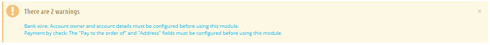
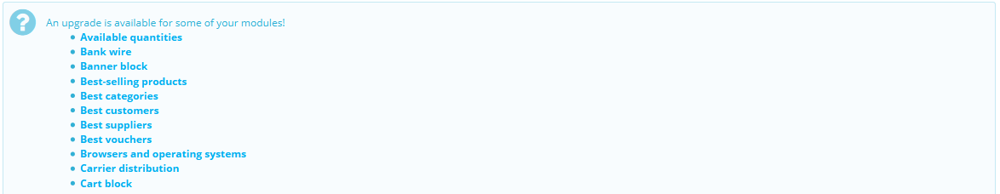
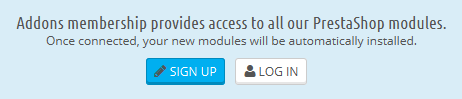
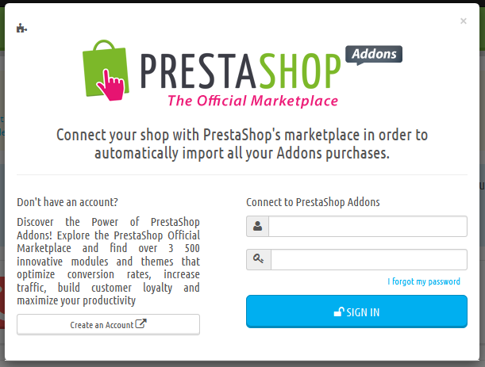
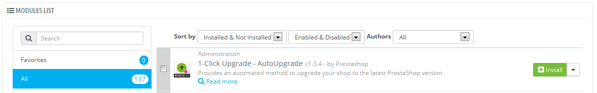
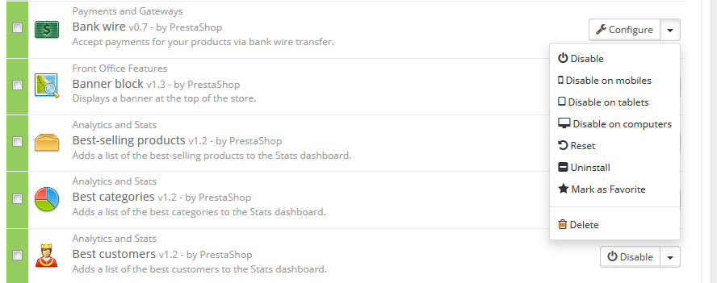
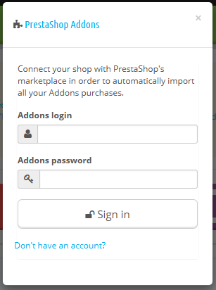
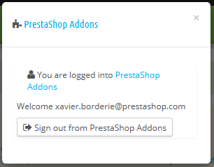

# Module

Die Seite "Module" unter dem Menüpunkt "Module" ermöglicht den Zugriff auf die Liste der Module. Auf dieser Seite können Sie Module installieren, deinstallieren, konfigurieren und aktualisieren. Alle nativen Module werden ausführlich in einem eigenen Kapitel erläutert, "Die nativen Module". Dieses Kapitel erklärt einfach, wie die Module-Seite funktioniert.

## Modul-Benachrichtigungen 

Unter dem Seitentitel erhalten Sie Benachrichtigungen und Warnungen zu installierten Modulen. Meistens helfen diese Benachrichtigungen, die Konfiguration eines Moduls abzuschließen, weil es noch nicht voll funktionsfähig ist: Durch Aktualisierung sollte die Meldung verschwinden ... und Ihr Modul richtig funktionieren.

Wenn einem Ihrer Module ein Update zur Verfügung steht, wird PrestaShop Sie darüber informieren, außerdem erscheint der Button "Alles aktualisieren" im obersten Bereich der Seite. Klicken Sie auf diese Schaltfläche, um sie alle zu aktualisieren.

## PrestaShop Addons 

PrestaShop Addons User haben die größten Vorteile, wenn es um das Management von Modulen geht. Wenn Sie erst einmal PrestaShop mit Ihrem Addons-Konto verbunden haben, werden die Module die Sie auf Addons erhalten, automatisch installiert und aktualisiert.

PrestaShop Addons ist der zentrale Marktplatz, wo Sie neue Module und Templates für Ihren Shop bekommen. Die Erstellung eines Kontos ist kostenlos, klicken Sie einfach auf den "Registrieren"-Button, der Sie hierhin weiterleiten wird: [https://addons.prestashop.com/en/login#createnow](https://addons.prestashop.com/en/login#createnow)

Wenn Sie bereits ein Addons-Konto haben, klicken Sie auf "Anmelden", um das Anmeldefenster zu öffnen.

Geben Sie Ihre Anmeldeinformationen ein und klicken auf "Anmelden": Ihre Installation von PrestaShop ist jetzt mit Ihrem Addons-Konto verbunden und vergleicht Ihre lokalen Module mit denen des Addons-Marktplatzes, um sicherzustellen, jedes Addon zur Verfügung und auf dem neuesten Stand zu halten!

## Die Modul-Liste 

In dieser Liste können Sie das Modul, das Sie installieren oder dessen Einstellungen Sie bearbeiten möchten, schnell finden.

Im ersten Abschnitt können Sie nach einem bestimmten Modul suchen oder Module filtern, bis Sie diejenigen, die Sie suchen, finden.

* **Suchfeld**. Module werden ihrer Eingabe entsprechend immer sofort angezeigt.
* **Filtern nach**. Die Liste aktualisiert sich automatisch, wenn Sie eine Auswahl treffen, und zeigt Module nach all den aktuellen Einstellungen an.\

  * **Installiert & Nicht installiert**. Meistens wollen Sie ein installiertes Modul konfigurieren oder ein anderes installieren. Dieser Filter ist der am häufigsten verwendete.
  * **Aktiviert und Deaktiviert**. Installierte Module sind die einzigen, die konfiguriert werden können.
  * &#x20;**Autoren**. Sie können die Module nach Autor zu filtern. Standardmäßig werden nur "PrestaShop"-Module zur Verfügung stehen, wenn Sie weitere Module hinzufügen, wird sich dieser Filter als sehr nützlich erweisen.

Auf der linken Seite ist eine Liste aller Modulkategorien, für jede steht die Anzahl der jeweils verfügbaren Module in Klammern. Klicken Sie auf eine Kategorie, um die Module zu dieser Kategorie anzuzeigen.\
&#x20;Eine der Kategorien heißt "Favoriten" und ist standardmäßig leer. Dies ermöglicht Ihnen, die Module, die Sie am häufigsten verwenden, zu sammeln und schnell auf sie zuzugreifen. Sie können Ihre Lieblings-Module mit dem Button "Zu Favoriten hinzufügen" als Favorit markieren.

Module können einen von 4 Status haben:

* Nicht installiert.
* Installiert aber deaktiviert.
* installiert und aktiviert.
* installiert und aktiviert, aber mit Warnungen.

Einige Module haben ein "Beliebt"-Abzeichen. Diese Module sind von der Addons-Website. Sie sind nicht kostenlos: die Schaltfläche "Installieren" wird von einem Einkaufswagen-Button ersetzt, markiert mit dem Preis des Moduls. Durch Klicken auf diese Schaltfläche, öffnet sich die Seite des Moduls auf der Addons-Website, wo Sie das Modul kaufen können.

Unterschied zwischen deaktivieren und deinstallieren

Wenn Sie keine Verwendung mehr für ein Modul haben, können Sie es entweder deaktivieren oder deinstallieren. Die Ergebnisse der beiden Aktionen sind für Sie die gleichen: das Modul ist nicht mehr vorhanden, die Konfiguration wird nicht mehr in Ihrem Back-Office angezeigt und es gibt keinen Einfluss auf das Front-End mehr.

Der Unterschied ist, dass Deaktivieren eines Moduls seine Konfiguration für eine spätere Wiederverwendung speichert, während die Deinstallation alle seine Konfigurationen und Datenbankdaten entfernt.

Deshalb sollten Sie ein Modul nur deinstallieren, wenn Ihnen die Konfiguration unwichtig ist oder Sie sicher sind, dass Sie es nicht brauchen. Wenn Sie wirklich sicher sind, dass Sie nicht möchten, dass dieses Modul in Ihrem Shop ist, können Sie auch auf den Link "Löschen" klicken.

## Anwenden  von Aktionen auf Module 

Hier sind die verfügbaren Aktionen je nach Status des Moduls:

* **Nicht installiere Module**:\

  * **Installieren**. Dadurch wird die Installation des Moduls auf Ihre PrestaShop Installation gestartet. Das Modul wird automatisch aktiviert.
  * **Zu Favoriten hinzufügen**. Dadurch wird das Modul zu Ihrer Favoritenliste hinzugefügt.
* **Installierte Module**:\

  * **Einstellungen**. Einige Module verfügen über eine Einstellungsseite. In diesem Fall zeigen sie den Button "Einstellungen", der zu einer neuen Seite weiterleitet, wo der Benutzer alle Einstellungen vornehmen kann.
  * **Deaktivieren**. Nach der Installation wird ein Modul standardmäßig aktiviert. Sie können es deaktivieren, um es aus Ihrem Back-Office zu entfernen, ohne jedoch die Einstellungen dafür zu löschen.\

    * &#x20;**Auf mobilen Geräten deaktivieren**. Dies wird die Front-Office-Ansicht des Moduls nur für mobile Geräte (Smartphones, etc.) deaktivieren.
    * **Auf Tablets deaktivieren**. Dies wird die Front-Office-Ansicht des Moduls nur für Tablets deaktivieren.
    * &#x20;**Auf PCs deaktivieren**. Dies wird die Front-Office-Ansicht des Moduls nur für Desktop-Computer deaktivieren.
  * **Reset**. Dies wird die Einstellungen des Moduls auf die Standardeinstellungen zurücksetzen.
  * **Deinstallieren**. Dadurch wird das Modul deaktiviert und seine Daten gelöscht.
  * **Zu Favoriten hinzufügen**. Dadurch wird das Modul zu Ihrer Favoritenliste hinzugefügt.
  * **Löschen**. Dadurch wird das Modul von der Modul-Liste entfernt und seine Dateien und Ordner von Ihrem Server gelöscht.

Top-Ranked-Module von Addons können auf Ihrer Modulliste angezeigt werden, abhängig von Ihren Ländereinstellungen. Sie erscheinen unter den regulären Modulen, aber ihre Buttons sind nicht mit "Installieren" gekennzeichnet, sondern zum Beispiel mit "30 €". Mit einem Klick auf den Button gelangen Sie zur Addons-Seite des Moduls, von der aus Sie sich anmelden und das Modul kaufen herunterladen können. Daraufhin können Sie es in Ihrem Shop installieren.

## Mit Addons verbinden 

In der Grundkonfiguration können Sie nur Standardmodule updaten, also diejenigen, die bereits in PrestaShop enthalten sind. Wenn Sie Module auf Addons, dem PrestaShop-Marktplatz, gekauft haben, und Sie diese automatisch zu aktualisieren möchten, müssen Sie PrestaShop mit Addons verbinden.

Klicken Sie auf den Link "Melden Sie sich beim Prestashop Marktplatz an" am oberen Rand des Bildschirms: dies wird ein Login-Fenster mit einem Formular öffnen. Füllen Sie einfach das Formular mit Ihren Addons Login-Daten aus und PrestaShop wird die Module, die Sie gekauft haben, erkennen. Klicken Sie erneut auf den Link und PrestaShop zeigt Ihr Konto an.

|  |  |
| ------------------------------------------ | ------------------------------------------ |

Wenn sich Module, die Sie bei Addons gekauft haben, nicht automatisch aktualisieren, überprüfen Sie, ob Sie auch wirklich eingeloggt sind.
