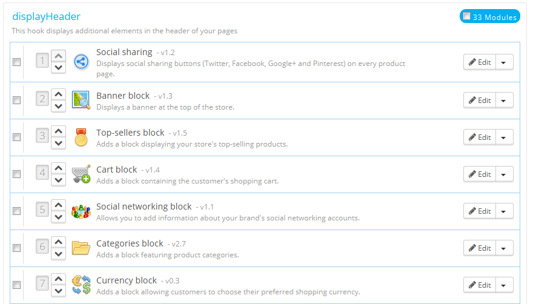
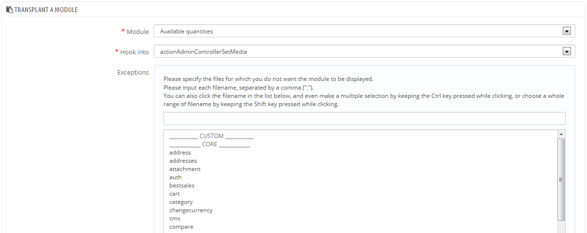
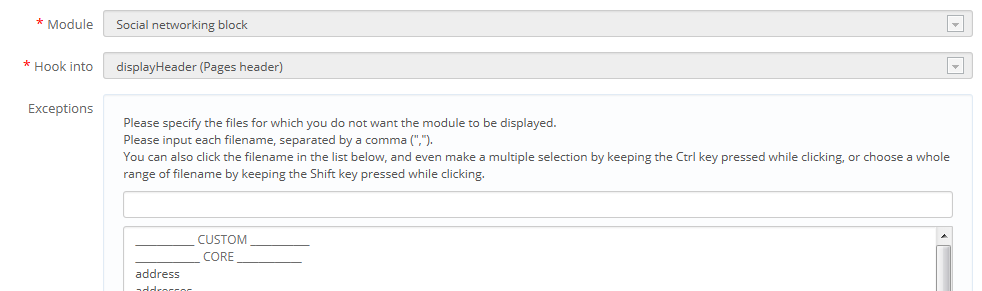
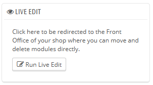
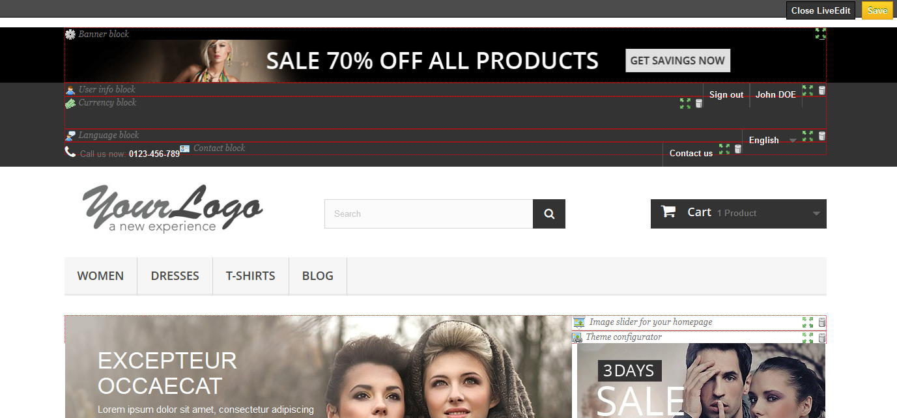

# Positionen

/\*\<!\[CDATA\[\*/\
div.rbtoc1597071534483 {padding: 0px;}\
div.rbtoc1597071534483 ul {list-style: disc;margin-left: 0px;}\
div.rbtoc1597071534483 li {margin-left: 0px;padding-left: 0px;}\
\
/\*]]>\*/

* [Positionen im Front-Office konfigurieren](positionen.md#Positionen-PositionenimFront-Officekonfigurieren)
  * [Verschieben eines Moduls innerhalb eines Hooks](positionen.md#Positionen-VerschiebeneinesModulsinnerhalbeinesHooks)
  * [Anbringen eines Moduls an einem Hook: Das Hinzufügen](positionen.md#Positionen-AnbringeneinesModulsaneinemHook:DasHinzufügen)
  * [Bearbeiten eines verbundenen Moduls](positionen.md#Positionen-BearbeiteneinesverbundenenModuls)
  * [Entfernen eines Moduls von einem Hook](positionen.md#Positionen-EntferneneinesModulsvoneinemHook)
  * [Verschieben eines Moduls mit Vorschau: Live Edit](positionen.md#Positionen-VerschiebeneinesModulsmitVorschau:LiveEdit)
    * [Wohin kann man Module bewegen?](positionen.md#Positionen-WohinkannmanModulebewegen?)
  * [Hinzufügen eines Moduls, durch Modifikation seines Codes](positionen.md#Positionen-HinzufügeneinesModuls,durchModifikationseinesCodes)

Module können auf zwei Weisen gesehen werden: im Back-Office (Optionen bzw. Konfigurationsfenster) und im Front-Office. Die Front-Office-Ansicht zeigt, wie und wo das Modul innerhalb eines Templates Ihres Shops angezeigt wird.

Die Position eines Moduls in Ihrem Template kann geändert werden, weil Sie vielleicht einen Modulblock an einer viel höheren (oder niedrigeren) Stelle auf der Seite haben möchten, als andere. Dies können Sie auf der Seite "Positionen" unter dem Menüpunkt "Module" durchführen. Dies ermöglicht Ihnen, ein Modul an einem bestimmten Hook im aktuellen Template zu befestigen, ohne Code schreiben.

Die "Positionen" Seite zeigt alle verfügbaren Hooks und ihre verknüpften Module. Viele sind standardmäßig leer, dafür haben einige der nützlichsten Hooks schon dutzende Module (Der Hook „Header“ hat standardmäßig 33 Module).



Am oberen Rand der Seite können Sie durch ein Dropdown-Menü die Hooks anzeigen, für die Sie sich interessieren.\
Standardmäßig werden nur Hooks angezeigt, die positionierbar sind. Durch ankreuzen des Felds "Unsichtbare Hooks anzeigen" sehen Sie alle Hooks, auch die, die nicht positionierbar sind.

Die Kopfzeile der Tabelle für jeden Hook zeigt den Hook-Namen, seinen technischen Namen (und für einige, eine kurze Beschreibung) und die Zahl der angeschlossenen Module. Die Tabelle listet die Module, die mit diesem Hooks verknüpft sind.

Die Module werden in der Reihenfolge, in der sie im Hook erscheinen, angezeigt.

## Verschieben eines Moduls innerhalb eines Hooks <a href="#positionen-verschiebeneinesmodulsinnerhalbeineshooks" id="positionen-verschiebeneinesmodulsinnerhalbeineshooks"></a>

Sie haben zwei Möglichkeiten, die Position eines Moduls innerhalb eines Hooks zu ändern:

* Klicken Sie auf den Aufwärts- oder Abwärtspfeil. Die Seite wird neu geladen und zeigt die neue Anordnung an.
* Ziehen Sie selbst die Zeile des Moduls:\

  1. Stellen Sie den Mauszeiger auf die Positionsnummer, um ihn in einen "move Point"-Cursor zu ändern.
  2. Klicken Sie und halten Sie die Maustaste gedrückt, während Sie den Cursor über die Zeile / Position setzen, an der Sie das Modul haben möchten: die Zeile des Moduls wird entsprechend geändert.
  3. Lassen Sie die Maustaste los, damit die aktuelle Position für das Modul gespeichert wird.

Für die meisten Module kann die Verschiebung ganz einfach direkt über das Backoffice durchgeführt werden. Einige Module benötigen eine Codeänderung, um sie verschieben zu können.

## Anbringen eines Moduls an einem Hook: Das Hinzufügen <a href="#positionen-anbringeneinesmodulsaneinemhook-dashinzufuegen" id="positionen-anbringeneinesmodulsaneinemhook-dashinzufuegen"></a>

Sie können ein Modul an mehr als nur einem Hook anbringen.

Zwei Dinge, die Sie vor dem Hinzufügen eines Moduls wissen sollten:

* Einige Module sind geschrieben worden, damit sie nur an bestimmte Hooks passen.
* Einige Hooks sind so geschrieben, dass sie bestimmte Module nicht akzeptieren.

Daher sollten Sie beachten, dass man nicht jedes Modul mit jedem Hook verbinden kann.

Achten Sie darauf, den Cache zu deaktivieren, wenn Sie ein neues Modul im Front-End testen möchten. Dies können Sie in auf der Seite "Leistung" im Menü "Erweiterte Einstellungen" tun.

Das Hinzufügen hat seine eigene Benutzeroberfläche:

1. Navigieren Sie zum Menü "Module" auf die "Positionen" Seite.
2. Klicken Sie auf "Modul hinzufügen" oben rechts. Die neue Benutzeroberfläche wird angezeigt.
3. Wählen Sie In der "Module" Dropdown-Liste das Modul, das Sie hinzufügen möchten.
4. Wählen Sie In der "Hook" Dropdown-Liste, wo Sie das Modul hinzufügen möchten. Es stehen viele Hooks zur Verfügung. Sie können Ihre Einstellungen später bei Bedarf ändern.
5. Sie können eine Mehrfachauswahl durchführen, indem Sie einfach auf den Dateinamen klicken, während die Strg-Taste gedrückt halten. Sie können Dateien auf die gleiche Weise deaktivieren: Strg + klicken.
6. Vergessen Sie nicht, die Änderungen zu speichern.



Das "Übertragung zu"-Drop-Down-Menü gibt Ihnen einen guten Überblick darüber, wo Module platziert werden können.

Auch wenn die "Übertragung zu"-Dropdown-Liste gibt einen umfassenden Überblick über die verfügbaren Hooks gibt, könnte nicht immer klar sein, welcher der ist, an dem Sie Ihr Modul anbringen wollen. Zögern Sie nicht, einen weiteren Hook zu versuchen, wenn das Ergebnis der Auswahl nicht das ist, was Sie erwartet haben.

Die Liste gibt einige Details: einige Hooks enthalten eine Beschreibung nach deren Namen, zum Beispiel "Add fields to the form 'attribute value'" für displayAttributeForm. Betrachten sie alle Hooks genauer, um den Richtigen zu wählen.

## Bearbeiten eines verbundenen Moduls <a href="#positionen-bearbeiteneinesverbundenenmoduls" id="positionen-bearbeiteneinesverbundenenmoduls"></a>

Jedes Modul verfügt über zwei Symbole auf der rechten Seite der Reihe: eines, um die Einstellungen zu bearbeiten, das andere, um das Modul zu löschen.

Bearbeiten von Einstellungen für ein Modul verwendet die gleiche Benutzeroberfläche, wie die für das Hinzufügen eines Moduls. Der Hauptunterschied ist, dass Sie nicht das Module und das "Übertragung zu"-Feld ändern können, diese sind deaktiviert, und somit ausgegraut. Sie können nur die Ausnahme-Einstellung ändern, die ebenso wie bei "Modul hinzufügen", weiter oben beschrieben, funktioniert.\
Sie können zwar die "Modul"- und "Übertragung zu"-Felder nicht ändern, sie dienen aber als eine praktische Erinnerung über aktuelle Position und Funktion, sollten Sie die Ausnahmen später wieder ändern wollen.



Wenn Sie ein Modul einem anderen Hook hinzufügen möchten, müssen Sie das „Hinzufügen“-Interface verwenden:

1. Klicken Sie auf "Modul hinzufügen" oben rechts. Die Hinzufügen-Benutzeroberfläche wird angezeigt.
2. Wählen Sie In der "Module" Dropdown-Liste das Modul, dem Sie einen anderen Hook zuweisen möchten.
3. Wählen Sie In der "Übertragung zu"-Dropdown-Liste, wohin Sie das Modul verweisen möchten.
4. Geben Sie Im Feld "Ausnahmen" den(die) Namen der Datei (en) der Seiten an, in denen Sie nicht möchten, dass das Modul erscheint.
5. Speichern Sie Ihre Änderungen. Die Hook-Liste erscheint.
6. Navigieren Sie zum Hook, dem Sie das Modul hinzugefügt haben: es sollte dort angezeigt werden. Verändern Sie seine Position, wenn nötig.
7. Navigieren Sie zum Hook, wo das Modul vorher war und klicken Sie auf das Papierkorb-Symbol, um es aus diesem Hook zu entfernen. Dies verhindert, dass das gleiche Modul zweimal angezeigt wird.

Kontrollieren Sie immer Ihr Front-Office, um sicherzustellen, dass das Modul auch dort ist, wo es sein soll.

## Entfernen eines Moduls von einem Hook <a href="#positionen-entferneneinesmodulsvoneinemhook" id="positionen-entferneneinesmodulsvoneinemhook"></a>

Es gibt zwei Möglichkeiten, ein Modul von einem Hook zu entfernen:

* Entfernen eines einzelnen Moduls: Klicken Sie auf die Papierkorb-Symbol auf der rechten Seite der Zeile des Moduls.
* Entfernen einer Menge von Modulen: Wählen Sie die Module, indem Sie die Boxen auf der linken Seite markieren und klicken Sie dann auf "ausgewählte Objekte entfernen", am oberen und unteren Rand der Liste.

## Verschieben eines Moduls mit Vorschau: Live Edit <a href="#positionen-verschiebeneinesmodulsmitvorschau-liveedit" id="positionen-verschiebeneinesmodulsmitvorschau-liveedit"></a>

Eine weitere Möglichkeit, Module im Front-Office des Shops zu verschieben ist der Live Edit-Modus, der die Seiten in ein Tool einbettet, mit dem Sie visuell entscheiden können, wo Sie Ihre Module platzieren können und wollen. Sie können von der "Positionen"-Seite darauf zugreifen, indem Sie auf die Schaltfläche "Live Edit" klicken.



Wenn Sie darauf klicken, öffnet sich PrestaShop in einem neuen Browser-Fenster / Tab, mit dem Live Edit-Skript:

* Alle Modulblöcke haben eine rot gepunktete Umrandung, so dass Sie sehen können, welche Blöcke bewegt werden können.
* An deren oberen linken Seite erscheint ein blockspezifischen Symbol, zusammen mit den Namen des Blocks, so dass Sie sich immer orientieren können.
* Am oberen rechten Rand Seite sind zwei Symbole:\

  1. &#x20;Ein Symbol "bewegen": klicken Sie darauf, um das Modul zu bewegen.
  2. Ein Symbol "Papierkorb": Klicken Sie, um den Block zu entfernen.



Am Kopf des Live Edit-Modus befindet sich eine Symbolleiste mit zwei Buttons: "Live Edit beenden" und "Speichern".

„Speichern“ ist selbsterklärend; „Live Edit beenden“ verwirft alle Änderungen, die Sie vielleicht Ihre Module 'Position während dieser Live-Bearbeitungssitzung vorgenommen haben.

Sobald Sie ein Modul entfernt haben, müssen Sie auf die "Positionen"-Seite gehen und auf "Modul hinzufügen" klicken, wenn Sie es wieder haben möchten.

### Wohin kann man Module bewegen? <a href="#positionen-wohinkannmanmodulebewegen" id="positionen-wohinkannmanmodulebewegen"></a>

Module können nicht einfach überall bewegt werden: es hängt sowohl von den Hooks des Templates ab, als auch von den Hooks, die jedes Moduls unterstützt(wie im obigen Abschnitt zu sehen). Daher können Sie meistens nur Module in deren Kontext bewegen: Spalten-Module können nur innerhalb einer Spalte und von einer Spalte in die andere (von rechts nach links, zum Beispiel) bewegt werden, während normale Homepage Module (die, in der Mitte) nur innerhalb ihrer jeweiligen Spalte verschoben werden können.

Um Ihnen einen visuellen Hinweis darauf zu geben, wohin ein bestimmtes Modul bewegt werden kann, wird ein leerer grüner Block angezeigt, wenn die Position korrekt ist, und ein leerer roter Block, wenn nicht.

## Hinzufügen eines Moduls, durch Modifikation seines Codes <a href="#positionen-hinzufuegeneinesmoduls-durchmodifikationseinescodes" id="positionen-hinzufuegeneinesmoduls-durchmodifikationseinescodes"></a>

Dies ist nur für Experten: Sie müssen eine gute Kenntnis der PHP und HTML haben, bevor Sie sich mit dem Code eines Moduls beschäftigen.

Einige Module können nicht in anderen Abschnitten des Front-Office hinzugefügt werden, nur weil ihnen der notwendige Code fehlt.

Der "Schnellsuche" Block (/ blocksearch) enthält zum Beispiel Vorlagen für column- und Header-Display, während der "Währungen" Block (/ blockcurrencies) eine Vorlagendatei hat, die nur mit dem Header-Abschnitt arbeitet. Ebenso ist kann der "Featured Products" Block (/ homefeatured) standardmäßig nur im Zentrum der Haupt-Seite platziert werden.

Wenn Sie einfache Module wie den "Währungen" Block an einer Position anzeigen möchten, für die es nicht geschrieben wurde, müssen Sie seine Template-Dateien bearbeiten.\
Komplexere Module, wie beispielsweise der "Featured" Block können auch bearbeitet werden, um in anderen Abschnitten der Seite angezeigt zu werden, aber es könnte sein, dass diese teilweise umgeschrieben werden müssen, damit ihr Design an dieser neuen Position funktioniert.

Um die „Übertragen zu“-Fähigkeit eines Moduls anzupassen, müssen Sie ihm die richtige PHP-Funktion den neuen Hook geben. Zum Beispiel hat der "Währungen"-Block diese Funktion:

```
function hookTop($params)
  {
  ...
  }
```

Um den "Währungen"-Block in der rechten Spalte einzusetzen, müssen Sie zum Beispiel die Funktion hookRightColumn() hinzufügen:

```
function hookRightColumn($params)
  {
  ...
  }
```

Danach müssen Sie den Code, der den Inhalt auf der Seite anzeigt, schreiben. Im besten Fall bedeutet das, den Inhalt der hookTop() Funktion kopieren und einfügen; im schlimmsten Fall, müssen Sie den Inhalt der hooktop() –Funktion in etwas umschreiben, das für den Platz funktioniert.
