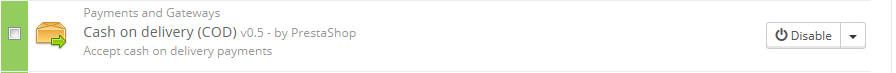
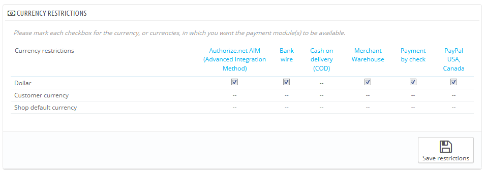
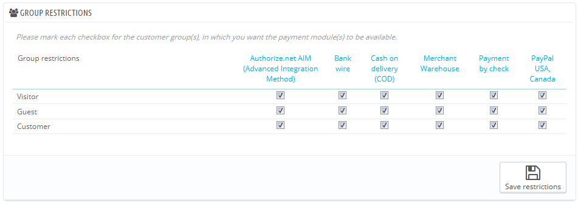
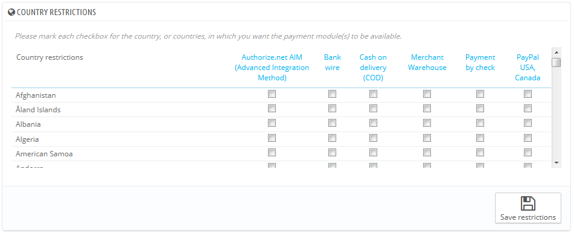

# Zahlungsart

Mit PrestaShop können Sie Geldtransaktionen Ihrer Kunden mit mehreren verschiedenen Zahlungsmethoden, wie Schecks, Banküberweisung, Nachnahme, und durch mehrere Partnermodule wie PayPal, Moneybookers, HiPay etc. akzeptieren.

Auf der "Zahlungsart"-Seite können Sie die folgenden Abschnitte sehen:

* **Modul-Liste**. Im Grunde eine Abkürzung zum Abschnitt "Zahlung" der Modulliste, auf der Seite „Module“.&#x20;
* drei Abschnitte "Beschränkungen":\

  * **Währungsbeschränkungen**. Wählen Sie, mit welchen Währungen Ihre installierten Zahlungsmodule funktionieren sollen.
  * **Gruppenbeschränkungen**. Wählen Sie, mit welchen Benutzergruppen Ihre installierten Zahlungsmodule funktionieren sollen.
  * **Länderbeschränkungen**. Wählen Sie, mit welchen Ländern Ihre installierten Zahlungsmodule funktionieren sollen.

## Installieren eines Zahlungsmoduls 

Installieren eines Zahlungsmoduls ist im Grunde nicht anders als die Installation eines regulären Moduls: klicken Sie einfach auf die Schaltfläche "Installieren" und konfigurieren es anschließend.

Sie sollten große Aufmerksamkeit auf die Einstellungen zu Zahlungsmodulen legen, um sicherzustellen, dass diese auch auf Ihre Adresse oder Bankkonto zeigen. Konfigurieren der Zahlungsmodule bedeutet oft, dass Sie zuerst beim Zahlungsdienstleister registriert sein müssen, was bedeutet, dass Sie bei diesen ein Konto haben müssen.

Installieren wir als Beispiel das "cashondelivery" -Modul. Finden Sie das Modul in der Liste und klicken Sie auf die Schaltfläche "Installieren". PrestaShop wird sich um alles kümmern, Sie auf die Seite mit der Liste aller Module schicken und Sie über das Ergebnis der Installation unterrichten. Wenn zum Beispiel ein Modul konfiguriert werden muss, bevor es arbeiten kann, wird PrestaShop ihnen eine Benachrichtigung ganz oben auf der Seite anzeigen. Im Fall des "Nachnahme" Moduls gibt es nichts zu konfigurieren.

## Zahlungsmodule: Währungsbeschränkungen 

Je nach Zahlung kann die Wahl der Währung des Kunden abweichen.

YoSie können die Auswahl der verfügbaren Zahlungsmethoden in Abhängigkeit von den verfügbaren Währungen begrenzen: Wenn Sie wollen, dass Kunden in der Lage sind, mit jeder beliebigen Währung zu zahlen, wenn Sie mit PayPal bezahlen, aber diejenigen mit Moneybookers z.B. nur in Dollar zahlen sollen, zum Beispiel.

Standardmäßig ist nur die Standardwährung in Ihrem Shop verfügbar. Wenn Sie mehr benötigen, folgen Sie diesem Prozess:

1. Im Menü "Lokalisierung" unter dem Menüpunkt "Lokalisierung" können Sie das Lokalisierungspaket für das Land, dessen Währung Sie akzeptieren wollen, importieren. Zum Beispiel, USA für US-Dollar, Großbritannien für UK Pound usw.
2. Auf der "Währungen"-Seite unter dem Menüpunkt "Lokalisierung" können Sie die Währungen, die Sie gerade importiert haben, sehen.

Wenn Sie ein Zahlungsmodul Nutzung nach Währung des Benutzers einschränken wollen, füllen Sie einfach die jeweiligen Kontrollkästchen und klicken Sie auf „speichern“.

Beachten Sie, die Währungsbeschränkungen arbeiten auf unterschiedliche Weise, je nach Zahlungsmodul:

* Für einige, wie Nachnahme, können Sie keine Standardeinstellungen ändern.
* Für andere, wie Banküberweisung, Zahlung per Scheck, Skrill, Ogone, etc., können Sie die Währungseinstellungen, mit Ausnahme der "Währung des Kunden" und "Standard-Währung" ändern, die in ihrem Standardzustand bleiben müssen.
* Für andere Module wie Hipay oder PayPal können Sie alle ihre Währungseinstellungen ändern, aber Sie können nur eine Option, "Währung des Kunden" oder "Standard-Währung", aber nicht beide gleichzeitig wählen.

Der Kunde kann seine oder ihre Währung über das Drop-Down-Menü am oberen Rand jeder Front-Office-Seite ändern.

Sie können die Standardwährung des Shops auf der "Lokalisierung"-Seite unter dem Menüpunkt "Lokalisierung" festlegen.

Wenn Sie die Standard-Währung eingestellt haben, nachdem Sie schon einige Preise festgelegt haben, müssen Sie den Preis für alle diese Artikel zurückzusetzen. Sie sollten die Standard-Währung ein für alle Mal festlegen, bevor Sie irgendeinen Artikelpreis setzen.

## Zahlungsmodule: Gruppenbeschränkungen 

Sie können die Auswahl der verfügbaren Zahlungsmethoden in Abhängigkeit von der Kundengruppe begrenzen: Man kann eine bestimmte Anzahl von Kundengruppen festlegen, deren Mitglieder Zugang zu mehr Zahlungsmethoden haben, als normale Kunden.

Beispielsweise könnten Sie festlegen, dass normale Kunden mit PayPal, Moneybookers und Hipay zahlen können, während professionelle oder Großkunden nur in der Lage sind, per Banküberweisung zu bezahlen. Je nach Art der Kunden und von Ihrer Auswahl werden die Kunden nur unter Verwendung der Verfahren zahlen können, die Ihren Entscheidungen entsprechen.

## Zahlungsmodule: Länderbeschränkung 

Sie können die Wahl der Zahlungsmittel nach Herkunftsland Ihrer Kunden zu begrenzen. Zum Beispiel könnten Sie wählen, alle Zahlungsmethoden für Kunden aus Frankreich, Spanien und Deutschland zu akzeptieren, während die Kunden aus Italien, dem Vereinigten Königreich und der Schweiz nur in der Lage sein sollen, per Banküberweisung zu bezahlen.

In der Tabelle sind alle bekannten Länder. Wenn eines fehlt, können Sie es mit Hilfe der "Länder" Seite unter dem Menü "Lokalisierung" hinzufügen.

Auch hier gilt, genau wie bei Währungsbeschränkungen, die verfügbaren Optionen variieren je nach Zahlungsmodul:

* Für manche ist die einzige Möglichkeit Ihr eigenes Land.
* Für andere wird nur eine Reihe von Ländern vom Dienst unterstützt, z.B. : Österreich, Belgien, Frankreich, usw.
* Alle anderen nativen Zahlungsmodule sollten mit allen Ländern funktionieren.

Suchen Sie das gewünschte Land durch die alphabetische Liste, und aktivieren oder deaktivieren Sie die Kontrollkästchen der Zahlungsmethoden, um zu entscheiden, ob Sie diese den Kunden aus diesem Land zur Verfügung stellen möchten. Sobald alle Einstellungen konfiguriert wurden, klicken Sie auf "Speichern" am unteren Ende der Tabelle.

Standardmäßig werden alle installierten Zahlungsmethoden für Land des Shops ermöglicht.
