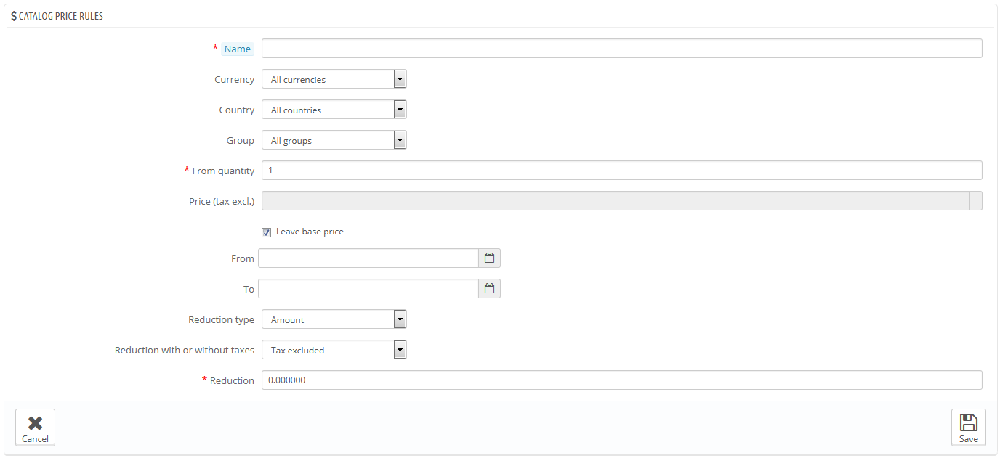
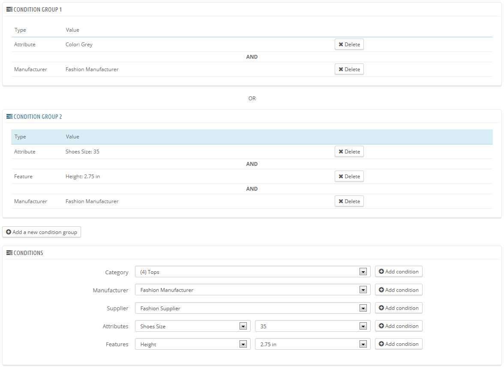

# Katalog Preisregeln

Katalog Preisregeln ermöglichen es Ihnen, Preissenkungen nach Kategorie, Hersteller, Lieferant, Variante oder Eigenschaft zu veranlassen. Diese Art von Regeln gilt für eine ganze Produktpalette, sie können nicht für einen einzelnen Artikel verwendet werden. Wenn Sie einen Rabatt auf ein einzelnes Produkt anwenden wollen, müssen Sie stattdessen eine Warenkorb Preisregel erstellen, oder einen bestimmten Preis in der Artikelkonfiguration festlegen (im "Preis"-Tab).

Beispielsweise können Sie eine Regel erstellen, die festlegt, dass spanische Kunden, die zu der "Good-Clients"-Gruppe gehören, 10% auf die Kategorie „Elektronik“ und auf alle Sony-Produkte für die erste Juli-Woche hat.

Die Seite "Katalog Preisregeln" listet die derzeit bestehenden Regeln, die Sie bearbeiten oder löschen können, indem Sie auf das Symbol „bearbeiten“ klicken. Wenn Sie eine Regel deaktivieren möchten, setzen Sie einfach das Enddatum auf den Tag vor.

## Erstellen einer neuen Katalog Preisregel 

Die Erstellungsseite hat zwei Abschnitte, mit denen Sie präzise neue Regeln erstellen.

### Die Regel spezifizieren 

Der erste Teil ist leicht zu verstehen.

Hier können Sie die Grundeinstellungen und andere Details festlegen.

* **Name**. Der Name ist öffentlich, Sie sollten ihn sprechend gestalten.
* **Shop**. Nur im Multishop-Modus verfügbar. Die Regel gilt für Kunden, die in einem bestimmten Ihrer Shops einkaufen. Nur verfügbar, wenn Sie mindestens zwei Shops haben.
* **Währung**. Die Regel gilt für Kunden, die mit einer bestimmten Währung zahlen.
* **Land**. Die Regel gilt für Kunden aus einem bestimmten Land.
* **Gruppe**. Die Regel gilt für Kunden, die zu einer bestimmten Kundengruppe gehören.
* **Mindestmenge**. Die Regel gilt für Bestellungen, bei denen eine bestimmte Anzahl von den entsprechenden Artikeln bestellt wurde.
* **Verkaufspreis netto.** Standardmäßig wird der Grundpreis des Artikels genutzt.
* **Von und Bis**. Die Regel gilt in diesem Zeitraum.
* **Ermäßigungsart**. Der Rabatt kann entweder ein Geldbetrag oder einen Prozentsatz der Bestellsumme sein.
* **Ermäßigung inkl. Oder ohne MwSt**. Der Rabatt kann entweder vor oder nach der Steuer gelten.
* **Ermäßigung**. Der Wert des Rabatts. Je nach "Ermäßigungsart" oben, kann "10,0" entweder "10€ Rabatt" (je nach Währung) oder "10%" Rabatt bedeuten.

Selbstverständlich können Sie alle diese Regeln kombinieren.

### Bedingungen 

Der Abschnitt "Bedingungen" listet die Artikel, für die die Ermäßigung gilt. Er wird nur angezeigt, wenn Sie auf die Schaltfläche "Neue Preis-Regel" klicken.

Die Bedingungen werden in Konditionsgruppen aufgebaut, was bedeutet, dass die Ermäßigung auf viele verschiedene Artikelbereiche angewendet werden können.\
Die Bedingungen werden in einer integrativen Weise gruppiert: alle Bedingungen der Gruppe müssen gelten, damit der Rabatt angewendet wird. Daher "UND".\
Die Bedingungen zwischen Gruppen sind exklusive: nur die Bedingungen einer Gruppe müssen gelten, damit der Rabatt gewährt wird. Daher "ODER".

Die Standard-Konditionsgruppe ist leer. Sie können ihr Bedingungen hinzufügen, indem Sie das Dropdown-Menü im unteren Bereich des Abschnitts benutzen:

* Wählen Sie eine Kategorie oder eine andere Art der Auswahl, und klicken Sie auf die Schaltfläche "Kondition hinzufügen".
* Die Bedingung wird in der Konditionsgruppe angezeigt. Sie können viele weitere Bedingungen in einer Konditionsgruppe festlegen.
* Nachdem eine Gruppe fertiggestellt wurde und Sie eine neue erstellen wollen, klicken Sie auf "Neue Preis-Regel". Eine neue Gruppe erscheint, welche Sie auf die gleiche Weise füllen können.

Standardmäßig werden die neuen Bedingungen der zuletzt erstellten Gruppe hinzugefügt. Wenn Sie die Bedingungen einer vorherigen Gruppe hinzufügen müssen, klicken Sie auf diese Gruppe, um sie zu markieren.

Sie können derzeit keine Gruppen löschen.
