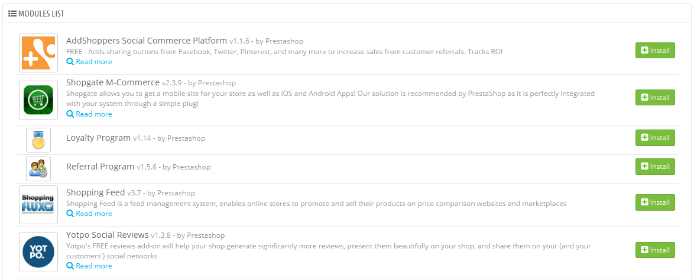

# Marketing-Addons

Diese Seite sammelt die in Bezug auf Marketing wichtigsten Module in Ihrer Installation von PrestaShop an einem Ort zusammen. Sie dient als Verknüpfung zu bestimmten Gruppen von Modulen der "Module"-Seite.

Die Module auf dieser Seite fassen die Themen "Werbung und Marketing" und "Smart Shopping" der Seite „Module“ zusammen.

Sie können Module direkt von dieser Seite aus installieren. Wenn Sie auf die Schaltfläche "Installieren" klicken, wird das Modul installiert und Sie werden auf die "Module"-Seite weitergeleitet, wo Sie das Modul konfigurieren können, indem Sie auf den entsprechenden Link "Einstellungen" klicken. Sie können diese Schritte auch auf der Seite „Marketing-Addons“ durchführen, um die Konfigurationsseite zu öffnen, das Modul zu löschen, zu deaktivieren, zurückzusetzen oder zu deinstallieren, abhängig von seinem Status.
