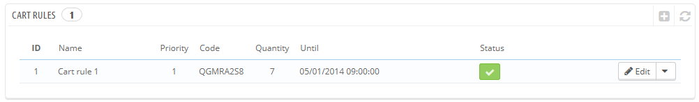
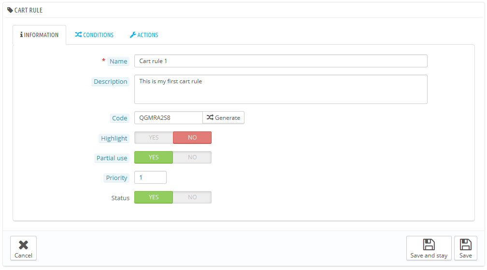
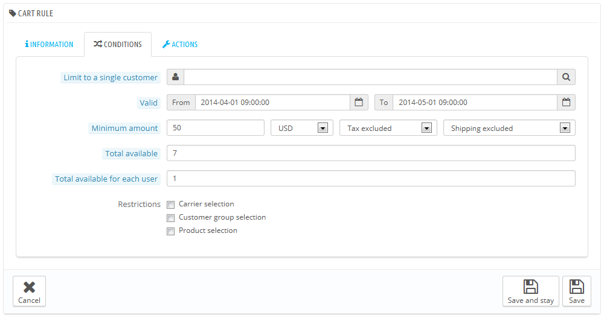
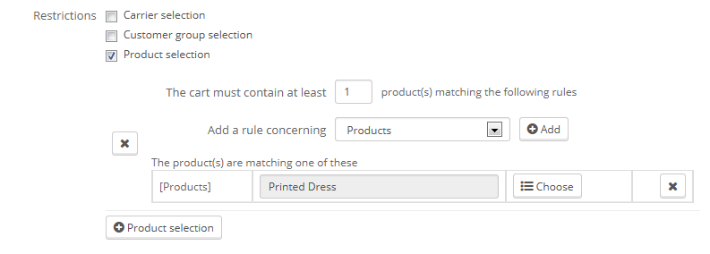
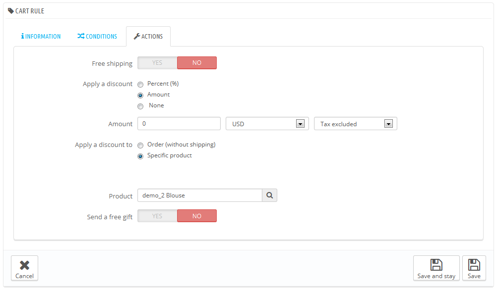
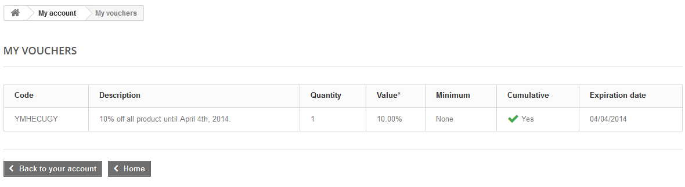
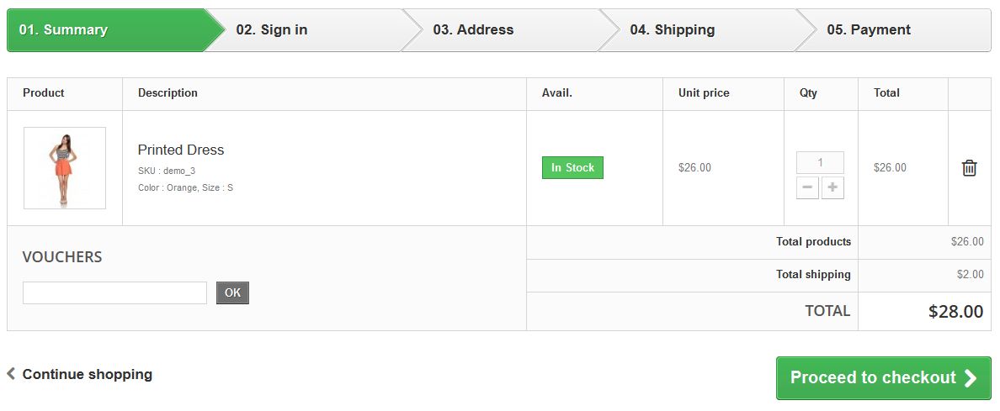
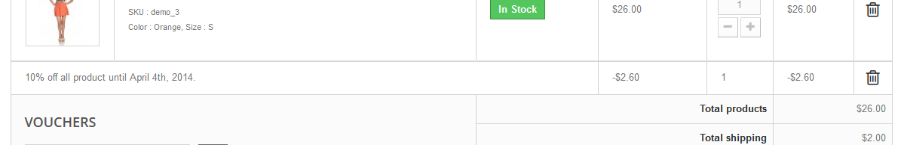

# Warenkorb Preisregeln

Die Seite "Warenkorb Preisregeln" gibt Ihnen Zugang zu einem fortschrittlichen Tool, das auf dem Gutscheinsystem von PrestaShop 1.4 aufbaut. Erfahrene Anwender von PrestaShop werden nicht von den neuen Funktionen überrascht sein, aber müssen sich an den neuen Namen gewöhnen: Wenn in diesem Handbuch Gutscheine erwähnt werden, handelt es sich eigentlich um Warenkorb Preisregeln - was sich sehr von Rückvergütungen unterscheidet.

Unterschied zwischen Rückvergütungen, Gutscheinen und Preisregeln

Eine Rückvergütung ist in erster Linie eine schriftliche Bestätigung, dass ein Artikel zurückgegeben wurde. Man kann sie als Gutschein nutzen

Ein Gutschein ist nicht an eine Warenrückgabe gebunden und kann mehr Formen als die Rückvergütung annehmen:

* Nachlass auf eine Bestellung (prozentual oder fester Wert).
* kostenloser Versand\
  \

Sie können einen Gutschein für alle Kunden, eine Kundengruppe oder einen einzelnen Kunden und das Ablaufdatum festlegen.

\
Eine Warenkorb Preisregel ist im Grunde eine erweiterte Version eines Gutscheins: zusätzlich zu dem, was ein Gutschein in PrestaShop 1.4 konnte, können Sie nun in PrestaShop 1.5 durch das Warenkorb Preisregeln-System einen Rabatt benennen:

* Einen Rabatt benennen.
* Dem Kunden zugestehen, nur einen Teil des Rabatts zu verwenden.
* Prioritäten zwischen Warenkorb Preisregeln vergeben.
* Kompatibilität zwischen Warenkorb Preisregeln setzen.
* Rabatt nur bei gewissen Versand-Diensten zulassen.
* Rabatt nur bei einer Auswahl von Produkten und / oder Kategorien und / oder Herstellern und / oder Lieferanten und / oder Varianten zulassen... oder alle zur gleichen Zeit, wenn nötig!
* Rabatt für kostenlosen Versand und / oder einen Rabatt auf eine bestimmte Bestellung und / oder ein Geschenk ... oder alles zur gleichen Zeit, wenn nötig!

In diesem Abschnitt des Handbuchs sind die Begriffe "Warenkorb Preisregel" und "Gutschein" gleichbedeutend und austauschbar.

Die Seite „Warenkorb Preisregeln“ listet die derzeit bestehenden Warenkorbregeln auf, die Sie aktivieren oder deaktivieren können, indem Sie auf Das Symbol in der Spalte „Status“ klicken.

## Erstellen einer neuen Preisregel 

Ein Gutschein kann automatisch nach einer Rücksendung eines Artikels erstellt werden, Sie können einen neuen Gutschein aber auch jederzeit manuell erstellen, mit sehr spezifischen Eigenschaften.

Das Erstellungsformular verfügt über drei Reiter, mit denen Sie neue Regeln und Gutscheine genau nach Ihren Wünschen erstellen können.

### Informationen-Tab 

Der erste Reiter, "Information", enthält Informationen zur Identifikation und Grundeinstellungen.

* **Name**. Der Name ist öffentlich, Sie sollten ihn also sprechend gestalten.
* **Beschreibung**. Die Beschreibung ist nicht öffentlich. Sie hilft Ihren Mitarbeitern zu verstehen, warum die Regel erstellt wurde.
* **Code**. Geben Sie Ihrer Regel einen eindeutigen Code. Sie können entweder einen manuellen (und daher in lesbaren Worten, wie 1VOUCH4JOE) eintragen, oder Sie lassen PrestaShop eine eindeutige Zeichenfolge erzeugen, indem Sie auf die Schaltfläche "Erzeugen" klicken. Selbstverständlich können Sie auch jeden anderen String-Generator (wie [http://www.random.org/strings/](http://www.random.org/strings/)) zu verwenden.\
  Beachten Sie, wenn kein Code festgelegt ist, wird die Regel für jeden Kunden gelten, der berechtigt ist:\

  * Wenn es einen Code gibt, dann müssen ihn Kunden während des Bestellprozesses eingeben.
  * Wenn es keinen Code gibt, wird die Regel automatisch für berechtigte Kunden gesetzt.
* Hervorheben. Wenn aktiviert, lässt PrestaShop den Kunden wissen, dass ein Gutschein entsprechend der Artikel in seinem Einkaufswagen zur Verfügung steht und hinzugefügt werden kann.
* Teilweise Nutzung erlauben. Wenn deaktiviert, kann die Regel / der Gutschein nur einmal verwendet werden, auch wenn sie/er nicht vollständig genutzt wird. Wenn aktiviert, wird ein neuer Beleg angelegt, wenn der Nachlass nicht vollständig genutzt wurde.
* Priorität. Wenn ein Kunde (oder Gruppe von Kunden) für mehr als einen Gutschein qualifiziert ist, oder mehr als ein Gutschein auf eine Bestellung angewendet werden kann, dann wendet PrestaShop die Gutschein einen nach dem anderen alphanumerischer Reihenfolge an. Standardmäßig haben alle eine Priorität von 1. Wenn Sie auf einen höheren Wert eingestellt ist, wird der Gutschein erst nach Gutscheinen mit einer geringeren Zahl angewendet.
* Status. Sie können Preisregeln deaktivieren und aktivieren, wann immer es notwendig ist.

### Bedingungen-Tab 

Der zweite Reiter "Bedingungen" enthält eine große Menge von Möglichkeiten, mit denen Sie genau festlegen können, wer von dieser Regel profitieren sollte.

* **Auf einen Kunden begrenzt**. Hier können Sie angeben, dass der Gutschein, den Sie erstellen, nur für einen bestimmten Kunden ist. Zum Beispiel wenn Sie eine Lieferverzögerung hatten und diesem Kunden einen Gutschein als Geste des guten Willens erstellen, auf den nur er oder sie zugreifen kann. Um schnell den passenden Kunden zu finden, geben Sie die ersten Buchstaben des Vornamens, Nachnamens oder seiner E-Mail in das Textfeld ein. Wenn leer, wird PrestaShop diese Regel auf keinen Kunden beschränken, außer sie haben eine Kundengruppe als weitere Bedingung hinzugefügt (siehe "Ausgewählte Kundengruppen"-Checkbox unten).
* **Gültigkeit**. Die Standard-Gültigkeit beträgt einen Monat, Sie können dies auch auf eine Woche oder nur einen Tag reduzieren.
* **Mindestbestellwert**. Der Mindestbestellwert, ab dem der Gutschein gilt. Ihr Gutschein wird erst dann gültig, wenn die Bestellung des Kunden über dem gegebenen Wert liegt. Sie können wählen, ob dieser Betrag Steuern und / oder Versandkosten enthält.
* **Insgesamt verfügbar**. Legen Sie die Menge der verfügbaren Gutscheine fest: entweder "1", wenn er für einen einzelnen Kunden bestimmt ist, oder eine beliebige Anzahl, für die ersten Kunden, die diesen Gutschein verwenden.
* **Insgesamt für jeden Benutzer verfügbar**. Sie können die Anzahl, wie oft ein Gutschein von einem Kunden verwendet werden kann, festlegen. Diese Zahl mindestens gleich der Menge der verfügbaren Gutscheine oben (Feld "Insgesamt verfügbar") sein.\

  * Wenn diese geringer als die Gesamtmenge der verfügbaren Gutscheine ist, dann ist ein einziger Kunde nicht in der Lage, alle von ihnen zu verwenden.
  * Wenn Sie den Wert auf "1" setzen, stellen Sie damit sicher, dass jeder Ihrer Kunden den Gutschein nur einmalig nutzen kann. In diesem Fall sollte man sicherzustellen, dass der Gutschein für eine Gruppe und nicht für einen einzigen Kunden gilt ...

Die Kontrollkästchen am unteren Rand des Abschnitts sind sehr wichtig, da sie helfen, Gutscheinberechtigte weiter zu filtern.

* Ausgewählte Versanddienste. Sie können einstellen, dass der Kunde nur einen Rabatt bekommt, wenn er einen bestimmten Versanddienst für die Paketzustellung auswählt.
* Ausgewählte Kundengruppen. Hier können Sie die Reichweite ihres Gutscheins noch weiter begrenzen, oder weitere Bedingungen hinzufügen.
* Kompatibilität mit anderen Warenkorb-Regeln. Standardmäßig kann eine Bestellung von einer beliebigen Anzahl an Warenkorb-Regeln profitieren. Mit dieser Option können Sie PrestaShop klar machen, dass diese Regel nicht mit einer Auswahl von anderen Regeln kombiniert werden darf. Diese Option erscheint nur, wenn Sie mehr als eine Warenkorb-Regel haben.
* Ausgewählte Artikel. Ein weiteres sehr nützliches Tool, das automatisch Gutscheine für Warenkörbe erstellt, die bestimmte Artikel enthalten. Das Tool wird im Folgenden näher erläutert.
* Ausgewählte Shops. Standardmäßig gilt eine Warenkorb-Regel für alle Ihre Shops. Mit dieser Option können Sie festlegen, die Regel nur auf bestimmte Shops zu beschränken.

Die Option "Ausgewählte Artikel" erweitert das Formular um einige Einstellmöglichkeiten. Hier können Sie nicht nur Gutscheine pro Artikel erstellen, sondern auch pro Kategorie, pro Hersteller, pro Lieferant und sogar pro Eigenschaft. Als Bonus können Sie alle diese Optionen kombinieren, um exakt zu spezifizieren.

Zum Beispiel können Sie solche automatisierten Gutscheine für Ihre Kunden erstellen: "Kaufen Sie  mindestens 3 Apple-Produkte, die Bestellung wird versandkostenfrei!"\
&#x20;Sie können so viele „ausgewählte Artikel“ wählen, wie Sie möchten, und zwar so:

1. Klicken Sie auf den Link „ausgewählte Artikel“, um einen neuen Abschnitt hinzuzufügen.
2. Geben Sie die Anzahl der Artikel an, die nötig ist, um den Rabatt zu aktivieren.
3. Fügen Sie mindestens eine Regel hinzu, die Sie möchten: Artikel, Varianten, Kategorien, Hersteller, Lieferanten. Sie können beliebig viele Regeln pro ausgewähltem Artikel hinzufügen, wie Sie wollen, auch eine für jeden Typ, wenn nötig.
4. Durch Klicken auf die Schaltfläche "Hinzufügen", wird eine neue Zeile in der Auswahl hinzugefügt. Für jeden Typ müssen Sie Details über den Inhalt der Regel geben. Klicken Sie auf den Link "Wählen", und ein Fenster geöffnet, das den verfügbaren Inhalt für diesen Typ angibt(Artikel, Kategorien, ...). Bewegen Sie den Inhalt von der linken Seite nach rechts, indem Sie auf die Schaltfläche "Hinzufügen" klicken, und schließen Sie das Fenster, indem Sie auf das "X" oben rechts klicken. Wenn nur ein Inhalt ausgewählt ist, wird dem Feld der Name seines Inhalts gegeben; andernfalls wird es die Anzahl der ausgewählten Inhalte als Namen haben.

Sie können beliebig viele Regeln innerhalb einer Auswahl nach Bedarf hinzuzufügen. Diese Regeln sind kumulativ: entweder gelten sie alle, oder der Rabatt wird nicht gewährt.

„Ausgewählte Artikel“ sind unabhängig: Sie können so viele wie nötig hinzuzufügen, und sie werden sich nicht gegenseitig beeinflussen. Dies ermöglicht Ihnen, eine ganze Produktpalette zu erstellen, auf die die Regel angewendet werden soll.

### Aktion-Tab 

Der dritte und letzte Reiter "Aktion" legt fest, was der Rabatt eigentlich tun soll.

* **Versandkostenfrei**. Die Regel lässt Kunden von wegfallenden Versandkosten profitieren.
* **Rabatt anwenden**.\

  * **Prozentsatz**. Die Regel gilt für einen Prozentsatz der Bestellsumme. Zum Beispiel sagen wir, eine Bestellung liegt bei 200€ vor Steuern. Die Regel hat einen Wert von 15%. Kunden, die von dieser Regel profitieren, werden nur noch 170€ zahlen (vor Steuern und Versandkosten).
  * **Betrag**. Die Regel gibt einen festen Wert als Rabatt. Zum Beispiel sagen wir, Die Bestellung liegt bei 200€ vor Steuern. Der Rabatt bietet 20€. Kunden, die von dieser Regel profitieren, zahlen nur 180€ (vor Versandkosten). Sie können wählen, ob die Steuer auf den Rabatt Einfluss hat, oder nicht.
  * **Keine**. Die Regel bietet keinen Rabatt auf die Bestellung. Die Auswahl dieser Option lässt den nächsten Abschnitt "Rabatt anwendbar auf" verschwinden.
* **Rabatt anwendbar auf:**\

  * **Bestellwert(ohne Versandkosten)**. Die Ermäßigung gilt für die gesamte Bestellung.
  * **einen besonderen Artikel**. Sie können den Artikel, für den der Rabatt gelten soll, wählen: Geben Sie die ersten Buchstaben des Artikels ein, und wählen Sie in der Liste den passenden Namen.
  * **nur auf den billigsten Artikel**. Nur bei der Prozentsatz-Option verfügbar.
  * **Ausgewählte(n) Artikel**. Der Kunde kann wählen, auf welche Artikel der Rabatt angewendet werden soll. Nur für bei der Prozentsatz-Option verfügbar.
* **Kostenloses Geschenk senden**. Sie können wählen, ein Geschenk für einige Bedingungen zu senden(und den Rabatt komplett zu überspringen). Ein Feld wird angezeigt: Geben Sie die ersten Buchstaben des Artikels ein und wählen Sie in der Liste den passenden Namen.

Sobald alles gespeichert wurde, können Sie Ihren Gutschein-Code an Ihre Kunden schicken, oder Sie lassen das System die Warenkorb-Regeln automatisch verarbeiten, abhängig von Ihren Einstellungen.

Ihr Gutschein wird auf der Seite „Warenkorb-Preisregeln“ unter dem Menü "Preisregeln" angezeigt. Sie können sie jederzeit bearbeiten oder löschen. Wenn der Gutschein zu einer bestimmten Gruppe oder einem Kunden gehört, wird er den Betroffenen im Front-Office angezeigt, sowohl im Abschnitt „Gutscheine“, als auch bei der Bestellung selbst, wenn die Regel dafür gilt.

Warenkorb-Regeln, die für alle Kunden gelten, werden nicht auf der Seite „Gutscheine“ der Kunden angezeigt: Kunden müssen davon wissen, um sie zu nutzen. Es liegt an Ihnen, Kunden über ihre öffentlichen Rabatte zu informieren.

Um die Warenkorb-Regel anzuwenden, muss der Kunde seinen Warenkorb besuchen, den Code im Gutschein-Feld eingeben und auf "Hinzufügen" klicken. Der Kunde wird nicht in der Lage sein, den Gutschein nachträglich hinzuzufügen, wenn der Bestellvorgang bereits abgeschlossen wurde.

Einmal eingegeben, zeigt die Warenkorb-Zusammenfassung die Auswirkungen des Gutscheins auf die Bestellung.

