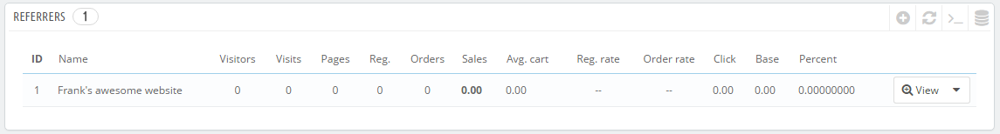
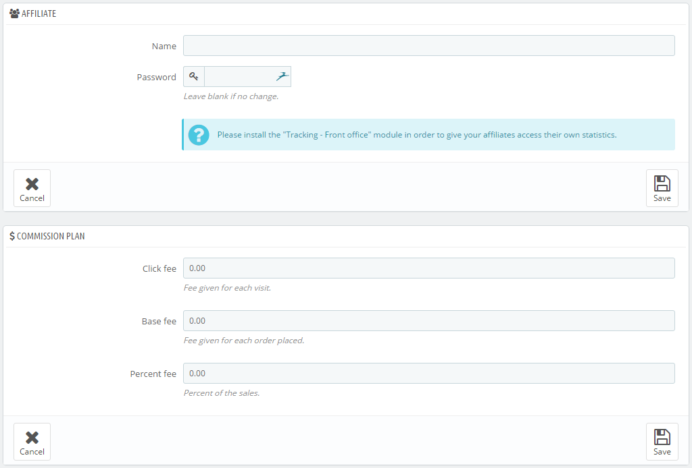
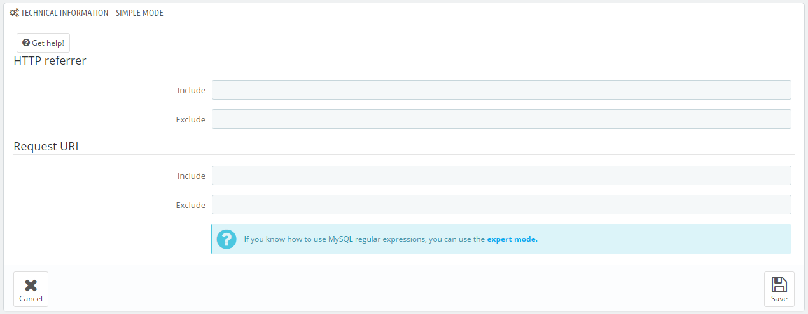
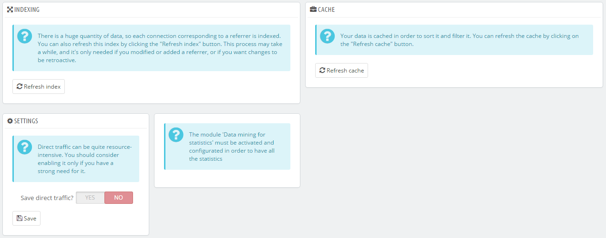

# Referrer

Ein Referrer ist eine Website, über die mindestens ein Besucher zu Ihrem Shop kommt. Diese Website enthält einen Link zu Ihrem Shop, und hilft, ein größeres Publikum anzusprechen und schließlich mehr Umsatz zu machen.

Einige Referrer sind wichtiger als andere: Vielleicht haben Sie Partner, die Links zu Ihrem Shop auf deren eigenen Website haben und Sie würden sicherlich wissen wollen, wie viele Besucher über diesen Link zu Ihrem Shop gekommen sind. Sie können Ihre Partner sogar bezahlen, einen Link zu Ihrem Shop zu zeigen, je nachdem, wie viel Ihnen dieser Traffic wert ist.\
Dies nennt man Affiliation und die "Referrer"-Seite hilft Ihnen, ein komplettes Affiliate-Programm aufzustellen, mit dem sich auch Ihre Partner verbinden können, um die Anzahl der Besuche und Verkäufe einzusehen, die deren Websites generiert haben. Das Prinzip: Registrierte Partner erhöhen den Traffic in Ihrem Shop, Sie möchten Ihre Partner dafür belohnen, und das Affiliate-Programm ist die Verknüpfung, wie Sie die Art und Höhe der Belohnung aushandeln können.

Das PrestaShop Referrer-Tool kann mit einem Statistik-Dashboard verglichen werden, auf das nicht nur ausschließlich Sie und Ihre Mitarbeiter zugreifen können. Wenn Sie eine Affiliate-Kampagne für eine Website erstellen, können Sie dieser Website Zugang zu allen Aktivitäten, die Ihre Seite unterstützen, über eine passwortgeschützte URL gewähren:  [http://example.com/modules/trackingfront/stats.php](http://example.com/modules/trackingfront/stats.php).

In der Liste der Referrer werden die Klick-, Grund- und anteiligen Gebühren in Abhängigkeit von den tatsächlichen Klicks, Verkäufen und dem festgelegten ausgeschütteten Prozentsatz pro Bestellung berechnet.

## Hinzufügen eines neuen Referrers 

Der Affiliate-Space ermöglicht es Ihnen, einen Account für Ihre Partner zu erstellen; diese haben Zugang zu allen Statistiken über die Besucher, von deren Website zu Ihrem Online-Shop. Um diesen „Space“ für einen Partner zu erstellen, müssen Sie ein Konto erstellen und anschließend festlegen, wie Sie ihn, basierend auf Traffic und Verkäufen, bezahlen.

Klicken Sie auf den "Neu"-Button Um zum Erstellungsformular für einen neuen Affiliate-Partner zu gelangen.

Jeder Abschnitt ist wichtig:

* **Vertriebspartner**. Das Konto Ihres Partners im Partnerprogramm.\

  * **Name**. Um sich mit Ihrem Affiliate-Back-Office zu verbinden, muss Ihr Partner einen Login-Namen haben; Sie können einen einfachen Namen oder eine E-Mail-Adresse zu verwenden, aber stellen Sie sicher, dass Sie etwas verwenden, das Sie und Ihr Partner sich leicht merken können.
  * **Passwort**. Wenn Sie ein Konto erstellen speichert PrestaShop das Passwort zusammen mit dem Login-Namen. Wenn Sie das Konto bearbeiten müssen (zum Beispiel, wenn Sie die Konditionen usw. ändern), wird das Passwortfeld leer sein. Dies bedeutet nicht, dass es kein Passwort hat; wenn Sie das Feld bei der Bearbeitung des Kontos wieder füllen, wird das Passwort geändert.
* **Kommission**. Hier legen Sie die Belohnungen für Ihren Partner fest – also das Geld, das Sie Ihrem Partner für Aktionen der Besucher von dessen Website verdanken.\

  * **Klick-Gebühr**. Hier legen Sie fest, wie viel Ihnen ein Besuch von der Website dieses Partners wert ist. Jedes Mal, wenn ein Besucher von der Seite Ihres Partners kommt, indem er auf den geschalteten Link klickt, erhält der Partner die festgelegte Menge Geld.
  * **Grundgebühr**. Sie können Ihren Partner auch belohnen, wenn Besucher von dessen Website einen Ihrer Artikel kaufen. Beachten Sie, dies ist nur dann gültig, wenn der Kauf während der Browser-Sitzung getätigt wird, während der der Besucher von der Seite des Partners kam.
  * **Anteilige Gebühr**. Neben der Grundgebühr, oder als Ersatz, können Partner mit einem Prozentsatz der Verkäufe belohnt werden, die dessen Besucher während der Browser-Sitzung erzeugt haben.
* **Technische Informationen – Einfacher Modus**. Dieser Abschnitt ist sehr wichtig, denn hier wird festgelegt, wie das System diesen Partner von anderen Referrer-Links unterscheidet. Einmal konfiguriert, sollten Sie ein paar Tests durchführen, um sicherzustellen, dass das Affiliate-Tracking richtig funktioniert.\

  * **HTTP-Referrer**. Im Feld "Einschließen" müssen Sie den Domain-Namen des Partners eintragen, den Sie als Affiliate-Domain tracken wollen.
  * **Request URI**. Im Feld "Einschließen" setzen Sie den letzten Teil eines Query-Strings. Das System wird Referrer tracken, die einen speziellen Query-String verwenden. Zum Beispiel, können Sie ?Prestaff= Argument in ihrer URL tracken. Dies kann Ihnen helfen, Referrer weiter zu differenzieren.
* **Technische Informationen - Expertenmodus**. Während der einfache Modus Wörter mit der MySQL-Funktion "LIKE" vergleicht, ermöglicht es der Experten-Modus, weitere reguläre MySQL Ausdrücke zu verwenden. Dies kann sehr mächtig sein, aber auch sehr schwer zu warten. Seien Sie sich der Sprache MySQL sicher, bevor Sie irgendetwas in diesen Bereichen einstellen.

Der Abschnitt "Hilfe" gibt Ihnen einige wertvolle Hinweise, wie Sie Ihre Affiliates am besten konfigurieren. Sie sollten sich das durchlesen.

## Einstellungen 

Die Referrer-Einstellungen sind meist Tools, damit Sie das Beste aus Ihrem Affiliate-Programm.

Es gibt drei Einstellungen:

* **Indizierung**. Sie müssen einmal auf "Reindizierung" klicken, wenn Sie einen neuen Referrer hinzugefügt haben und den neuesten Traffic für diesen neuen Partner analysieren möchten.
* **Cache**. PrestaShop speichert die Daten, die es sammelt. Sie können den "Cache auffrischen" –Button verwenden, um Ihren Daten-Cache regelmäßig zu aktualisieren.
* Direkten Serververkehr speichern?. Direkter Serververkehr steht für Besucher, die zu Ihrem Shop gekommen sind, indem sie direkt die URL im Browser eingegeben haben. Während diese wichtig sind, weil es Besucher sind, die sich wirklich für Ihren Shop und Ihre Artikel interessieren(im Gegensatz zu den Besuchern von Partnern, die vielleicht einfach zufällig über Ihren Shop gestolpert sind), nimmt dieser Traffic einen großen Platz auf Ihrer Datenbank ein. Deshalb wird dieser Verkehr standardmäßig nicht gespeichert, noch analysiert. Aktivieren Sie diese Option nur, wenn Sie wissen, was Sie tun.
