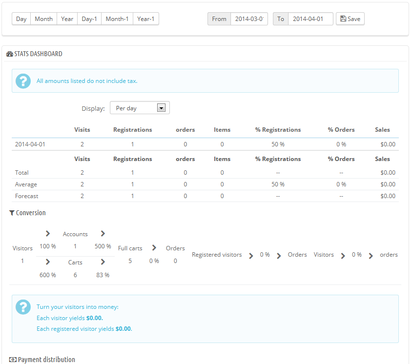
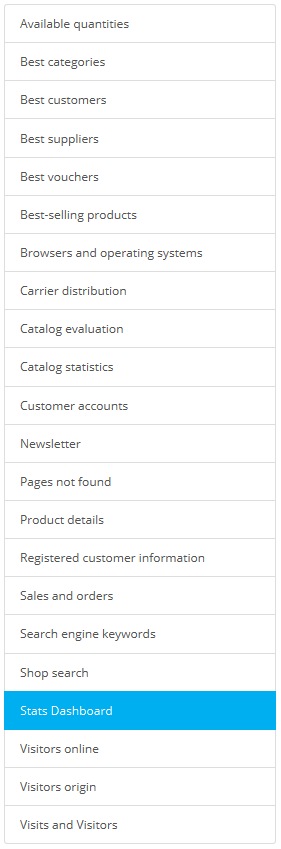

# Statistiken verwalten

In diesem Abschnitt wird der Nutzen der verschiedenen verfügbaren Statistiken im Detail erklärt. Durch Klicken auf die einzelnen Kategorien in der Seitenleiste lädt die Seite mit den Statistiken zur ausgewählten Kategorie neu.\
Einige der Statistiken enthalten eine vollständige Erklärung dazu, dies hilft Ihnen, die Daten besser zu verstehen und die erlangten Informationen zur Verbesserung Ihres Shops und Ihres Umsatzes zu nutzen.

Statistische Daten werden ab dem Zeitpunkt, an dem Sie PrestaShop installieren, gesammelt. Wenn Sie lieber ab dem Zeitpunkt, ab dem Sie den Shop online stellen, Statistiken anlegen möchten(und damit alle Testdaten löschen), können Sie den "Auto-clean Zeitraum" von mindestens 24 Stunden vor der endgültigen Markteinführung verwenden. Siehe unten.

## Hauptübersicht 

Standardmäßig zeigt das Statistik-Dashboard einen Überblick über die wichtigsten Zahlen, die PrestaShop gesammelt hat, seit Sie den Shop online gestellt haben.

Am oberen Rand der Seite ist eine Leiste, Sie den Zeitraum für die aktuell angezeigte Statistik wählen können. Drei Sätze von Optionen stehen zur Verfügung:

* Aktueller Tag, Monat oder Jahr.
* Vorheriger Tag, Monat oder Jahr.
* Genaue Datumsauswahl.

Das Dashboard enthält 8 Abschnitte:

* **Die wichtigsten Statistiken**. Dies ist das Herzstück dieser Seite. Innerhalb einer einzigen Tabelle gibt PrestaShop einen Überblick über die wichtigsten Zahlen, die für den gewählten Zeitraum gesammelt wurden: Besuche, Anmeldungen, Bestellungen, gekaufte Artikel, Registrierungen(%), Prozentsatz der Bestellungen pro Besucher, Menge der verwendeten Gutscheine, Erlöse.\
  Sie können das Zeitfenster über das Drop-down-Menü darüber ändern. Die zur Verfügung stehenden Zeiträume sind: pro Tag, pro Woche, pro Monat und pro Jahr.\
  Die drei Zeilen am Ende der Tabelle sind nicht von dem gewählten Zeitraum betroffen: Gesamt, Durchschnitt und Prognose ermöglichen Ihnen eine bessere Schätzung darüber, wie sich Ihr Shop macht.
* **Umwandlung**. Dieser Abschnitt gibt Ihnen eine Vorstellung davon, wie viel ein Besucher oder ein registrierter Kunde wert sind, basierend auf Ihren Einkäufen. Es ist ein guter Punkt, um zu sehen, wir Ihr Geschäft läuft.\
  Hinweis: der Unterschied zwischen einem "Warenkörbe" und "Volle Warenkörbe" sind die Kundeninformationen. Ein Warenkorb ist der eines Besuchers, mit Artikeln, aber keiner Adresse usw., ein voller Warenkorb ist ein Warenkorb mit Artikeln, einer Lieferadresse und einem gewählten Versanddienst- kurz gesagt, der Warenkorb hat den Bestellvorgang fast vollständig durchlaufen, alles, was noch zu tun ist, ist nur bezahlen.
* **Zahlungsverteilung**. In diesem werden die Zahlungsmethoden aufgelistet, die am häufigsten von Ihren zahlenden Kunden gewählt werden. Basierend auf diesen Zahlen können Sie Ihren Shop mehr der beliebtesten Zahlungsmethode anpassen, oder die von Ihnen favorisierte Zahlungsmethode nach vorn bringen.\
  Mit Hilfe des Drop-Down-Menüs „Gebiet“ über der Tabelle können Sie die Zahlen auf ein bestimmtes geografisches Gebiet begrenzen, so sehen Sie, welche Methode am besten bzw. am schlechtesten funktioniert, abhängig vom Gebiet.
* **Verteilung der Kategorien**. Dieser Abschnitt gibt Angaben bezogen auf die Kategorien. Für jede Kategorie werden nützliche Zahlen angezeigt: verkaufte Artikel, Umsatz, verkaufte Artikel (%) in Bezug auf gesamte verkaufte Artikel, Umsatz (%) relativ zum gesamten Shop, Durchschnittspreis. Wenn Sie merken, dass eine Kategorie viel mehr Umsatz macht, als andere, sollten Sie vielleicht mehr Bemühungen in diese stecken. Andererseits könnten Sie versuchen, die anderen Kategorien durch Gutscheine, Werbeaktionen usw. attraktiver zu machen...\
  Mit Hilfe des Drop-Down-Menüs „Gebiet“ über der Tabelle, können Sie Ihre Auswahl auf ein bestimmtes Gebiet beschränken, so sehen Sie, welche Kategorie in welchem Gebiet am erfolgreichsten ist.
* **Sprachenverteilung**. Ihre Kunden können ihre bevorzugte Sprache bei der Registrierung wählen, Sie sehen die Verteilung davon in diesem Abschntt. Achten Sie darauf, alle Ihre Artikel für mindestens die beiden beliebtesten Sprachen richtig übersetzt zu haben.
* **Gebietsverteilung**. Sie können zwar andere Abschnitte durch Gebiete filtern, dieser Abschnitt zeigt Ihnen jedoch direkt die Anzahl der Bestellungen und Umsätze (und ihre entsprechenden Prozentsätze) für alle Gebiete.
* **Währungsverteilung**. Wenn Sie mehr als eine Währung akzeptieren, hilft Ihnen dieser Abschnitt, die am häufigsten verwendete Währung zu akzeptieren.\
  Mit Hilfe des Drop-Down-Menüs gebiet über der Tabelle können Sie die Zahlen auf ein bestimmtes geografisches Gebiet begrenzen, so sehen Sie, welche Währung in welchem Gebiet am erfolgreichsten ist.
* **Attributverteilung**. Dies ist eher eine interne Statistik, so dass Sie sehen, welche Varianten und Variantengruppen am meisten in Ihren Artikeln benutzt werden.

## Durch die Statistiken navigieren 

Die meisten der statistischen Daten können als CSV-Dateien heruntergeladen werden, indem Sie auf den Button "CSV-Export" klicken.

* **Verfügbare Mengen**. Dieser Abschnitt gibt Ihnen einen Überblick über den Wert Ihres aktuellen Lagerbestands.
* **Beliebteste Kategorien**. Dieser Abschnitt zeigt die Anzahl der verkauften Artikel, sortiert nach Kategorie. Sie können so sehen, wie viele Artikel in jeder Kategorie verkauft wurden, wie hoch die Handelsspanne ist und wie viele Besucher sich die Kategorie angesehen haben.&#x20;
* **Beste Kunden**. In diesem Abschnitt sind die besten Kunden Ihres Shops gelistet. Sie Liste zeigt ihre E-Mail-Adresse, Anzahl der Besuche und wie viel sie ausgegeben haben. Halten Sie ein Auge auf dieser Seite, um den Überblick zu behalten und sich um Ihre besten Kunden zu kümmern. Durch Anklicken der Schaltflächen am oberen Rand der Spalten können Sie wählen, wie Sie diese Daten sortieren möchten.
* **Beliebteste Lieferanten**. Dieser Abschnitt enthält Statistiken über Ihre Lieferanten durch die Verkaufsmengen und den Umsatz.
* **Beliebteste Gutscheine**. Dieser Bereich zeigt die beliebtesten Coupons, Gutscheine, Warenkorb-Preisregeln und Katalog-Preisregeln, die Sie erstellt und verteilt haben, ob persönlich oder durch eine Werbekampagne. Die Tabelle zeigt auch den Umsatz und die Anzahl der verwendeten Gutscheine.
* **Beliebteste Artikel**. In diesem Bereich werden Ihre beliebtesten Artikel angezeigt. Sie können hier die erreichten Umsätze, den durchschnittlichen Tagesumsatz, Anzahl der Seitenaufrufe und die aktuell in Ihrem Lager verfügbaren Mengen ansehen. Mit dieser Tabelle können Sie Ihre Kernprodukte identifizieren und entscheiden, ob Maßnahmen wie Erhöhung oder Verringerung Ihrer Preise bzw. Rabatte für bestimmte Artikel gegeben werden.
* **Browser und Betriebssysteme**. Dieser Abschnitt informiert Sie über die Web-Browser, die Besucher und Kunden verwenden, um Ihren Shop zu durchsuchen. Sie sollten überprüfen, ob Ihr Shop vollkommen kompatibel mit diesen Browsern ist, oder zumindest mit den drei beliebtesten. Darüber hinaus erfahren Sie, wie viele Besucher auf Ihren Shop von ihren mobilen Geräten (wie Smart-Phones) aus zugreifen. Wenn diese Zahl hoch ist, sollten Sie über eine mobile Version Ihres Shops nachdenken.\
  Schließlich können Sie sehen, welche Betriebssysteme Ihre Besucher verwenden. Stellen Sie sicher, dass Ihr Shop mit allen verwendeten Betriebssystemen kompatibel ist.
* **Verteilung der Lieferanten**. Diese Seite zeigt an, welche Lieferanten am meisten von Ihren Besuchern gewählt werden. Hier können Sie einige Filter basierend auf dem Bestellstatus setzen. Wenn Sie sehen, dass ein Lieferant nicht häufig verwendet wird, obwohl er schnell und effizient arbeitet, könnten Sie dies als Anhaltspunkt sehen, den Lieferanten bei der Übersicht mehr hervorstechen zu lassen, um die Kundenzufriedenheit zu erhöhen.
* **Katalogauswertung**. Dieser Abschnitt gibt einen Überblick über die Leistung Ihres Katalogs. Sie können herausfinden, ob jeder Artikel aktiv ist und ob seine Beschreibung korrekt in allen Sprachen Ihres Shops eingetragen wurde. Sie können auch sehen, ob alle Ihre Artikel genug Bilder haben, sowie ihre Verkäufe und aktuelle Lagerbestände betrachten. Die Gesamtleistung für jeden Artikel wird mit einem farbigen Symbol angezeigt. Sie können die Hauptkriterien festlegen, indem Sie über der Tabelle die Einträge neu setzen und dann die Einstellungen speichern.
* **Katalogstatistik**. Dieser Abschnitt enthält praktische Informationen über die verkauften Artikel in Ihrem Online-Shop, sowie über Ihren Katalog als Ganzes. Die Zahlen können je nach Kategorie mit dem Drop-down-Menü über der Tabelle gefiltert werden. Sie können die Leistung Ihres Katalogs durch die folgenden Faktoren betrachten:\

  * **Lieferbare Artikel**. Die Menge der verfügbaren Artikel in der gewählten Kategorie (standardmäßig alle Kategorien).
  * **Durchschnittlicher Preis (Basispreis)**. Durchschnittlicher Artikelpreis in der ausgewählten Kategorie.
  * **Aufgerufene Produktseiten**. Anzahl der Seiten, die durch potenzielle Kunden besucht wurden. Vergleichen Sie diese Daten zwischen verschiedenen Kategorien, um zu sehen, welche die meisten Kunden angesehen haben, und im Gegensatz dazu, welche die wenigsten. Verwenden Sie diese Informationen, um einige Verbesserungen in Ihrem Katalog zu machen.
  * **Gekaufte Artikel**. Die Menge der Produkte gekauften Artikel.
  * **Durchschnittliche Anzahl an Seitenaufrufen**. Die weltweite Anzahl der Besuche für Artikel in der ausgewählten Kategorie.
  * **Durchschnittliche Anzahl an Einkäufen**. Die Einkäufe in der gewählten Kategorie, bezogen auf alle Kategorien.
  * Bilder zur Verfügung. Zeigt an, wie viele Bilder die Artikel in der gewählten Kategorie haben. Ein schneller Weg, zu wissen, ob Artikelbilder fehlen, ist, wenn eine Kategorie weniger Bilder als Artikel hat.
  * **Durchschnittliche Anzahl an Bildern**. Anzahl der Bilder in der gewählten Kategorie, geteilt durch die Anzahl der Artikel.
  * **Nie angesehene Artikel**. Einige Ihrer Artikel wurden vielleicht noch nie von Besuchern angesehen. Überprüfen Sie deren Seiten und versuchen Sie, zu verstehen, warum.
  * **Nie gekaufte Artikel**. Einige Ihrer Artikel wurden vielleicht noch nie von Kunden gekauft. Dies ist ein ernstes Problem und Sie sollten sich die Zeit nehmen, zu verstehen, wieso.
  * **Umrechnungskurs**. Zeigt das Verhältnis zwischen der Zahl der Besucher und der Anzahl der Einkäufe. Es ist wichtig, dass dieser Wert so hoch wie möglich ist.
  * Eine Tabelle am unteren Rand der Seite zeigt, welche Artikel in dieser Kategorie noch nie gekauft wurden. Sie haben die Möglichkeit, evtl. den Preis zu ändern oder eine bessere Beschreibung einzutragen.
* **Kundenkonten**. Diese Seite zeigt eine Grafik mit der Zahl der Kundenkonten in Ihrem Online-Shop. Mit diesen Informationen können Sie die Wirkung Ihrer Marketingkampagnen zu messen. Sie können die Anzahl der Besucher sehen, die ein Konto, aber eigentlich nie etwas gekauft haben, als auch die Anzahl der Kunden, die ein Konto erstellt und einen Artikel gleich nach der Registrierung gekauft haben.
* **Newsletter**. Auf dieser Seite sehen Sie die Newsletter-Abonnement Statistik. Sie können diese Datenbank verwenden, um Kunden zu informieren. Die Newsletter dienen in der Regel zur Erhöhung der Besucherzahlen in Ihrem Shop. Wenn Sie möchten die Anmeldungen erhöhen möchten, sollten Sie vielleicht Codes zu Gutscheinen, Warenkorb-Preisregeln usw. in den Newslettern veschicken. Sie können alle Ihre Abonnenten-Adressen über das "Newsletter"-Modul auf der "Module"-Seite einsehen.
* **Seiten nicht gefunden**. Auf dieser Seite erfahren Sie, auf welche Seiten des Katalogs Besucher versucht haben zuzugreifen, die Seite aber nicht finden konnten ("HTTP 404" -Error). Dies ist nützlich für die Suche nach potenziellen technischen Problemen, die Ihren Umsatz behindern können.
* **Produktdetails**. Diese Seite zeigt alle Artikel in Ihrem Shop mit Artikelnummer, Name und lieferbarer Verkaufsmenge. Sie können die Ergebnisse sortieren, indem Sie im Drop-down-Menü über der Tabelle eine Kategorie auswählen, nach der gefiltert werden soll. Klicken Sie auf einen Artikel, um auf seine Statistiken zugreifen. Anschließend sehen Sie ein Diagramm mit zwei Datensätzen: Beliebtheit und Umsatz. Der Umrechnungskurs, die gekaufte Summe, die Verkäufe und die Anzahl, wie oft der Artikel angesehen wurde werden ebenfalls angezeigt.
* **Information zu registrierten Kunden**. Dieser Abschnitt ist in fünf Abschnitte aufgeteilt.\

  * **Geschlechterverteilung**. Sie können sehen, wie Ihre Kunden durch verschiedene soziale Titel unterschieden werden - standardmäßig, Herr und Frau, es gibt aber viele andere, wie Dr. oder Sr. Daher können Sie dieser Grafik bezogen auf Geschlechterverteilung nicht vertrauen... es sei denn Sie reduzieren die Titel auf nur zwei geschlechtsspezifische Titel.
  * **Altersgruppen**. Sie können die Verteilung Ihrer Kunden nach ihrem Alter filtern. Wenn Sie sehen, dass die Altersgruppe Ihrer Kunden nicht der entspricht, die Sie wollen, sollten Sie über einen neuen Marketing-Ansatz nachdenken.
  * **Länderverteilung**. Sie können schnell sehen, in welchen Ländern Ihre Kunden leben. Dies kann Ihnen helfen, Marketing-Bemühungen auf ein einzelnes Land zu konzentrieren.
  * **Währungsbereiche**. Sie können sehen, welche Währungen für Bestellungen verwendet werden, und in welchen Proportionen.
  * **Sprachverteilung**. Sie können, in welcher Sprache Ihr Shop am häufigsten besucht wird, so können Sie entscheiden, ob Sie die Übersetzungen Ihres Shops in bestimmten Sprachen verbessern sollten.
* **Verkäufe und Bestellungen**. Diese beiden Diagramme stellen die Entwicklung von Umsatz und Bestellungen Ihres Shops dar. Sie können mit dem Dropdown-Menü über der Tabelle nach bestimmten Ländern gefiltert werden.\

  * Die erste Grafik zeigt die Gesamtzahl der Bestellungen, sowie die Gesamtzahl der bestellten Artikel. Mit dieser Grafik können Sie analysieren, welche Zeiträume Ihnen die größte Rendite in Bezug auf die Menge der Bestellungen gab.
  * Das zweite Diagramm hilft Ihnen, Ihren Umsatz grafisch zu visualisieren. Hier können Sie analysieren, wann Sie den größten Umsatz hatten. Dies ermöglicht es Ihnen zum Beispiel, um eine bessere Vorstellung davon zu bekommen, wann Sie Ihre Marketing-Kampagnen starten sollten.
* **Suchmaschinen-Schlüsselworte**. Auf dieser Seite erfahren Sie, welche Keywords in eine Suchmaschine eingegeben wurden, um Besucher zu Ihrem Online-Shop zu bringen. Dies ermöglicht Ihnen, zu wissen, welche Begriffe leicht zu Ihrem Shop führen. Umgekehrt können Sie sehen, welche Keywords nicht auf dieser Liste sind und somit überhaupt nicht effektiv.
* **Shop-Suche**. Dieser Abschnitt hat zwei Teile.\

  * Der erste ist ein Diagramm, das die Verteilung der in der Suchleiste Ihres Shops eingegebenen Keywords zeigt. So können Sie sehen, welche Artikel Ihre Besucher am meisten suchen- und damit die, von denen Sie viel auf Lager haben sollten.
  * Der zweite ist eine zusammenfassende Tabelle der Suchen Ihrer Besucher. Sie können sehen, welche Keywords verwendet wurden, wie oft sie eingegeben wurden und wie viele Ergebnisse daraus resultierten. Es ist wichtig, dass alle Suchen ein Ergebnis bekommen. Um Ihren Shop zu verbessern, sollten Sie Artikel hinzufügen, die den Kundenanforderungen entsprechen(die er sucht) oder zusätzliche Tags zu Ihren Artikeln hinzufügen, die leicht erkennbar sind.
* **Statistik-Kontrollzentrum**. Dies ist die Statistik-Homepage. Sie zeigt die Hauptstatistiken Ihres Shops.&#x20;
* **Besucher online**. Dieser Abschnitt zeigt die Anzahl der Besucher in Ihrem Shop. Sie können ihren Namen ansehen, sowie die Seiten, die sie gerade ansehen. Die Daten werden live aktualisiert, wenn Besucher durch Ihren Shop surfen.
* **Herkunft der Besucher**. Diese Seite zeigt die Top-Ten-Websites und Suchmaschinen, die Besucher zu Ihrem Shop gebracht haben. Normalerweise spielen Suchmaschinen eine sehr wichtige Rolle. Wenn Sie eine Marketing-Kampagne aufbauen, indem Sie Artikel dazu auf anderen Seiten veröffentlichen, können Sie sofort deren Auswirkung auf Ihre Seite betrachten. Unter der Grafik sind die Namen der Websites, von der Besucher kamen, gelistet, mit der Anzahl der Besucher in der rechten Spalte.
* **Besuche und Besucher**. Diese Seite gibt Ihnen Statistiken über die Besucher zu Ihrem Shop und die Anzahl der Male, die sie Ihren Shop besuchen. Je größer die Zahl ist, desto beliebter ist Ihr Shop. Die Grafik hilft Ihnen, das Verhalten Ihrer Besucher zu verstehen. Grundsätzlich werden Sie sehen, wie oft Ihr Shop besucht wird, diesen Wert kann man mit der Anzahl der Besucher vergleichen(Ein Besuch entspricht einem Internet-Benutzer, der Ihren Shop besucht. Bis zum Ende des Besuchs auf der Webseite wird nur ein Besuch gezählt. Ein Besucher ist eine unbekannte Person - die nicht registriert oder angemeldet ist - und in Ihrem Shop surft. Ein Besucher kann Ihren Shop mehrmals besuchen). Je größer die Differenz zwischen den beiden Zahlen, desto größer ist Ihre Basis von Stammkunden.
