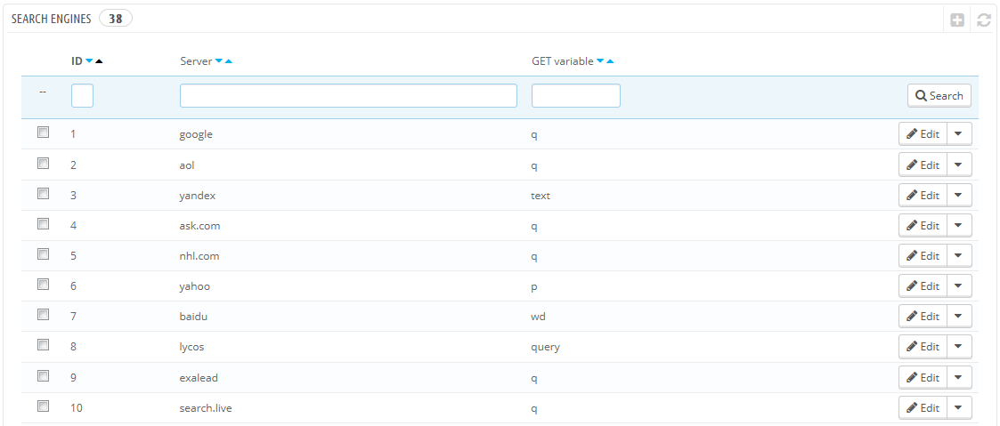
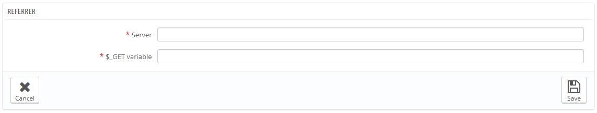

# Suchmaschinen

Viele Ihrer Besucher werden von Suchmaschinen kommen. Um zu wissen, wonach sie suchen, und wie Sie Ihren Shop für ihre zu verbessern können, müssen Sie ihre Anfragen kennen.

Auf dieser Seite finden Sie eine Tabelle aller Suchmaschinen, die Ihre Installation von PrestaShop unterstützt - was bedeutet, dass PrestaShop in der Lage ist, diese zu erkennen, und die Anfrage, die der Besucher einer bestimmten Suchmaschine verwendet, zu extrahieren.

Während Google den größten Anteil der Suchmaschinen-Nutzer hat, gibt es noch viele andere Suchmaschinen, die Menschen benutzen, um Ihre Website zu finden. Daher müssen Sie in der Lage sein, ihre Suchanfragen abzurufen. Wenn eine unbekannte Suchmaschine regelmäßig Besucher zu Ihrer Website bringt, ist es höchste Zeit, Sie zu Ihrer Datenbank hinzufügen - sonst würden die Besucher in Ihren Statistiken "Andere Suchmaschinen" benutzen, was nicht hilfreich zur Auswertung ist.

## Hinzufügen einer Suchmaschine 

Es ist sehr einfach, eine neue Suchmaschine zu Ihrer Liste hinzuzufügen.

Nehmen wir an, Sie wollen DuckDuckGo, eine Suchmaschine, die großen Wert auf Datenschutz legt, hinzufügen:

1. Holen Sie sich die volle Referrer-URL für die Suche. Zum Beispiel [http://duckduckgo.com/?q=kids+shoes](http://duckduckgo.com/?q=kids+shoes)
2. Nehmen Sie den Domain-Namen, der spezifisch für diese Suchmaschine ist, und legen Sie sie in das Feld "Suchmaschine". In unserem Fall "DuckDuckGo".
3. Suchen Sie die Abfragevariable:\

   1. Finden Sie den Query-String. Er sollte eine Reihe von Buchstaben, gefolgt von einem Zeichen "=", gefolgt von der Abfrage und mit einem "&" geschlossen oder dem Ende des Strings. In unserem Fall ist es "q = kids + shoes".
   2. Die Abfrage-Variable ist die Menge der Buchstaben vor dem Zeichen "=". In unserem Fall: "q". Setzen Sie dies ins Feld "$ \_GET Variable".
4. Klicken Sie auf die Schaltfläche "Speichern", und von nun an wird PrestaShop in der Lage sein, Besucher aus DuckDuckGo zu erkennen.
