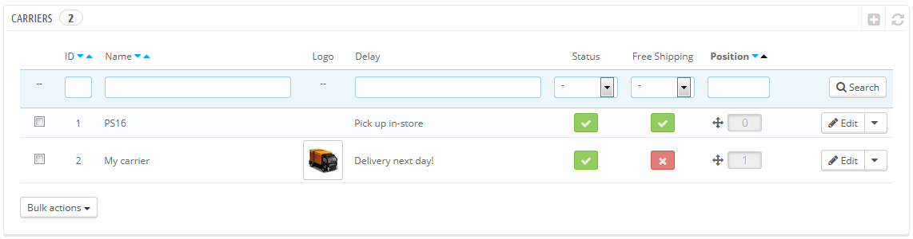
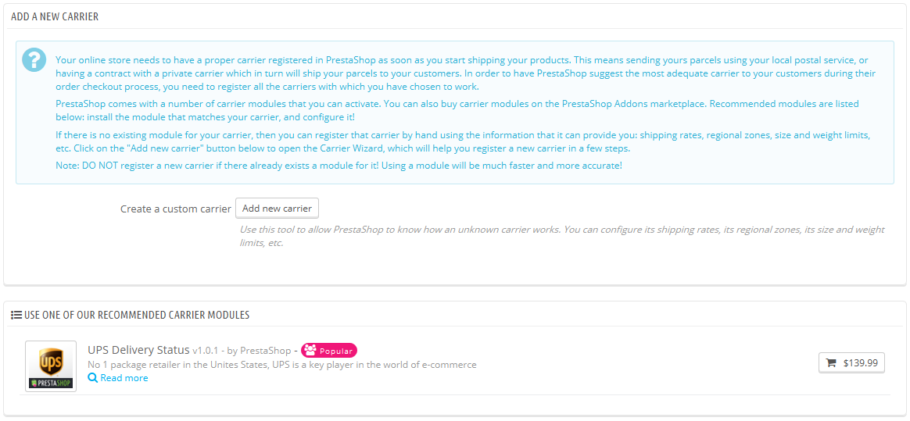
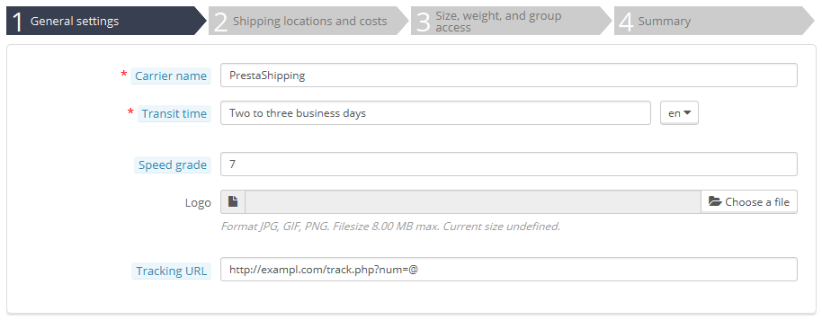
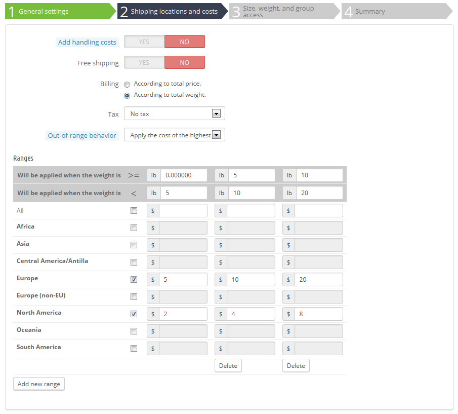
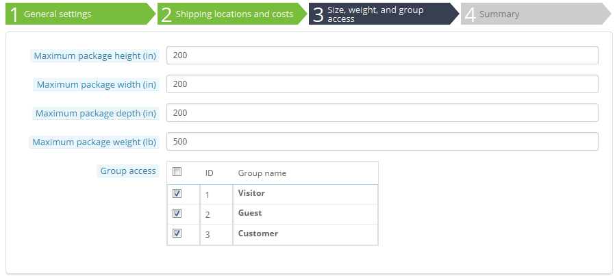
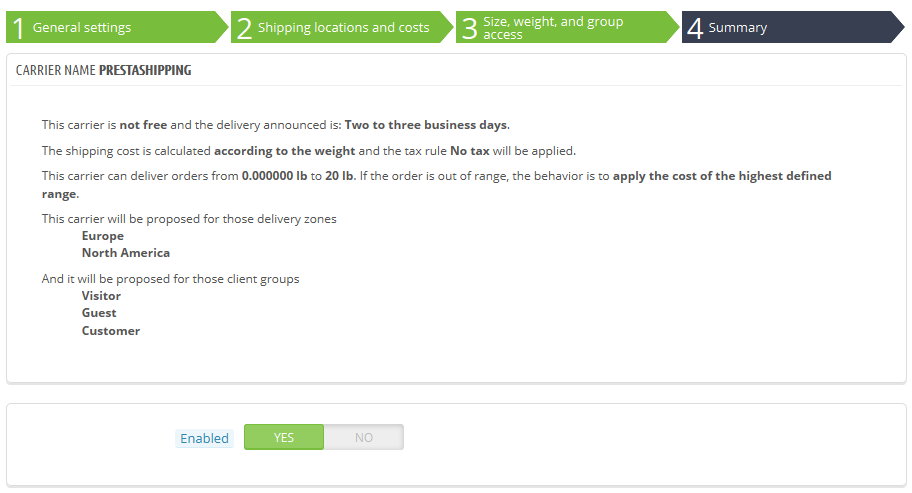

# Versanddienste

Sie müssen Versanddienste zu Ihrer PrestaShop Installation hinzufügen – diese sind ein klarer Indikator dafür, wer Ihre Produkte liefert. Es könnte sein, dass dies nur Sie sind, oder Ihr Shop(wenn Sie zum Beispiel Artikel als Download verkaufen oder nur lokal arbeiten), aber sobald Sie tatsächlich das Senden von Paketen mit Briefmarken und eine Lieferdienst wie Ihren lokaler Postdienst oder FedEx , UPS usw. benötigen, dann müssen deren Daten in die Datenbank Ihres Shop eintragen. Auf diese Weise können Sie Kunden besser entscheiden lassen, welchen Versanddienste sie wählen sollen, auf der Grundlage ihrer Lieferbereiche, Gebühren und Termine.

Die "Versanddienste"-Seite zeigt Ihnen eine Liste aller Ihrer aktuellen Lieferdienste. Von dort können Sie direkt ihren Status ändern, zeigen, warum der Versand kostenlos ist oder nicht, und ihre Position ändern, wie sie dem Kunden gezeigt wird.

Standardmäßig haben Sie zwei Versanddienste in Ihrer Datenbank:

* Ihren eigenen Laden: Das entspricht Ihrem Ladengeschäft, zu dem Kunden kommen können und ihre Produkte selbst holen. Hier gibt es keine Preisspanne oder Gewichtsspanne.
* "My Carrier": Dies ist ein Probedienst und sollte nicht in der Praxis verwendet werden. Er hat eine Preisspanne (von $ 0 bis $ 10.000) und eine Gewichtsspanne(von 0 kg bis 10.000 kg).

Es liegt an Ihnen, diesen Standarddienst zu entfernen und neue hinzufügen. Zumindest sollten Sie "My Carrier" bearbeiten und mit den Daten eines realen Dienstes ersetzen: Name, Details und Bereiche. Wir empfehlen, dass Sie "My Carrier" löschen, und ein Versanddienst-Modul verwenden, um einen bestimmten Versand Partner in PrestaShop zu verwenden.

Erstellen Sie einen neuen Versanddienst, indem Sie zuerst auf die Schaltfläche "NEU" klicken. Es öffnet sich eine neue Seite mit zwei Optionen:

* **Nutzen Sie eines unserer empfohlenen Versand-Module**. Es wird dringend empfohlen, ein Versandmodul zu installieren: Dies wird den Prozess sehr viel schneller und die Einstellungen viel genauer machen.
* **Versanddienst hinzufügen**. Wenn Sie ein Modul für den gewünschten Versandpartner nicht finden, weder in den nativen Modulen, noch auf dem PrestaShop Addons Marktplatz, dann sollten Sie Ihren Versanddienst selbst mit dem Versanddienst-Assistenten hinzufügen: Klicken Sie auf "Versanddienst hinzufügen", um dieses Tool zu öffnen.

Dies ist ein neuer Abschnitt, der in der Version 1.6.0.7 von PrestaShop hinzugefügt wurde. Er hilft Ihnen, zu entscheiden, ob Sie ein Trägermodul installieren oder Ihren eigenen Versanddienst mit dem Assistenten konfigurieren wollen.

## Erstellen eines neuen Versanddienstes mit dem Versanddienst-Assistent 

In diesem Abschnitt werden wir einen kompletten Versanddienst erstellen, mit dem Carrier-Wizard. Sie können so viele Versanddienste erstellen, wie Sie möchten.

Wenn ein Versanddienst verschiedene Transportdienste anbietet, sollten Sie so viele einzelne Versanddienste in PrestaShop erstellen, um sie an ihrem Namen zu differenzieren:

Viele Details, die von PrestaShop gefragt werden, sollten Sie von Ihrem Versanddienst zur Verfügung gestellt bekommen, sobald Sie einen Vertrag mit diesem abgeschlossen haben. Wenden Sie sich an diesen, um sicherzustellen, dass alles richtig konfiguriert ist.

Um einen neuen Versanddienst zu erstellen, klicken Sie auf den "Neu" Button auf der "Versanddienste" Seite. Dies wird die Carrier-Assistenten auf die erste seiner vier Panels zu öffnen.

### Panel 1: Allgemeine Einstellungen 

Hier können Sie den Versanddienst beschreiben und Informationen eintragen, damit der Kunde erkennen kann, welchen Versanddienst er bevorzugen kann.

Betrachten wir alle Informationen, die Sie eingeben müssen:

* **Name Versanddienst**. Der Name ist öffentlich, Sie sollten den offiziellen Namen verwenden. Wenn Sie mehrere Transportdienste von einem Versanddienst haben, wird der Name Ihnen helfen, sie zu unterscheiden.
* **Lieferzeit**. Die geschätzte Zeit, die dieser Versanddienst benötigt, um Ihre Produkte auszuliefern, einfach ausgedrückt. Dies wird dem Kunden an der Kasse angezeigt. Es wird Kunden helfen, einen Versanddienst entsprechend der der Zeit, die sie bereit sind, auf ihre Sendung zu warten, zu wählen. Kunden akzeptieren oft, mehr für einen schnelleren Dienst zu zahlen. Sie müssen dieses Feld in allen verfügbaren Sprachen ausfüllen, insbesondere in der Standardsprache.\
  You must fill this field in all the available languages, especially the default one.
* **Liefergeschwindigkeit**. Da das Feld "Lieferzeit" einen beliebigen Text enthalten kann, kann es nicht verwendet werden, um Liefergeschwindigkeiten. Durch "Liefergeschwindigkeit" kann jedem Versanddienst ein Wert von 0 (sehr langsam) bis 9 (sehr schnell) gegeben werden. Dies wird dann verwendet, um Versanddienste in ihrer Liefergeschwindigkeit zu sortieren, und Kunden helfen, nach ihren Präferenzen zu wählen.
*   **Logo**. Mit einem Logo können Kunden zwischen verschiedenen Versanddiensten leichter unterscheiden. PrestaShop wird Ihr Bild im Bestellformular anpassen. Das Logo wird auf jeder Seite des Wizard erscheinen, als Erinnerung an den Versanddienst, den Sie gerade bearbeiten / erstellen.

    Das Logo wird auf jeder Seite des Wizard erscheinen, als Erinnerung an den Versanddienst, den Sie gerade bearbeiten / erstellen.
*   **Tracking-URL**. Diese Tracking-URL muss von Ihrem Versanddienst zur Verfügung gestellt (wenn vorhanden) werden. Zum Beispiel Frankreichs Post (La Poste) bietet diese URL: [http://www.colissimo.fr/portail\_colissimo/suivreResultat.do?parcelnumber=](http://www.colissimo.fr/portail\_colissimo/suivreResultat.do?parcelnumber=). Wenn Kunden ihre Bestellung abschließen, wird die URL mit dem "@" durch die Tracking-Nummer von der Bestellung gesetzt, die ermöglicht, auf diesen Link zu klicken und tz sehen, wo sich das Paket gerade befindet.

    Klicken Sie auf "Weiter", um zum zweiten Panel zu gelangen.

### Panel 2: Versanddienst-Gebiete und Kosten 

Zunächst zeigt das Panel eine Handvoll von Einstellungen:

* **Bearbeitungskosten einrechnen**. Bearbeitungskosten der Versanddienste einrechnen oder nicht.
* **Versandkostenfrei**. Wenn aktiviert, werden Sie nicht in der Lage sein, Versandpreise anzuzeigen.\
  Wenn deaktiviert, werden Sie in der Lage sein, die Bereiche und pro Land Kosten im folgenden Formular zu bearbeiten.
* **Wahl der Preisspanne**. Bei der Abrechnung der Bestellung eines Kunden, kann sich PrestaShop auf zwei Arten verhalten, je nachdem, wie die folgenden Punkte gesetzt stellen(stellen Sie sicher, die Dokumentation darüber zu lesen):\

  * **Nach Gesamtpreis**. Versandkosten hängen von dem Gesamtpreis der Bestellung ab.
  * **Nach Gesamtgewicht**. Versandkosten hängen von dem Gesamtgewicht der Bestellung ab.
* **MwSt**. Zeigt an, ob dieser Versanddienst einer Steuer unterliegt, um zu liefern, und wenn ja, welche. Die Steuer muss bereits in PrestaShop ("Steuern" Seite des Menüs "Lokalisierung") vorliegen.
* **Bei Überschreitung der Spanne**. Falls der Versanddienst keine Versandkosten für die erforderliche Zone oder Gewicht festgelegt hat, können Sie angeben, wie PrestaShop reagieren soll. Sie haben zwei Möglichkeiten:\

  * Die größte Preisspanne verwenden. PrestaShop wird den teuersten Bereich verwenden, sowie seine Bedingungen.
  * Versanddienst deaktivieren. PrestaShop wird diesen Versanddienst nicht empfehlen, da er diesen Auftrag wahrscheinlich nicht zuliefert.

Dann kommt der wichtigste Teil: die Erstellung der Spannen. Dies ist ein sehr wichtiger Schritt, da PrestaShop diese Informationen benötigt, um den Kunden Versanddienste zu zeigen, die tatsächlich ihre Bestellung liefern können. So werden, je nach Gesamtpreis der Bestellung oder Gesamtgewicht, einige Versanddienste nicht zur Verfügung stehen, während andere nur bei einem bestimmten Wert angezeigt werden. Sie müssen sehr genau sein beim Ausfüllen dieser Werte, und vorzugsweise die bereitgestellten Werte des Versanddienstes eintragen.

Hier können Sie die Preis- oder Gewichtsbereiche ihrer Versanddienste einsetzen(abhängig von Ihrer Wahl für die Option "Preisspanne" oben) und einen Bereich nach dem anderen eintragen.

Für jeden Bereich müssen Sie nur ein paar Schritte durchführen:

1.  **Legen Sie die untere und obere Grenze des Bereichs fest, den Sie erstellen**. Abhängig von der "Preisspanne"-Wahl, wird entweder "gilt für Preise" oder "gilt für Gewicht“ angezeigt.&#x20;

    Beachten Sie, dass die untere Grenze inklusiv(> =), während die obere Grenze exklusiv (<) ist. Das bedeutet, dass eine Bereichsobergrenze den gleichen Wert wie der niedrigste Wert des nächsten Bereichs haben kann, ohne zu überlappen.
2.  **Füllen Sie die Preise**. Sobald beide unteren und oberen Grenzen gefüllt sind, stellt PrestaShop das Feld "All" zur Verfügung. Dies ist eine Spezialfunktion: jeder Wert, den Sie eingeben wird in das Feld für alle verfügbaren geographischen Zonen kopiert, ohne Ihr Zutun. Sie können dann den Wert separat für jede Zone bearbeiten.\

    Überprüfen Sie das Kontrollkästchen für jede Zone in die der Versanddienst liefert. Wenn dieser Versanddienst in ein bestimmtes Gebiet nicht liefert, deaktivieren Sie das Kontrollkästchen.
3. **Neue Spanne hinzufügen**. Klicken Sie auf den Button "Neue Spanne hinzufügen". PrestaShop wird eine neue Spalte hinzufügen. Legen Sie wieder Ober- und Untergrenze fest, dann Füllen Sie die Preise pro Zone.

Die Preis- und Gewichtseinheiten sind die Standardeinheiten Ihrer PrestaShop Installation, und die Ihrer Artikel. Sie können diese Einheiten auf der Seite "Lokalisierung" des Menüs "Lokalisierung" ändern.

Klicken Sie auf "Weiter", um das dritte Panel zu erreichen.

### Panel 3: Maße, Gewicht und Gruppenverfügbarkeit 

Dieses Panel zeigt zwei Gruppen von Optionen:

* **Maximale Paket Höhe / Breite / Länge / Gewicht**. Hier legen Sie die minimale und maximale Paketgröße und Gewicht fest, die ein wesentlicher Teil der Wahl eines Versanddienstes sind. Der Wert ist die Standard-Gewicht- und Maßeinheit, wie auf der Seite "Lokalisierung" des Menüs "Lokalisierung" festgelegt.
*   **Gruppenzugang**. Vielleicht möchten Sie nur, dass einige Benutzergruppen in der Lage sind, einen bestimmten Versanddienst zu verwenden. Diese Option dient diesem Zweck.

    Klicken Sie auf "Weiter", um das vierte und letzte Panel zu erreichen.

Click "Next" to reach the fourth and final panel.

### Panel 4: Übersicht 

Das letzte Panel gibt Ihnen einen Überblick über Ihre Einstellungen für diesen Versanddienst.

Wenn einige Einstellungen falsch sind, können Sie entweder über die "Zurück" -Taste, oder direkt mit einem Klick auf die Registerkarte des gewünschten Panels dorthin gelangen.

Wenn Sie den Versanddienst als Entwurf speichern und später vervollständigen möchten, deaktivieren Sie den Versanddienst mit Hilfe der Option "Aktiviert" im unteren Bereich dieses letzten Panels.

So oder so, klicken Sie auf die Schaltfläche "Fertig stellen", um Ihre Arbeit zu speichern, und den Versanddienst zu erstellen.

Bei der Verwendung von PrestaShop im Multishop-Modus, steht ein anderes Panel zur Verfügung, was die Panel-Reihenfolge verändert:

1. Allgemeine Einstellungen
2. **MultiShop**
3. Versanddienst-Gebiete und Kosten
4. Maße, Gewicht und Gruppenzugriff
5. Übersicht

Alle Panels werden wie oben beschrieben. Die neue Registerkarte, "Multishop", ermöglicht es Ihnen, diese Versanddienste auf eine Auswahl von Ihren Shops zu begrenzen.

## Versanddienste mit einem Versandmodul hinzufügen 

PrestaShop besitzt eine Vielzahl von kostenlosen Modulen, unter denen Sie eine Handvoll von Versanddienstmodulen finden, die Sie sofort installieren können, für die großen weltweiten und inländischen Versanddienste.

Die verfügbaren Versanddienste hängen von den Voreinstellungen Ihres Shops ab: wenn Sie Ihren Shop in Frankreich festgelegt haben, werden Sie nicht die gleichen Module sehen, wie wenn Ihr Shop für die USA festgelegt ist!

Auf der "NEU"-Seite können Sie zwischen dem Erstellen eines Versanddienstes mit dem Assistenten oder der Installation eines unserer empfohlenen Trägermodule wählen. Es wird dringend empfohlen, Versanddienste durch die Installation eines Versandmoduls zu registrieren: Dies wird den Prozess sehr viel schneller machen und die Einstellungen werden viel genauer.

Je nach Modul können Sie entweder auf die Schaltfläche "Installieren" klicken und PrestaShop die Arbeit machen lassen, oder auf die Warenkorb-Taste klicken. In diesem zweiten Fall werden Sie auf den Addons-Markt weitergeleitet, auf dem Sie das Modul kaufen können. Sobald Sie das Modul erworben haben, können Sie es installieren und konfigurieren.
