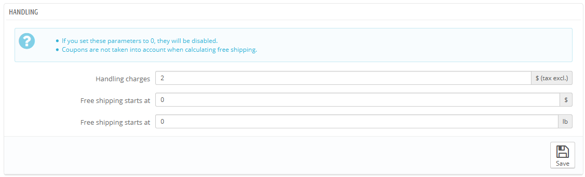
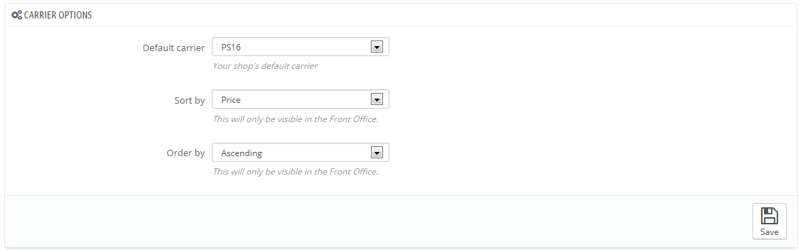

# Voreinstellungen verwalten

Hier finden Sie noch mehr allgemeine Einstellungen für den Versand in Ihrem Shop.

Diese Seite bietet Ihnen Einstellungen für Bearbeitungsgebühren:

* **Bearbeitungsgebühren**. Geben Sie die pro-Auftragsabwicklung Aufwendungen, die dem endgültigen Kaufpreis hinzugefügt werden. Dies ist unabhängig von Ihren Versandkosten: es sind die Kosten für Sie oder Ihre Mitarbeiter, die Produkte zu erstehen, zu verpacken und zu liefern. Wenn es keine solchen Kosten gibt, lassen Sie es bei 0.
*   **Versandkostenfrei ab(Währung) und Versandkostenfrei ab(Gewicht)**. Geben Sie den Preis oder das Gewicht an, ab dem Ihre Kunden versandkostenfrei bestellen. Wenn Sie sich zum Beispiel entscheiden, versandkostenfrei anzubieten, wenn der Auftrag mehr als 250 $ beträgt, können Sie dies hier festlegen. Eine Nachricht wird Ihren Kunden angezeigt, die angibt, wie viel sie bestellen müssen, um versandkostenfrei bestellen zu können.

    Wenn Sie keine Versandkosten anbieten wollen und nicht wollen, dass diese Meldung angezeigt wird, lassen Sie diese Werte bei 0.

Im Abschnitt "Standardeinstellungen" haben Sie Zugriff auf 3 Einstellungen, die Auswirkungen auf das Front-Office haben, uf den Kunden bei einer Wahl helfen:

* **Standard-Versanddienst**. Wenn Sie in Ihrem System mehr als einen Versanddienst haben, möchten Sie vielleicht einen Standard eintragen, um Ihre Kunden mehr dazu zu bringen, diesen auszuwählen. Neben den Versanddiensten selbst, hat diese Dropdown-Liste zwei Kontextoptionen:
  * **Bester Preis**. Je nach der Höhe der Bestellung, ihr Gewicht und Lieferzone, wird PrestaShop immer den günstigsten Preis für den Kunden wählen.
  * **Bestnote**. PrestaShop wird den Versanddienst, der im Rahmen des Auftrags die kürzeste Versandverzögerung haben wird, anzeigen.
* **Sortierung**. Wenn Kunden eine Auswahl von Versanddiensten haben, können Sie die Liste entweder mit dem Versandpreis oder durch ihre Position, wie in der Liste auf der "Versanddienste" Seite eingestellt, sortieren.
* **Sortierung**. Dies ermöglicht es, die Reihenfolge, in der die Versanddienste sortiert sind, zu setzen:\

  * Wenn die Versandkosten mit aufsteigender Reihenfolge sortiert sind, dann werden Versanddienste von den billigsten zu den teuersten angezeigt.
  * Wenn Position gewählt ist und mit einer absteigenden Reihenfolge sortiert, dann wird der Versanddienst, der an der Spitzenposition der Liste ist, an die unterste Position verschoben.
