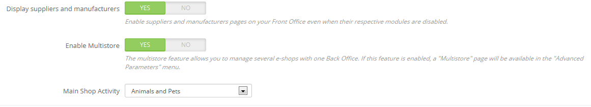

# Verwalten mehrerer Shops

Eines der herausragenden Merkmale von PrestaShop heißt "Multishop", dh die Fähigkeit, mehrere Shops aus dem gleichen Back-Office zu verwalten.

&#x20;Dank dieser Funktion, können Sie viele benutzerdefinierte Shops verwalten, welche viele gemeinsame Elemente teilen. Für mehr Effizienz, können Sie auch Gruppen von Shop selbst erstellen.

## Wie entscheidet man, ob man die Multishop-Funktion benötigt 

Sie werden sich dabei ertappen die Multishop-Funktion zu verwenden, obwohl es nicht nötig ist. Zum Beispiel, wenn Sie einen mehrsprachigen Shop möchten oder wenn Sie mehr als eine Währung verwenden wollen, oder wenn Sie für jede Kategorie ein anderes Template haben möchten.\

Hier sind zwei Fragen, die Sie sich stellen sollten, bevor Sie sich entscheiden, die Multishop-Funktion zu aktivieren:

1. Möchten Sie in ihrem Shop unterschiedliche Preis für das selbe Produkt haben (außer bei speziellen Rabatten für einen Kunden oder eine Kundengruppe).\
   **Wenn die Antwort "Ja" ist, dann benötigen Sie die Multishop-Funktion.**
2. Wenn ein Kunde in einem Shop kauft, wollen Sie, dass er oder sie keinen Zugriff auf den Bestellverlauf oder die Rechnungen des anderen Shops hat (auch wenn der Kunde die gleichen Anmeldedaten für beide Shops hat).\
   &#x20;**Wenn die Antwort "Ja" ist, dann benötigen Sie die Multishop**-Funktion: Die Shops werden nicht deren Warenkorb und Bestellungen teilen, und Kunden die Artikel in deren Warenkorb von Shop 1 einfügen werden nicht die Artikel des Warenkorb von Shop 2 sehen können

Wenn beide Antworten mit 'Nein' beantworten werden können, dann benötigen Sie nicht die Multishop-Funktion.

## Aktiviere die Multishop-Funktion 

Wechseln einer Einzelnen-Shop PrestaShop Installation in eine Multi-Shop Installation ist sehr einfach:

1. Melden Sie sich in Ihrem Shop an.
2. Gehen Sie zum Menüpunkt "Voreinstellungen" und wählen Sie die Seite "Allgemein".
3. Finden Sie die Option "Multishop aktivieren", und wählen Sie "Ja".
4. Speichern Sie die Änderungen.

Aufwärts: Die Multishop-Funktion ist nun aktiv, beginnen Sie mit dem Hinzufügen von "Multishop" Seiten über das Menü "Erweiterte Einstellungen". Dies ist die Seite, wo Sie die verschiedenen Shops, welche mit dieser PrestaShop Installation erstellt wurden, verwalten können.

## Verwenden der Multishop-Funktion 

* [Das Multishop Interface](das-multishop-interface.md)
* [Erstellen einer neuen Shop Gruppe](erstellen-einer-neuen-shop-gruppe.md)
* [Erstellen eines neuen Shops](erstellen-eines-neuen-shops.md)
* [Die URL eines Shops festlegen](die-url-eines-shops-festlegen.md)
