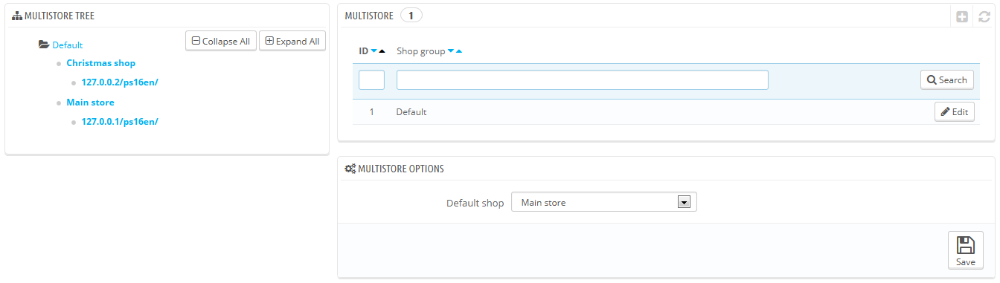
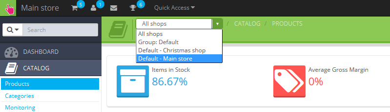

# Das Multishop Interface

## Verwaltung Ihrer Shops 

Die "Multishop"-Seite besteht aus drei Sektionen:

* **Multishop-Verzeichnisbaum**. Gibt Ihnen eine Vogelperspektive von Ihren Shop-Gruppen, Ihrer Shops, und sogar der unterschiedlichen URL-Verknüpfungen zu Ihren einzelnen Shops.\
  Standardmäßig gibt es nur einen Shop, in der Standard-Gruppe: Der Haupt-Shop
* **Shop Gruppen** Tabelle. Listet die verfügbaren Shop Gruppen. Sie können sie bearbeiten durch anklicken des Icon "Bearbeiten" rechts.
* **Multishop-Optionen**. Listet die verfügbaren Optionen für die vorhanden Shops.\

  * **Standard-Shop**.   Der Standard-Shop ist der Shop, der eine zentrale Funktion haben wird, er teilt seine Angaben mit anderen Shops (Produkte, Träger, etc.), und ist derjenige der erscheint bei der Anmeldung in der Administration.

## Ein Back-Office, um sie alle zu beherrschen 

Wenn die Multishop-Funktion für Ihre PrestaShop Installation aktiviert ist, werden viele Aspekte von PrestaShop individualisierbar auf einer Pro-Shop oder Pro-Shop-Gruppenbasis.

Zum besseren Verständnis für welchen Shop Ihre Änderungen gültig sind, fügt PrestaShop ein DropDown Menü ganz oben im Bild hinzu, wo Sie den Anwendungsbereich Ihrer Änderungen auswählen:

* Anwenden auf alle Shops in dieser Installation von PrestaShop.
* Anwenden nur auf Shops der ausgewählten Shop Gruppe.
* Anwenden nur auf den ausgewählten Shop.

Dieses Auswahl-Menü hilft Ihnen herauszufinden in welchem(n) Shop(s) Sie aktuell arbeiten.

Ist der Multishop-Modus erst aktiv, können viele reguläre Einstellungen nur global (alle Shops) verändert werden (vor allem in den Einstellungen für: Lokalisierung, Einstellungen, Erweiterte Einstellungen, Administration) und werden deshalb in anderen Einstellungs-Seiten als nicht verfügbar erscheinen. Sie können jedoch diese Einstellungen auf einer lokaleren Ebene (pro gruppierter Shop oder pro Shop) ändern, wenn es von nöten ist.

Diese Einstellungen werden regulär erscheinen, wenn alle Shops ausgewählt sind, während andere Selektionen (Gruppierungen von Shops oder einzelne Shops) mehr Optionen erhalten:

* Eine "Ja / Nein" -Option oberhalb eines jeden Abschnitts der Einstellungs-Seiten.
* Ein Kontrollkästchen neben den einzelnen Optionen.

.png>)

Sie dienen beide dem selben Zweck: Ihnen die Freigabe von Optionen zu erlaubenm, die andernfalls ausgeschaltet sind. Sie können die Option freigeben, wenn Sie wollen oder Sie geben alle Optionen frei, indem Sie den Yes/No-Schalter betätigen. Einmal angeschaltet. hängt es von Ihnen ab, welche Optionen Sie bevorzugen: Das Umlegen des Yes/No-Schalters wird keine Einstellungen verändern. Es erlaubt Ihnen nur Einstellungen zu verändern.&#x20;

Nichtsdestotrotz: Manche Optionen können nicht bearbeitet werden und zeigen an: "Sie können diese Einstellung nicht ändern."

Die folgende Tabelle zeigt Ihnen, welche Elemente für einen einzelnen Shop, gruppierten Shops und/oder allen Shops geändert werden kann.&#x20;

| Element                                                                                                                                                                                                                                        | Pro Shop | Pro Shop-Gruppe | Alle Shops |
| ---------------------------------------------------------------------------------------------------------------------------------------------------------------------------------------------------------------------------------------------- | -------- | --------------- | ---------- |
| Mitarbeiter                                                                                                                                                                                                                                    | X        | X               | X          |
| Kundengruppen                                                                                                                                                                                                                                  | X        | X               | X          |
| Produkte                                                                                                                                                                                                                                       | X        | X               | X          |
| — Preise                                                                                                                                                                                                                                       | X        | X               | X          |
| — Kombinationen und Preise                                                                                                                                                                                                                     | X        | X               | X          |
| — Sprachen                                                                                                                                                                                                                                     | X        | X               | X          |
| — Mehrere Bilder (**außer für die Hauptseite**)                                                                                                                                                                                                | X        | X               | X          |
| 
— Vorhandende Anzahl zum verkauf, basierend auf:
<ul><li>Die "Share quantity available for sale" Option ist für die Gruppe freigegeben,</li><li>The group does not share its quantity available for sale outside of the group.</li></ul> | X        | X               |            |
| — Alle anderen Informationen (Beschreibung, Tags, eigene URL, usw.)                                                                                                                                                                            | X        | X               | X          |
| Katalog Werte und Attribute                                                                                                                                                                                                                    | X        | X               | X          |
| Rabatte: Einkaufswagen Regeln                                                                                                                                                                                                                  | X        |                 |            |
| Rabatte: Katalogpreis Regeln                                                                                                                                                                                                                   | X        |                 |            |
| Steuern: Steuer Regeln                                                                                                                                                                                                                         | X        | X               | X          |
| Kategorien (**außer Hauptbild**)                                                                                                                                                                                                               | X        | X               | X          |
| Logistiker                                                                                                                                                                                                                                     | X        | X               | X          |
| Warenhaus                                                                                                                                                                                                                                      | X        | X               | X          |
| Erweitertes Lager Management                                                                                                                                                                                                                   | X        |                 |            |
| Lieferant                                                                                                                                                                                                                                      | X        | X               | X          |
| Hersteller                                                                                                                                                                                                                                     | X        | X               | X          |
| CMS Seiten                                                                                                                                                                                                                                     | X        | X               | X          |
| Kontakte                                                                                                                                                                                                                                       | X        | X               | X          |
| 
Länder  A country's status (enabled or disabled) is common to all shop it is associated to.
                                                                                                                                          | X        | X               | X          |
| Währung                                                                                                                                                                                                                                        | X        | X               | X          |
| Sprachen                                                                                                                                                                                                                                       | X        | X               | X          |
| Module                                                                                                                                                                                                                                         | X        | X               | X          |
| — Hooks und Ausnahmen                                                                                                                                                                                                                          | X        | X               | X          |
| — Aktivieren/Deaktivieren                                                                                                                                                                                                                      | X        | X               | X          |
| — Konfigurationen(Zum Beispiel PayPal Login Berechtigungsnachweise)                                                                                                                                                                            | X        |                 |            |
| Zahlungsmodule                                                                                                                                                                                                                                 | X        | X               | X          |
| — Einschränkungen pro Länder                                                                                                                                                                                                                   | X        |                 |            |
| — Einschränkungen pro Währung                                                                                                                                                                                                                  | X        |                 |            |
| — Einschränkungen pro Gruppe                                                                                                                                                                                                                   | X        |                 |            |
| Freundliche URLs                                                                                                                                                                                                                               | X        |                 |            |
| Szenen                                                                                                                                                                                                                                         | X        | X               | X          |
| Web Service Konto                                                                                                                                                                                                                              | X        | X               | X          |
| Hauptseite Bildslider                                                                                                                                                                                                                          | X        |                 |            |

Notes

**Kategorien**: Ein Produkt kann nur in einer gegebenen Kategorie eines Shops erscheinen, wenn es in diese vorher zugewiesen wurde. Mit anderen Worten: Wenn Shop A und Shop B die Kategorie K gemeinsam haben, können Sie das Produkt P in die K Kategorie von Shop A verbinden und P wird nicht in Kategorie K von Shop B erscheinen.

**Logistiker**: Sie können alle Logistiker über den einzelnen Shop, gruppierte Shops oder alle Shops managen, aber Sie können nicht eine Logistik auf jeden einzelnen Shop individualisieren. Sie müssen dafür die Logistik duplizieren, wenn Sie die selbe Logistik mit zwei verschiedenen Preisen in zwei Shops haben wollen.

**Lager**: Der erweiterte Bestandsmanager kann nur für ein Shop auf einmal eingesetzt werden, jedoch kann man mit dem Lager Shopgruppen verwalten.

Sie können für jeden Shop einen spezifischen Preis für jedes Produkt einstellen, das ganze oder ein Teil des Katalogs teilen und die Produktbilder tauschen, usw.

Sie können die Konten Ihrer Kunden zwischen zwei unterschiedlichen Shops freischalten, damit sie einheitliche Einlogdaten jeweils benutzen können und auch gleichzeitig in beiden Shops eingeloggt sein können.

Mit dem erweiterten Bestandsmanager können Sie bis ins kleinste Detail die Vorgänge zwischen Ihren Lager und Ihrem Shop verwalten.
