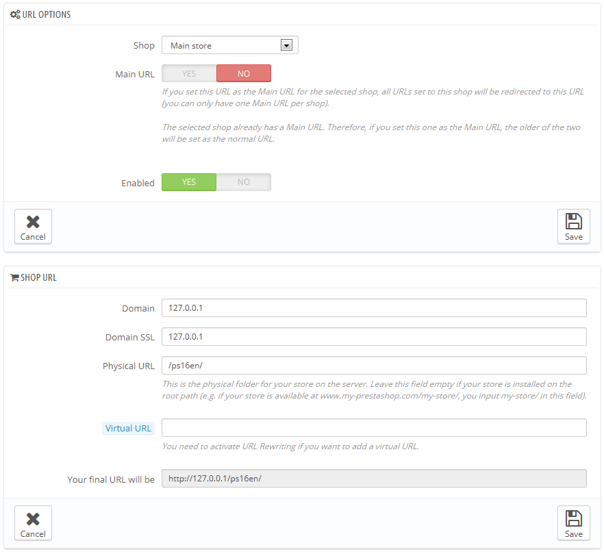

# Die URL eines Shops festlegen

Jeder Shop kann eine eigene Web-Adresse (URL) - oder sogar mehrere Adressen haben - völlig unabhängig vom Hauptshop(der erste Shop, den Sie installiert haben).\
Sie müssen für jeden Shop mindestens eine Web-Adresse festlegen.

**Zwei Shops können nicht die gleiche Adresse teilen.** Wenn Sie versuchen, eine Adresse einem neuen Shop zuzuteilen, die bereits von einem anderen Shop benutzt wird, wird PrestaShop einen Fehler anzeigen.\
On the other hand, you can have as many shops on one domain name as you want:

*   Mit Unterordnern: [http://www.example.com/men/](http://www.example.com/men/), [http://www.example.com/women/](http://www.example.com/women/), [http://www.example.com/kids/](http://www.example.com/kids/), [http://www.example.com/pets/](http://www.example.com/pets/) etc.

    Wenn Sie Unterordner benutzen, sollten Sie darauf achten, für jeden Shop zwei URLs zu vergeben: eine mit „www“ und eine ohne!

    Zum Beispiel: [http://www.example.com/men/](http://www.example.com/men/) und [http://example.com/men/](http://example.com/men/)

    Ansonsten versuchen Kunden, auf Ihren Shop ohne "www" zuzugreifen und werden zum Hauptshop weitergeleitet.
* Verwendung von Subdomains: [http://men.example.com/](http://men.example.com/), [http://women.example.com/](http://women.example.com/), [http://kids.example.com/](http://kids.example.com/), [http://pets.example.com/](http://pets.example.com/) usw.

Erstellen Sie keine Subdomain oder Unterordner selbst, weder auf Ihrem Server oder auf Ihrem Computer: PrestaShop kümmert sich um die Erstellung der Pfade auf Ihrem Server. Wenn ein Kunde einen dieser Pfade anfordert, erkennt dies PrestaShop und stellt die benötigten Dateien und Daten für den richtigen Shop automatisch bereit.

Natürlich kann ein Shop auch einen eigene Domain-Namen haben.

Einen Domain-Namen benutzen

Falls Sie einen anderen Domain-Namen für Ihre Zusatz-Shops und nicht mit Sub-Domains / Unterordnern verwenden möchten, müssen Sie Ihre Domain konfigurieren, um auf den Ordner zu zeigen, wo PrestaShop installiert ist. Das URL-Rewriting wird dann von PrestaShop selbst übernommen.

Alternativ können Sie einen Aliasnamen für Ihren Domain-Namen erstellen, der auf die absolute URL weiterleitet, wo sich die Installation von PrestaShop befindet. Die Art und Weise, diese Einstellungen durchzuführen, hängt von dem Benutzerinterface und den Optionen an, die Ihr Hosting-Provider bereitstellt: "Alias" für Plesk, "Forward" für CPanel "Aliasdomain" für ISPConfig usw.

Wählen Sie den gewünschten Shop im Multishop-Baum und klicken Sie auf „Neue URL hinzufügen“, um eine weitere URL hinzuzufügen. PrestaShop lädt ein Formular mit zwei Abschnitten und acht Optionen:

* **URL-Optionen**.
  * **Shop**. Eine Erinnerung an den Shop, dem Sie eine neue URL hinzufügen. Sie können auch einfach zu einem anderen Shop wechseln.
  * **Ist das die Haupt-URL des Shops?**. Durch die Aktivierung dieser Option geben Sie an, dass alle anderen URLs für diesen Shop zu der hier festgelegten Haupt URL umgeleitet werden(dies ändert eine andere bestehende Haupt URL u einer normalen URL).
  * Status. Sie können eine URL jederzeit deaktivieren und aktivieren.
* **Shop-URL**.\

  * **Domain**. Die Domain des Shops. Dies muss nicht auf den Domainnamen beschränkt sein: Sie können eine Sub-Domain angeben, wenn Sie das brauchen. Stellen Sie sicher, kein "http: //" oder einen "/" hinzuzufügen. Beispiel: [`www.example.com`](http://www.example.com) oder [`kids.example.com`](http://kids.example.com).
  * **SSL-Domain**. Wenn sich Ihre SSL-Domain von Ihrer Haupt-Domain unterscheidet, sollten Sie dies in diesem Bereich eintragen. Beispiel: [`www.example.com`](http://www.example.com) oder [`kids.example.com`](http://kids.example.com) .
  * **Physikalische URL**. Hier müssen Sie den physischen Pfad zu Ihrer eigentlichen Installation auf dem Server festlegen. Wenn der Shop am Root der Domain oder Subdomain ist, lassen Sie dieses Feld leer. Beispiel: `/` oder `/kids/`.
  * **Virtuelle URL**. Sie können mit dieser Option Ihren Shop Kunden transparent zur Verfügung stellen: durch URL-Rewriting können Sie Ihren Shop anzeigen lassen, ohne einen Unterordner erstellen zu müssen. Natürlich muss URL-Rewriting in PrestaShop aktiviert sein (heißt: benutzerfreundliche URLs, siehe "SEO & URLs" unter dem Menü "Voreinstellungen" für mehr Informationen). Beispiel: /shoes/. Beachten Sie, dass dies nur Unterordner-Shops funktioniert, nicht für Sub-Domain-Shops.
  * **Endgültige URL**. Zeigt Ihnen die Auswirkungen Ihrer Einstellungen auf die Adresse Ihres Shops.

