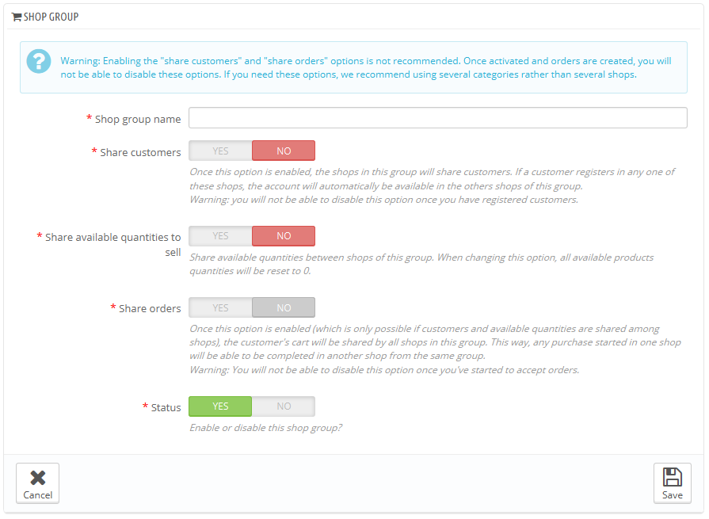

# Erstellen einer neuen Shop Gruppe

Wenn Sie Shopgruppen eingeschaltet haben, können Sie verschiedene Charakteristiken zwischen Ihren Shops in einer Gruppe teilen: Katalog, Angestellte, Logistiker, Module, usw. Die Einstellung erfolgt dann so leicht, als würden Sie einen einzelnen Shop optimieren, während einzelne Details immernoch verändert werden können.\
Das Hinzufügen von Kennwerten zu allen Shops in einer Gruppe benötigt nur einen Schritt. Im Multishop-Modus haben Sie ein Drop-Down-Menü, welches für viele administrative Seiten verfügbar ist und Ihnen erlaubt die Veränderungen von einzelnen Shops oder Shopgruppen zu filtern.

Technically speaking, when selecting a shop group in the multistore drop-down menu, the displayed entities reflect the **union** of the entities pertaining to the shops in that group.

Generally speaking, parameters are applied to all the entities belonging to the selected entity in the multistore drop-down menu. This is explained in details later in this chapter.

Clicking the "Add new shop group" button brings a form with few options but a lot of text: you should make sure to read each description from beginning to end, as they help you make a decision about these options. Since some are non-reversible (you cannot disable them once they are enabled), it is important to know exactly what you enable.

The available settings are:

* **Shop group name**. The name is private, customers will not see it. Still, make sure to use a telling name: the more shop groups you will have, the more you will need to be able to find a given group quickly. You can edit the name at any time.
* **Share customers**. _**Once enabled, you cannot disable this option**_. This is great when you want to allow your customers to use the same login credentials on all shops of this shop group.
* **Share available quantities to sell**. You can have different quantities of the same product for sale on your shops. With this option, all the shops from this group will share the same available quantity of products. This can make it easier to manage said quantities.
* **Share orders**. _**Once enabled, you cannot disable this option**_. This option can only be enabled if both "Share customers" and "Share available quantities to sell" options are enabled. With this option, customers who are logged on any shop from this group will be able to see their order history for all the shops in the group.
* **Status**. Choose to enable this group right away, or later. You can enable/disable a shop group at any time.

Two shop groups cannot share customers, carts or orders.

Existing shop groups can be edited from the shop groups list on the "Multistore" front page: simply click on the 'edit' icon on the right of the shop's row to open the form. As expected, you cannot edit the "Share customers" and "Share orders" options.
