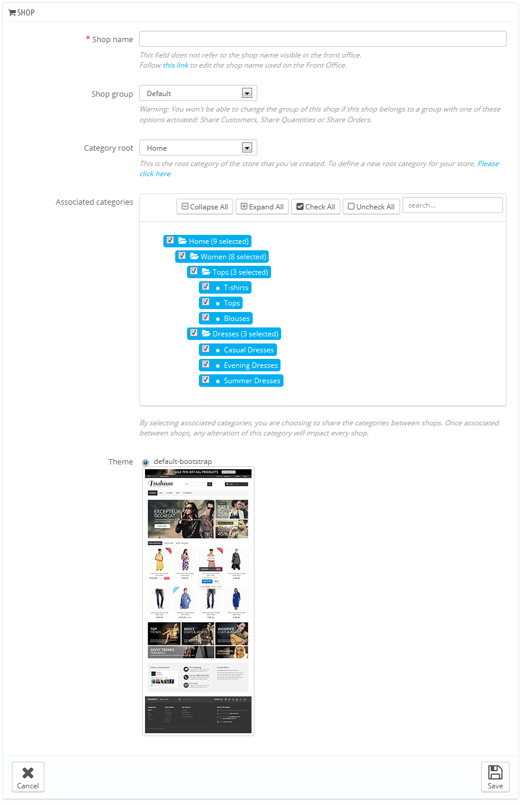
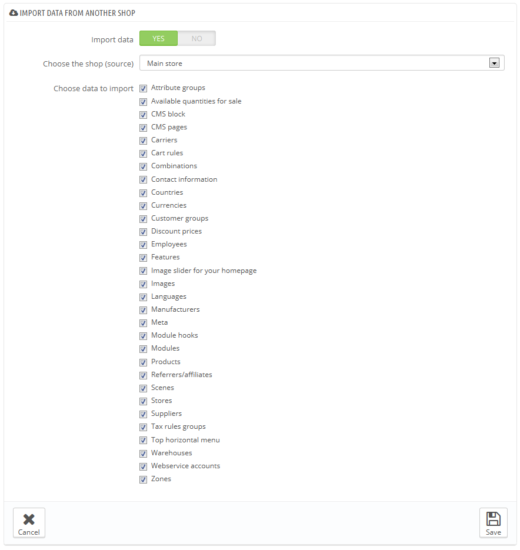

# Erstellen eines neuen Shops

The shop creation tool, located in the "Multistore" page, enables you to simply and precisely define both the front office appearance of your shop (namely, its theme) and the elements you wish to import from your main shop into this new one.

Clicking the "Add new shop" button opens brings a form with two sections. The first one has 5 options:

* **Shop name**. The name is public: customers will see it in many places, such as the site title or the e-mail references. Make sure to make it clear that it describes this specific shop.
* **Shop Group**. A shop can only belong to one shop group. Also, it **must** belong to a group: it cannot exist outside of a shop group – even if it's the only shop in that group.\
  &#x20;Note: you will not be able to move the shop to any other group if you create it within a shop group which has any of its three options enabled ("Share customers", "Share available quantities to sell" or "Share orders").
* **Category root**. While your main shop has the catalog root as its category root, any other shop can either use the same root, or use any category of the catalog as its root – in effect using a sub-set of the main catalog as its own catalog.
* **Associated categories**. In addition to being able to limit a shop's catalog to a sub-set of the main catalog (see the "Category root" option above), you can choose to only make some sub-categories of the main category available in this new shop.
* **Theme**. You can use any of the available themes as the theme for this shop. In effect, this makes it possible for you to have the very same catalog available in two completely different shops, with a different theme, URL or even prices.

The second section, "Import data from another shop", is where you define which data of the main shop you want to use as the data of this new shop.

It has two options:

* **Import data**. If disabled, your shop will not share any data with any other shop, and the section will close itself. While this is helpful when you want to manage two entirely different shops with a single installation of PrestaShop, this also means you will have to configure both shops from A to Z, whereas sharing data means you would not have to recreate carriers, currencies or modules, for instance. Make sure to think your choice through, as you will not be able to revert back.
* **Choose the shop (source)**. If you do wish to import data, you must indicate from which of the existing shops you want to import that data. If you already have defined a sub-shop of the main shop, this can help you make a "copy" of that sub-shop, instead of having to set the various import options again.
* **Choose data to import**. This is where you decide what kind of data you want to import from the source shop. At the very least, you should import all the modules, even if it means disabling some, as the whole front office is displayed through modules and some major parts of the back office also rely on modules.

When you create a product in a new shop and that product already exists in another shop, PrestaShop will try its best to suggest the existing product, so that you will not have to recreate everything.

When saving the shop, PrestaShop warns you that it does not yet have a URL. Click on the red warning to add one (see below).
