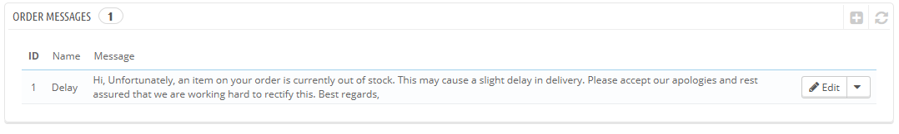
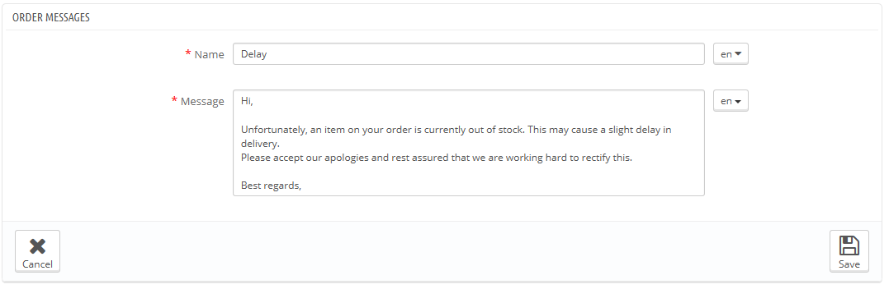
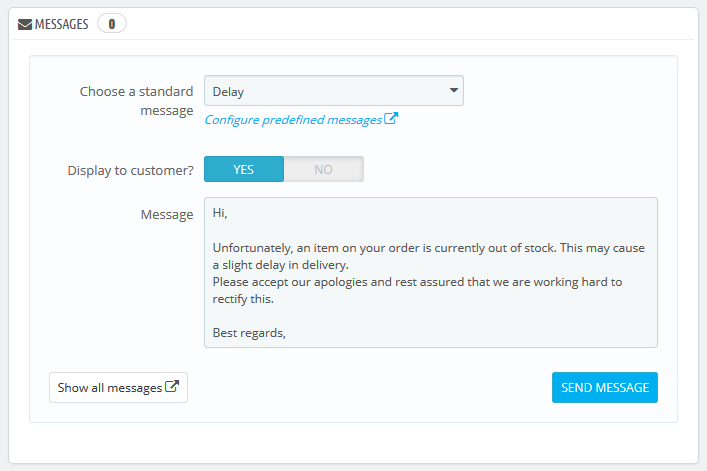

# Bestellnachrichten

Wenn Sie eine Nachricht an Ihre Kunden mit PrestaShop  (von der Bestellungs-Seite aus) schicken, können Sie diese speichern, um sie erneut an andere Kunden zu senden, wenn es um die selben Fragen, Kommentare oder Sonstiges geht.

Um dies zu tun, navigieren Sie auf die Seite "Bestellnachrichten" unter dem Menü "Bestellungen". Eine Standardnachricht ist bereits gespeichert: "Delay".

## Erstellen einer neuen Nachricht 

Um eine Nachricht hinzuzufügen, klicken Sie auf die Schaltfläche "NEU". Sie können auch die Standardnachricht bearbeiten.

Das Formular beschränkt sich auf das Wesentliche:

* **Name**. Geben Sie Ihrer Nachricht einen aussagekräftigen Namen, so dass Sie sie leicht finden können, wenn sie später benötigt wird.
* **Nachricht**. Schreiben Sie den Inhalt, den Sie an Ihre Kunden versenden möchten.

Wenn Sie fertig sind, klicken Sie auf "Speichern".

Sie können so viele Nachrichten wie nötig erstellen.

## Senden einer Nachricht an einen Kunden 

Sobald Sie Ihre vorgefertigten Nachrichten erstellt haben, können Sie sie versenden, indem Sie direkt in eine Bestellung eines Kunden navigieren:

1. Wählen Sie die zuvor erstellte Nachricht.
2. Bearbeiten Sie diese, wenn nötig, um sie auf die Bestellung oder den Kunden zuzuschneiden.
3. Aktivieren Sie die "An Kunden senden?"-Option.
4. Klicken Sie auf "Nachricht senden".

Ihr Kunde wird die Nachricht auf die E-Mail-Adresse seines Kontos erhalten. Um die Konversation fortzusetzen, navigieren Sie im Menü "Kunden" zu „Kundenservice“.
