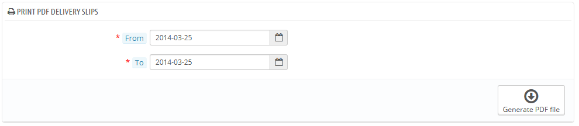
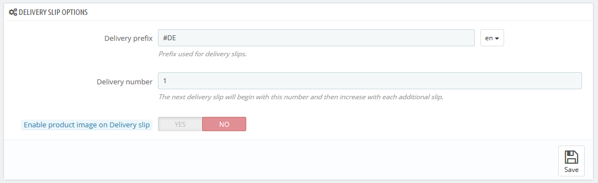

# Lieferscheine

Ein Lieferschein ist eine Bescheinigung der Auslieferung.

Er wird mit in das zu versendende Paket, zusammen mit den bestellten Artikeln, eingepackt. Lieferscheine haben das Logo ihres Shops aufgedruckt und listen den Inhalt des Pakets auf. Beim Empfang des Pakets ist der Kunde mithilfe des Lieferscheins in der Lage, die Vollständigkeit der Bestellung zu überprüfen.

Das Verfahren bei Lieferscheinen entspricht dem bei Rechnungen. Wählen Sie einen Zeitraum und PrestaShop erstellt das entsprechende Dokument.

Sie können eine PDF-Datei der Lieferscheine nach Datum gefiltert erzeugen, was sehr nützlich ist, wenn Sie alle Lieferscheine für einen bestimmten Tag oder ein Quartal benötigen. Geben Sie das Start- und Enddatum ein und klicken auf die Schaltfläche "PDF erzeugen".

## Lieferschein-Optionen 

Die folgenden drei Optionen funktionsgleich mit den Rechnungsoptionen:

* **Präfix**. Standardmäßig hat PrestaShop sprachabhängige Präfixe: "DE" für Englisch, "LI" für Französisch (für "livraison"), "EN" für Spanisch (für "entrenga"), etc. Sie können stattdessen Sprachcodes wählen, wie: "EN", "FR", "SP", usw. Selbstverständlich können Sie auch einen einzigen Präfix für jede Sprache festlegen, oder gar keinen.
* **Lieferschein-Nr**. Wenn Ihr Unternehmen bereits Bestellungen und Lieferscheine hatte, bevor Sie PrestaShop genutzt haben, können Sie diese Option verwenden, um Ihre Lieferschein-Nummer von einer höheren Zahl an zu beginnen…
* **Produktbild aktivieren**. Neu in 1.6.1. Wenn die Funktion aktiviert ist, wird das Artikelbild neben den Artikelnamen dem Lieferschein hinzugefügt.

PrestaShop generiert dann die Lieferscheinnummer gemäß den Einstellungen: "# DE000001", "# LI000002" usw.

Vergessen Sie nicht, Änderungen zu speichern.
