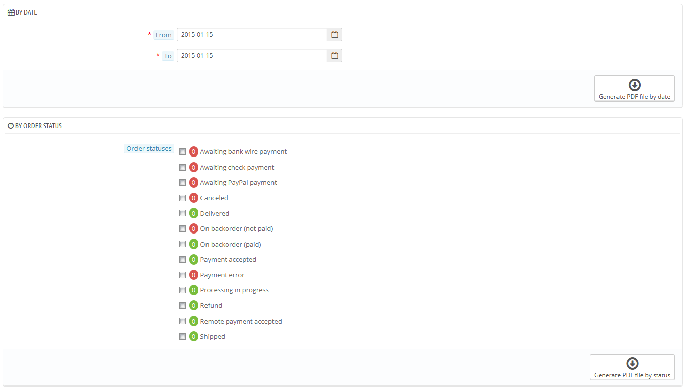

# Rechnungen

Jedes Mal, wenn eine Bestellung Ihres Shops bestätigt wurde, wird eine Rechnung an den Kunden gesendet. Sie können die Rechnung für eine einzelne Bestellung von der Seite „Bestellung“ herunterladen. Über die "Rechnungen"-Seite im Menü "Bestellungen" können Sie eine Auswahl von Rechnungen aus früheren Bestellungen im PDF-Format(in derselben PDF-Datei) herunterladen.

Sie können eine PDF-Datei mit mehreren Rechnungen in Abhängigkeit von zwei Hauptkriterien erzeugen:

* **Nach Datum**. Sehr nützlich, wenn Sie alle Rechnungen für einen bestimmten Monat oder ein Quartal drucken möchten. Geben Sie das Start- und Enddatum ein und klicken Sie auf die Schaltfläche "PDF-Datei nach Datum erstellen".
* **Nach Status**. Ein Muss, wenn Sie genau drucken wollen, welche Bestellungen storniert, erstattet oder zurückgesendet wurden. PrestaShop zeigt die Anzahl der jeweiligen Rechnungen in Klammern neben jedem Status.

In beiden Fällen werden die Rechnungen in einer einzigen PDF-Datei generiert, jede mit ihren eigenen Seiten. Sie können nicht eine einzelne PDF-Datei für jede Rechnung eines bestimmten Zeitraums oder Status bekommen.

Wenn Sie das Aussehen von Rechnungen Ihres Shops anpassen möchten, müssen Sie die Vorlagendateien ändern.

PDF-Template-Dateien liegen im /pdf -Ordner. Öffnen Sie die invoice.tpl Datei und bearbeiten sie, wie Sie es möchten: es ist eine HTML-Datei mit Smarty-Tags.

## Rechnungsoptionen 

Sie können wählen, ob Rechnungen Ihren Kunden zur Verfügung stehen sollten, der Bestellvorgang abgeschlossen wurde. Außerdem können Sie festlegen, welches Rechnungs-Präfix und welche Rechnungsnummer auf der gedruckten Version der Rechnung stehen sollen. Diese Funktion kann Ihnen helfen, die Verwaltung Ihres Kontos zu vereinfachen.

* **Rechnungen aktivieren**. Wenn deaktiviert, werden Ihre Kunden nach dem Kauf keine Rechnung erhalten. Sie werden für das Betreuen der Rechnungen verantwortlich sein, wenn Ihre Kunden danach fragen.
* **Steueranteile auf der Rechnung aktivieren**. Neu in 1.6. , zeigt eine Aufschlüsselung der Steueranteile auf der Rechnung, wenn mehrere Steuersätze kombiniert wurden.
* **Produktbild aktivieren**. Neu in 1.6.1. Wenn sie aktiviert ist, wird das Artikelbild neben den Artikelnamen der Rechnung hinzugefügt.
* **Präfix**. Standardmäßig hat PrestaShop sprachabhängige Präfixe: "IN" für Englisch, "FA" für Französisch (für "facture"), "CU" für Spanisch (für "cuenta"), etc. Sie können stattdessen Sprachcodes wählen, wie: "EN", "FR", "SP", usw. Selbstverständlich können Sie auch einen einzigen Präfix für jede Sprache festlegen, oder gar keinen.\
  PrestaShop generiert dann die Rechnungsnummer gemäß den Einstellungen: "# IN000001", "# FA000002" usw.
* **Rechnungsnummer**. Wenn Ihr Unternehmen bereits Bestellungen und Rechnungen hatte, bevor Sie PrestaShop genutzt haben, können Sie diese Option verwenden, um Ihre Rechnungsnummer von einer höheren Zahl an zu beginnen.
* **Freitext**. Neu in 1.6.1.0. Dieses Feld ermöglicht es Ihnen, einige zusätzliche Inhalte auf den Rechnungen hinzuzufügen, zum Beispiel gesetzliche Informationen, wenn nötig. Auf der Rechnung wird dies ganz unten angezeigt. Natürlich können Sie diesen Freitext verwenden, um jeden möglichen Text, den Sie für notwendig erachten, anzuzeigen.
* **Rechnungsart**. Abhängig von Ihrem Template können Sie hier mehrere Styles für Ihre Rechnungen verwenden. Wenn Sie wissen, wie HTML-Code funktioniert, können Sie Ihre eigene Rechnungsart hinzufügen oder bearbeiten: Diese werden unter /pdf in ihrer PrestaShop-Installation gespeichert.
* **Festplatte als Cache für PDF-Rechnungen verwenden**. Sie können auswählen, ob generierte Rechnungen auf der PrestaShop Serverfestplatte gespeichert werden und nicht im Server-Cache. Während diese Methode an Speichernutzung spart, verlangsamt es die PDF-Generierung selbst, verwenden Sie die Funktion mit Bedacht.

Vergessen Sie nicht, die Änderungen zu speichern.

Wenn Ihre Kunden um ihre Rechnungen bitten, können Sie sie auf die Seite "Bestellverlauf" ihrer Benutzerkonten hinweisen, die alle ihre Rechnungen bereit hält.
