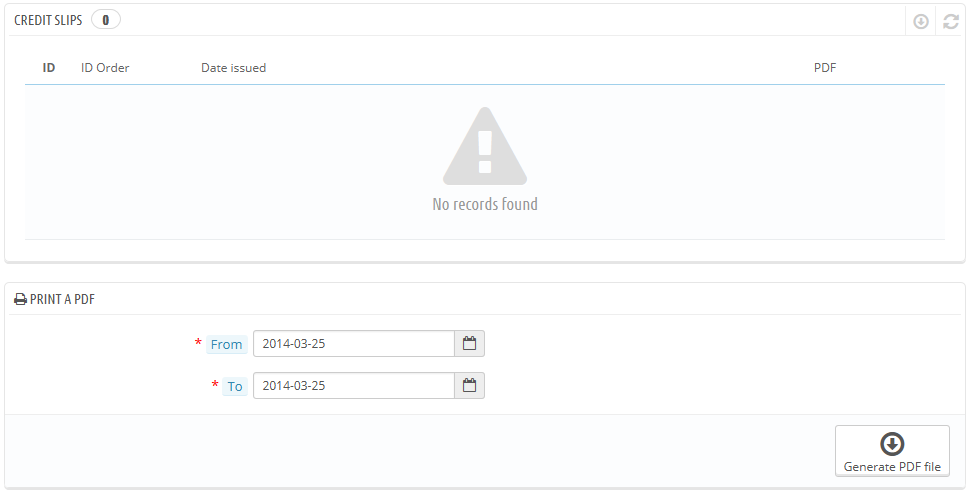
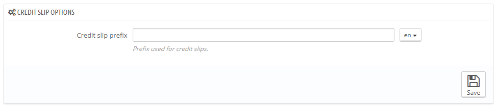

# Rückvergütungen

Nachdem Sie einer Warenrücksendung zugestimmt haben, sollten Sie alsbald ein Paket von ihrem Kunden erhalten. Sobald Sie das Paket erhalten haben, müssen Sie eine Rückvergütung auf der Seite der Bestellung erstellen. Man kann sie auch als "Gutschrift"  bezeichnen.\
&#x20;Rückvergütungen werden nicht auf der dazu passenden Seite unter „Bestellungen“ erstellt, sondern nur gelistet. Diese Seite wird auch dazu verwendet, eine PDF-Datei Ihrer Rückvergütungen zu generieren.

## Rückvergütungs-Optionen 

Es gibt nur eine Option auf der Seite:

* **Rückvergütungs-Präfix**. Vielleicht möchten einen Sprachbezogenen Präfix erstellen, dies funktioniert mit dem Sprachbutton. Selbstverständlich können Sie auch festlegen, dass kein Präfix genutzt wird.

PrestaShop generiert dann die Rückvergütungs-Nummer gemäß Ihren Einstellungen.

Vergessen Sie nicht, die Änderungen zu speichern.

## Erstellen einer Rückvergütung 

Klicken Sie In der Liste der Bestellungen("Bestellungen“-Seite) auf eine Bestellung, bei welcher der Kunde eine Rückvergütung erhalten soll- das funktioniert nur, wenn Warenrücksendung überhaupt aktiviert wurde.

Gehen Sie unterhalb der Tabelle "Artikel" wie folgt vor:

1. die Rücksendung (n) prüfen.
2. das Feld "Auf Lager buchen" aktivieren, wenn der Artikel in Ihr Lager zurückgestellt werden soll.
3. Markieren Sie das Kästchen "Rückvergütung generieren"
4. Um einen Kunden für eine verpatzte Bestellung zu entschädigen, können Sie zusätzlich noch einen Gutschein mit dem Kästchen "Gutschein erzeugen" erstellen.
5. Sie können auch die Versandkosten erstatten, indem Sie auf "Versandkosten mit einschließen" klicken.

Nachdem Sie alle gewünschten Optionen ausgewählt haben, bestätigen Sie mit "Artikel zurücksenden".

Der Rückvergütungsschein ist nun erstellt und wird in den Bestelldetails sowie auf der Seite "Rückvergütungen" zur Verfügung stehen.\
Von dort aus können Sie auf den Link klicken, um die PDF-Datei herunterladen.\
Der Kunde wird den Schein in seinem Bereich "Mein Konto" zu sehen bekommen.

Wenn Sie einen Gutschein erstellt haben, werden ihn die Kunden in der Rubrik "Meine Gutscheine" finden. Wenn sie darauf klicken, sollte es etwa so aussehen:

Der Wert der Rücksendung (n) wurde dem Gutschein hinzugefügt. Der Kunde kann den Rabatt-Code bei seiner nächsten Bestellung einlösen.
