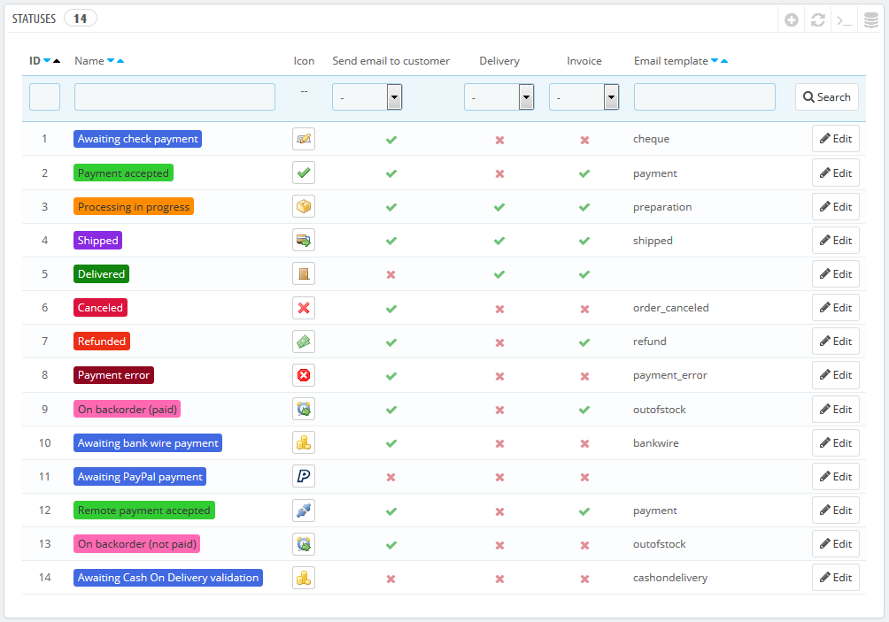
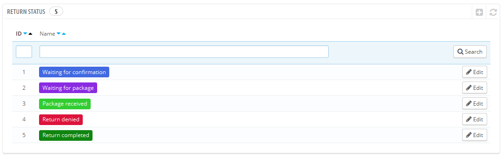
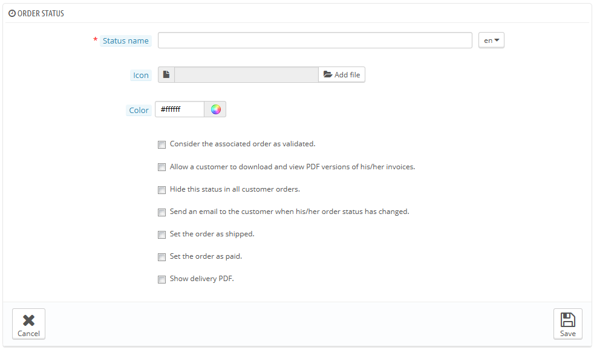
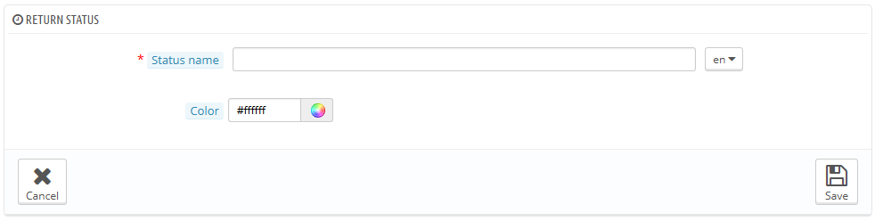

# Status

Unterschiedliche Bestell- oder Rückgabestatus ermöglichen Ihnen die einfache Verwaltung Ihrer Bestellungen und Rückgaben und außerdem, Ihre Kunden über die Entwicklung ihrer Bestellungen auf dem Laufenden zu halten.

Die verschiedenen verfügbaren Status sind im Menü "Bestellungen" unter „Status“ erstellbar und editierbar.

Die Seite zeigt eine Liste der aktuell erstellten Status, zusammen mit:

* markanten Farben: bestehende Status haben Farben, die helfen, schnell zu entscheiden, ob es ein Problem mit dem Auftrag gibt, oder alles glatt läuft.
* Icons.
* drei PrestaShop-Funktionen (es gibt noch mehr):\

  * Sollte PrestaShop bei einer Statusänderung eine E-Mail an den Kunden senden?
  * Hat der Status mit der Zustellung zu tun?
  * Erlaubt der Status dem Kunden, eine PDF-Version seiner Rechnung herunterzuladen?
* E-Mail-Vorlage: Sie können diese Vorlagen Sprache für Sprache auf der "Übersetzungen- Seite im Menü "Lokalisierung" bearbeiten. Wählen Sie "E-Mail-Vorlagen" im Dropdown-Menü Im Abschnitt "Übersetzungen Ändern" aus, und klicken Sie auf den Sprachcode der Sprache, in der Sie diese Vorlagen bearbeiten möchten.
* Die Aktionssymbole: "Bearbeiten" und "Löschen".

Die Retouren-Status-Liste  verfügt über weniger Informationen, weil diese Status lediglich Information für das Backoffice geben.

## Das Erstellen eines neuen Bestellungsstatus 

Sie können einen neuen Status mit dem "NEU"-Button oben erzeugen. Die Erstellungsseite wird geöffnet.

Das Formular ausfüllen:

* Name des Status. Halten Sie ihn kurz und einzigartig.
* Sie können alle 16 \* 16 Symbol verwenden, zum Beispiel können Sie das hervorragende und kostenlose FamFamFam Silk icon verwenden: [http://www.famfamfam.com/lab/icons/silk/](http://www.famfamfam.com/lab/icons/silk/).
* Farbe. Sie sollten darauf achten, dass die Farben existierenden Farben entsprechen, nur um die Ordnung beizubehalten. Die Standardfarben und deren Verwendungen sind:\

  * Rot / Orange: stornierte oder erstattete Bestellungen,
  * Hochrot: Zahlungsfehler,
  * Blau: Aufträge, die noch immer auf Zahlung warten,
  * Hellgrün: bezahlte Bestellungen,
  * Dunkelgrün: gelieferte Bestellungen,
  * Lila: versendete Bestellungen,
  * Pink: zurückgezogene Bestellungen.
* Optionen:
  * &#x20;**Zugehörige Bestellung gilt als bestätigt**. Wenn aktiviert, werden alle damit verbundenen Bestellungen als "bezahlt" markiert und sie in denselben Status gebracht.
  * **Dem Kunden Download und Ansicht seiner PDF-Rechnung erlauben**. Wenn deaktiviert, müssen Sie dem Kunden ihre Rechnung selbst schicken.
  * **Diesen Bestell-Status dem Kunden nicht anzeigen**. Dies ermöglicht Ihnen, Status nur firmenintern zu behandeln. Kunden werden diesen Status nie sehen.
  * **Sende E-Mail an Kunden, wenn sich der Status ändert**. Wenn aktiviert, erscheint ein Dropdown-Menü, in dem Sie wählen können, welche Mail-Vorlage gewählt werden soll.
  * **Setze Bestellung auf "Versand erfolgt"**. Seien Sie vorsichtig: sobald ein Auftrag als "versendet" markiert wurde, kann dieser Vorgang nicht rückgängig gemacht werden.
  * **Setze Bestellung auf "Bezahlt"**. Hier gilt das gleiche: Sobald eine Bestellung als "bezahlt" markiert wurde, kann dieser Vorgang nicht rückgängig gemacht werden.
  * **Zeige PDF-Lieferschein**. Zeigt den Lieferschein als PDF.

## Das Erstellen eines neuen Retouren-Status 

Sie können einen neuen Retouren-Status mit dem "NEU" -Button am unteren Rand erstellen. Die Erstellungsseite wird geöffnet.

Diese verfügt über nur zwei Felder:

* **Name des Status**. Geben Sie den gewünschten Status-Namen ein.
* **Farbe**. Stellen Sie die Farbe ein.

Speichern Sie schließlich .
