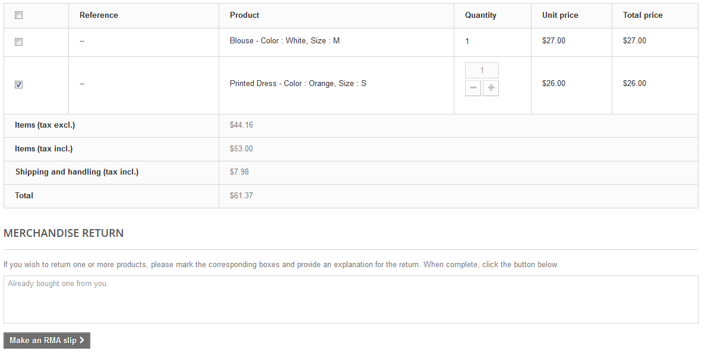
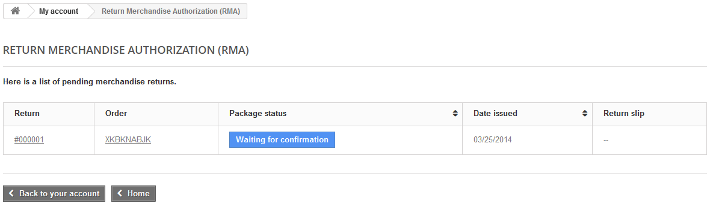
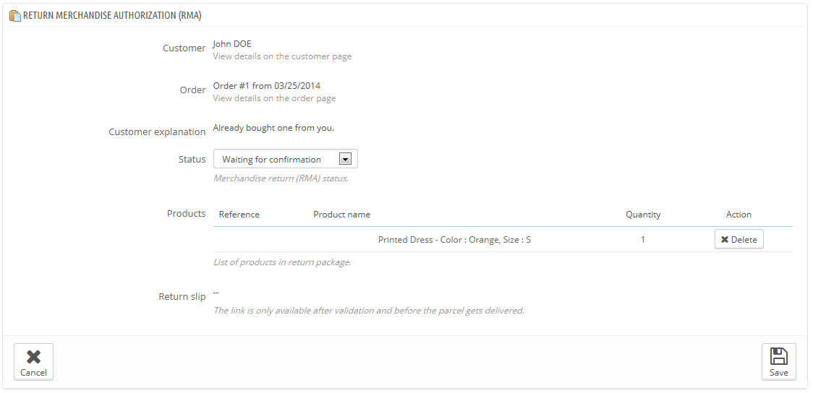
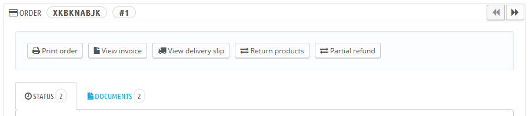

# Warenrücksendungen

Auf der Seite „Warenrücksendungen“ finden Sie eine Liste aller Rücksendungen.

Am unteren Ende der Seite haben Sie die Möglichkeit, zu erlauben, ob Kunden Artikel zurück zu Ihnen senden dürfen. Hier können Sie einfach die Anzahl der Tage festlegen, an denen eine Rücksendung nach der Bestellung initiiert werden kann, und speichern Sie Ihre Einstellungen: Kunden haben jetzt die Möglichkeit, einen Rückgabeantrag zu stellen. Sie können auch den Präfix für eine Retour-Nummer festlegen, oder einfach keine eintragen.

## Rückgabeprozess: Wie der Kunde ihn sieht 

Nachdem Sie die Option der Warenrücksendung in Ihrem Back-Office aktiviert haben, kann der Kunde Artikel wählen, die zurückgesendet werden sollen(sofern die Bestellung noch im gültigen Zeitrahmen liegt). Um dies zu tun, sind folgende Schritte erforderlich:

1. Aufrufen der Seite "Bestellverlauf" von seinem Konto.
2. die Bestellung, aus der der Kunde einen Artikel zurückgeben will, wählen.
3. Die Artikel zum zurückgeben anwählen, indem die dazugehörigen Kästchen ausgefüllt werden.
4. (Optional) eine Erklärung einfügen, damit das Shop-Team besser versteht, warum der Kunde diese Artikel zurückgeben will.

Sobald das Formular abgeschlossen ist, klickt der Kunde auf "Rückgabe beantragen", und die Anforderung wird an den Shopleiter (Sie) gesendet. Der Antrag wird als "Warten auf Bestätigung" auf der Seite "Warenrücksendung“ des Kunden markiert.

## Rückgabeprozess: wie Sie ihn sehen 

Der Rückgabeantrag wird in Ihrem Back-Office angezeigt und hat zunächst den Status "Warten auf Bestätigung".

Der Erstattungsprozess kann mehrere Schritte andauern, diese werden immer durch den jeweiligen Status signalisiert. Es gibt nur eine Handvoll von Status während der Erstattungsprozedur:

* Warten auf Bestätigung.
* Warten auf Paket.
* Paket empfangen.
* Rückgabe verweigert.
* Rückgabe abgeschlossen.

Es liegt nun an Ihnen, die Rückgabe zu akzeptieren oder abzulehnen:

1. Klicken Sie auf den Namen des Rücknahmeantrags, um mehr Details zu sehen.
2. Ändern Sie den Status, um den Rückkehrprozess fortzusetzen oder abzubrechen.\

   * Wenn Sie den Rückgabeprozess stoppen möchten(und somit eine Rückerstattung verweigern), wählen Sie einfach den "Rückgabe verweigert"-Status.
   * Wenn Sie akzeptieren, den Artikel zurückzunehmen und dem Kunden die Kosten zu erstatten, folgen Sie genau diesen Schritten:
     1. Wählen Sie den nächsten Schritt im Prozess: "Warten auf Paket". Dies schickt eine E-Mail an den Kunden, die darauf hinweist, dass er den Artikel zu Ihnen zurück senden kann.
     2. Nachdem Sie das Paket erhalten haben, ändern Sie den Status auf "Paket empfangen".
     3. Schließlich, sobald der ganze Prozess vorbei ist(entweder der Kunde erhielt eine Rückerstattung oder ihm wurde eine Rückvergütung erteilt), ändern Sie den Status zu "Rückgabe abgeschlossen".
3. Bestätigen.

## Erstattung für einen Kunden 

Eine Bestellung kann teilweise oder vollständig zurückerstattet werden. Dies wird mit Hilfe von zwei Buttons in der oberen Leiste der Seite der Bestellung getan und nicht auf der Seite der Warenrücksendung.

Die Aktionstasten ändern sich, je nach Zustand der Bestellung. Wenn die Bestellung z.B. den Status "delivered" hat, ändern sich "Artikel hinzufügen" und "Artikel löschen" in zwei neue Schaltflächen: "Warenrücksendung" und "Teilerstattung".

Warenrücksendung  ist standardmäßig nicht aktiviert. Um es zu aktivieren, navigieren Sie unter dem Menüpunkt "Bestellungen" zu „Warenrücksendungen“, und aktivieren Sie die Option unteren Rand der Seite. Dies wird für alle Artikel und Bestellungen gelten.

* **Standard-Rückerstattung**. Verfügbar, sobald die Bestellung den Status "Payment accepted" hat. Nicht mehr verfügbar, wenn die Artikel gesendet wurden. Nötig, um die gesamte Bestellung zurückzuerstatten, und kann, solange die Artikel noch immer im Lager sind, durchgeführt werden. Klicken Sie auf die "Standard Erstattung" und eine neue Spalte mit dem Titel "Rückzahlung" wird angezeigt. Tragen Sie den Betrag und die Menge für jeden der betroffenen Artikel ein, wählen Sie eine der Optionen im unteren Bereich der Liste (siehe unten), und klicken Sie auf "Teilerstattung" am unteren Rand der Tabelle.
* **Teilerstattung**. Verfügbar, sobald die Bestellung den Status „Payment accepted“ hat. Wird verwendet, wenn Sie nur einen Teil der Bestellung und nicht die ganze Bestellung zurückerstatten müssen, entweder weil der Kunde einen Artikel zurückgesendet hat, oder einfach als Zeichen des guten Willens für eine beschädigte Ware, für die sich der Kunde trotzdem entschied. Klicken Sie auf die "Teilerstattung" und eine neue Tabelle mit dem Titel "Teilerstattung" wird angezeigt. Tragen Sie den Betrag und die Menge für jeden der betroffenen Artikel ein, wählen Sie eine der Optionen im unteren Bereich der Liste (siehe unten), und klicken Sie auf "Teilerstattung" am unteren Rand der Tabelle.

Wenn Sie ein Produkt als zurückzugeben oder zu erstatten markiert haben, sind vier Optionen unter der Liste der Produkte verfügbar:

* **Auf Lager buchen**. Wenn markiert, wird PrestaShop den Lagerbestand für diesen Artikel wieder erhöhen. Sie sollten dies nicht markieren, wenn ein Artikel beschädigt ist.
* **Rückvergütung generieren**. Wenn markiert, wird eine Erstattung als Bestätigung von Ihrem Shop generiert, dass Waren zurückgegeben wurden und dass eine Erstattung erteilt wurde. Der Kunde kann Sie dann für seinen nächsten Einkauf verwenden.
* **Gutschein erzeugen**. Wenn markiert, wird ein Gutschein für die Menge der ausgewählten Elemente erstellt. Ein Gutschein wird in Form eines Codes bereitgestellt, den der Kunde während der Kaufabwicklung eingeben kann.

Wenn der Kunde die Bestellung mit einer Kreditkarte bezahlt, kann das Zahlungssystem den Einkaufswagen automatisch erstatten, oder Sie tun es selbst. Wenn die Bestellung mit einem Scheck oder einer Banküberweisung bezahlt wurde, müssen Sie sich selbst darum kümmern, markieren Sie dann den Auftrag im Back-Office als manuell zurückerstattet (auf der Seite der Bestellung).
