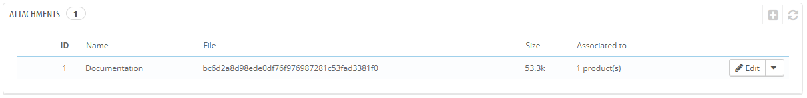
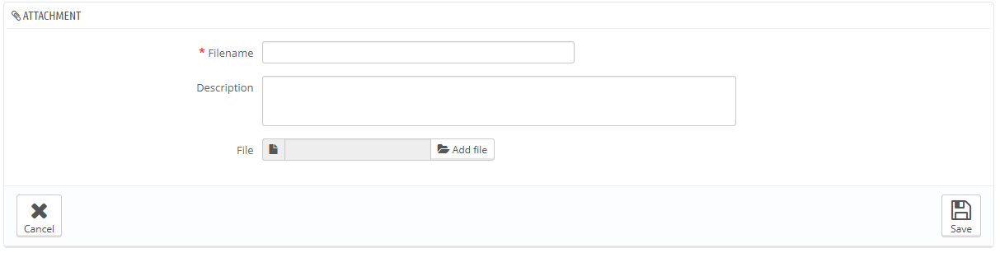

# Anhänge

Mit PrestaShop können Sie Ihren Kunden einige Dateien vor dem Verkauf anbieten.

Zum Beispiel können Sie Broschüren oder Schaltpläne von Elektronikprodukten bereitstellen, um Kunden einen tieferen Einblick vor dem Kauf zu bieten. Sie können zu diesem Zweck ein Dokument hochladen.\
&#x20;Sie können auch einfach nur ein PDF-Handbuch direkt zum Download zur Verfügung stellen.

Jedem Artikel können eigene Anhänge zugeordnet werden, die einzeln unter dem "Anhänge"-Tab jedes Artikels hinzugefügt werden können, wie im vorherigen Kapitel dieses Handbuchs erklärt ("Hinzufügen von Produkten und Produktkategorien"). Die Seite „Katalog“>“Anhänge“ gibt Ihnen Zugang zu allen angehängten Dateien des Shops: wenn Sie eine Datei vielen Artikeln zuordnen müssen, werden Sie damit nur einmal hochgeladen.

Sie können Anhänge hochladen, bevor Sie sie Artikeln zuordnen.

Der Prozess, einen neuen Anhang zu Ihrem Shop hinzuzufügen ist einfach:

1. Klicken Sie auf den "NEU"-Button. Ein neues Formular öffnet sich.
2. **Dateiname**. Geben Sie Ihrem Anhang einen Namen, in allen benötigten Sprachen.
3. **Beschreibung**. Geben Sie ihm eine kurze Beschreibung, auch in so vielen Sprachen, wie nötig.
4. Klicken Sie auf "Datei hinzufügen", um eine Datei auf Ihrem Computer zum Hochladen auszuwählen.
5. Klicken Sie auf "Speichern".

Sie werden dann zur vorhergehenden Liste umgeleitet, wo Ihre Datei wird nun angezeigt wird. Die Datei ist ab sofort für alle Artikel verfügbar und kann über die Artikelkonfiguration unter „Anhänge“ zugeordnet werden.

Nun wird der Tab „Download“ im Online-Shop angezeigt, auf den Ihre Kunden diese Datei bei Bedarf klicken können.
